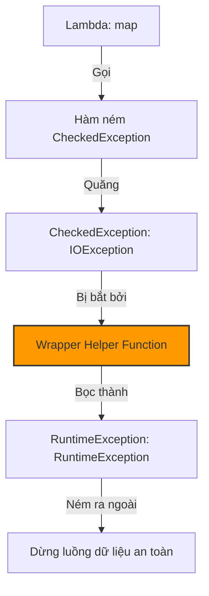

# Cách xử lý checked exception trong lambda? Kỹ thuật Exception Wrapping, SneakyThrows và custom functional interface

## ⚡ Tóm tắt ngắn (30s)
Vì các phương thức trừu tượng (SAM) của các Functional Interfaces dựng sẵn trong Java (như `Function`, `Predicate`) không khai báo mệnh đề `throws CheckedException`, do đó việc gọi các hàm ném checked exception (như `IOException`, `SQLException`) bên trong Lambda sẽ bị báo lỗi biên dịch lập tức.

Có 3 giải pháp xử lý thực chiến:
1.  **Khối try-catch truyền thống**: Đơn giản nhưng tạo ra lượng mã boilerplate khổng lồ làm xấu xí cấu trúc lambda.
2.  **Kỹ thuật Exception Wrapping (Bọc Exception)**: Sử dụng một hàm tiện ích trung gian để bắt checked exception và bọc (wrap) nó lại thành một unchecked exception (`RuntimeException`).
3.  **Lombok `@SneakyThrows`**: Kỹ thuật hack compiler cấp độ bytecode để ném thẳng checked exception ra ngoài mà không cần khai báo `throws`.

---

## 🔍 Chi tiết bản chất thực chiến

### 1. Tại sao Java cấm Checked Exception trong Functional Interfaces?
Mục tiêu tối thượng của Stream API là viết code dạng Declarative trôi chảy liền mạch. Nếu Java thiết kế các core interface hỗ trợ `throws Exception`, mọi điểm gọi stream sẽ tràn ngập các khối try-catch bọc xung quanh pipeline, triệt tiêu hoàn toàn tính thanh lịch và ngắn gọn của lập trình hàm.

### 2. Bản chất kỹ thuật của Lombok @SneakyThrows
Lombok sử dụng cơ chế ép kiểu Generic ngầm ẩn để đánh lừa trình biên dịch JVM tại thời điểm compile.
Tại mức độ Bytecode, JVM thực tế **không phân biệt** giữa Checked Exception và Unchecked Exception; sự phân biệt này chỉ tồn tại ở lớp kiểm tra nghiêm ngặt của compiler Java (`javac`).
Bằng cách ép kiểu giả định thông qua generic không xác định, Lombok qua mặt `javac` thành công, cho phép ném các checked exception tự do mà không cần khai báo `throws`.

### 3. Sơ đồ cơ chế Exception Wrapping


---

## 💻 Code thực chiến: BAD vs GOOD

### ❌ BAD: Viết try-catch cồng kềnh ngập ngụa trong map() làm nát code
```java
import java.io.IOException;
import java.nio.file.Files;
import java.nio.file.Paths;
import java.util.List;
import java.util.stream.Collectors;

public class BadExceptionHandling {
    public List<String> readFileContents(List<String> paths) {
        return paths.stream()
            .map(path -> {
                try {
                    // Try-catch cồng kềnh phá vỡ vẻ đẹp của Stream
                    return new String(Files.readAllBytes(Paths.get(path)));
                } catch (IOException e) {
                    // Nuốt exception hoặc trả về null - Cực kỳ nguy hiểm!
                    throw new RuntimeException(e); 
                }
            })
            .collect(Collectors.toList());
    }
}
```

###  GOOD: Dùng Exception Wrapper Helper hoặc custom functional interface sạch sẽ
```java
import java.io.IOException;
import java.nio.file.Files;
import java.nio.file.Paths;
import java.util.List;
import java.util.function.Function;
import java.util.stream.Collectors;

public class GoodExceptionHandling {
    // 1. Định nghĩa Functional Interface riêng hỗ trợ ném Checked Exception
    @FunctionalInterface
    public interface ThrowingFunction<T, R, E extends Exception> {
        R apply(T t) throws E;
    }

    // 2. Viết Wrapper biến đổi ThrowingFunction thành Function tiêu chuẩn
    public static <T, R> Function<T, R> wrap(ThrowingFunction<T, R, Exception> throwingFunction) {
        return i -> {
            try {
                return throwingFunction.apply(i);
            } catch (Exception e) {
                // Tự động bọc Checked Exception thành RuntimeException
                throw new RuntimeException(e);
            }
        };
    }

    public List<String> readFileContents(List<String> paths) {
        return paths.stream()
            // Sử dụng helper wrapper cực kỳ sạch sẽ và dễ đọc!
            .map(wrap(path -> new String(Files.readAllBytes(Paths.get(path)))))
            .collect(Collectors.toList());
    }
}
```

---

## 📊 So sánh các giải pháp xử lý Checked Exception trong Lambda

| Phương pháp giải quyết | Tính Thẩm Mỹ của Code | Độ An Toàn Runtime | Đánh Giá Ưu / Nhược Điểm |
| :--- | :--- | :--- | :--- |
| **Try-Catch Truyền Thống** | **RẤT XẤU** ( Boilerplate bủa vây) | An toàn tuyệt đối | Thích hợp cho code nháp nhanh, không nên dùng cho production |
| **Exception Wrapping** | **CỰC SẠCH** (Dùng helper function) | Cao (Chuyển thành unchecked) | **KHUYÊN DÙNG**. Tách biệt hoàn hảo phần logic xử lý lỗi |
| **Lombok `@SneakyThrows`**| **CỰC SẠCH** (Dùng annotation) | Cần kiểm soát chặt | Cực tiện lợi, nhưng đòi hỏi dev phải hiểu sâu bản chất bytecode |

---

## ⚠️ Common Gotchas & Questions follow-up

* **Cạm bẫy nuốt Exception thầm lặng (Swallowing Exception Gotcha)**:
  Tuyệt đối không sử dụng try-catch bên trong lambda để bắt lỗi rồi trả về `null` hoặc một giá trị giả định rỗng mà không ghi log hay ném lại lỗi.
  * *Hậu quả:* Việc nuốt exception làm stream tiếp tục chạy trơn tru, nhưng sẽ phát sinh các lỗi `NullPointerException` bất ngờ ở các bước phía sau cực kỳ khó trace dấu vết lỗi nguyên bản.
*  **Câu hỏi đào sâu từ interviewer**: *Nếu ta dùng @SneakyThrows hoặc cơ chế bọc exception tương đương trong lambda chạy trên Parallel Stream, chuyện gì sẽ xảy ra với các worker thread còn lại khi một phần tử quăng exception?*
  * *(Trả lời: Khi một worker thread gặp Exception (cho dù là checked hay unchecked), Exception đó sẽ được truyền thẳng lên luồng quản lý chính (Main Thread) đang kích hoạt Stream. Luồng chính sẽ bị gián đoạn và quăng Exception đó ra ngoài lập tức. Các worker threads khác đang chạy song song sẽ bị hủy bỏ (canceled) một cách an toàn mà không làm rò rỉ hay nghẽn luồng của hệ thống).*
---