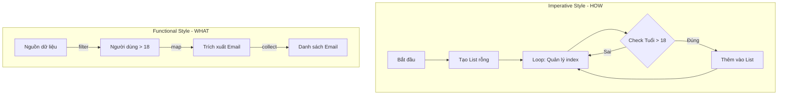

# So sánh code imperative và functional style? Phân tích thiết kế, khả năng bảo trì và tối ưu hóa

## ⚡ Tóm tắt ngắn (30s)
*   **Imperative Style (Lập trình mệnh lệnh)**: Tập trung vào **LÀM NHƯ THẾ NÀO (How)**. Code mô tả chi tiết từng bước thực thi vật lý: quản lý chỉ số chỉ số, thay đổi trạng thái biến (mutable state), dùng vòng lặp `for`, `while`. Ưu điểm duy nhất: Hiệu năng thô cực mạnh, dễ debug từng dòng.
*   **Functional Style (Lập trình chức năng)**: Tập trung vào **LÀM CÁI GÌ (What)**. Sử dụng các khai báo luồng xử lý (Stream API), biểu thức lambda, hàm thuần túy (pure functions) và tính bất biến (immutability). Ưu điểm vượt trội: Ngắn gọn, dễ đọc, cực dễ mở rộng chạy song song, giảm thiểu tối đa lỗi tranh chấp tài nguyên (side effects).

---

## 🔍 Chi tiết bản chất thực chiến

### 1. Sự dịch chuyển tư duy: HOW sang WHAT
Hãy tưởng tượng nghiệp vụ lọc ra danh sách Email của những người dùng trên 18 tuổi.
*   **Imperative (HOW)**: "Khởi tạo một ArrayList rỗng. Chạy vòng lặp từ chỉ số 0 đến hết danh sách. Tại mỗi bước, kiểm tra xem tuổi của phần tử hiện tại có lớn hơn 18 hay không. Nếu có, thêm email của họ vào ArrayList. Trả về ArrayList".
*   **Functional (WHAT)**: "Lấy nguồn dữ liệu người dùng. Lọc ra những người trên 18 tuổi. Ánh xạ thành email của họ. Thu gom lại thành một danh sách".

### 2. Khả năng bảo trì vượt trội của Functional Style
Khi business logic thay đổi phức tạp hơn (ví dụ: cần lọc thêm người dùng có email đuôi gmail, sắp xếp theo tên, bỏ trùng lặp):
*   Với Imperative: Bạn phải chọc sâu vào trong khối lặp, thêm các biến cờ hiệu (flags), các khối điều kiện lồng nhau, khiến vòng lặp phình to và trở thành một "bãi mìn" cực dễ phát sinh bug khi có dev khác vào sửa.
*   Với Functional: Bạn chỉ việc chèn thêm các mắt xích pipeline độc lập như `.filter()`, `.sorted()`, `.distinct()` cực kỳ trực quan và an toàn.

### 3. Sơ đồ so sánh dịch chuyển kiến trúc


---

## 💻 Code thực chiến: BAD vs GOOD

### ❌ BAD: Dùng Imperative style viết code lồng chéo phức tạp (Pyramid of Doom) cực kỳ khó bảo trì
```java
import java.util.ArrayList;
import java.util.HashMap;
import java.util.List;
import java.util.Map;

public class BadImperativeStyle {
    // Phân nhóm và đếm số lượng giao dịch thành công theo từng loại tiền tệ
    public Map<String, Long> countSuccessfulTxByCurrency(List<Transaction> txs) {
        Map<String, Long> result = new HashMap<>();
        for (Transaction tx : txs) {
            if (tx.getStatus().equals("SUCCESS")) { // Khối điều kiện lồng 1
                String currency = tx.getCurrency();
                if (currency != null) {              // Khối điều kiện lồng 2
                    Long count = result.get(currency);
                    if (count == null) {             // Khối điều kiện lồng 3
                        result.put(currency, 1L);
                    } else {
                        result.put(currency, count + 1);
                    }
                }
            }
        }
        return result;
    }
}
```

###  GOOD: Chuyển sang Functional Style dạng khai báo Declarative siêu sạch, cực kỳ dễ hiểu
```java
import java.util.List;
import java.util.Map;
import java.util.Objects;
import java.util.stream.Collectors;

public class GoodFunctionalStyle {
    public Map<String, Long> countSuccessfulTxByCurrency(List<Transaction> txs) {
        return txs.stream()
            .filter(tx -> "SUCCESS".equals(tx.getStatus()))
            .map(Transaction::getCurrency)
            .filter(Objects::nonNull)
            .collect(Collectors.groupingBy(
                currency -> currency, 
                Collectors.counting() // Sử dụng downstream collector cực kỳ thanh lịch!
            ));
    }
}
```

---

## 📊 Bảng so sánh toàn diện Imperative và Functional Styles

| Tiêu chí so sánh | Imperative Style (Mệnh lệnh) | Functional Style (Khai báo) |
| :--- | :--- | :--- |
| **Triết lý cốt lõi** | Tập trung vào các bước thực hiện (**HOW**) | Tập trung vào kết quả mong muốn (**WHAT**) |
| **Trạng thái biến** | Mutable State (Biến thay đổi liên tục) | Immutable State (Bất biến, không side effects) |
| **Cơ chế điều khiển** | Vòng lặp (`for`, `while`), câu lệnh nhảy | Stream API, Pipeline chỗi hàm, Đệ quy |
| **Khả năng Bảo Trì** | Thấp khi logic phình to phức tạp | Rất cao, các hàm được module hóa độc lập |
| **Hỗ trợ đa luồng** | Rất khó khăn (Cần đồng bộ hóa, dễ bị race condition) | Dễ dàng tuyệt đối (Chỉ cần gọi `parallelStream()`) |
| **Hiệu Năng Thô** | **CỰC CAO** (Không có chi phí overhead) | Thấp hơn một chút do chi phí tạo đối tượng trung gian |

---

## ⚠️ Common Gotchas & Questions follow-up

* **Cạm bẫy "Cực đoan hóa lập trình hàm" (Functional Fanaticism Gotcha)**:
  Nhiều lập trình viên sau khi học Stream API đã cố gắng chuyển đổi tất cả mọi vòng lặp trong dự án sang Stream, ngay cả đối với những tác vụ cực kỳ đơn giản (như in ra màn hình 5 số nguyên) hoặc các thuật toán xử lý ma trận toán học phức tạp đòi hỏi truy cập ngẫu nhiên liên tục.
  * *Hậu quả:* Việc cực đoan hóa này làm code trở nên tối nghĩa, khó hiểu và suy giảm hiệu năng không đáng có. Lập trình viên thông thái cần biết kết hợp hài hòa cả hai trường phái.
*  **Câu hỏi đào sâu từ interviewer**: *Trong kịch bản nào Imperative Style bắt buộc phải được lựa chọn thay thế cho Functional Style vì lý do tài nguyên hệ thống?*
  * *(Trả lời: Trong các hệ thống nhúng (Embedded Systems), các dịch vụ tài chính giao dịch tần suất siêu cao (High-Frequency Trading - HFT), hoặc các Engine game thời gian thực. Tại những môi trường đặc thù này, độ trễ xử lý (Latency) được đo bằng micro-giây và tài nguyên RAM cực kỳ hạn chế. Chi phí cấp phát đối tượng của lambda/stream và áp lực dọn dẹp Heap của Garbage Collector sẽ gây ra hiện tượng giật cục (GC Pauses). Khi đó, sử dụng vòng lặp for truyền thống thao tác trên mảng nguyên thủy (Primitive array) là sự lựa chọn duy nhất đúng).*
---