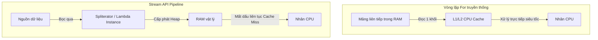

# Stream có luôn tốt hơn loop không? So sánh chi tiết hiệu năng JIT, CPU Cache, Garbage Collector

## ⚡ Tóm tắt ngắn (30s)
Câu trả lời chắc chắn là **KHÔNG**.
Xét về hiệu năng thuần túy, **Vòng lặp truyền thống (`for`/`while`) hầu như luôn nhanh hơn hoặc bằng Stream API**.

Bản chất kỹ thuật đằng sau bao gồm:
1.  **Chi phí Cấp phát (GC Overhead)**: Stream API tạo ra hàng loạt đối tượng trung gian (đối tượng Stream, các instance ẩn của Lambda) trên bộ nhớ Heap, tạo áp lực dọn dẹp khổng lồ cho Garbage Collector khi xử lý lượng bản ghi lớn.
2.  **Độ tối ưu của JIT Compiler**: Vòng lặp `for` cơ bản cực kỳ thân thiện với trình biên dịch JIT, dễ dàng được tối ưu hóa ở mức mã máy thông qua kỹ thuật `Loop Unrolling`.
3.  **Tối ưu hóa CPU Cache (Cache Locality)**: Vòng lặp lướt mảng tuần tự tận dụng hoàn hảo bộ nhớ đệm CPU L1/L2 cache, trong khi Stream phải nhảy qua nhiều lớp con trỏ đối tượng gây ra hiện tượng hụt Cache (Cache Misses).

*Quy tắc thực chiến:* Sử dụng **Stream** để tăng độ sạch sẽ, dễ đọc và bảo trì của code nghiệp vụ Service. Sử dụng **Loop** trong các hàm xử lý tính toán lõi hiệu năng cao (Hot Paths) hệ thống.

---

## 🔍 Chi tiết bản chất thực chiến

### 1. Tại sao Vòng lặp For thân thiện với CPU Cache?
*   Khi duyệt mảng bằng vòng lặp `for` cơ bản, các phần tử dữ liệu (đặc biệt là kiểu nguyên thủy như `int[]`) nằm liên tiếp sát nhau trong bộ nhớ RAM vật lý. CPU khi đọc phần tử đầu tiên sẽ ngầm tải luôn cả một khối bộ nhớ xung quanh vào bộ nhớ đệm L1/L2 Cache (Kỹ thuật Prefetching). Việc truy cập các phần tử tiếp theo sẽ nhanh gấp 100 lần vì lấy trực tiếp từ L1/L2.
*   Với Stream, dữ liệu bị bọc qua các lớp đối tượng, các Lambda thực chất là các lời gọi phương thức ảo thông qua con trỏ đối tượng. CPU liên tục bị mất dấu vùng nhớ kế tiếp, gây ra **Cache Misses**, buộc CPU phải truy xuất trực tiếp xuống RAM vật lý chậm chạp.

### 2. Áp lực của Stream lên Garbage Collector
Khi chạy một pipeline stream dài xử lý 10 triệu phần tử:
*   Mỗi bước `map()`, `filter()` đều ngầm khởi tạo các đối tượng Spliterator và các bản thể trung gian. Hàng chục triệu đối tượng ngắn hạn (Short-lived objects) bị tống lên bộ nhớ Heap cùng lúc.
*   Garbage Collector sẽ phải liên tục kích hoạt cơ chế dọn dẹp (Minor GC). Trong lúc GC dọn dẹp, toàn bộ ứng dụng có thể bị dừng lại vài mili-giây (Stop-The-World), làm tăng độ trễ (latency spikes) của dịch vụ.

### 3. Sơ đồ tương tác vùng nhớ: Loop vs Stream


---

## 💻 Code thực chiến: BAD vs GOOD

### ❌ BAD: Dùng Stream API vô tội vạ cho các thuật toán xử lý tính toán lõi (Hot Paths)
```java
public class PerformanceCriticalService {
    // Hàm này bị gọi 500,000 lần mỗi giây trong hệ thống tài chính
    public double calculateMovingAverage(double[] prices) {
        // Sai lầm: Sử dụng Stream tạo ra DoubleStream và boxing liên tục
        // Làm chậm hệ thống gấp 5-10 lần so với loop cơ bản!
        return java.util.Arrays.stream(prices)
                               .filter(p -> p > 0.0)
                               .average()
                               .orElse(0.0);
    }
}
```

###  GOOD: Dùng vòng lặp For nguyên thủy cho Hot Paths, giữ Stream cho code nghiệp vụ
```java
public class PerformanceCriticalService {
    // Tận dụng vòng lặp for thô sơ nhưng mang lại tốc độ hủy diệt
    public double calculateMovingAverage(double[] prices) {
        double sum = 0;
        int count = 0;
        for (double price : prices) { // Chạy trực tiếp trên stack nguyên thủy, cache locality hoàn hảo
            if (price > 0.0) {
                sum += price;
                count++;
            }
        }
        return count == 0 ? 0.0 : sum / count;
    }
}
```

---

## 📊 Bảng so sánh chi tiết hiệu năng và tài nguyên

| Đặc tính kỹ thuật | Vòng lặp For/While truyền thống | Stream API |
| :--- | :--- | :--- |
| **Tốc độ xử lý thô** | **CỰC NHANH** (Tương thích phần cứng tối đa) | Chậm hơn 1.5 - 5 lần tùy thuộc vào độ phức tạp pipeline |
| **Cấp phát bộ nhớ Heap**| Gần như bằng 0 (Chỉ dùng stack nội bộ) | Rất lớn (Hàng loạt đối tượng trung gian được tạo ra) |
| **Áp lực lên Garbage Collector**| Không đáng kể | Rất lớn khi xử lý tập dữ liệu khổng lồ |
| **Truy cập CPU Cache** | Tối ưu tuyệt hảo (Tận dụng CPU Prefetching) | Kém do cấu trúc con trỏ nhảy vùng nhớ liên tục |
| **Khả năng bảo trì code**| Kém khi logic lọc, gộp lồng nhau quá nhiều | Cực cao nhờ cú pháp Declarative tường minh |

---

## ⚠️ Common Gotchas & Questions follow-up

* **Cạm bẫy đo hiệu năng bằng System.currentTimeMillis() (Naive Benchmark Gotcha)**:
  Rất nhiều lập trình viên mắc sai lầm khi tự đo hiệu năng bằng cách chạy thử 1 lần vòng lặp và 1 lần stream rồi in ra hiệu số mili-giây.
  * *Lý do sai lệch:* Trình biên dịch JIT của JVM hoạt động theo cơ chế thông minh. Nó cần chạy ấm (warm-up) khoảng 10,000 lần để nhận diện "Hot Code" và biên dịch sang mã máy tối ưu. Thêm vào đó, Garbage Collector có thể tự kích hoạt ngẫu nhiên làm kết quả sai lệch hoàn toàn.
  * *Khắc phục:* Bắt buộc dùng thư viện **JMH (Java Microbenchmark Harness)** để đo hiệu năng chuẩn xác.
*  **Câu hỏi đào sâu từ interviewer**: *Tại sao JIT compiler có thể dễ dàng tối ưu hóa (Loop Unrolling) trên vòng lặp for truyền thống hơn so với Stream API?*
  * *(Trả lời: **Loop Unrolling** là kỹ thuật tối ưu hóa phần cứng đỉnh cao của JIT. Nó nhân bản mã nguồn trong vòng lặp để giảm số lần kiểm tra điều kiện nhảy chỉ số index (ví dụ: thay vì lặp 4 lần, nó gộp mã lệnh chạy 4 phần tử trong 1 bước lặp). Với vòng lặp `for` cơ bản, cấu trúc tuần tự và giới hạn vòng lặp cực kỳ rõ ràng trên Stack giúp JIT phân tích dòng dữ liệu dễ dàng. Trong khi đó, Stream API bọc dữ liệu qua các Spliterator phức tạp và các lời gọi phương thức ảo (Virtual Methods) của lambda, khiến JIT gặp khó khăn rất lớn trong việc tĩnh học hóa luồng dữ liệu để unroll vòng lặp).*
---