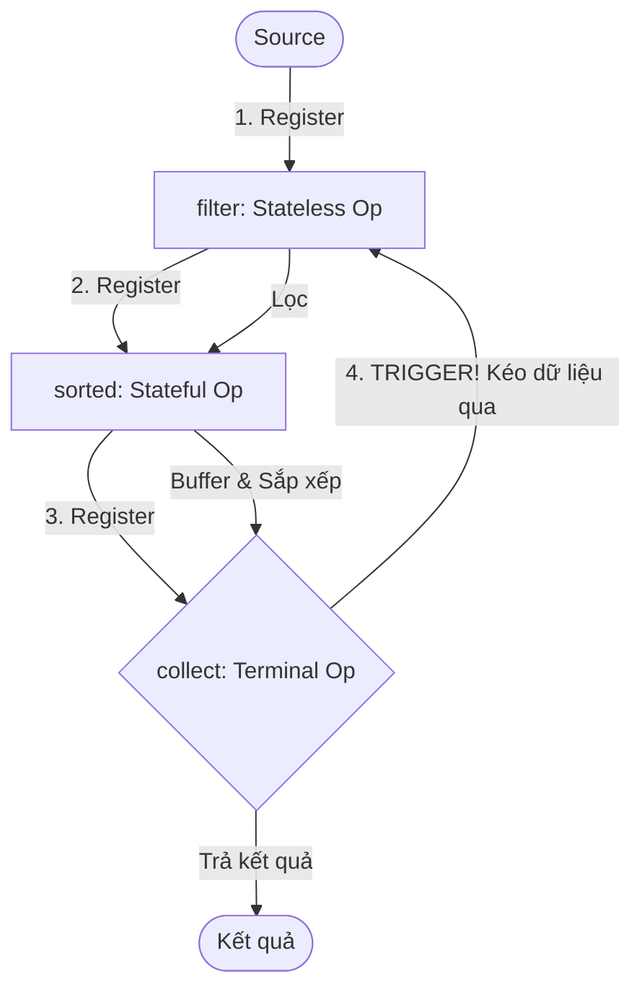

# Intermediate operation và terminal operation khác nhau thế nào?

## ⚡ Tóm tắt ngắn (30s)
* **Intermediate Operations** (như `filter`, `map`, `flatMap`, `sorted`, `distinct`) là các tác vụ biến đổi một stream thành một stream khác. Chúng có tính **lười biếng (Lazy)**: chỉ đăng ký "công thức chế biến" vào pipeline chứ hoàn toàn chưa thực thi tính toán trên dữ liệu.
* **Terminal Operations** (như `collect`, `forEach`, `reduce`, `count`, `findFirst`, `anyMatch`) là các tác vụ đóng ống dẫn. Chúng có tính **chủ động (Eager)**: khi được gọi, chúng kích hoạt toàn bộ pipeline chạy từ đầu, kéo dữ liệu từ nguồn qua các bước trung gian, tiêu thụ stream và trả về kết quả cuối cùng (hoặc không trả về gì).

---

## 🔍 Chi tiết bản chất thực chiến

### 1. Cơ chế đăng ký bước trung gian (Intermediate Registration)
Mỗi khi ta gọi một intermediate operation, Java không hề lặp qua danh sách phần tử. Thay vào đó, nó tạo ra một đối tượng Stream mới bọc đối tượng Stream cũ, liên kết thành một chuỗi Double-Linked List cấp độ logic của các lớp hiện thực Stream (như `StatelessOp`, `StatefulOp`). Nó lưu trữ cấu hình lambda của bước đó.

### 2. Sự phân loại trong Intermediate Operations
* **Stateless (Không lưu trạng thái)**: Xử lý từng phần tử một cách độc lập mà không cần biết các phần tử trước hoặc sau (ví dụ: `filter`, `map`). Hiệu năng cực tốt, dễ chạy song song.
* **Stateful (Lưu trạng thái)**: Cần phải nạp tất cả phần tử vào bộ nhớ để tính toán tổng thể trước khi có thể đẩy kết quả đi tiếp (ví dụ: `sorted`, `distinct`, `limit`). Chi phí RAM cực cao vì phải buffer dữ liệu.

### 3. Sơ đồ kích hoạt Pipeline qua Terminal Operation


---

## 💻 Code thực chiến: BAD vs GOOD

### ❌ BAD: Lạm dụng side-effect trong Intermediate Operations hoặc quên gọi Terminal Operation
```java
import java.util.List;

public class BadPipelineUsage {
    public void processData(List<User> users) {
        // Sai lầm 1: Thiếu terminal operation -> Pipeline này hoàn toàn KHÔNG CHẠY!
        users.stream()
             .filter(u -> u.getAge() > 18)
             .map(u -> {
                 System.out.println("Processing: " + u.getName()); // Sẽ không in gì cả
                 return u.getName();
             });

        // Sai lầm 2: Thực hiện tác vụ I/O blocking hoặc thay đổi dữ liệu trong filter/map (Side Effect)
        users.stream()
             .filter(u -> {
                 // Gọi DB hoặc HTTP call trong filter -> Phá vỡ tính Lazy và làm chậm pipeline cực nghiêm trọng!
                 return db.checkValid(u.getId()); 
             })
             .forEach(System.out::println);
    }
}
```

###  GOOD: Pipeline thiết kế rõ ràng, tách bạch biến đổi và thu gom dữ liệu
```java
import java.util.List;
import java.util.stream.Collectors;

public class GoodPipelineUsage {
    public List<String> processData(List<User> users) {
        // Lấy danh sách ID trước để truy vấn DB hàng loạt (Batching) thay vì gọi lẻ tẻ trong stream
        List<Long> ids = users.stream()
                              .map(User::getId)
                              .collect(Collectors.toList());
        
        List<Long> validIds = db.checkValidBatch(ids); // Truy vấn batch tối ưu

        // Xây dựng pipeline xử lý dữ liệu sạch
        return users.stream()
             .filter(u -> validIds.contains(u.getId()))
             .map(User::getName)
             .collect(Collectors.toList()); // Terminal op kích hoạt pipeline hợp lệ
    }
}
```

---

## 📊 So sánh Stateless và Stateful Operations

| Tiêu chí | Stateless (filter, map) | Stateful (sorted, distinct, limit) |
| :--- | :--- | :--- |
| **Lưu trữ trung gian** | Không tốn bộ nhớ để lưu trữ phần tử | Phải buffer các phần tử vào một cấu trúc dữ liệu tạm thời |
| **Độ phức tạp bộ nhớ** | $O(1)$ bổ sung | Có thể lên đến $O(N)$ (ví dụ: sorted cần nạp toàn bộ stream) |
| **Ảnh hưởng Parallel** | Cực kỳ tối ưu khi chạy song song | Tốn chi phí đồng bộ luồng cực lớn để hợp nhất trạng thái |
| **Khả năng ngắt sớm** | Không hỗ trợ ngắt trực tiếp | Hỗ trợ ngắt sớm (Short-circuiting) như `limit` |

---

## ⚠️ Common Gotchas & Questions follow-up

* **Cạm bẫy loop vô tận với Stateful Operation trên Infinite Stream (Infinite Loop Gotcha)**:
  Nếu bạn tạo một infinite stream (ví dụ `Stream.iterate(0, i -> i + 1)`) rồi gọi `sorted()` hoặc `distinct()` trước khi gọi `limit()`, ứng dụng của bạn sẽ bị đơ hoàn toàn (Out of Memory hoặc CPU 100%) vì JVM cố gắng nạp toàn bộ vô hạn phần tử vào bộ nhớ để sắp xếp!
  * *Khắc phục:* Luôn luôn gọi `limit()` trước các stateful operations khi làm việc với infinite streams.
*  **Câu hỏi đào sâu từ interviewer**: *Tại sao Stream API lại thiết kế cơ chế lười biếng (Lazy)? Nó đem lại lợi ích gì về mặt tối ưu hóa hiệu năng biên dịch và thực thi?*
  * *(Trả lời: Cơ chế lười biếng cho phép JVM thực hiện kỹ thuật **Loop Fusion (Tích hợp vòng lặp)** và **Short-circuiting (Ngắt sớm)**. Thay vì duyệt qua danh sách phần tử 3 lần tương ứng với 3 mắt xích xử lý, JVM sẽ kết hợp tất cả các mắt xích stateless thành một vòng lặp duy nhất. Mỗi phần tử được kéo qua toàn bộ chuỗi biến đổi chỉ trong 1 lần duyệt (single-pass). Hơn nữa, nếu có tác vụ ngắt sớm như `findFirst()` hay `limit(1)`, luồng xử lý sẽ dừng ngay lập tức khi tìm thấy phần tử hợp lệ đầu tiên, tiết kiệm tối đa thời gian tính toán của CPU).*
---