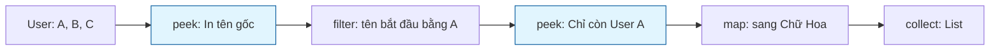

# Debug stream pipeline như thế nào? Kỹ thuật dùng peek(), custom debug collector và các công cụ IDE

## ⚡ Tóm tắt ngắn (30s)
Gỡ lỗi (Debugging) trong Stream API là thách thức lớn vì toàn bộ pipeline được viết dưới dạng một chuỗi lệnh đơn duy nhất (Fluent Chain), khiến việc đặt breakpoint truyền thống giữa các bước biến đổi trở nên bất khả thi.

Có 4 kỹ thuật gỡ lỗi thực chiến tối thượng:
1.  **Java Stream Debugger (IDE Tool)**: Công cụ trực quan hóa có sẵn trong IntelliJ IDEA. Chỉ cần nhấp vào biểu tượng "Trace Current Stream Chain" khi dừng ở breakpoint, IDE sẽ hiển thị biểu đồ trực quan chi tiết từng phần tử bị thay đổi thế nào qua từng bước.
2.  **Sử dụng `.peek()`**: Chèn phương thức trung gian `.peek(x -> log.debug(x))` để in trạng thái dữ liệu trôi qua mà không làm biến đổi dòng chảy.
3.  **Đặt Breakpoint trực tiếp trong biểu thức Lambda**: Nhấp chuột vào phần thân của Lambda (ở lề dòng IDE) thay vì nhấp vào đầu dòng lệnh Stream.
4.  **Tách chuỗi (Refactoring)**: Tách các lambda phức tạp thành các class/method riêng biệt để dễ dàng viết Unit Test độc lập.

---

## 🔍 Chi tiết bản chất thực chiến

### 1. Sức mạnh của Trình gỡ lỗi trực quan IntelliJ Stream Debugger
Đây là vũ khí tối thượng của lập trình viên Java. Khi bạn debug một luồng dữ liệu phức tạp gồm `filter`, `map`, `flatmap`, `sorted`:
*   IntelliJ sẽ phân tích cấu trúc của Stream tại thời điểm runtime.
*   Nó hiển thị một bảng so sánh song song trực quan 2 phía (Before và After) của từng Operation riêng biệt. Bạn có thể thấy rõ phần tử nào bị lọc bỏ ở bước filter, phần tử nào bị biến đổi kiểu dữ liệu ở bước map.

### 2. Kỹ thuật dùng peek() an toàn cho debug
Phương thức `.peek()` nhận vào một `Consumer`. Nó được sinh ra duy nhất cho mục đích quan sát phần tử trôi qua đường ống.
*   *Lưu ý cốt lõi:* Tuyệt đối không thay đổi trạng thái (mutation) của phần tử bên trong `peek()`. Thao tác này sẽ tạo ra side-effect nguy hại phá vỡ tính bất biến của Stream.

### 3. Sơ đồ gỡ lỗi dòng chảy bằng .peek()


---

## 💻 Code thực chiến: BAD vs GOOD

### ❌ BAD: Viết logic biến đổi cực phức tạp trong 1 dòng Stream không thể debug và lạm dụng peek làm side effect
```java
import java.util.List;
import java.util.stream.Collectors;

public class BadDebugUsage {
    public List<String> processData(List<User> users) {
        // Sai lầm 1: Logic quá phức tạp lồng chéo, khi crash lỗi không biết lỗi ở filter hay map
        // Sai lầm 2: Lạm dụng peek() để thay đổi trực tiếp tuổi (Side effect phá vỡ tính Pure)
        return users.stream()
            .peek(u -> u.setAge(u.getAge() + 1)) // ⚠️ Cực kỳ bậy! peek() dùng để thay đổi state
            .filter(u -> u.getName().length() > 5 && u.getAge() > 20)
            .map(u -> u.getName().toUpperCase())
            .collect(Collectors.toList());
    }
}
```

###  GOOD: Tổ chức Stream rõ ràng, dùng peek() ghi log an toàn và tách biệt logic
```java
import java.util.List;
import java.util.stream.Collectors;
import org.slf4j.Logger;
import org.slf4j.LoggerFactory;

public class GoodDebugUsage {
    private static final Logger log = LoggerFactory.getLogger(GoodDebugUsage.class);

    public List<String> processData(List<User> users) {
        return users.stream()
            // Chỉ dùng peek để log/debug xem trạng thái đầu vào
            .peek(u -> log.debug("Đầu vào stream: {}", u.getName())) 
            
            .filter(this::isValidUser) // Tách logic phức tạp thành method riêng để dễ debug/test
            
            .peek(u -> log.debug("Sau khi lọc: {}", u.getName()))
            
            .map(User::getName)
            .map(String::toUpperCase)
            .collect(Collectors.toList());
    }

    private boolean isValidUser(User u) {
        // Đặt breakpoint dễ dàng ngay tại đây!
        return u.getName().length() > 5 && u.getAge() > 20;
    }
}
```

---

## 📊 So sánh các kỹ thuật Debug Stream API

| Kỹ thuật debug | Ưu điểm vượt trội | Nhược điểm hạn chế | Kịch bản khuyên dùng |
| :--- | :--- | :--- | :--- |
| **Java Stream Debugger (IDE)** | Trực quan hóa 100%, nhìn thấu từng biến đổi phần tử | Chỉ dùng được khi chạy ở chế độ Debug trên IDE Local | Gỡ lỗi các pipeline phức tạp nhiều bước gộp/lọc |
| **Chèn `.peek()`** | Hoạt động được ở mọi môi trường (kể cả Production log) | Làm phình to dòng log, giảm hiệu năng nếu không tắt | Gỡ lỗi môi trường Staging/Dev thông qua log file |
| **Breakpoint trong Lambda** | Dừng chương trình ngay tại phần tử lỗi để xem giá trị | Dễ bị dừng quá nhiều lần nếu tập dữ liệu đầu vào lớn | Khi biết chắc chắn có 1 phần tử lỗi và muốn xem Stack |
| **Tách chuỗi (Refactoring)** | Cực kỳ sạch sẽ, viết được Unit Test chuyên biệt | Tốn công sức viết thêm method bổ trợ | Logic nghiệp vụ siêu quan trọng cần độ tin cậy tuyệt đối |

---

## ⚠️ Common Gotchas & Questions follow-up

* **Cạm bẫy biến mất thầm lặng của peek() do JVM tối ưu hóa (Optimized Out peek Gotcha)**:
  Có một cạm bẫy cực kỳ quái dị trong Java 9+. Trình tối ưu hóa của JVM có thể tự động **loại bỏ (bỏ qua hoàn toàn) lệnh `.peek()`** nếu nó phát hiện ra hành động terminal operation tiếp theo không thực sự tiêu thụ phần tử dữ liệu.
  * *Ví dụ:*
    ```java
    long count = list.stream()
                     .peek(System.out::println) // ⚠️ Hoàn toàn không in ra bất kỳ dòng chữ nào!
                     .count();
    ```
    Từ Java 9+, với nguồn dữ liệu kích thước xác định (như ArrayList), JVM tối ưu hóa hàm `count()` bằng cách đọc trực tiếp size của nguồn mà không thèm chạy qua các intermediate operations phía trước. Do đó, `peek()` bị bỏ qua hoàn toàn làm lập trình viên hoang mang nghĩ rằng code không chạy.
*  **Câu hỏi đào sâu từ interviewer**: *Tại sao việc để nguyên các hàm .peek(System.out::println) phục vụ debug sau khi bàn giao dự án lên Production lại có thể hủy diệt hiệu năng của toàn bộ hệ thống Microservice?*
  * *(Trả lời: Vì hai nguyên nhân chí tử:*
    *1. **Nghẽn cổ chai I/O**: Ghi dữ liệu ra console (`System.out`) là thao tác ghi đĩa/màn hình đồng bộ (Synchronized Blocking I/O) cực kỳ chậm chạp. Nó chặn đứng luồng CPU xử lý.*
    *2. **Tranh chấp tài nguyên luồng**: Khi chạy Parallel Stream, hàng chục thread CPU sẽ cùng tranh giành chiếc khóa Monitor Lock của đối tượng `PrintStream` duy nhất để in log. Điều này biến việc xử lý song song thành tuần tự và gây ra hiện tượng nghẽn cổ chai luồng (Thread Contention) cực lớn, làm sụt giảm 90% hiệu năng hệ thống).*
---