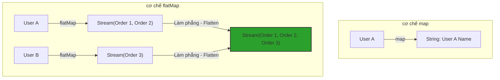

# map() và flatMap() khác nhau thế nào? Phân tích kiến trúc Flattening trong thực chiến

## ⚡ Tóm tắt ngắn (30s)
* **`map()`** là phép biến đổi **1-đối-1 (1-to-1 Mapping)**. Nó nhận vào một phần tử kiểu `T`, biến đổi và trả về đúng một phần tử kiểu `R`. Đầu vào là `Stream<T>`, đầu ra chắc chắn là `Stream<R>`.
* **`flatMap()`** là phép biến đổi **1-đối-nhiều (1-to-Many Mapping)** và làm phẳng (**Flattening**). Nó nhận vào một phần tử kiểu `T`, biến đổi phần tử đó thành một `Stream<R>` con độc lập, sau đó gom tất cả các stream con này lại để làm phẳng thành một `Stream<R>` lớn duy nhất. Đầu vào là `Stream<T>`, đầu ra là `Stream<R>` thay vì `Stream<Stream<R>>`.

---

## 🔍 Chi tiết bản chất thực chiến

### 1. Khi nào chọn map() vs flatMap()?
* Chọn **`map()`** khi bạn chỉ muốn thay đổi hình dáng dữ liệu của từng phần tử (ví dụ: chuyển từ đối tượng Entity sang DTO, hoặc viết hoa một chuỗi String).
* Chọn **`flatMap()`** khi cấu trúc dữ liệu của bạn có tính chất phân cấp (Nested/Hierarchical Data), nơi một phần tử cha chứa một Collection các phần tử con, và bạn muốn lấy toàn bộ phần tử con của tất cả các cha ra thành một danh sách phẳng.

### 2. Sơ đồ bản chất của flatMap


---

## 💻 Code thực chiến: BAD vs GOOD

### ❌ BAD: Dùng map() cho cấu trúc dữ liệu lồng nhau gây ra code lồng vòng khó bảo trì
```java
import java.util.List;
import java.util.stream.Collectors;

public class BadMapUsage {
    // Lấy tất cả số điện thoại của tất cả khách hàng
    public List<String> getAllPhoneNumbers(List<Customer> customers) {
        // Hậu quả: map trả về Stream<List<String>>, kết hợp với collect tạo ra List<List<String>>
        List<List<String>> nestedPhones = customers.stream()
                .map(Customer::getPhoneNumbers) // getPhoneNumbers() trả về List<String>
                .collect(Collectors.toList());

        // Phải viết thêm vòng lặp ngoài để làm phẳng thủ công -> Phá vỡ tính thanh thoát của Stream!
        List<String> flatPhones = new ArrayList<>();
        for (List<String> list : nestedPhones) {
            flatPhones.addAll(list);
        }
        return flatPhones;
    }
}
```

###  GOOD: Sử dụng flatMap() để làm phẳng dữ liệu tức thì ngay trong pipeline
```java
import java.util.Collection;
import java.util.List;
import java.util.stream.Collectors;

public class GoodMapUsage {
    public List<String> getAllPhoneNumbers(List<Customer> customers) {
        return customers.stream()
                // flatMap nhận vào Customer, trả về Stream<String> (từ Collection.stream())
                .flatMap(customer -> customer.getPhoneNumbers().stream())
                .collect(Collectors.toList()); // Kết quả là List<String> phẳng hoàn hảo!
    }
}
```

---

## 📊 So sánh map() và flatMap()

| Tiêu chí | map() | flatMap() |
| :--- | :--- | :--- |
| **Mục đích** | Biến đổi phần tử 1-đối-1 | Biến đổi và làm phẳng cấu trúc dữ liệu phân cấp |
| **Hàm Lambda đầu vào** | Trả về một giá trị đơn lẻ (`T -> R`) | Trả về một Stream (`T -> Stream<R>`) |
| **Kiểu trả về trung gian** | `Stream<R>` | `Stream<R>` (sau khi giải phẳng từ `Stream<Stream<R>>`) |
| **Sự thay đổi số phần tử** | Giữ nguyên chính xác số phần tử của stream gốc | Số phần tử đầu ra có thể tăng lên nhiều lần hoặc giảm về 0 |

---

## ⚠️ Common Gotchas & Questions follow-up

* **Cạm bẫy NullPointerException khi flatMap trả về null (Null Stream Gotcha)**:
  Trong hàm lambda của `flatMap(x -> ...)`, nếu hàm xử lý trả về `null` thay vì một đối tượng Stream trống, JVM sẽ ném ngay lập tức `NullPointerException` khi stream chạy qua phần tử đó.
  * *Khắc phục:* Luôn đảm bảo hàm lambda trả về `Stream.empty()` nếu dữ liệu con bị rỗng hoặc null, tuyệt đối không trả về `null`.
  * *Ví dụ:* `flatMap(c -> c.getOrders() == null ? Stream.empty() : c.getOrders().stream())`.
*  **Câu hỏi đào sâu từ interviewer**: *Lập trình viên thường kết hợp flatMap với lớp Optional như thế nào để xử lý các thuộc tính lồng nhau có nguy cơ NullPointerException cao một cách an toàn và gọn gàng?*
  * *(Trả lời: Ta có thể dùng `Optional.flatMap()` để điều hướng qua các lớp đối tượng lồng nhau mà không cần viết khối `if (a != null && a.getB() != null)`. Khác với Stream API, `Optional.flatMap` nhận đầu vào là một hàm trả về một `Optional` khác, và tự động giải phẳng kết quả thành một lớp `Optional` đơn lẻ. Ví dụ: `Optional.ofNullable(user).flatMap(User::getProfile).flatMap(Profile::getAddress).map(Address::getCity)`. Nếu bất kỳ mắt xích nào trong chuỗi trả về `Optional.empty()` (hoặc null), toàn bộ chuỗi sẽ dừng lại an toàn và trả về `Optional.empty()` mà không hề ném lỗi).*
---