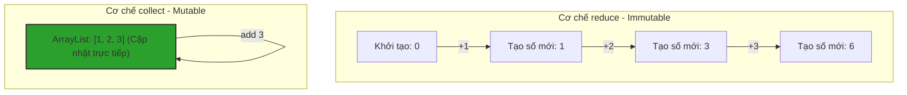

# filter(), reduce(), collect() dùng thế nào? Phân biệt sâu sắc Mutable và Immutable Reduction

## ⚡ Tóm tắt ngắn (30s)
Đây là ba công cụ trụ cột để lọc và tổng hợp dữ liệu trong Stream API:
1. **`filter(Predicate<T>)`**: Phép lọc loại bỏ phần tử. Giữ lại những phần tử thỏa mãn điều kiện logic của Predicate (trả về true).
2. **`reduce()`**: Phép gom tụ không thay đổi trạng thái (**Immutable Reduction**). Nó tích lũy các phần tử của stream để tạo ra một giá trị đơn lẻ mới (ví dụ: tính tổng, nhân, tìm max) thông qua một hàm tích lũy (Accumulator). Mỗi bước tích lũy sẽ tạo ra một đối tượng kết quả mới.
3. **`collect(Collector)`**: Phép gom tụ thay đổi trạng thái (**Mutable Reduction**). Nó thu thập các phần tử của stream vào một cấu trúc dữ liệu container có khả năng thay đổi trạng thái (như `List`, `Set`, `Map`) bằng cách cập nhật trực tiếp vào đối tượng container duy nhất đó, giúp tối ưu hiệu năng và bộ nhớ vượt trội.

---

## 🔍 Chi tiết bản chất thực chiến

### 1. Bản chất của reduce() - Immutable Reduction
Hàm `reduce` nhận vào 3 tham số (hoặc ít hơn):
* **Identity**: Giá trị khởi tạo mặc định (ví dụ: 0 đối với phép cộng, 1 đối với phép nhân).
* **Accumulator**: Hàm tích hợp phần tử mới vào kết quả tích lũy trung gian (`(result, element) -> newResult`).
* **Combiner**: Hàm hợp nhất các kết quả trung gian từ các luồng khác nhau khi chạy Parallel Stream.
* *Tại sao gọi là Immutable?* Bởi vì kết quả trung gian không được chỉnh sửa trực tiếp, mỗi lần tích lũy ta tạo ra một giá trị mới (ví dụ: `String` concatenation tạo ra chuỗi mới liên tục, gây tốn bộ nhớ).

### 2. Bản chất của collect() - Mutable Reduction
Hàm `collect` cập nhật dữ liệu trực tiếp vào một container có sẵn (như `ArrayList::add`). Container này được tái sử dụng trong suốt vòng đời của stream, triệt tiêu hoàn toàn chi phí khởi tạo đối tượng mới liên tục.

### 3. Sơ đồ cơ chế hoạt động của collect và reduce


---

## 💻 Code thực chiến: BAD vs GOOD

### ❌ BAD: Dùng reduce để gom tụ kiểu Mutable hoặc dùng forEach để collect dữ liệu thủ công
```java
import java.util.ArrayList;
import java.util.List;

public class BadReductionUsage {
    // Sai lầm 1: Dùng forEach để nhét dữ liệu vào list bên ngoài -> Phá vỡ tính Thread-safe!
    public List<String> badCollect(List<User> users) {
        List<String> result = new ArrayList<>(); // Shared mutable state
        users.stream()
             .filter(u -> u.getAge() > 18)
             .map(User::getName)
             .forEach(result::add); // Cực kỳ nguy hiểm nếu chuyển sang Parallel Stream!
        return result;
    }

    // Sai lầm 2: Dùng reduce để tích lũy mutable object (ArrayList) -> Cực kỳ chậm và sai thiết kế!
    public List<String> badReduce(List<User> users) {
        return users.stream()
                .map(User::getName)
                .reduce(
                    new ArrayList<String>(),
                    (list, name) -> {
                        list.add(name); // Thay đổi trực tiếp biến tích lũy trong reduce là cấm kỵ
                        return list;
                    },
                    (list1, list2) -> {
                        list1.addAll(list2);
                        return list1;
                    }
                );
    }
}
```

###  GOOD: Sử dụng collect() và các Collectors dựng sẵn an toàn tuyệt đối
```java
import java.util.List;
import java.util.stream.Collectors;

public class GoodReductionUsage {
    public List<String> goodCollect(List<User> users) {
        // Collect thực hiện Mutable Reduction an toàn, chuẩn chỉ, hỗ trợ chạy song song tối ưu
        return users.stream()
             .filter(u -> u.getAge() > 18)
             .map(User::getName)
             .collect(Collectors.toList()); // Dùng Collector chuẩn
    }

    public int calculateTotalAge(List<User> users) {
        // Dùng reduce cho kiểu bất biến (Immutable - Integer) là cực kỳ hợp lý
        return users.stream()
             .map(User::getAge)
             .reduce(0, Integer::sum);
    }
}
```

---

## 📊 Sự khác biệt cốt lõi giữa reduce() và collect()

| Đặc điểm | reduce() (Immutable Reduction) | collect() (Mutable Reduction) |
| :--- | :--- | :--- |
| **Cơ chế hoạt động** | Tích lũy bằng cách tạo ra giá trị mới ở mỗi bước | Cập nhật trực tiếp vào một container có sẵn |
| **Kiểu dữ liệu phù hợp** | Kiểu dữ liệu bất biến (`int`, `double`, `String`, `BigDecimal`) | Các cấu trúc dữ liệu có thể thay đổi trạng thái (`List`, `Map`, `StringBuilder`) |
| **Hiệu năng với Collection** | Kém, do phải sao chép cấu trúc dữ liệu liên tục | Cực kỳ xuất sắc, tận dụng cấu trúc dữ liệu sẵn có |
| **Mức độ an toàn Parallel** | Rất an toàn nhưng chi phí cao | Cực kỳ an toàn và được tối ưu hóa tối đa bởi JVM |

---

## ⚠️ Common Gotchas & Questions follow-up

* **Cạm bẫy sửa đổi nguồn dữ liệu gốc trong stream (ConcurrentModificationException Gotcha)**:
  Nếu bên trong các hàm trung gian hoặc hàm terminal (như `forEach`), bạn thực hiện các thao tác thêm, sửa, xóa phần tử của chính Collection nguồn đang tạo ra Stream đó, JVM sẽ lập tức ném ra `ConcurrentModificationException`.
  * *Khắc phục:* Luôn ghi nhớ nguyên lý: Stream là luồng một chiều biến đổi dữ liệu, luôn trả về kết quả mới thông qua `collect()` và giữ nguyên nguồn dữ liệu gốc (Read-Only).
*  **Câu hỏi đào sâu từ interviewer**: *Tại sao hàm Combiner lại cực kỳ quan trọng trong phương thức reduce() khi chạy với Parallel Stream? Chuyện gì xảy ra nếu ta bỏ qua hoặc viết sai logic của Combiner?*
  * *(Trả lời: Khi chạy Parallel Stream, nguồn dữ liệu được chia nhỏ thành nhiều phần nhỏ (sub-streams), mỗi luồng CPU sẽ xử lý một sub-stream một cách độc lập và tạo ra kết quả tích lũy cục bộ. Hàm **Combiner** chịu trách nhiệm gộp các kết quả cục bộ của các luồng CPU đó lại thành kết quả chung cuộc duy nhất. Nếu ta bỏ qua hoặc hiện thực sai logic Combiner, kết quả cuối cùng của Parallel Stream sẽ bị sai lệch hoàn toàn, hoặc hệ thống sẽ không thể chạy song song và bị suy giảm hiệu năng nghiêm trọng).*
---