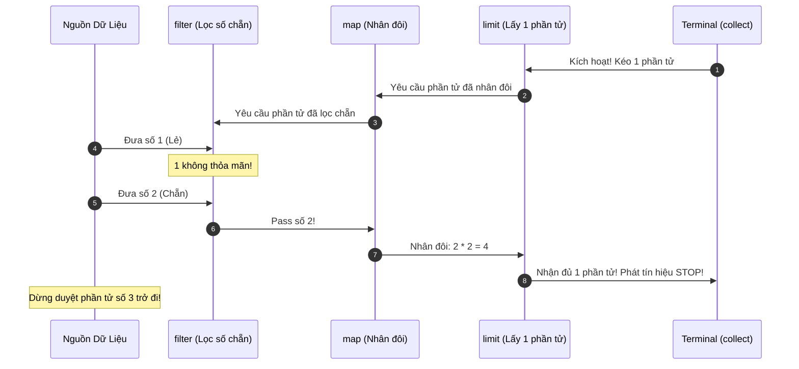

# Lazy evaluation trong stream là gì? Giải mã cơ chế tối ưu hóa Loop Fusion và Short-Circuiting

## ⚡ Tóm tắt ngắn (30s)
**Lazy Evaluation** (Tính toán lười biếng) trong Stream API nghĩa là các thao tác xử lý phần tử (Intermediate Operations) sẽ **không bao giờ được thực thi** ngay khi khai báo. Chúng chỉ là các khai báo thiết lập cấu hình.
Toàn bộ pipeline chỉ thực sự "thức giấc" và chạy khi có một **Terminal Operation** được kích hoạt.
Cơ chế Lazy đem lại hai lợi ích tối thượng giúp Stream tối ưu hóa hiệu năng vượt trội so với vòng lặp truyền thống:
1. **Loop Fusion (Gộp vòng lặp)**: JVM tự động tích hợp nhiều tác vụ trung gian (như filter, map) thành một lần duyệt dữ liệu duy nhất cấp độ CPU, loại bỏ hoàn toàn các cấu trúc dữ liệu trung gian tốn kém.
2. **Short-Circuiting (Ngắt sớm)**: Pipeline có thể dừng thực thi ngay lập tức khi đạt đủ điều kiện yêu cầu (ví dụ: `limit(N)`, `anyMatch()`), giúp tránh việc duyệt qua các phần tử không cần thiết còn lại trong nguồn dữ liệu.

---

## 🔍 Chi tiết bản chất thực chiến

### 1. Cơ chế hoạt động của Loop Fusion
Nếu duyệt theo kiểu truyền thống (Imperative):
* Lọc danh sách $\rightarrow$ tạo danh sách tạm 1.
* Biến đổi danh sách tạm 1 $\rightarrow$ tạo danh sách tạm 2.
* Lấy phần tử đầu tiên của danh sách tạm 2.
$\rightarrow$ Lãng phí RAM để lưu trữ danh sách tạm và duyệt qua dữ liệu nhiều lần.

Với Stream API:
JVM gom nhóm tất cả các hàm lambda của các bước stateless thành một ống dẫn duy nhất. Khi phần tử số 1 được kéo từ nguồn, nó chạy một mạch qua `filter`, qua `map`, đến `Terminal`. Sau đó phần tử số 2 mới được kéo. Quá trình này chỉ dùng đúng 1 vòng lặp duy nhất cho toàn bộ chuỗi operations (Single pass execution).

### 2. Cơ chế hoạt động của Short-Circuiting (Ngắt sớm)
Short-circuiting là khả năng tạo ra các kết quả hữu hạn từ các nguồn dữ liệu vô tận. Các thao tác như `limit(N)`, `findFirst()`, `anyMatch()`, `allMatch()` sẽ phát tín hiệu ngắt ngược về phía đầu nguồn ngay khi nhận đủ dữ liệu yêu cầu, đóng Spliterator lập tức và dừng luồng dữ liệu.

### 3. Sơ đồ Sequence của quá trình Pull & Short-Circuit


---

## 💻 Code thực chiến: BAD vs GOOD

### ❌ BAD: Viết side-effect hoặc logging nặng nề bên trong Intermediate Operations vì nghĩ nó sẽ chạy ngay lập tức
```java
import java.util.List;

public class BadLazyUsage {
    public void processUsers(List<User> users) {
        // Sai lầm kinh điển: Đoạn code này hoàn toàn KHÔNG IN ra gì cả và không chạy!
        // Vì thiếu Terminal Operation để kích hoạt nguồn điện cho pipeline.
        users.stream()
             .filter(u -> {
                 System.out.println("Filtering user: " + u.getName()); // Sẽ không bao giờ được gọi
                 return u.getAge() > 18;
             })
             .map(u -> {
                 System.out.println("Mapping user: " + u.getName()); // Sẽ không bao giờ được gọi
                 return u.getName();
             });
    }
}
```

###  GOOD: Pipeline khai báo chuẩn, kiểm soát chặt chẽ điểm kích hoạt và tận dụng ngắt sớm
```java
import java.util.List;
import java.util.stream.Collectors;

public class GoodLazyUsage {
    public List<String> processUsers(List<User> users) {
        System.out.println("--- Bắt đầu khai báo Pipeline (Chưa chạy) ---");
        
        var stream = users.stream()
             .filter(u -> {
                 System.out.println("-> Chạy qua filter: " + u.getName());
                 return u.getAge() > 18;
             })
             .map(u -> {
                 System.out.println("-> Chạy qua map: " + u.getName());
                 return u.getName().toUpperCase();
             })
             .limit(1); // ✅ Tối ưu: Chỉ lấy đúng 1 phần tử thỏa mãn rồi dừng ngay lập tức

        System.out.println("--- Đã khai báo xong Pipeline (Vẫn chưa chạy) ---");
        
        // Gọi Terminal operation thực sự kích hoạt toàn bộ luồng xử lý
        List<String> result = stream.collect(Collectors.toList());
        
        System.out.println("--- Kết quả cuối cùng: " + result);
        return result;
    }
}
```

---

## 📊 So sánh Eager Evaluation và Lazy Evaluation

| Đặc điểm | Eager Evaluation (Vòng lặp/Collection) | Lazy Evaluation (Stream API) |
| :--- | :--- | :--- |
| **Thời điểm chạy** | Thực thi ngay lập tức khi dòng code được quét qua | Chỉ thực thi khi Terminal Operation được gọi |
| **Dữ liệu trung gian** | Phải lưu trữ toàn bộ các Collection trung gian trong RAM | Không tốn RAM để lưu trữ dữ liệu trung gian |
| **Cách thức duyệt** | Duyệt qua dữ liệu nhiều lần tương ứng số lượng bước | Chỉ duyệt qua dữ liệu duy nhất một lần (Loop Fusion) |
| **Hiệu năng với tập lớn**| Suy giảm hiệu năng nhanh do tốn RAM và dư thừa phép tính | Cực kỳ tối ưu nhờ tận dụng Short-Circuiting |

---

## ⚠️ Common Gotchas & Questions follow-up

* **Cạm bẫy tác dụng phụ bị thực thi trễ (Side-effect Execution Delay Gotcha)**:
  Nếu bạn thực hiện các thao tác thay đổi cơ sở dữ liệu hoặc ghi log quan trọng bên trong `map()` hay `filter()` (vốn dĩ là các tác vụ lười biếng), các tác vụ này sẽ bị delay cho đến khi gọi terminal operation. Nguy hiểm hơn, nếu pipeline bị ngắt sớm (Short-circuit), một phần dữ liệu phía sau sẽ **không bao giờ được chạy qua**, dẫn đến việc mất mát log hoặc trạng thái DB bị cập nhật thiếu mà không hề báo lỗi!
  * *Khắc phục:* Giữ cho các hàm trong intermediate operations hoàn toàn là **Pure Functions (hàm thuần túy)**: không có side-effect, không sửa đổi trạng thái bên ngoài. Chỉ thực hiện side-effect trong `forEach()` (Terminal Operation).
*  **Câu hỏi đào sâu từ interviewer**: *Làm thế nào để chứng minh cơ chế Loop Fusion đang hoạt động trong một chuỗi gồm 3 hàm filter, map, filter liên tiếp bằng code thực tế?*
  * *(Trả lời: Ta có thể dễ dàng chứng minh bằng cách chèn câu lệnh in log hoặc debug bên trong các hàm lambda của filter và map đó. Khi kích hoạt terminal operation, ta sẽ thấy thứ tự log in ra sẽ là: Phần tử 1 đi qua filter 1 $\rightarrow$ filter 2 $\rightarrow$ map $\rightarrow$ Terminal, rồi mới đến lượt Phần tử 2 đi qua chuỗi đó. Nó chứng minh các phần tử được kéo xuyên suốt qua cả ống dẫn trong 1 lần lặp duy nhất, chứ không phải chạy xong hết filter 1 trên tất cả phần tử rồi mới sang filter 2).*
---