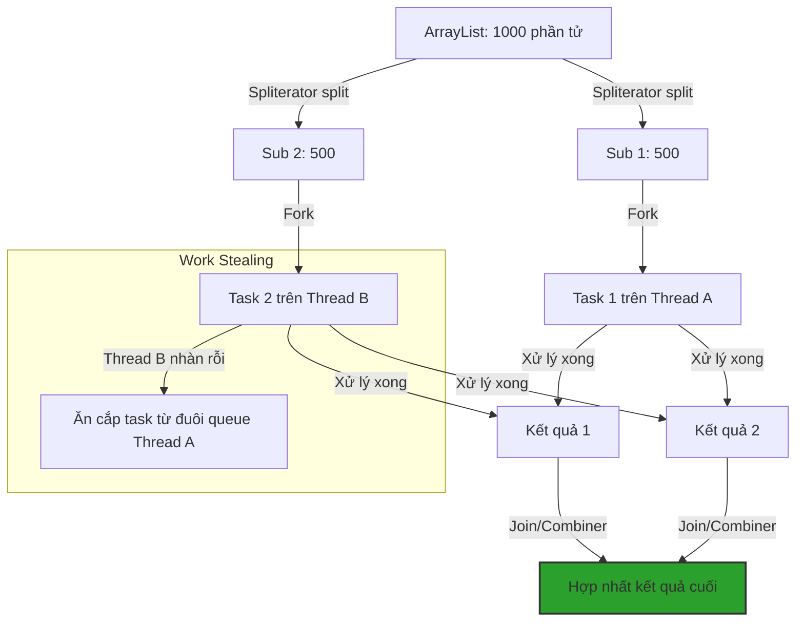

# Parallel stream hoạt động như thế nào? Giải mã thuật toán Work-Stealing và Spliterator

## ⚡ Tóm tắt ngắn (30s)
`Parallel Stream` trong Java là cơ chế xử lý song song, chia nhỏ dòng dữ liệu lớn thành nhiều luồng dữ liệu nhỏ hơn để chạy đồng thời trên nhiều nhân CPU.
Bản chất hoạt động dựa trên 3 trụ cột kỹ thuật:
1. **Spliterator (Split-able Iterator)**: Có nhiệm vụ chia đôi (split) nguồn dữ liệu một cách đệ quy thành các phần bằng nhau.
2. **ForkJoinPool.commonPool()**: Thread Pool dùng chung của toàn hệ thống (mặc định số luồng = số nhân CPU - 1), chịu trách nhiệm thực thi các tác vụ.
3. **Thuật toán Work-Stealing**: Các luồng CPU nhàn rỗi sẽ chủ động "đánh cắp" (steal) tác vụ từ đuôi hàng đợi của các luồng bận rộn khác, tối ưu hóa tối đa hiệu suất xử lý phần cứng.

---

## 🔍 Chi tiết bản chất thực chiến

### 1. Spliterator chia tách dữ liệu như thế nào?
Không phải nguồn dữ liệu nào cũng được chia tách hiệu quả như nhau.
* **ArrayList, Arrays, IntStream.range**: Sử dụng cơ chế truy cập ngẫu nhiên chỉ chỉ số (Index-based), giúp `Spliterator` chia đôi cực kỳ nhanh chóng ($O(1)$) và cân bằng hoàn hảo.
* **LinkedList, Stream.iterate, BufferedReader.lines**: Để chia đôi, JVM bắt buộc phải lướt qua từng phần tử để tìm điểm giữa. Chi phí chia tách cực kỳ đắt đỏ ($O(N)$) và thường không cân bằng, triệt tạo lợi ích của chạy song song.

### 2. Thuật toán Work-Stealing của ForkJoinPool
Mỗi thread trong `ForkJoinPool` quản lý một hàng đợi hai đầu (Deque - Double Ended Queue) chứa các task cần xử lý:
* Thread sở hữu deque sẽ lấy task từ **đầu** (Head) hàng đợi để xử lý theo cơ chế LIFO (Last-In-First-Out) nhằm tối ưu cache bộ nhớ.
* Khi hàng đợi của Thread A bị rỗng, nó sẽ đóng vai trò là "kẻ trộm", nhảy sang đuôi của hàng đợi Thread B để "đánh cắp" task từ **cuối** (Tail) hàng đợi theo cơ chế FIFO (First-In-First-Out). Việc này giảm thiểu tối đa tranh chấp khóa giữa Thread sở hữu và Thread ăn trộm.

### 3. Sơ đồ cơ chế Fork-Join và Work-Stealing


---

## 💻 Code thực chiến: BAD vs GOOD

### ❌ BAD: Dùng Parallel Stream trên cấu trúc dữ liệu khó chia tách và chứa I/O blocking nặng nề
```java
import java.io.BufferedReader;
import java.io.FileReader;
import java.io.IOException;
import java.util.LinkedList;
import java.util.List;

public class BadParallelUsage {
    // Sai lầm 1: Chạy song song trên LinkedList (Split tệ hại)
    public double calculateAverageAge(List<User> users) { // Giả định users là LinkedList
        return users.parallelStream() // LinkedList.parallelStream() chạy cực kỳ chậm!
                    .mapToInt(User::getAge)
                    .average()
                    .orElse(0.0);
    }

    // Sai lầm 2: Blocking I/O (gọi API ngoài) trong commonPool gây nghẽn toàn bộ ứng dụng!
    public void fetchExternalData(List<String> urls) {
        urls.parallelStream()
            .map(url -> httpClient.get(url)) // Làm nghẽn ForkJoinPool.commonPool()
            .forEach(System.out::println);
    }
}
```

###  GOOD: Chạy song song trên ArrayList với tác vụ CPU-bound nặng nề
```java
import java.util.ArrayList;
import java.util.List;

public class GoodParallelUsage {
    // Thao tác tính toán CPU-heavy (mã hóa dữ liệu) trên ArrayList lớn
    public List<String> encryptPasswords(List<String> rawPasswords) {
        // ArrayList hỗ trợ Spliterator chia tách O(1) hoàn hảo
        return rawPasswords.parallelStream() 
                    .map(this::heavyPBKDF2Hash) // CPU-bound nặng, cực kỳ phù hợp chạy song song
                    .collect(java.util.stream.Collectors.toList());
    }

    private String heavyPBKDF2Hash(String password) {
        // Giả lập phép băm mật khẩu tốn CPU (20ms)
        return BCrypt.hashpw(password, BCrypt.gensalt(12));
    }
}
```

---

## 📊 Mức độ phù hợp Parallel Stream của các cấu trúc dữ liệu

| Nguồn Dữ Liệu | Khả năng Chia Tách (Spliterator) | Đánh Giá Tốc Độ Parallel | Giải Thích Bản Chất |
| :--- | :--- | :--- | :--- |
| **ArrayList** | Cực kỳ xuất sắc ($O(1)$) | **SIÊU NHANH** | Dựa trên chỉ số (index), chia đôi hoàn hảo không tốn chi phí |
| **Mảng (Array)** | Cực kỳ xuất sắc ($O(1)$) | **SIÊU NHANH** | Tương tự ArrayList, tối ưu hóa bộ nhớ đệm CPU (L1/L2 cache) |
| **IntStream.range**| Cực kỳ xuất sắc ($O(1)$) | **SIÊU NHANH** | Tính toán chỉ số toán học trực tiếp, không tốn RAM |
| **HashSet / TreeSet**| Khá tốt ($O(log N)$) | **KHÁ TỐT** | Cấu trúc cây/bảng băm dễ chia nhỏ nhưng tốn chi phí hash |
| **LinkedList** | Rất kém ($O(N)$) | **RẤT CHẬM** | Bắt buộc lướt tuần tự qua các node để chia tách |
| **Stream.iterate** | Rất kém | **RẤT CHẬM** | Bản chất tuần tự hoàn toàn (phần tử sau phụ thuộc phần tử trước) |

---

## ⚠️ Common Gotchas & Questions follow-up

* **Cạm bẫy thảm họa nghẽn commonPool (CommonPool Starvation Gotcha)**:
  Mặc định, mọi Parallel Stream trên toàn JVM đều sử dụng chung một đối tượng `ForkJoinPool.commonPool()`. Nếu bạn chạy một tác vụ có gọi HTTP API hoặc truy vấn cơ sở dữ liệu chậm trong parallel stream, các luồng của pool chung này sẽ bị khóa (blocked). Hệ quả là toàn bộ các phần xử lý bất đồng bộ khác của ứng dụng sẽ bị treo cứng!
  * *Khắc phục:* Tuyệt đối không chạy blocking I/O trong Parallel Stream. Nếu bắt buộc, hãy bọc nó trong một Thread Pool chuyên dụng riêng bằng cách đẩy task vào một `ForkJoinPool` tự định nghĩa.
*  **Câu hỏi đào sâu từ interviewer**: *Làm thế nào để chỉ định số lượng Thread xử lý cho một Parallel Stream cụ thể mà không làm ảnh hưởng đến commonPool của hệ thống?*
  * *(Trả lời: Ta có thể bọc luồng thực thi của Parallel Stream bên trong một khối code chạy bởi một `ForkJoinPool` tùy biến. JVM sẽ tự nhận biết và ép Parallel Stream đó sử dụng các Worker Thread của pool tùy biến đó thay vì sử dụng `commonPool()`. Ví dụ:
    ```java
    ForkJoinPool customPool = new ForkJoinPool(8); // Pool chuyên dụng với 8 threads
    customPool.submit(() -> {
        myList.parallelStream().map(x -> heavyCalc(x)).collect(Collectors.toList());
    }).get(); // Chờ xử lý hoàn tất
    ```
    Cách làm này phân tách hoàn toàn tài nguyên CPU, bảo vệ an toàn cho hệ thống).*
---