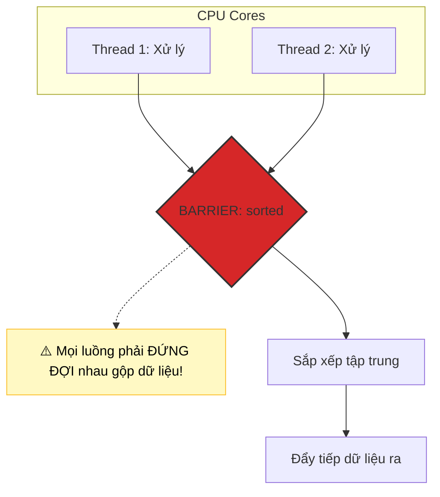

# Khi nào không nên dùng parallel stream? Phân tích quy tắc N*Q thực chiến

## ⚡ Tóm tắt ngắn (30s)
`Parallel Stream` không phải là "viên đạn bạc" làm tăng tốc độ xử lý trong mọi tình huống. Có 5 trường hợp cấm kỵ tuyệt đối không được dùng song song:
1. **Tác vụ quá nhỏ (Quy tắc $N 	imes Q < 10,000$)**: Với $N$ là số phần tử, $Q$ là chi phí tính toán cho mỗi phần tử. Nếu tích số này nhỏ hơn $10,000$, chi phí chia tách, tạo luồng và gộp luồng (overhead) sẽ lớn hơn rất nhiều so với thời gian chạy tuần tự.
2. **Nguồn dữ liệu khó phân tách**: `LinkedList`, `Stream.iterate()`, `BufferedReader.lines()` chia tách cực kỳ chậm.
3. **Chứa các tác vụ Stateful**: `sorted()`, `distinct()`, `limit()` yêu cầu sự đồng bộ luồng cực lớn, gây nghẽn cổ chai luồng.
4. **Tác vụ I/O Blocking nặng**: DB Query, Web Service Call làm treo `commonPool` dùng chung.
5. **Shared Mutable State (Side Effects)**: Tranh chấp biến dùng chung gây sai lệch dữ liệu hoặc treo luồng (race condition / lock contention).

---

## 🔍 Chi tiết bản chất thực chiến

### 1. Giải mã quy tắc $N 	imes Q$ huyền thoại
Để đo lường hiệu năng của chạy song song, Doug Lea (cha đẻ của Java Concurrency) đề xuất công thức $N 	imes Q$:
* **$N$**: Số lượng phần tử dữ liệu trong nguồn.
* **$Q$**: Chi phí thời gian xử lý của CPU trên một phần tử duy nhất.
* **Nếu $N 	imes Q$ cực lớn (ví dụ $> 10,000$)**: Chạy song song sẽ mang lại lợi thế vượt trội vì CPU cores được tận dụng tối đa, lấn át chi phí overhead của quản lý thread.
* **Nếu $N 	imes Q$ nhỏ (ví dụ phép toán cộng đơn giản trên $1000$ phần tử)**: Chạy song song chắc chắn sẽ **chậm hơn** chạy tuần tự (Sequential) từ 2 đến 10 lần.

### 2. Sự nghẽn mạch của Stateful Operations trong Parallel Stream
Khi chạy song song, các luồng tính toán độc lập. Tuy nhiên, các hàm như `sorted()` đòi hỏi phải thu thập toàn bộ dữ liệu của tất cả các luồng về một nơi, thực hiện sắp xếp toàn cục, sau đó mới chia lại để đi tiếp. Thao tác này tương đương với một ranh giới đồng bộ hóa (Barrier) cực lớn trong phần cứng, triệt tiêu hoàn toàn khả năng chạy bất đồng bộ.

### 3. Sơ đồ rào cản đồng bộ hóa (Barrier) của sorted()


---

## 💻 Code thực chiến: BAD vs GOOD

### ❌ BAD: Dùng Parallel Stream cho tác vụ tính toán quá đơn giản
```java
import java.util.List;

public class BadParallelPerformance {
    // Phép tính cộng đơn giản trên mảng nhỏ
    public int sumAges(List<User> users) {
        // Sai lầm nghiêm trọng! Chi phí fork/join lớn hơn gấp 10 lần phép cộng age.
        // N * Q ở đây cực kỳ nhỏ!
        return users.parallelStream() 
                    .mapToInt(User::getAge)
                    .sum();
    }
}
```

###  GOOD: Chạy song song cho các tác vụ CPU-bound nặng nề
```java
import java.util.List;
import java.util.stream.Collectors;

public class GoodParallelPerformance {
    // Mã hóa hàng loạt ảnh đại diện người dùng dạng Base64 (N lớn, Q rất lớn)
    public List<String> processAvatars(List<byte[]> avatarBytesList) {
        // N lớn (10,000 ảnh), Q rất lớn (mã hóa Base64 tốn CPU tính toán toán học)
        return avatarBytesList.parallelStream()
                              .map(bytes -> Base64.getEncoder().encodeToString(bytes))
                              .collect(Collectors.toList());
    }
}
```

---

## 📊 Khi nào nên và không nên chọn Parallel Stream

| Kịch Bản Thực Tế | Nên Dùng Parallel? | Lý Do Bản Chất |
| :--- | :--- | :--- |
| **Phép toán đơn giản (Cộng, Nhân, Lọc)** | **KHÔNG** | Quy tắc $N 	imes Q$ quá nhỏ, tốn chi phí quản lý luồng |
| **Tác vụ CPU-heavy (Mã hóa, Nén, Render)**| **CỰC KỲ NÊN** | Tận dụng tối đa 100% công suất các nhân CPU vật lý |
| **Nguồn dữ liệu LinkedList** | **KHÔNG** | Chi phí phân tách dữ liệu quá lớn ($O(N)$) |
| **Nguồn dữ liệu ArrayList lớn** | **NÊN** | Spliterator hỗ trợ chia tách cực nhanh ($O(1)$) |
| **Pipeline có sorted() hoặc distinct()** | **KHÔNG** | Rào cản đồng bộ hóa (Barrier) làm nghẽn toàn bộ luồng song song |

---

## ⚠️ Common Gotchas & Questions follow-up

* **Cạm bẫy rò rỉ ThreadLocal trong Parallel Stream (ThreadLocal Leaks Gotcha)**:
  Nếu mã nguồn của bạn dựa vào các biến lưu trong `ThreadLocal` (như thông tin UserContext, Transaction ID) ở luồng chính, khi chạy `parallelStream()`, các phần tử sẽ được chạy trên các Worker Threads khác nhau của `ForkJoinPool.commonPool()`.
  * *Hậu quả:* Các worker thread này sẽ **không thể đọc được** dữ liệu trong `ThreadLocal` của luồng chính, dẫn đến việc lấy ra giá trị `null` hoặc dữ liệu bị sai lệch, gây ra các lỗi bảo mật nghiêm trọng hoặc NullPointerException!
*  **Câu hỏi đào sâu từ interviewer**: *Tại sao việc dùng Parallel Stream để ghi log hoặc in ra console (System.out.println) lại có thể làm giảm hiệu năng ứng dụng kinh khủng hơn cả chạy tuần tự?*
  * *(Trả lời: Bản chất `System.out.println` và các thư viện ghi log ghi trực tiếp ra console hoặc file vật lý sử dụng cơ chế **Synchronized** bên dưới để đảm bảo thứ tự in dòng chữ không bị đè và lẫn lộn giữa các luồng. Khi ta dùng `parallelStream()` để in log, nhiều luồng CPU sẽ liên tục tranh chấp cùng một cái Monitor Lock của đối tượng `PrintStream`. Hệ quả là các luồng bị rơi vào trạng thái Thread Contention (tranh chấp luồng) cực lớn, CPU phải liên tục context-switch, khiến tốc độ chạy chậm hơn chạy tuần tự gấp nhiều lần).*
---