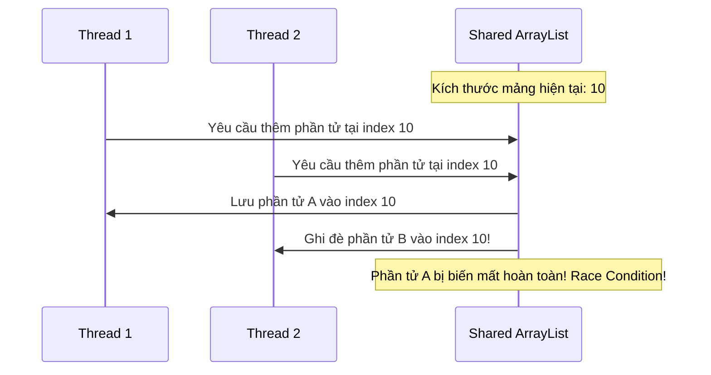

# Side effect trong stream nguy hiểm thế nào? Nguyên tắc thiết kế Stateless & Pure Functions

## ⚡ Tóm tắt ngắn (30s)
**Side effect (Tác dụng phụ)** xảy ra khi một hàm trung gian trong pipeline sửa đổi một trạng thái (State) nằm ngoài phạm vi hoạt động của nó (ví dụ: thay đổi biến toàn cục, cập nhật danh sách bên ngoài, ghi vào DB).
Trong Stream API, side effect cực kỳ nguy hiểm vì 3 lý do tối thượng:
1. **Phá vỡ cơ chế Lazy Evaluation**: Do tính lười biếng, các side effect sẽ bị thực thi trễ (delay) hoặc hoàn toàn không thực thi nếu pipeline bị ngắt sớm (Short-circuit).
2. **Gây thảm họa Race Condition**: Khi chạy `parallelStream()`, nhiều luồng CPU cùng thay đổi một trạng thái mutable dùng chung mà không có cơ chế khóa, dẫn đến mất dữ liệu hoặc crash chương trình ngẫu nhiên.
3. **Phá vỡ nguyên lý Lập trình hàm**: Làm mất tính bất biến (Immutability), khiến ứng dụng cực kỳ khó viết Unit Test và debug.

---

## 🔍 Chi tiết bản chất thực chiến

### 1. Thế nào là hàm thuần túy (Pure Function)?
Để Stream hoạt động an toàn và dự đoán trước được kết quả, tất cả các hàm lambda truyền vào intermediate operations phải là **Pure Functions**:
* **Không có Side Effects**: Không thay đổi bất kỳ trạng thái nào bên ngoài hệ thống.
* **Tính nhất quang (Deterministic)**: Với cùng một đầu vào $X$, hàm luôn luôn trả về cùng một đầu ra $Y$, không phụ thuộc vào trạng thái hệ thống hay thời gian chạy.

### 2. Thảm họa bất đồng bộ khi cập nhật Shared Mutable State
ArrayList trong Java không phải là một cấu trúc dữ liệu Thread-safe. Khi ta gọi `parallelStream()` kết hợp với side effect `list.add()`, nhiều luồng CPU sẽ đồng thời ghi đè lên mảng backing-array bên trong ArrayList. Điều này dẫn đến 2 kịch bản lỗi:
* **Mất mát dữ liệu thầm lặng**: Một phần tử ghi đè lên phần tử của luồng khác tại cùng một index.
* **ArrayIndexOutOfBoundsException**: Xảy ra khi hai luồng đồng thời mở rộng kích thước mảng backing-array.

### 3. Sơ đồ Race Condition trên Shared Mutable State


---

## 💻 Code thực chiến: BAD vs GOOD

### ❌ BAD: Dùng side effect để thu thập dữ liệu ra một danh sách bên ngoài
```java
import java.util.ArrayList;
import java.util.List;

public class BadSideEffectUsage {
    public List<String> getAdultUserNames(List<User> users) {
        // Biến trạng thái dùng chung cực kỳ nguy hại
        List<String> results = new ArrayList<>(); 
        
        users.parallelStream() // Chuyển sang song song sẽ gây lỗi rớt dữ liệu!
             .filter(u -> u.getAge() > 18)
             .map(User::getName)
             .forEach(name -> results.add(name)); // ⚠️ Tác dụng phụ: sửa đổi kết quả bên ngoài
             
        return results;
    }
}
```

###  GOOD: Thiết kế Stateless hoàn toàn, thu thập dữ liệu bằng collect()
```java
import java.util.List;
import java.util.stream.Collectors;

public class GoodStatelessUsage {
    public List<String> getAdultUserNames(List<User> users) {
        // Tuyệt đối không chạm vào state bên ngoài
        // JVM tự quản lý việc gom kết quả từ các thread một cách an toàn
        return users.parallelStream()
                    .filter(u -> u.getAge() > 18)
                    .map(User::getName)
                    .collect(Collectors.toList()); // ✅ Mutable Reduction an toàn, Thread-safe
    }
}
```

---

## 📊 So sánh hàm Impure (Side Effect) và Pure (Stateless)

| Tiêu chí | Impure Functions (Side-effect) | Pure Functions (Stateless) |
| :--- | :--- | :--- |
| **Độ an toàn đa luồng** | **CỰC KỲ NGUY HIỂM** (Cần đồng bộ hóa thủ công) | **AN TOÀN TUYỆT ĐỐI** (Không lo race condition) |
| **Tính dự đoán trước** | Kém, phụ thuộc vào thứ tự chạy của các phần tử | Tuyệt hảo, kết quả luôn nhất quán bất kể thứ tự chạy |
| **Dễ viết Unit Test** | Khó, đòi hỏi phải thiết lập môi trường / state bên ngoài | Cực kỳ dễ dàng (chỉ cần truyền input và assert output) |
| **Tối ưu hóa JVM** | JVM không thể tối ưu hóa và khó chạy song song | JVM tự do tối ưu hóa Loop Fusion và ngắt sớm |

---

## ⚠️ Common Gotchas & Questions follow-up

* **Cạm bẫy rò rỉ dữ liệu thầm lặng (Silent Data Loss Gotcha)**:
  Đây là lỗi nguy hiểm nhất vì nó **không ném ra bất kỳ Exception nào**. Khi bạn dùng `parallelStream()` để nhét dữ liệu vào một `ArrayList` hoặc `HashSet` bên ngoài qua `forEach`, ứng dụng vẫn chạy thành công 100% trong môi trường Test (do dữ liệu nhỏ, luồng chạy tuần tự). Tuy nhiên, khi lên Production với hàng triệu request, dữ liệu đầu ra sẽ bị mất mát khoảng 1-2% một cách ngẫu nhiên.
  * *Khắc phục:* Cấm tuyệt đối việc sử dụng `forEach()` để nhét phần tử vào một Collection bên ngoài. Luôn luôn dùng `collect(Collectors.toList())`.
*  **Câu hỏi đào sâu từ interviewer**: *Chuyện gì xảy ra nếu ta sử dụng một đối tượng Thread-safe như ConcurrentHashMap hoặc CopyOnWriteArrayList để hứng dữ liệu side-effect trong forEach() của Parallel Stream? Hệ năng có bị ảnh hưởng không?*
  * *(Trả lời: Kết quả dữ liệu sẽ chính xác và không bị mất mát vì các class này là Thread-safe. Tuy nhiên, hiệu năng của ứng dụng sẽ bị **suy giảm nghiêm trọng**. `CopyOnWriteArrayList` sử dụng cơ chế sao chép toàn bộ mảng mỗi khi ghi, chi phí ghi song song sẽ cực kỳ đắt đỏ. `ConcurrentHashMap` sẽ phải sử dụng các cơ chế khóa phân đoạn (Segment Locks). Việc tranh chấp lock liên tục giữa các luồng CPU sẽ biến song song thành tuần tự, thậm chí chậm hơn chạy tuần tự do tốn chi phí quản lý lock. Việc dùng `.collect()` luôn là giải pháp nhanh nhất vì JVM gom kết quả vào các container cục bộ của từng luồng trước, rồi mới ghép lại một lần ở bước cuối).*
---