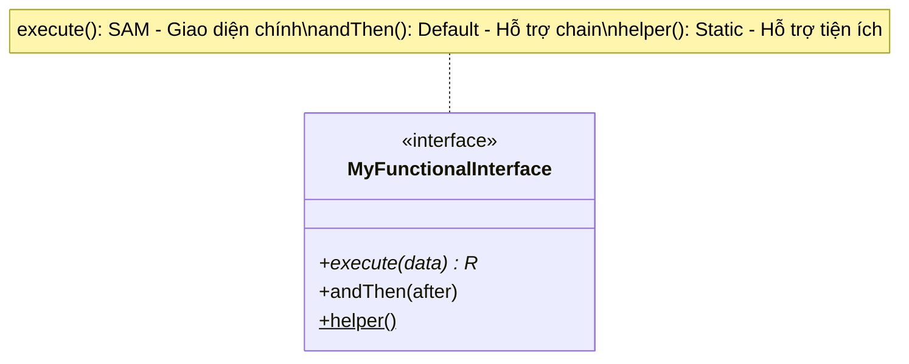

# Functional interface là gì? Phân tích kiến trúc SAM và vai trò của các Default Methods

## ⚡ Tóm tắt ngắn (30s)
**Functional Interface** (Giao diện hàm) trong Java là một interface **chỉ chứa duy nhất một phương thức trừu tượng (Single Abstract Method - SAM)**. Giao diện hàm đóng vai trò là "kiểu dữ liệu" để Java định nghĩa và biên dịch các Lambda Expression hoặc Method Reference.
* **Kiến trúc SAM**: Chỉ có đúng 1 phương thức trừu tượng. Tuy nhiên, nó có thể chứa nhiều phương thức `default` và `static` mà không làm mất để tính chất Functional.
* **Annotation `@FunctionalInterface`**: Là chỉ thị mang tính khai báo để compiler kiểm tra nghiêm ngặt quy tắc SAM ngay khi build.

---

## 🔍 Chi tiết bản chất thực chiến

### 1. Tại sao Java cần Functional Interface mà không thêm kiểu dữ liệu "Function" mới?
Để đảm bảo **tính tương thích ngược (Backward Compatibility)** với hàng tỷ dòng code Java cũ viết trước Java 8, các kỹ sư thiết kế Java đã không tạo ra một hệ thống kiểu dữ liệu hàm hoàn toàn mới. Thay vào đó, họ tận dụng chính các interface sẵn có có 1 method (như `Runnable`, `Callable`, `Comparator`) và biến chúng thành bệ đỡ cho Lambda.

### 2. Vai trò tối thượng của Default và Static Methods
* **Default Methods** cho phép ta thêm các phương thức có thân hàm (concrete methods) vào interface mà không làm vỡ các class con đang hiện thực interface đó.
* Trong Functional Interface, các default method đóng vai trò giúp **xâu chuỗi các hàm lại với nhau (Function Chaining)**. Ví dụ: `Predicate.and()`, `Predicate.or()`, `Function.andThen()`, `Function.compose()`.

### 3. Sơ đồ cụ thể hóa Functional Interface


---

## 💻 Code thực chiến: BAD vs GOOD

### ❌ BAD: Tự viết Functional Interface thiếu annotation, hoặc hỏng cấu trúc SAM
```java
// Thiếu annotation @FunctionalInterface
public interface Evaluator<T> {
    boolean evaluate(T t); // SAM

    // Vô tình lập trình viên khác nhảy vào thêm method thứ hai
    // Hậu quả: Toàn bộ code viết Lambda cho interface này ở chỗ khác sẽ bị báo lỗi biên dịch lập tức!
    boolean evaluateBackup(T t); 
}
```

###  GOOD: Khai báo chuẩn chỉ, sử dụng annotation và default method để chaining
```java
import java.util.Objects;

@FunctionalInterface
public interface SecureEvaluator<T> {
    // Đúng 1 method trừu tượng duy nhất (SAM)
    boolean test(T t);

    // Hỗ trợ kết hợp nhiều điều kiện bảo mật bằng Default Method
    default SecureEvaluator<T> and(SecureEvaluator<? super T> other) {
        Objects.requireNonNull(other);
        return (t) -> test(t) && other.test(t); // Trả về lambda mới kết hợp
    }
}
```

---

## 📊 So sánh Anonymous Class và Functional Interface với Lambda

| Tiêu chí | Anonymous Class (Lớp ẩn danh) | Functional Interface + Lambda |
| :--- | :--- | :--- |
| **Cú pháp** | Dài dòng, nhiều boilerplate code | Siêu ngắn gọn, tập trung vào hành vi |
| **Số lượng abstract method** | Không giới hạn (có thể có 5, 10 methods) | Bắt buộc chỉ có đúng 1 (SAM) |
| **Tham chiếu `this`** | Trỏ đúng đối tượng của lớp ẩn danh | Trỏ đúng outer class chứa lambda |
| **Tại thời điểm runtime** | JVM bắt buộc phải load 1 file `.class` vật lý | JVM không cần load file class mới (dùng Indy) |

---

## ⚠️ Common Gotchas & Questions follow-up

* **Cạm bẫy kế thừa phương thức của Object Class trong SAM (Object Methods Gotcha)**:
  Nếu một interface khai báo thêm một phương thức trừu tượng trùng khớp với phương thức của `java.lang.Object` (ví dụ: `boolean equals(Object obj);`), phương thức đó **KHÔNG** được tính là phương thức trừu tượng trong quy tắc SAM!
  * *Lý do*: Mọi class trong Java đều mặc định thừa kế và hiện thực `equals()` từ Object. Do đó, SAM vẫn cần một method trừu tượng thực sự khác.
*  **Câu hỏi đào sâu từ interviewer**: *Kiến trúc Default Method trong Interface có làm cho Java bị vướng phải thảm họa Đa Kế Thừa (Diamond Problem) như trong C++ không? Nếu một class kế thừa 2 interfaces có cùng 1 default method thì JVM sẽ giải quyết thế nào?*
  * *(Trả lời: Java có bị ảnh hưởng nhưng có 3 quy tắc phân giải cực kỳ chặt chẽ để giải quyết xung đột:*
    *1. **Class luôn luôn thắng (Classes win)**: Nếu class cha hoặc lớp hiện tại có hiện thực method đó, nó luôn được ưu tiên hơn default method từ interface.*
    *2. **Interface con thắng (Sub-interfaces win)**: Nếu interface B thừa kế từ interface A, và cả hai cùng có default method trùng tên, B.method() sẽ thắng.*
    *3. **Bắt buộc override thủ công**: Nếu không thuộc 2 quy tắc trên (ví dụ: class kế thừa trực tiếp interface C và D song song cùng có default method trùng tên), compiler sẽ báo lỗi lập tức buộc lập trình viên phải override phương thức đó trong class hiện tại và chỉ định rõ muốn gọi interface nào bằng cú pháp `C.super.methodName()`).*
---