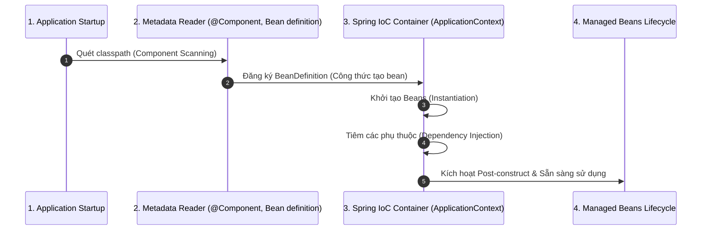

# Spring IoC là gì? Phân tích Dependency Lookup vs Dependency Injection

## ⚡ Tóm tắt ngắn (30s)
`IoC (Inversion of Control - Đảo ngược điều khiển)` là một nguyên lý thiết kế phần mềm, trong đó quyền kiểm soát luồng thực thi và vòng đời của đối tượng được chuyển từ code của lập trình viên sang cho một **Framework/Container** (trong trường hợp này là **Spring IoC Container**).
* **Bản chất**: Thay vì class tự khởi tạo các dependencies của nó bằng từ khóa `new`, Spring Container sẽ chịu trách nhiệm khởi tạo, cấu hình, lắp ráp (wire) và quản lý vòng đời của chúng từ đầu đến cuối dưới dạng các **Spring Beans**.
* **Cơ chế thực hiện**: Spring hỗ trợ hai cơ chế chính để lấy dependency: **Dependency Lookup (DL)** và **Dependency Injection (DI)**. Trong thực tế, **DI** là cách tiếp cận phổ biến và được khuyến nghị tối đa để giữ code loose coupling.

---

## 🔍 Chi tiết bản chất thực chiến

### 1. Spring IoC Container hoạt động như thế nào?
Spring IoC Container nhận đầu vào là các **Java Classes (POJO)** kết hợp với **Configuration Metadata** (XML, Annotation `@Component`, hoặc `@Configuration` class). Sau đó, nó tự động phân tích và tạo ra một hệ thống runtime hoàn chỉnh gồm các đối tượng đã được liên kết với nhau.

Hai interface cốt lõi của Spring Container:
1.  **BeanFactory**: Container cơ bản nhất, hỗ trợ lazy-loading (chỉ khởi tạo bean khi được gọi). Phù hợp với môi trường tài nguyên cực hạn (như IoT hay thiết bị di động cũ).
2.  **ApplicationContext**: Kế thừa `BeanFactory`, hỗ trợ eager-loading (khởi tạo tất cả singleton beans ngay khi startup), tích hợp thêm Internationalization (i18n), Event Publication, và AOP integration. Đây là container tiêu chuẩn trong mọi ứng dụng Spring Boot thực tế.

### 2. Sự khác biệt tối bản giữa Dependency Lookup (DL) và Dependency Injection (DI)
Mặc dù cả hai đều nhằm giải quyết bài toán quản lý dependency, cách tiếp cận của chúng hoàn toàn trái ngược nhau:

*   **Dependency Lookup (DL)**: Đối tượng *chủ động* yêu cầu container cung cấp dependency khi cần thiết thông qua API (ví dụ: `context.getBean()`).
    *   *Hệ quả:* Code của bạn bị phụ thuộc (tightly coupled) vào Spring API. Rất khó viết Unit Test độc lập vì phải giả lập (mock) toàn bộ ApplicationContext.
*   **Dependency Injection (DI)**: Đối tượng *thụ động* nhận dependency từ container truyền vào (thông qua Constructor, Setter hoặc Field).
    *   *Hệ quả:* Class hoàn toàn không biết gì về sự tồn tại của Spring Container. Nó chỉ là một POJO thuần túy, cực kỳ dễ test và linh hoạt.

### 3. Sơ đồ hoạt động của Spring IoC Container


---

## 💻 Code thực chiến: BAD vs GOOD

### ❌ BAD: Tự khởi tạo thủ công hoặc dùng Dependency Lookup (DL)
```java
package com.example.service;

import com.example.repository.UserRepository;
import org.springframework.context.ApplicationContext;

public class UserServiceBad {
    // Anti-pattern 1: Tự khởi tạo bằng 'new' - Ghép cứng (Tight coupling)
    // Nếu UserRepository đổi constructor hoặc cần config, ta phải sửa mọi class dùng nó.
    private final UserRepository userRepository = new UserRepository();

    // Anti-pattern 2: Dùng Dependency Lookup (DL)
    // Class UserService bị dính chặt vào ApplicationContext của Spring, phá vỡ tính đóng gói.
    private UserRepository userRepositoryDL;

    public UserServiceBad(ApplicationContext context) {
        this.userRepositoryDL = (UserRepository) context.getBean("userRepository");
    }
}
```

###  GOOD: Dùng Dependency Injection (DI) thuần túy
```java
package com.example.service;

import com.example.repository.UserRepository;
import org.springframework.stereotype.Service;

@Service // Đăng ký UserService là một Bean trong Spring IoC
public class UserServiceGood {
    
    // Khai báo final để đảm bảo tính bất biến (Immutability)
    private final UserRepository userRepository;

    // Spring tự động tìm UserRepository bean và tiêm vào đây (Constructor Injection)
    // Không hề có code phụ thuộc vào Spring Context API!
    public UserServiceGood(UserRepository userRepository) {
        this.userRepository = userRepository;
    }
    
    public void executeBusiness() {
        userRepository.findActiveUsers();
    }
}
```

---

## 📊 Trade-off: Tự quản lý đối tượng (Manual) vs Spring IoC

| Tiêu chí | Tự quản lý (`new`) | Spring IoC Container |
| :--- | :--- | :--- |
| **Tính liên kết (Coupling)** | Rất chặt (Tight coupling). Khó thay đổi hoặc scale-up cấu trúc project. | Rất lỏng (Loose coupling). Thay thế dependencies dễ dàng nhờ Interface. |
| **Khả năng kiểm thử (Testability)** | Rất khó. Không thể Mock các dependency nội bộ trong Unit Test độc lập. | Cực kỳ dễ dàng. Có thể tiêm bất kỳ mock class nào thông qua Constructor. |
| **Quản lý vòng đời (Lifecycle)** | Thủ công, dễ dẫn đến rò rỉ tài nguyên nếu quên đóng connections/files. | Tự động hóa hoàn toàn từ lúc khởi tạo đến khi hủy (graceful shutdown). |
| **Thời gian khởi động (Startup)** | Tức thời (Instantaneous). | Có độ trễ (overhead) do quét classpath, nạp cấu hình và xử lý Reflection. |

---

## ⚠️ Common Gotchas & Questions follow-up

* **Cạm bẫy khởi động chậm (Startup Overhead)**:
  Trong các dự án siêu lớn với hàng ngàn Spring Beans, thời gian khởi động ApplicationContext có thể mất vài phút vì Spring quét toàn bộ classpath và sử dụng Java Reflection để khởi tạo beans.
  * *Khắc phục:* Trong môi trường dev, có thể bật cấu hình `spring.main.lazy-initialization=true` để chỉ khởi tạo bean khi thực sự có request gọi tới, giúp tăng tốc startup đáng kể.
* **Câu hỏi đào sâu từ interviewer**: *Nếu hai Spring Beans phụ thuộc chéo lẫn nhau (A cần B, B cần A) thì IoC Container sẽ xử lý thế nào?*
  * *(Trả lời: Đây là lỗi kinh điển **Circular Dependency**. Nếu cả hai bean đều dùng **Constructor Injection**, Spring Boot sẽ ném ra ngoại lệ `BeanCurrentlyInCreationException` và dừng startup ngay lập tức. Để giải quyết, Spring cho phép trì hoãn việc tiêm thông qua annotation `@Lazy`, hoặc refactor code tách phần xử lý chung sang một class thứ ba C, hoặc sử dụng Setter Injection).*
---
