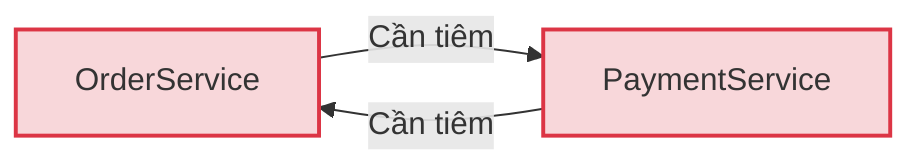

# Circular Dependency trong Spring: Nguyên nhân và 4 giải pháp xử lý

## ⚡ Tóm tắt ngắn (30s)
`Circular Dependency (Phụ thuộc vòng)` xảy ra khi hai hoặc nhiều Spring Beans phụ thuộc chéo lẫn nhau trực tiếp hoặc gián tiếp, tạo thành một vòng lặp khép kín (ví dụ: Bean A cần Bean B, Bean B cần Bean A).
*   **Hậu quả**: Khi sử dụng **Constructor Injection**, Spring sẽ không thể xác định thứ tự khởi tạo và lập tức quăng lỗi **`BeanCurrentlyInCreationException`**, làm sập ứng dụng ngay khi startup.
*   **Bản chất kiến trúc**: Phụ thuộc vòng là một **Code Smell** nghiêm trọng, cảnh báo hệ thống đang thiết kế tồi, vi phạm nguyên tắc Đơn nhiệm (SRP) và gây khớp nối quá chặt (High Coupling).
*   **Giải pháp**: Cách tốt nhất là **Tách nhỏ Class** hoặc sử dụng **Event-Driven (Spring Events)** để phá vỡ vòng lặp phụ thuộc chéo. Cách khắc phục nhanh (nhưng không khuyến nghị) là dùng `@Lazy`.

---

## 🔍 Chi tiết bản chất thực chiến

### 1. Sơ đồ chu trình phụ thuộc vòng

Để tạo `OrderService`, Spring cần gọi Constructor của nó và truyền vào `PaymentService`. Nhưng để khởi tạo `PaymentService`, Spring lại cần có `OrderService` trước. Đây là vòng lặp vô tận (Deadlock khởi tạo).

### 2. Tại sao Field/Setter Injection lại chạy được, còn Constructor Injection thì crash?
Đây là câu hỏi cực kỳ chuyên sâu thường gặp ở các buổi phỏng vấn Senior:
*   **Với Constructor Injection**: Spring bắt buộc phải tạo xong instance vật lý của Bean ngay tại bước gọi Constructor. Do đó, nó không thể tạo ra bất kỳ "tham chiếu tạm thời" nào, dẫn đến crash lập tức.
*   **Với Setter/Field Injection (Spring Three-Level Cache)**: Spring có thể tách biệt quá trình **Instantiation (Khởi tạo thô)** và **Populate Properties (Tiêm phụ thuộc)**. 
    1. Đầu tiên, Spring tạo ra instance rỗng (chưa tiêm gì) của Bean A bằng constructor mặc định.
    2. Spring đưa tham chiếu thô (early reference) này vào bộ nhớ đệm cấp 3 (**`singletonFactories` cache**).
    3. Khi khởi tạo Bean B, Bean B cần A. Spring sẽ lấy tham chiếu thô của A từ cache ra tiêm vào B. Bean B khởi tạo thành công hoàn toàn.
    4. B được tiêm ngược lại vào A. Cả hai Bean hoàn tất khởi tạo.
*   *Lưu ý quan trọng:* Từ **Spring Boot 2.6+**, cơ chế tự động giải quyết phụ thuộc vòng của Setter/Field này đã bị **cấm mặc định** (`spring.main.allow-circular-references=false`). Nếu code dính lỗi này, app vẫn crash kể cả khi dùng Field Injection để ép buộc nhà phát triển phải viết code sạch.

---

## 💻 Code thực chiến: BAD vs GOOD

### ❌ BAD: Hai Service phụ thuộc trực tiếp chéo nhau qua Constructor
```java
package com.example.service;

import org.springframework.stereotype.Service;

@Service
public class OrderServiceBad {
    private final PaymentServiceBad paymentService;

    public OrderServiceBad(PaymentServiceBad paymentService) {
        this.paymentService = paymentService;
    }
    public void createOrder() { System.out.println("Creating order..."); }
}

@Service
public class PaymentServiceBad {
    private final OrderServiceBad orderService;

    public PaymentServiceBad(OrderServiceBad orderService) {
        this.orderService = orderService;
    }
    public void processPayment() { System.out.println("Processing payment..."); }
}
// ⚠️ Ứng dụng crash lập tức khi startup với lỗi BeanCurrentlyInCreationException!
```

###  GOOD: Giải pháp tối ưu - Tách Class nghiệp vụ trung gian (Refactoring)
Chúng ta phá vỡ vòng lặp bằng cách chuyển logic điều phối chung sang một Class trung gian thứ ba (`OrderPaymentProcessor`), giữ cho hai Service nghiệp vụ cốt lõi hoàn toàn độc lập với nhau.

```java
package com.example.service;

import org.springframework.stereotype.Service;

@Service
public class OrderServiceGood {
    // Chỉ tập trung vào nghiệp vụ Order, không cần biết tới PaymentService!
    public void createOrder() {
        System.out.println("Order created in Database.");
    }
}

@Service
public class PaymentServiceGood {
    // Chỉ tập trung vào nghiệp vụ thanh toán
    public void processPayment() {
        System.out.println("Payment processed successfully.");
    }
}

@Service
public class OrderPaymentProcessor { // ✅ Class điều phối trung gian
    private final OrderServiceGood orderService;
    private final PaymentServiceGood paymentService;

    // Phụ thuộc 1 chiều tuyến tính: Processor -> OrderService & PaymentService
    // Hoàn toàn sạch bóng Circular Dependency!
    public OrderPaymentProcessor(OrderServiceGood orderService, PaymentServiceGood paymentService) {
        this.orderService = orderService;
        this.paymentService = paymentService;
    }

    public void checkout() {
        orderService.createOrder();
        paymentService.processPayment();
    }
}
```

---

## 📊 Trade-off: So sánh các phương pháp xử lý Circular Dependency

| Phương pháp | Độ phức tạp | Đánh giá kiến trúc | Ưu điểm | Nhược điểm |
| :--- | :--- | :--- | :--- | :--- |
| **1. Tách Class (Refactoring)** | Trung bình |  **Xuất sắc (Clean Code)** | Giải quyết tận gốc lỗi thiết kế, code decoupling cực đẹp. | Tốn công thiết kế lại và tạo thêm class phụ. |
| **2. Dùng `@Lazy`** |  Rất thấp |  **Tạm chấp nhận** | Khắc phục lỗi cực nhanh chỉ bằng 1 dòng annotation. | ❌ Bản chất lỗi thiết kế vẫn còn đó, chỉ là ẩn đi. Dễ gây NPE ngầm lúc chạy. |
| **3. Dùng Spring Events**| Cao |  **Tuyệt vời** | Tách biệt hoàn toàn vật lý giữa các service qua cơ chế Publisher/Subscriber. | Khó debug luồng chạy vì code bất đồng bộ/gián tiếp. |
| **4. Bật `allow-circular-references`**|  Không | ❌ **Tệ hại (Nợ kỹ thuật)** | Sửa lỗi bằng 1 dòng config trong file `.properties`. | ❌ Dung túng cho code bẩn, che giấu các lỗi thiết kế hệ thống nghiêm trọng. |

---

## ⚠️ Common Gotchas & Questions follow-up

* **Cạm bẫy lạm dụng annotation `@Lazy`**:
  Đặt `@Lazy` trước tham số trong constructor báo hiệu cho Spring tạo ra một CGLIB proxy thô truyền vào tạm thời, giúp vượt qua vòng quét startup. Tuy nhiên, nếu lạm dụng, bạn sẽ tích tụ nợ kỹ thuật khổng lồ, khiến cấu trúc dependencies của project trở thành một mạng nhện chằng chịt không thể bảo trì sau này.
  * *Khắc phục:* Chỉ coi `@Lazy` là giải pháp tình thế ngắn hạn. Luôn luôn ưu tiên giải pháp **Tách Class** hoặc dùng **Spring Events** để truyền thông điệp gián tiếp.
* **Câu hỏi đào sâu từ interviewer**: *Spring giải quyết Circular Dependency ở tầng Setter/Field bằng cơ chế cache 3 cấp như thế nào?*
  * *(Trả lời: Spring sử dụng Class `DefaultSingletonBeanRegistry` chứa 3 Map cache:
    1. `singletonObjects` (Cấp 1): Lưu các Bean đã được khởi tạo hoàn chỉnh, tiêm đầy đủ dependency.
    2. `earlySingletonObjects` (Cấp 2): Lưu các Bean thô đã khởi tạo instance nhưng chưa được tiêm dependency.
    3. `singletonFactories` (Cấp 3): Lưu các ObjectFactory có khả năng tạo ra tham chiếu sớm (early reference) cho Bean.
    Khi xảy ra phụ thuộc vòng ở Setter, Spring lấy ObjectFactory của Bean A từ Cache cấp 3 lên, tạo ra tham chiếu sớm đưa vào Cache cấp 2 để tiêm cho Bean B, từ đó bẻ gãy vòng lặp).*
---
