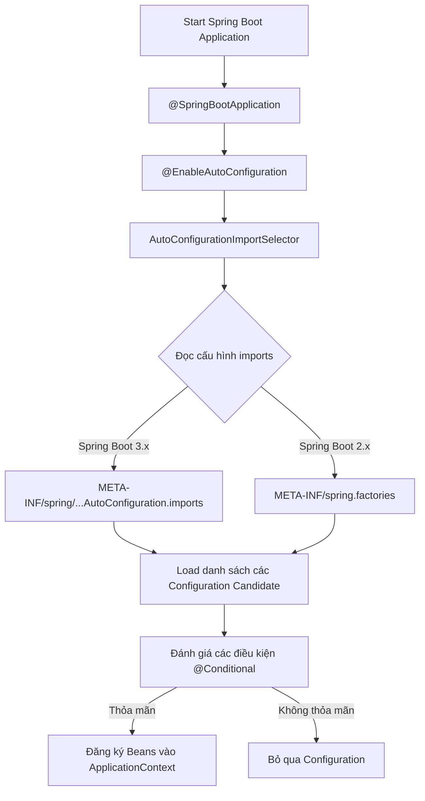

# Spring Boot Auto-Configuration: Bản chất hoạt động và Cơ chế Custom

## ⚡ Tóm tắt ngắn (30s)
`Auto-Configuration (Tự động cấu hình)` là một trong những tính năng cốt lõi giúp Spring Boot hiện thực hóa triết lý **"Convention over Configuration"** (Ưu tiên quy ước hơn cấu hình) và **"Opinionated Defaults"**.
*   **Bản chất**: Spring Boot tự động quét classpath, phát hiện các thư viện (jar dependencies) đang có mặt và tự động định nghĩa, cấu hình các Spring Beans tương ứng mà không cần lập trình viên phải viết code cấu hình thủ công.
*   **Cơ chế cốt lõi**:
    1.  **Kích hoạt**: Thông qua `@EnableAutoConfiguration` (được nhúng sẵn bên trong `@SpringBootApplication`).
    2.  **Đọc Metadata**: Quét các file cấu hình đặc biệt (`META-INF/spring/org.springframework.boot.autoconfigure.AutoConfiguration.imports` ở Spring Boot 3.x hoặc `spring.factories` ở 2.x) để lấy danh sách các Configuration class khả dụng.
    3.  **Lọc Điều kiện**: Sử dụng các annotation họ `@ConditionalOn*` (như `@ConditionalOnClass`, `@ConditionalOnMissingBean`) để quyết định xem có thực sự khởi tạo Configuration đó hay không.
*   **Best Practice**: Luôn ưu tiên dùng `@ConditionalOnMissingBean` khi viết custom auto-configuration để cho phép ứng dụng dễ dàng ghi đè (override) cấu hình mặc định.

---

## 🔍 Chi tiết bản chất thực chiến

### 1. Luồng hoạt động nội bộ của Auto-Configuration
Khi ứng dụng Spring Boot startup, quá trình tự động cấu hình diễn ra qua các bước sau:



### 2. Các Annotation điều kiện `@ConditionalOn*` (Trái tim của Auto-Configuration)
Spring Boot không cấu hình mù quáng. Nó sử dụng cơ chế Conditional để kiểm tra xem môi trường đã sẵn sàng chưa:
*   `@ConditionalOnClass`: Chỉ kích hoạt nếu tìm thấy class nhất định trong classpath (Ví dụ: Chỉ tự động cấu hình Connection Pool nếu tìm thấy `HikariDataSource.class`).
*   `@ConditionalOnMissingBean`: Chỉ tạo Bean này nếu lập trình viên **chưa** định nghĩa bất kỳ Bean nào cùng loại trước đó. Đây là mấu chốt để nhà phát triển có thể tùy biến cấu hình theo ý mình.
*   `@ConditionalOnProperty`: Kích hoạt dựa trên giá trị của một thuộc tính cấu hình trong file `application.yaml` (ví dụ: `mail.enabled=true`).

---

## 💻 Code thực chiến: BAD vs GOOD

### ❌ BAD: Cách cấu hình thủ công tẻ nhạt thời Spring Framework cổ điển
Để cấu hình một `DataSource` kết nối MySQL và một `JdbcTemplate`, chúng ta phải viết hàng chục dòng Java Config hoặc XML Boilerplate. Khi đổi sang Database khác, ta lại phải sửa thủ công.

```java
package com.example.config;

import org.springframework.context.annotation.Bean;
import org.springframework.context.annotation.Configuration;
import org.springframework.jdbc.core.JdbcTemplate;
import com.zaxxer.hikari.HikariDataSource;
import javax.sql.DataSource;

@Configuration
public class LegacyManualDbConfig {

    @Bean
    public DataSource dataSource() {
        HikariDataSource dataSource = new HikariDataSource();
        dataSource.setDriverClassName("com.mysql.cj.jdbc.Driver");
        dataSource.setJdbcUrl("jdbc:mysql://localhost:3306/mydb");
        dataSource.setUsername("root");
        dataSource.setPassword("admin");
        return dataSource;
    }

    @Bean
    public JdbcTemplate jdbcTemplate(DataSource dataSource) {
        return new JdbcTemplate(dataSource);
    }
}
// ⚠️ Nhược điểm: Cứng nhắc, không thể tự động nhận biết DB khác nếu đổi thư viện, code lặp đi lặp lại giữa các dự án.
```

###  GOOD: Tạo một Custom Auto-Configuration thông minh cho doanh nghiệp
Giả sử công ty bạn muốn viết một Starter dùng chung để tự động cấu hình một `AuditService` ghi nhận log người dùng. Service này chỉ hoạt động nếu ứng dụng bật config `company.audit.enabled=true` và lập trình viên chưa tự định nghĩa một `AuditService` custom nào khác.

**Bước 1: Viết Configuration Class**
```java
package com.company.starter.audit;

import org.springframework.boot.autoconfigure.AutoConfiguration;
import org.springframework.boot.autoconfigure.condition.ConditionalOnClass;
import org.springframework.boot.autoconfigure.condition.ConditionalOnMissingBean;
import org.springframework.boot.autoconfigure.condition.ConditionalOnProperty;
import org.springframework.context.annotation.Bean;

@AutoConfiguration // Sử dụng thay thế cho @Configuration từ Spring Boot 2.7+
@ConditionalOnClass(AuditEngine.class) // Chỉ cấu hình nếu classpath chứa thư viện Audit Engine
@ConditionalOnProperty(name = "company.audit.enabled", havingValue = "true", matchIfMissing = false)
public class AuditAutoConfiguration {

    @Bean
    @ConditionalOnMissingBean // ✅ Cho phép lập trình viên tự tạo Bean riêng để override
    public AuditService auditService(AuditEngine auditEngine) {
        return new DefaultAuditServiceImpl(auditEngine);
    }
}
```

**Bước 2: Khai báo với Spring Boot**
Tạo file sau tại thư mục `/src/main/resources/`:
*   Đường dẫn: `META-INF/spring/org.springframework.boot.autoconfigure.AutoConfiguration.imports`
*   Nội dung file:
    ```text
    com.company.starter.audit.AuditAutoConfiguration
    ```

---

## 📊 Trade-off: So sánh cơ chế cấu hình trong Spring

| Phương pháp | Độ linh hoạt | Tốc độ Startup | Dễ bảo trì | Tình huống phù hợp |
| :--- | :--- | :--- | :--- | :--- |
| **Manual Java Config (`@Configuration`)** | Thấp | Nhanh nhất (Spring không cần quét điều kiện) | Khó bảo trì khi dự án lớn | Phù hợp với các Beans nghiệp vụ nội bộ, mang tính chất độc bản trong dự án. |
| **Spring Boot Auto-Configuration** |  **Rất cao** | Chậm hơn một chút (do tốn công đánh giá `@Conditional`) |  **Rất dễ dàng** | Hoàn hảo cho thư viện dùng chung (Startes), cấu hình hạ tầng (Database, Security, Queue). |
| **XML Configuration (Legacy)** | Cực thấp | Khá nhanh | Tệ hại | Chỉ nên tồn tại trong các dự án di sản (Legacy Systems). |

---

## ⚠️ Common Gotchas & Questions follow-up

### 1. Lỗi Auto-Configuration tự động khởi tạo những Beans không mong muốn
*   **Vấn đề**: Spring Boot tự động kích hoạt cấu hình bảo mật `SecurityAutoConfiguration` ngay khi thấy thư viện Spring Security trong dependency, khóa toàn bộ API của bạn lại bằng password ngẫu nhiên.
*   **Cách xử lý**: Loại trừ class auto-configuration đó ra khỏi quá trình scan bằng thuộc tính `exclude` của `@SpringBootApplication`:
    ```java
    @SpringBootApplication(exclude = {SecurityAutoConfiguration.class})
    public class MyApplication {
        public static void main(String[] args) {
            SpringApplication.run(MyApplication.class, args);
        }
    }
    ```

### 2. Làm thế nào để debug xem Auto-Configuration nào đã chạy hoặc không chạy?
Khi phỏng vấn, các Lead/Senior thường hỏi: *"Làm sao biết vì sao một Auto-configuration bị từ chối?"*
*   **Trả lời**:
    1.  Chạy ứng dụng với tham số `--debug` (Ví dụ: `java -jar app.jar --debug`). Lúc này Spring Boot sẽ in ra **"CONDITIONS EVALUATION REPORT"** chi tiết, ghi rõ Bean nào được tạo, Bean nào bị loại bỏ và lý do cụ thể (thỏa mãn hay trượt `@Conditional` nào).
    2.  Sử dụng Spring Boot Actuator endpoint `/actuator/conditions` để xem báo cáo động dạng JSON ngay khi ứng dụng đang chạy.
