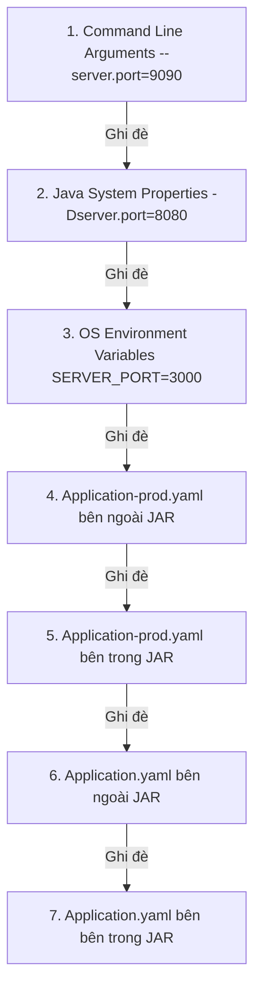

# Externalized Configuration trong Spring Boot: Cơ chế nạp và Thứ tự ưu tiên

## ⚡ Tóm tắt ngắn (30s)
`Externalized Configuration (Cấu hình ngoại vi)` là cơ chế cho phép nhà phát triển tách toàn bộ thông tin cấu hình ra khỏi file đóng gói ứng dụng (file `.jar` / `.war`). 
*   **Triết lý cốt lõi**: Hiện thực hóa nguyên tắc **"Build Once, Run Anywhere"** (Đóng gói một lần, chạy ở mọi nơi). Một file `.jar` duy nhất sau khi build có thể deploy lên cả Dev, Staging, và Prod mà không cần compile lại code, chỉ cần thay đổi cấu hình truyền vào từ bên ngoài.
*   **Cơ chế hoạt động**: Spring Boot thu thập cấu hình từ hơn 17 nguồn khác nhau (như file `.properties`/`.yaml`, biến môi trường, tham số dòng lệnh) và nạp chúng vào một đối tượng trừu tượng duy nhất là **`Environment`** dưới dạng các cặp Key-Value.
*   **Thứ tự ưu tiên cốt lõi (Càng lên cao càng ưu tiên)**:
    1.  **Command Line Arguments** (Tham số dòng lệnh, ví dụ: `--server.port=9090`).
    2.  **Java System Properties** (Thuộc tính hệ thống JVM, ví dụ: `-Dserver.port=8080`).
    3.  **OS Environment Variables** (Biến môi trường hệ điều hành, ví dụ: `SERVER_PORT=3000`).
    4.  **Profile-specific config** ngoài file jar (`application-{profile}.yaml`).
    5.  **Profile-specific config** nằm trong file jar.
    6.  **Default config** ngoài file jar (`application.yaml`).
    7.  **Default config** nằm trong file jar.

---

## 🔍 Chi tiết bản chất thực chiến

### 1. Phân rã độ ưu tiên của các nguồn cấu hình phổ biến
Khi có xung đột cấu hình (cùng một key cấu hình tồn tại ở nhiều nơi), Spring Boot sẽ giải quyết theo sơ đồ ưu tiên từ trên xuống dưới dưới đây:



### 2. Quy tắc chuyển đổi tên biến (Relaxed Binding)
Spring Boot sử dụng cơ chế **Relaxed Binding** cho phép ánh xạ linh hoạt giữa các định dạng đặt tên key cấu hình khác nhau. Đây là điểm cực kỳ quan trọng khi chuyển đổi cấu hình từ file YAML sang biến môi trường của Docker/Kubernetes:

| Định dạng | Ví dụ key trong YAML | Ánh xạ tương đương trong OS Environment Variables |
| :--- | :--- | :--- |
| **Kebab-case** (Khuyên dùng cho YAML) | `spring.datasource.max-active` | `SPRING_DATASOURCE_MAX_ACTIVE` |
| **CamelCase** | `spring.datasource.maxActive` | `SPRING_DATASOURCE_MAX_ACTIVE` |
| **Snake_case** | `spring.datasource.max_active` | `SPRING_DATASOURCE_MAX_ACTIVE` |
| **Hệ điều hành** (Chỉ chữ in hoa và dấu gạch dưới) | Không dùng | `SPRING_DATASOURCE_MAX_ACTIVE` |

*Quy tắc vàng*: Khi định nghĩa biến môi trường trong Docker/K8s để ghi đè config trong Spring Boot, hãy chuyển toàn bộ chữ cái thành **IN HOA**, thay dấu chấm `.` và dấu gạch ngang `-` thành **dấu gạch dưới `_`**.

---

## 💻 Code thực chiến: BAD vs GOOD

### ❌ BAD: Đọc file cấu hình vật lý thủ công bằng các lớp I/O truyền thống
Viết code tự đọc file `.properties` bằng `FileInputStream`. Cách làm này triệt tiêu hoàn toàn khả năng nạp biến môi trường của Container (Docker/K8s) và phá hỏng cơ chế quản lý cấu hình tự động của Spring.

```java
package com.example.config;

import java.io.FileInputStream;
import java.io.IOException;
import java.util.Properties;

public class HardcodedConfigReader {
    private Properties properties = new Properties();

    public HardcodedConfigReader() {
        try (FileInputStream fis = new FileInputStream("/var/config/app.properties")) {
            properties.load(fis); // ⚠️ Đường dẫn tuyệt đối bị ghim cứng!
        } catch (IOException e) {
            e.printStackTrace();
        }
    }

    public String getDbUrl() {
        return properties.getProperty("db.url");
    }
}
// ⚠️ Tác hại: Ứng dụng không thể chạy trên Windows nếu đường dẫn là Unix-style. Không thể ghi đè tham số từ Docker ENV.
```

###  GOOD: Sử dụng `@Value` với cơ chế Fallback (Default Value) an toàn
Sử dụng annotation `@Value` của Spring để nạp cấu hình tự động từ `Environment`. Luôn thiết lập một giá trị mặc định sau dấu hai chấm `:` phòng trường hợp môi trường chưa khai báo biến này.

```java
package com.example.service;

import org.springframework.beans.factory.annotation.Value;
import org.springframework.stereotype.Service;

@Service
public class ThirdPartyApiService {

    // Nạp key từ external config, nếu không tìm thấy sẽ lấy mặc định là "https://mock-api.com"
    @Value("${thirdparty.api.url:https://mock-api.com}")
    private String apiBaseUrl;

    // Nạp timeout, tự động parse sang kiểu int, mặc định là 5000ms
    @Value("${thirdparty.api.timeout-ms:5000}")
    private int timeoutMs;

    public void callExternalApi() {
        System.out.println("Connecting to: " + apiBaseUrl + " with timeout: " + timeoutMs + "ms");
    }
}
```

---

## 📊 Trade-off: So sánh các nguồn cung cấp cấu hình thực tế

| Nguồn cấu hình | Mức độ bảo mật | Độ tiện dụng khi Dev | Tốc độ thay đổi (Không cần rebuild) | Use Case thực tế |
| :--- | :--- | :--- | :--- | :--- |
| **File `application.yaml` trong JAR** | ❌ Tệ (Lộ thông tin nhạy cảm khi push git) |  **Cực cao** | Không thể (Phải build lại jar) | Dùng lưu cấu hình mặc định, các hằng số phi nhạy cảm. |
| **OS Environment Variables** |  **Rất cao** | Trung bình | Nhanh (Chỉ cần restart container) | Lưu DB credentials, API Key khi chạy ứng dụng trên Docker/Kubernetes. |
| **Command Line Args (`--key`)** | Trung bình (Lộ credentials trong tiến trình OS `ps -ef`) | Cao | Rất nhanh (Chỉ cần chạy lại lệnh shell) | Dùng để override nhanh cổng chạy port hoặc kích hoạt nhanh profile khi test. |
| **Spring Cloud Config Server** |  **Tuyệt đối** | Thấp (Phải dựng thêm service) |  **Tức thời** (Dynamic refresh không cần restart) | Phù hợp với hệ thống Microservices hàng chục service chạy cùng lúc. |

---

## ⚠️ Common Gotchas & Questions follow-up

### 1. Cạm bẫy "Bị ghi đè âm thầm" (Silent Override) bởi các biến môi trường ngẫu nhiên
*   **Vấn đề**: Bạn cấu hình biến `app.name=OrderService` trong file `application.yaml`. Trên Server Linux thực tế, tình cờ hệ điều hành có sẵn một biến môi trường tên là `APP_NAME=SystemDiagnostic`. Khi Spring Boot chạy lên, giá trị `app.name` của bạn lập tức bị biến môi trường của Linux ghi đè âm thầm thành `SystemDiagnostic`, gây ra các lỗi logic cực kỳ khó hiểu.
*   **Cách phòng tránh**: 
    1.  Luôn đặt prefix (tiền tố) độc bản cho các key cấu hình tự tạo trong dự án (ví dụ: `companyname.projectname.app-name` thay vì chỉ dùng `app-name`).
    2.  Hạn chế tối đa việc đặt tên biến hệ điều hành quá chung chung trên server.

### 2. Làm thế nào để truyền một cấu hình JSON phức tạp qua dòng lệnh?
Interviewer thường hỏi: *"Tôi muốn truyền cả một danh sách Object cấu hình phức tạp qua một biến môi trường duy nhất thì làm thế nào?"*
*   **Trả lời**: Sử dụng thuộc tính đặc biệt **`SPRING_APPLICATION_JSON`**. Spring Boot tự động nhận biết biến này chứa chuỗi JSON và giải nén (parse) nó thành các cặp key-value nạp vào `Environment`.
    *   *Ví dụ chạy dòng lệnh:*
        ```bash
        java -Dspring.application.json='{"database":{"url":"jdbc:mysql://mydb","username":"admin"}}' -jar app.jar
        ```
        Lúc này, Spring Boot tự động ánh xạ thành các thuộc tính `database.url` và `database.username` hoàn toàn chuẩn xác.
