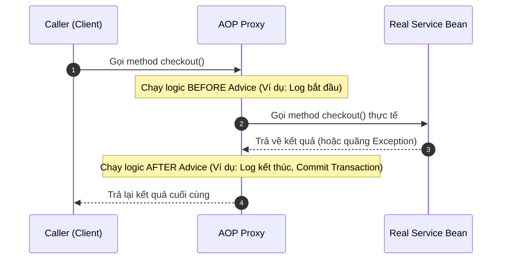

# Spring AOP (Aspect-Oriented Programming): Bản chất và Thuật ngữ chuyên sâu

## ⚡ Tóm tắt ngắn (30s)
`AOP (Aspect-Oriented Programming - Lập trình hướng khía cạnh)` là một phương pháp luận lập trình bổ trợ cực kỳ mạnh mẽ cho OOP (Lập trình hướng đối tượng).
*   **Bản chất**: AOP dùng để tách biệt các **"Cross-Cutting Concerns"** (Mối quan tâm cắt ngang - những logic phụ lặp đi lặp lại ở nhiều tầng nghiệp vụ như Logging, Security, Transaction, Caching) ra khỏi logic nghiệp vụ cốt lõi (Business Logic).
*   **Các thuật ngữ cốt lõi buộc phải nhớ khi phỏng vấn**:
    1.  **Aspect (Khía cạnh)**: Class tập hợp các logic cắt ngang (ví dụ: LogAspect, TransactionAspect).
    2.  **Join Point (Điểm nối)**: Vị trí thực tế trong mã nguồn nơi mà Aspect có thể được chèn vào. *Lưu ý:* Spring AOP chỉ hỗ trợ duy nhất Join Point tại bước **thực thi phương thức (Method Execution)**.
    3.  **Pointcut (Điểm cắt)**: Biểu thức lọc (Pointcut Expression) xác định những Join Point nào sẽ bị áp dụng khía cạnh (ví dụ: "áp dụng cho tất cả các Controller").
    4.  **Advice (Chỉ thị hành động)**: Đoạn code logic thực tế sẽ được chạy khi chương trình đi qua Pointcut.
    5.  **AOP Proxy**: Đối tượng trung gian (JDK Dynamic Proxy hoặc CGLIB) được Spring tạo ra bao bọc lấy Bean gốc để dệt (weave) logic AOP vào lúc runtime.

---

## 🔍 Chi tiết bản chất thực chiến

### 1. Bản chất luồng hoạt động của Spring AOP qua Proxy
Spring không sửa đổi trực tiếp mã nguồn compile của bạn (trừ khi dùng AspectJ). Nó tạo ra một lớp bọc (Proxy) bao quanh Bean thực tế:



### 2. Các loại Advice phổ biến và thứ tự thực thi
*   `@Before`: Chạy trước khi method thực tế bắt đầu.
*   `@After`: Chạy sau khi method kết thúc (bất kể thành công hay xảy ra lỗi).
*   `@AfterReturning`: Chỉ chạy sau khi method thực thi **thành công hoàn toàn** và trả về kết quả.
*   `@AfterThrowing`: Chỉ chạy nếu method xảy ra **Exception**. Thường dùng để log lỗi tập trung hoặc rollback.
*   `@Around` (Quyền lực nhất): Bao bọc toàn bộ quá trình chạy của method. Nó có quyền kiểm duyệt xem method thực tế có được chạy hay không, sửa đổi tham số đầu vào, hoặc giả lập kết quả trả về (thích hợp cho Caching và Security).

---

## 💻 Code thực chiến: BAD vs GOOD

### ❌ BAD: Viết lặp đi lặp lại code đo lường hiệu năng hệ thống ở mọi Service
Lập trình viên muốn đo thời gian chạy của các method nghiệp vụ để phát hiện bottle-neck. Họ copy-paste code đo lường thời gian (hệ thống `currentTimeMillis`) ở khắp nơi, làm biến dạng code nghiệp vụ chính.

```java
package com.example.service;

import org.springframework.stereotype.Service;

@Service
public class BadOrderService {

    public void processOrder() {
        long startTime = System.currentTimeMillis(); // ⚠️ Boilerplate Code
        try {
            // Logic nghiệp vụ chính
            System.out.println("Processing order in Database...");
            Thread.sleep(150); // Giả lập tốn thời gian
        } catch (InterruptedException e) {
            e.printStackTrace();
        } finally {
            long duration = System.currentTimeMillis() - startTime; // ⚠️ Lặp lại
            System.out.println("Execution time: " + duration + "ms"); // ⚠️ Gây loãng code
        }
    }
}
```

###  GOOD: Tạo Custom Annotation và sử dụng Aspect tập trung cực kỳ tao nhã

**Bước 1: Tạo Annotation đánh dấu**
```java
package com.example.aop;

import java.lang.annotation.ElementType;
import java.lang.annotation.Retention;
import java.lang.annotation.RetentionPolicy;
import java.lang.annotation.Target;

@Target(ElementType.METHOD)
@Retention(RetentionPolicy.RUNTIME)
public @interface TrackTime {
    // Chỉ dùng để đánh dấu method cần đo thời gian
}
```

**Bước 2: Viết Aspect xử lý tập trung**
```java
package com.example.aop;

import org.aspectj.lang.ProceedingJoinPoint;
import org.aspectj.lang.annotation.Around;
import org.aspectj.lang.annotation.Aspect;
import org.slf4j.Logger;
import org.slf4j.LoggerFactory;
import org.springframework.stereotype.Component;

@Aspect // ✅ Đánh dấu class chứa Aspect
@Component // Đăng ký làm Bean để Spring quản lý
public class PerformanceAspect {

    private static final Logger log = LoggerFactory.getLogger(PerformanceAspect.class);

    // ✅ Định nghĩa Điểm cắt: Áp dụng cho bất kỳ method nào có gắn tag @TrackTime
    @Around("@annotation(com.example.aop.TrackTime)")
    public Object measureExecutionTime(ProceedingJoinPoint joinPoint) throws Throwable {
        long startTime = System.currentTimeMillis();

        // 🚀 Chạy method thực tế và lấy kết quả trả về
        Object result = joinPoint.proceed(); 

        long duration = System.currentTimeMillis() - startTime;
        
        // Log tên Class + tên Method + thời gian thực thi cụ thể
        log.info("AOP Metric - Method [{}] executed in {}ms", 
                 joinPoint.getSignature().toShortString(), 
                 duration);

        return result; // Trả về kết quả cho caller
    }
}
```

**Bước 3: Sử dụng đơn giản và sạch sẽ**
```java
package com.example.service;

import com.example.aop.TrackTime;
import org.springframework.stereotype.Service;

@Service
public class GoodOrderService {

    @TrackTime // ✅ Chỉ cần gắn annotation, sạch bóng boilerplate code đo đạc!
    public void processOrder() {
        System.out.println("Processing order in Database...");
        // Logic nghiệp vụ thuần túy không chứa bất kỳ dòng log hạ tầng nào!
    }
}
```

---

## 📊 Trade-off: So sánh các loại Advice trong Spring AOP

| Loại Advice | Khả năng kiểm soát Method chính | Phù hợp cho Use Case | Lưu ý hiệu năng |
| :--- | :--- | :--- | :--- |
| **`@Before`** | Thấp (Chỉ chạy trước, không can thiệp kết quả). | Kiểm tra quyền truy cập, ghi log bắt đầu. | Hầu như không ảnh hưởng. |
| **`@AfterThrowing`** | Thấp (Chỉ chụp lại Exception). | Gửi cảnh báo hệ thống (Telegram/Slack), ghi log lỗi. | Thấp. |
| **`@Around`** |  **Tối đa** (Có thể chặn chạy method, thay đổi kết quả). | Caching (nếu có cache thì trả luôn không chạy DB), Transaction, Rate Limiting. | ⚠️ Cần viết code tối ưu vì nếu gọi lỗi hoặc quên lệnh `proceed()`, method chính sẽ bị nuốt chửng (chặn đứng). |

---

## ⚠️ Common Gotchas & Questions follow-up

### 1. Cạm bẫy "Self-Invocation" (Tự gọi nội bộ trong cùng một Class)
Đây là câu hỏi phỏng vấn phân loại ứng viên Senior cực kỳ kinh điển:
*   **Vấn đề**: Bạn có một service chứa hai method:
    ```java
    @Service
    public class MyService {
        public void methodA() {
            methodB(); // ⚠️ Gọi trực tiếp
        }

        @TrackTime
        public void methodB() {
            System.out.println("Running B");
        }
    }
    ```
    Khi Client gọi `methodA()`, Aspect `@TrackTime` trên `methodB()` **sẽ không bao giờ hoạt động**.
*   **Nguyên nhân**: Vì AOP hoạt động thông qua Proxy. Client gọi `methodA()` qua Proxy thành công, nhưng khi MyService tự gọi nội bộ `methodB()`, nó gọi trực tiếp qua tham chiếu `this` nội bộ của chính nó chứ không đi qua Proxy nữa. Do đó, logic AOP bị bỏ qua hoàn toàn.
*   **Khắc phục**: 
    1.  Tách hai method này sang hai Class riêng biệt để bắt buộc đi qua Proxy (Khuyên dùng nhất).
    2.  Tiêm chính Proxy của nó vào qua cơ chế Self-injection (Sử dụng `@Autowired` trên chính field của class).

### 2. Sự khác biệt cốt lõi giữa Spring AOP và AspectJ?
*   **Spring AOP**: Dễ dùng hơn, dệt logic lúc runtime bằng Dynamic Proxy, chỉ hỗ trợ cắt method của Spring Beans.
*   **AspectJ**: Là bộ thư viện AOP nguyên bản, dệt logic lúc compile-time hoặc class-loading (Load-time Weaving), hỗ trợ cắt bất kỳ vị trí nào (kể cả hàm khởi tạo constructor, thay đổi giá trị thuộc tính class, áp dụng được cho cả các class thường không phải Spring Beans). Tuy nhiên cài đặt phức tạp hơn nhiều.
