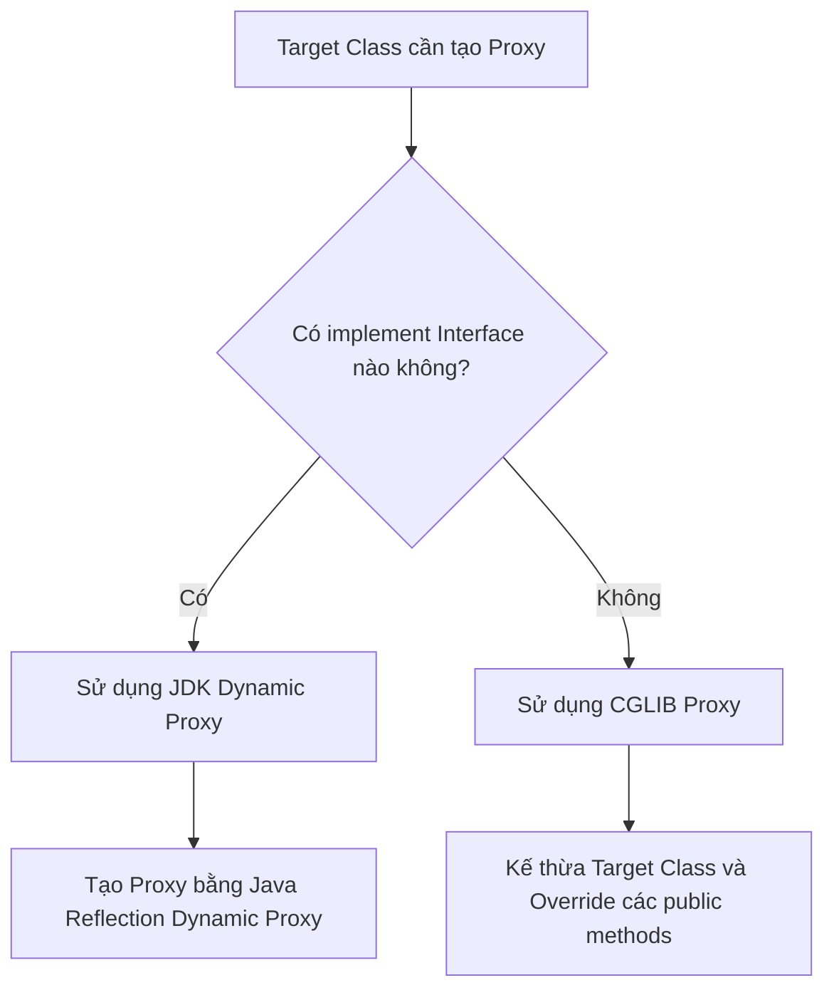

# Những hạn chế chí tử của Proxy-based AOP trong Spring

## ⚡ Tóm tắt ngắn (30s)
Spring AOP mặc định hoạt động dựa trên cơ chế **Proxy-based (Lớp bọc động)**. Khi một Spring Bean được áp dụng Aspect, Spring sẽ không thay đổi mã nguồn gốc, mà tạo ra một đối tượng Proxy trung gian (bằng **JDK Dynamic Proxy** hoặc **CGLIB**) bao bọc lấy Bean gốc để đánh chặn các cuộc gọi method.
Chính cơ chế hoạt động gián tiếp này dẫn đến **4 hạn chế chí tử** mà mọi Senior Developer phải nắm lòng để tránh các bug ngầm nghiêm trọng:
1.  **Lỗi tự gọi nội bộ (Self-invocation)**: Khi Method A gọi Method B trong cùng một Class, cuộc gọi diễn ra trực tiếp qua con trỏ `this` nội bộ mà không đi qua lớp bọc Proxy. Hệ quả là mọi Aspect (bao gồm cả `@Transactional`, `@Cacheable`, hay Custom AOP) trên Method B sẽ **hoàn toàn vô hiệu**.
2.  **Chỉ áp dụng được cho phương thức `public`**: Spring AOP không thể can thiệp vào các phương thức `private`, `protected`, hay package-private. Nếu bạn cố gắn `@Transactional` lên một private method, Spring sẽ **im lặng bỏ qua** (Fail Silently) mà không đưa ra bất kỳ cảnh báo nào.
3.  **Bất lực trước Class hoặc Method `final`**: Vì CGLIB hoạt động bằng cách kế thừa (subclassing) Class gốc để override method, nên nếu Class hoặc Method bị đánh dấu `final`, Spring AOP sẽ chịu chết và không thể tạo Proxy.
4.  **Chỉ hoạt động với Spring Beans**: Mọi đối tượng được khởi tạo bằng từ khóa `new` thủ công sẽ hoàn toàn nằm ngoài tầm kiểm soát của AOP.

---

## 🔍 Chi tiết bản chất thực chiến

### 1. Phân biệt hai cơ chế sinh Proxy của Spring: JDK Dynamic Proxy vs CGLIB
Spring Boot tự động quyết định công nghệ sinh Proxy dựa trên cấu trúc Class:



*   **JDK Dynamic Proxy**: Chỉ hoạt động nếu Class có Interface. Nó sinh ra một Proxy class kế thừa `java.lang.reflect.Proxy` và implement chính Interface đó.
*   **CGLIB (Code Generation Library)**: Nếu Class không có Interface (hoặc được ép cấu hình sử dụng class-proxy), Spring sẽ dùng CGLIB để sinh mã bytecode động, tạo ra một subclass của Class gốc. 
    *   *Hệ quả*: Do CGLIB sử dụng cơ chế kế thừa, nên nếu class có constructor `private` hoặc class bị đánh dấu `final`, Spring Boot sẽ không thể tạo proxy và ứng dụng sẽ crash ngay lúc startup.

---

## 💻 Code thực chiến: BAD vs GOOD

### ❌ BAD: Dùng `@Transactional` trên private method hoặc tự gọi nội bộ (Lỗi thất bại âm thầm)
Dưới đây là một trong những bug kinh điển nhất trong Spring. Phương thức `checkout()` gọi nội bộ phương thức `saveOrder()`. Do `saveOrder()` là `private` và lại được gọi nội bộ, tính năng `@Transactional` hoàn toàn không hoạt động. Nếu lưu DB lỗi, dữ liệu sẽ **không được rollback**!

```java
package com.example.service;

import org.springframework.stereotype.Service;
import org.springframework.transaction.annotation.Transactional;

@Service
public class OrderServiceBad {

    public void checkout() {
        System.out.println("Processing checkout...");
        // ⚠️ Lỗi 1: Gọi nội bộ bypass hoàn toàn lớp Proxy!
        // ⚠️ Lỗi 2: Bản thân saveOrder() là private, Spring AOP không thể can thiệp!
        saveOrder(); 
    }

    @Transactional // ⚠️ Vô tác dụng, Spring im lặng bỏ qua không báo lỗi!
    private void saveOrder() {
        System.out.println("Saving order to DB...");
        // Giả sử ghi DB lỗi và quăng RuntimeException ở đây, DB vẫn KHÔNG rollback!
        throw new RuntimeException("DB Connection Timeout!");
    }
}
```

###  GOOD: Giải pháp cấu hình chuẩn chỉ (Tách biệt Class và Public hóa)
Phá vỡ giới hạn tự gọi bằng cách chuyển phương thức Transaction sang một Service/Class độc lập và chuyển đổi phạm vi truy cập (visibility) thành `public`. Điều này ép buộc mọi cuộc gọi phải đi qua Proxy của Spring để kích hoạt AOP.

```java
package com.example.service;

import org.springframework.stereotype.Service;
import org.springframework.transaction.annotation.Transactional;

@Service
public class OrderDbService { // ✅ Tách riêng Service thao tác DB

    @Transactional // ✅ OK: Method public và được gọi từ bên ngoài Class
    public void saveOrder() {
        System.out.println("Saving order to DB safely via Proxy...");
        throw new RuntimeException("DB Connection Timeout! Rollback activated!");
    }
}

@Service
public class OrderServiceGood {

    private final OrderDbService orderDbService;

    // Tiêm Service DB độc lập vào để gọi qua Proxy
    public OrderServiceGood(OrderDbService orderDbService) {
        this.orderDbService = orderDbService;
    }

    public void checkout() {
        System.out.println("Processing checkout...");
        // ✅ OK: Gọi thông qua Bean orderDbService đã được Spring tạo Proxy bọc ngoài!
        orderDbService.saveOrder(); 
    }
}
```

---

## 📊 Trade-off: So sánh JDK Dynamic Proxy vs CGLIB trong Spring

| Tiêu chí | JDK Dynamic Proxy | CGLIB Proxy |
| :--- | :--- | :--- |
| **Cơ chế hoạt động** | Implement Interface của Target Class. | Kế thừa (Subclass) Target Class. |
| **Yêu cầu Interface** |  **Bắt buộc phải có**. | Không cần. |
| **Giới hạn Class** | Không giới hạn. | ❌ Không thể proxy class bị đánh dấu `final`. |
| **Giới hạn Method** | Chỉ can thiệp được các method định nghĩa trong Interface. | ❌ Không thể proxy method bị đánh dấu `final` hoặc `private`. |
| **Tốc độ tạo Proxy** | Khá nhanh. | Chậm hơn một chút do phải sinh mã Bytecode động. |
| **Cấu hình mặc định** | Là mặc định của Spring Core truyền thống. | **Là mặc định của Spring Boot 2.x và 3.x** (`spring.aop.proxy-target-class=true`). |

---

## ⚠️ Common Gotchas & Questions follow-up

### 1. Cách khắc phục nhanh (nhưng không khuyến nghị) lỗi tự gọi bằng `AopContext`
Interviewer hỏi: *"Nếu tôi tuyệt đối không muốn tách Class, tôi có cách nào tự gọi nội bộ mà vẫn kích hoạt được Aspect không?"*
*   **Trả lời**: Có thể kích hoạt thuộc tính `exposeProxy=true` trong cấu hình AOP, sau đó lấy Proxy hiện tại thông qua class **`AopContext`** để gọi gián tiếp phương thức.
    *   *Cách viết code:*
        ```java
        public void checkout() {
            // ✅ Lấy Proxy hiện tại của chính Class này để gọi method thay vì dùng con trỏ 'this'
            ((OrderServiceBad) AopContext.currentProxy()).saveOrder(); 
        }
        ```
    *   *Khuyến nghị thực tế:* **Tránh tuyệt đối cách này** vì nó tạo ra sự khớp nối chặt chẽ (high coupling) giữa mã nguồn nghiệp vụ của bạn với API của Spring Framework, khiến code rất khó unit test độc lập.

### 2. Làm thế nào để giải quyết triệt để 100% các hạn chế của Proxy-based AOP?
*   **Trả lời**: Nếu hệ thống bắt buộc phải can thiệp AOP vào các phương thức `private`, `static`, các class `final`, hay can thiệp vào cả các đối tượng tạo bằng `new` (như các Entity của Hibernate), chúng ta phải từ bỏ Spring AOP và tích hợp **AspectJ** thực sự vào dự án.
    *   AspectJ sử dụng cơ chế **Compile-time Weaving (CTW)** hoặc **Load-time Weaving (LTW)**. Nó trực tiếp sửa đổi file `.class` (Bytecode) sau khi compile hoặc can thiệp thông qua Java Agent khi nạp class vào JVM, bẻ gãy mọi giới hạn của cơ chế Proxy truyền thống.
