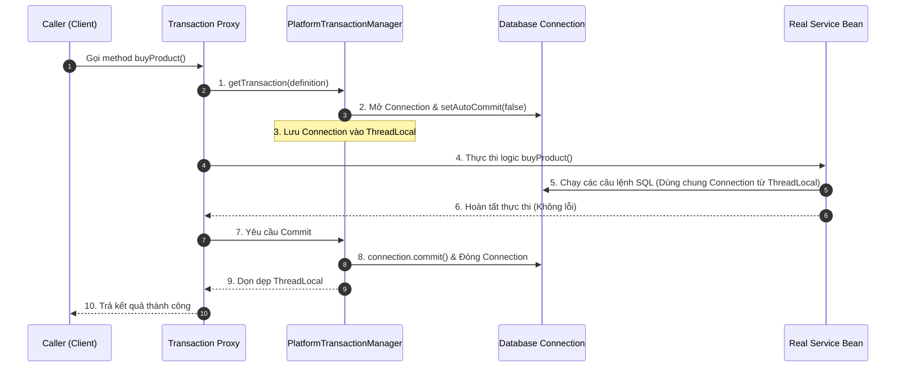

# Dưới mui xe @Transactional: Cơ chế hoạt động chi tiết

## ⚡ Tóm tắt ngắn (30s)
`@Transactional` là annotation khai báo (Declarative Transaction Management) giúp quản lý các giao dịch cơ sở dữ liệu tự động mà không cần viết code `beginTransaction()`, `commit()`, `rollback()` thủ công.
*   **Cơ chế hoạt động cốt lõi**:
    1.  **Tạo Proxy**: Khi ứng dụng startup, Spring phát hiện Bean có gắn `@Transactional` và tạo ra một **Transaction Proxy** bao bọc Bean đó.
    2.  **Đánh chặn (Intercept)**: Khi Client gọi method, Proxy chặn cuộc gọi và chuyển hướng đến **`TransactionInterceptor`**.
    3.  **Bắt đầu & Gắn kết Thread**: Interceptor yêu cầu **`PlatformTransactionManager`** mở một kết nối (Connection) mới, thiết lập `setAutoCommit(false)` và liên kết (bind) Connection này vào Thread hiện tại thông qua **`ThreadLocal`** (sử dụng lớp `TransactionSynchronizationManager`).
    4.  **Thực thi**: Method nghiệp vụ chạy. Mọi câu lệnh SQL bên trong (qua JPA, Hibernate, JDBC) sẽ tự động lấy chung Connection từ `ThreadLocal` này để thực thi.
    5.  **Hoàn tất**: 
        *   Nếu method chạy thành công: Gọi `connection.commit()`.
        *   Nếu quăng ra **Unchecked Exception** (`RuntimeException` hoặc `Error`): Gọi `connection.rollback()`.
*   **Cạm bẫy cực lớn**: Mặc định, Spring **KHÔNG** rollback khi gặp **Checked Exception** (như `IOException`, `ParseException`). Luôn luôn phải khai báo `@Transactional(rollbackFor = Exception.class)` để đảm bảo an toàn tuyệt đối.

---

## 🔍 Chi tiết bản chất thực chiến

### 1. Sơ đồ tuần tự hoạt động của `@Transactional`



### 2. Vai trò của `ThreadLocal` trong quản lý Transaction
Làm sao Spring đảm bảo 3 Repository khác nhau gọi trong cùng một Service lại chạy chung một Transaction?
*   Spring sử dụng lớp **`TransactionSynchronizationManager`** quản lý một bản đồ `ThreadLocal`.
*   Khi Transaction bắt đầu, Connection vật lý được đăng ký vào `ThreadLocal`.
*   Khi Hibernate hay JdbcTemplate cần thực thi SQL, chúng không tự tiện mở connection mới, mà luôn gọi: `DataSourceUtils.getConnection(dataSource)` để lấy lại đúng Connection đang được bind trong `ThreadLocal` của Thread đó.
*   Nhờ vậy, tính cô lập (Isolation) được đảm bảo hoàn hảo giữa các request đồng thời của người dùng.

---

## 💻 Code thực chiến: BAD vs GOOD

### ❌ BAD: Dữ liệu lỗi vẫn commit thành công do lỗi Checked Exception & Nuốt lỗi
Lập trình viên sử dụng `@Transactional` mặc định nhưng ném ra một Checked Exception (`IOException`). Thậm chí, họ viết khối `try-catch` nuốt chửng Exception mà không quăng ngược lại cho Spring biết. Kết quả: Dữ liệu lỗi vẫn được lưu vào DB trơ trơ!

```java
package com.example.service;

import org.springframework.stereotype.Service;
import org.springframework.transaction.annotation.Transactional;
import java.io.FileWriter;
import java.io.IOException;

@Service
public class OrderServiceBad {

    @Transactional // ⚠️ Mặc định: Chỉ rollback với RuntimeException/Error
    public void createOrderWithLog() throws IOException {
        // SQL 1: Lưu đơn hàng thành công
        System.out.println("SQL: Insert into orders values (1, 'Laptop')");

        // Gặp lỗi ghi file hệ thống (Checked Exception)
        if (true) {
            throw new IOException("Disk Full! Cannot write order receipt."); 
        }
        // ⚠️ Hậu quả: IOException là Checked Exception. Spring coi đây là lỗi nghiệp vụ bình thường.
        // Giao dịch vẫn COMMIT thành công! Dữ liệu DB bị sai lệch so với thực tế ghi file receipt.
    }

    @Transactional
    public void createOrderWithTryCatch() {
        try {
            // SQL 1: Lưu đơn hàng
            System.out.println("SQL: Insert into orders values (2, 'Phone')");
            // Gây lỗi chia cho 0 (RuntimeException)
            int result = 1 / 0;
        } catch (ArithmeticException e) {
            // ⚠️ Cực kỳ nguy hiểm: Nuốt chửng lỗi!
            System.out.println("Lỗi toán học nhưng kệ đi!");
        }
        // ⚠️ Hậu quả: Do Exception đã bị bắt và nuốt, Spring Interceptor hoàn toàn không biết có lỗi.
        // Giao dịch vẫn COMMIT bình thường!
    }
}
```

###  GOOD: Cấu hình `rollbackFor` tường minh và quăng ngược lỗi ra ngoài
Luôn khai báo `rollbackFor = Exception.class` để bảo vệ transaction trước mọi loại Exception. Nếu bắt buộc phải catch lỗi để ghi log, hãy luôn re-throw (ném ngược lại) một RuntimeException để kích hoạt cơ chế rollback của Spring.

```java
package com.example.service;

import org.springframework.stereotype.Service;
import org.springframework.transaction.annotation.Transactional;
import java.io.IOException;

@Service
public class OrderServiceGood {

    // ✅ Khai báo rollback với BẤT KỲ loại Exception nào (kể cả Checked)
    @Transactional(rollbackFor = Exception.class) 
    public void createOrderWithLog() throws IOException {
        System.out.println("SQL: Insert into orders values (1, 'Laptop')");

        if (true) {
            throw new IOException("Disk Full! Rollback activated immediately!"); 
        }
    }

    @Transactional(rollbackFor = Exception.class)
    public void createOrderWithTryCatch() {
        try {
            System.out.println("SQL: Insert into orders values (2, 'Phone')");
            int result = 1 / 0;
        } catch (ArithmeticException e) {
            System.out.println("Log error details to monitoring system...");
            // ✅ Bắt buộc phải re-throw RuntimeException để kích hoạt cơ chế rollback của Spring AOP!
            throw new RuntimeException("Calculation failed, transaction rolling back...", e);
        }
    }
}
```

---

## 📊 So sánh: `@Transactional` (Khai báo) vs `TransactionTemplate` (Lập trình)

Trong thực tế, đôi khi dùng annotation không phải là giải pháp tốt nhất. Spring cung cấp thêm `TransactionTemplate` (Programmatic Transaction):

| Tiêu chí | `@Transactional` (Annotation) | `TransactionTemplate` (Programmatic) |
| :--- | :--- | :--- |
| **Độ phức tạp viết code** | Cực thấp (Chỉ cần 1 dòng Annotation). | Trung bình (Phải viết code lồng trong callback). |
| **Phạm vi Transaction** | Toàn bộ phương thức (Method-level). | Có thể bo hẹp trong vài dòng code cụ thể (Block-level). |
| **Bảo mật kết nối DB** | ⚠️ Giữ Connection từ đầu tới cuối method. |  **Tối ưu**. Chỉ lấy connection khi thực sự bắt đầu ghi DB. |
| **Khi nào nên dùng** | Phù hợp cho 90% trường hợp CRUD nghiệp vụ thông thường. | Khi phương thức có gọi API ngoài (Network I/O tốn thời gian) -> Cần thu hẹp block transaction để tránh nghẽn Connection Pool. |

---

## ⚠️ Common Gotchas & Questions follow-up

### 1. Cạm bẫy giữ kết nối Database quá lâu gây nghẽn Connection Pool (Hikari CP Exhausted)
Đây là lỗi kiến trúc hệ thống cực kỳ nghiêm trọng trên môi trường Production có tải cao:
*   **Vấn đề**: Bạn viết một Service xử lý đặt hàng:
    ```java
    @Transactional
    public void checkout() {
        saveOrderToDb(); // 1. Mở Transaction, lấy 1 Connection từ Pool
        callThirdPartyPaymentApi(); // 2. Gọi HTTP API ra bên ngoài (Tốn 3 giây!)
        updateStatusDb(); // 3. Cập nhật DB
    }
    ```
*   **Hậu quả**: Do phương thức được đánh dấu `@Transactional`, kết nối Database vật lý sẽ bị Thread hiện tại **giữ chặt** (block) trong suốt 3 giây chờ API bên ngoài phản hồi. Nếu có 100 request đồng thời, toàn bộ 100 kết nối của HikariCP sẽ bị cạn kiệt, khiến toàn bộ hệ thống sập và báo lỗi: `Connection is not available, request timed out`.
*   **Khắc phục**: **Tuyệt đối không gọi Network I/O (REST API, gửi Mail, Kafka...) bên trong method `@Transactional`**. Hãy tách logic ghi DB ra một class riêng, gọi API ngoài ở class cha không có Transaction, sau đó mới gọi Service DB.
