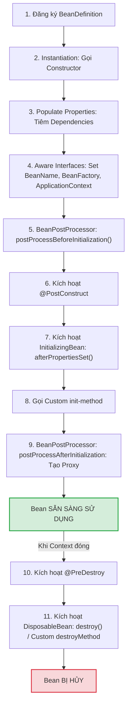

# Bean Lifecycle trong Spring: Phân tích sâu sắc vòng đời Bean

## ⚡ Tóm tắt ngắn (30s)
Vòng đời của một Spring Bean là chuỗi các bước từ khi được khai báo cho đến khi bị hủy, được quản lý hoàn toàn bởi **Spring IoC Container**. Vòng đời này gồm 4 giai đoạn chính:
1.  **Instantiation (Khởi tạo)**: Spring tìm và tạo instance của Bean bằng Java Reflection (qua constructor).
2.  **Populate Properties (Nạp thuộc tính)**: Spring tiến hành Dependency Injection để nạp các giá trị và dependencies vào Bean.
3.  **Initialization (Khởi tạo tùy biến)**: Spring kích hoạt các hàm bổ trợ cấu hình như `@PostConstruct`, `InitializingBean`, và các `BeanPostProcessor`. Lúc này Bean đã sẵn sàng hoạt động.
4.  **Destruction (Hủy bỏ)**: Khi ApplicationContext đóng lại, Spring gọi các hàm giải phóng tài nguyên như `@PreDestroy` hay `DisposableBean` để tắt Bean an toàn.

---

## 🔍 Chi tiết bản chất thực chiến

### 1. Sơ đồ chi tiết 11 bước trong chu kỳ vòng đời của Spring Bean
Đây là quy trình nội bộ chính xác được Spring Container thực thi trên mọi Bean:



---

## 💻 Code thực chiến: BAD vs GOOD

### ❌ BAD: Khởi chạy luồng xử lý hoặc gọi dependency ngay trong Constructor
```java
package com.example.service;

import com.example.client.ExternalApiClient;
import org.springframework.beans.factory.annotation.Autowired;
import org.springframework.stereotype.Service;

@Service
public class MetricSchedulerBad {

    @Autowired
    private ExternalApiClient apiClient; // Sẽ được nạp sau khi chạy Constructor!

    public MetricSchedulerBad() {
        // Anti-pattern 1: Truy cập dependency ở Constructor
        // Lúc này apiClient ĐANG LÀ NULL vì Spring chưa chạy bước Populate Properties!
        // Chạy dòng dưới sẽ ném NullPointerException ngay lập tức!
        apiClient.connect(); 

        // Anti-pattern 2: Tạo thread ngầm hoặc socket ngay trong constructor
        // Đối tượng chưa cấu hình xong hoàn toàn đã khởi chạy luồng xử lý dữ liệu.
        new Thread(() -> {
            System.out.println("Processing...");
        }).start();
    }
}
```

###  GOOD: Sử dụng các Callback Hooks vòng đời chuẩn
```java
package com.example.service;

import com.example.client.ExternalApiClient;
import jakarta.annotation.PostConstruct;
import jakarta.annotation.PreDestroy;
import lombok.RequiredArgsConstructor;
import lombok.extern.slf4j.Slf4j;
import org.springframework.stereotype.Service;
import java.util.concurrent.ExecutorService;
import java.util.concurrent.Executors;

@Service
@RequiredArgsConstructor
@Slf4j
public class MetricSchedulerGood {

    private final ExternalApiClient apiClient; // Được nạp an toàn qua Constructor Injection
    private ExecutorService executorService;

    // ✅ Khởi tạo tùy biến sau khi tất cả dependencies đã được nạp và kiểm tra đầy đủ
    @PostConstruct
    public void init() {
        log.info("Giai đoạn Initialization: Kết nối tới API và thiết lập Thread Pool...");
        apiClient.connect();
        this.executorService = Executors.newSingleThreadExecutor();
        this.executorService.submit(() -> log.info("Thread ngầm đang chạy an toàn..."));
    }

    // ✅ Giải phóng tài nguyên khi đóng ứng dụng để tránh rò rỉ bộ nhớ (Memory Leak)
    @PreDestroy
    public void cleanup() {
        log.info("Giai đoạn Destruction: Đang đóng các kết nối và dừng Thread Pool...");
        if (executorService != null) {
            executorService.shutdown();
        }
        apiClient.disconnect();
    }
}
```

---

## 📊 Trade-off: So sánh 3 cơ chế cấu hình Callback trong Spring

| Tiêu chí | Annotations (`@PostConstruct` / `@PreDestroy`) | Interfaces (`InitializingBean` / `DisposableBean`) | Custom Methods (`@Bean(initMethod, destroyMethod)`) |
| :--- | :--- | :--- | :--- |
| **Độ xâm lấn code** |  Rất thấp (Sử dụng annotations chuẩn của Jakarta/JEE). | ❌ Cao (Class phải implement interface của Spring). |  Không xâm lấn (Định nghĩa trực tiếp trong class cấu hình). |
| **Kiến trúc sạch** |  Có (Giữ code Java POJO thuần). | ❌ Không (Code bị gắn cứng với thư viện Spring). |  Tuyệt vời (Phù hợp khi import thư viện bên thứ 3 không thể sửa code). |
| **Độ linh hoạt** | Cố định logic bên trong Class. | Cố định logic bên trong Class. |  Rất cao (Có thể cấu hình động các tên method khác nhau tùy môi trường). |
| **Được khuyến nghị**| **Ưu tiên số 1** cho code nội bộ của dự án. | Không khuyến nghị trong lập trình hiện đại. | **Ưu tiên số 1** khi tích hợp thư viện ngoài. |

---

## ⚠️ Common Gotchas & Questions follow-up

* **Cạm bẫy lỗi NullPointerException ở Constructor**:
  Lập trình viên mới thường lầm tưởng rằng Constructor là nơi có thể thực hiện mọi logic thiết lập. Tuy nhiên, tại Constructor, đối tượng mới chỉ được cấp phát bộ nhớ (Instantiation), toàn bộ các trường `@Autowired` hay dependencies chưa hề được tiêm vào.
  * *Khắc phục:* Chuyển toàn bộ logic khởi tạo cần dùng đến dependency sang phương thức đánh dấu `@PostConstruct`.
* **Câu hỏi đào sâu từ interviewer**: *Sự khác nhau cơ bản giữa BeanPostProcessor và BeanFactoryPostProcessor là gì?*
  * *(Trả lời: 
    1. **BeanFactoryPostProcessor**: Can thiệp vào cấu trúc định nghĩa của Bean (BeanDefinition) **trước khi** bất kỳ bean thực tế nào được khởi tạo. Ví dụ: Đọc file `application.properties` và thay thế các placeholder `${db.url}` thành giá trị thật.
    2. **BeanPostProcessor**: Can thiệp vào instance thực tế của Bean **trong quá trình khởi tạo** (sau Instantiation). Nó có 2 hooks: `postProcessBeforeInitialization` và `postProcessAfterInitialization`. Đây là nơi Spring chèn các cơ chế Dynamic Proxy để hiện thực hóa tính năng AOP, như `@Transactional` hoặc `@Async`).*
---
