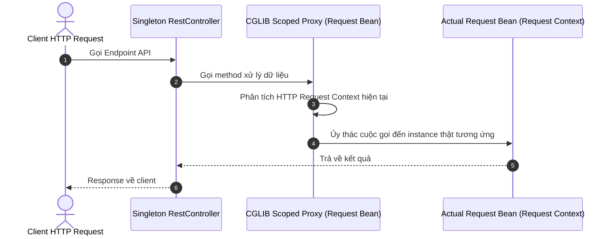

# Các loại Bean Scope trong Spring: Phân tích và trường hợp sử dụng thực tế

## ⚡ Tóm tắt ngắn (30s)
Spring Framework cung cấp **6 loại Bean Scope** (trong đó có 4 scope chỉ áp dụng trong môi trường Web):
1.  **singleton** (Mặc định): Chỉ có duy nhất 1 instance được tạo ra cho toàn bộ IoC Container.
2.  **prototype**: Mỗi khi có yêu cầu gọi (`context.getBean()`) hoặc tiêm dependency, Spring sẽ tạo ra 1 instance hoàn toàn mới.
3.  **request** (Web): Tạo ra 1 instance cho mỗi HTTP Request. Tự động hủy khi HTTP request kết thúc.
4.  **session** (Web): Tạo ra 1 instance cho mỗi HTTP Session.
5.  **application** (Web): Tạo ra 1 instance duy nhất cho vòng đời của một `ServletContext`.
6.  **websocket** (Web): Tạo ra 1 instance cho vòng đời của một kết nối `WebSocket`.

*   **Vấn đề cốt lõi thực chiến**: Khi inject một `prototype` bean vào một `singleton` bean, bản chất prototype sẽ bị mất (nó chỉ được tạo 1 lần duy nhất lúc singleton bean khởi tạo). Để giải quyết, ta bắt buộc phải sử dụng **Scoped Proxy** hoặc **ObjectProvider**.

---

## 🔍 Chi tiết bản chất thực chiến

### 1. Phân biệt sâu sắc Singleton và Prototype Scope
*   **Singleton (Stateless)**: Không nên chứa trạng thái động (mutable state) của client. Tất cả các request đều đi qua cùng một vùng nhớ. Vì thế, Singleton Bean bắt buộc phải là **Thread-safe/Stateless** (chỉ chứa business logic, các repositories, services).
*   **Prototype (Stateful)**: Chứa thông tin riêng biệt cho mỗi phiên làm việc hoặc tác vụ. Spring IoC Container chịu trách nhiệm khởi tạo và cấu hình cho Prototype bean, nhưng **không quản lý việc hủy bỏ (destruction)** của nó. Lập trình viên phải tự dọn dẹp tài nguyên của prototype bean để tránh rò rỉ bộ nhớ (Memory leak).

### 2. Cơ chế Scoped Proxy hoạt động ra sao?
Khi tiêm một request-scoped bean vào một singleton bean (như một `@RestController`), Spring không thể tiêm một instance request thực tế ngay lúc startup vì chưa hề có HTTP request nào.
Spring giải quyết bằng cách tiêm một **Scoped Proxy** (thường do thư viện CGLIB sinh ra). Proxy này đóng vai trò là một "vỏ bọc" có cấu trúc interface giống hệt Bean thật. Khi một method trên proxy được gọi tại runtime, proxy sẽ tự động phân tích HTTP context hiện tại và chuyển hướng cuộc gọi đến đúng instance của request hiện hành.



---

## 💻 Code thực chiến: BAD vs GOOD

### ❌ BAD: Dẫn đến lỗi mất tính chất Prototype (Prototype Injection Problem)
```java
package com.example.service;

import org.springframework.beans.factory.annotation.Autowired;
import org.springframework.context.annotation.Scope;
import org.springframework.stereotype.Component;
import org.springframework.stereotype.Service;

@Component
@Scope("prototype")
class TokenGenerator {
    private final double value = Math.random();
    public double getValue() { return value; }
}

@Service
public class SessionServiceBad {

    @Autowired
    private TokenGenerator tokenGenerator; // Prototype bị inject vào Singleton

    public void printToken() {
        // ⚠️ VẤN ĐỀ: Vì SessionServiceBad là Singleton (chỉ tạo 1 lần),
        // tokenGenerator cũng chỉ được inject 1 lần duy nhất lúc startup.
        // Mọi cuộc gọi tiếp theo sẽ trả về CÙNG một giá trị random, mất hoàn toàn tính chất prototype!
        System.out.println("Token: " + tokenGenerator.getValue());
    }
}
```

###  GOOD: Giải quyết bằng ObjectProvider (Hiện đại và POJO-friendly nhất)
```java
package com.example.service;

import org.springframework.beans.factory.ObjectProvider;
import org.springframework.beans.factory.annotation.Autowired;
import org.springframework.context.annotation.Scope;
import org.springframework.context.annotation.ScopedProxyMode;
import org.springframework.stereotype.Component;
import org.springframework.stereotype.Service;

@Component
@Scope("prototype")
class TokenGeneratorGood {
    private final double value = Math.random();
    public double getValue() { return value; }
}

@Service
public class SessionServiceGood {

    // ✅ Sử dụng ObjectProvider để trì hoãn việc lấy instance thật (Lazy resolution)
    private final ObjectProvider<TokenGeneratorGood> tokenGeneratorProvider;

    public SessionServiceGood(ObjectProvider<TokenGeneratorGood> tokenGeneratorProvider) {
        this.tokenGeneratorProvider = tokenGeneratorProvider;
    }

    public void printToken() {
        // ✅ Mỗi lần gọi getObject(), Spring IoC sẽ sinh ra một instance TokenGeneratorGood mới tinh
        TokenGeneratorGood tokenGenerator = tokenGeneratorProvider.getObject();
        System.out.println("Token mới: " + tokenGenerator.getValue());
    }
}
```

---

## 📊 Trade-off: So sánh các phương án giải quyết Prototype Injection

| Tiêu chí | Dùng ApplicationContext Lookup | Dùng `@Lookup` Annotation | Dùng `ObjectProvider<T>` (Best) |
| :--- | :--- | :--- | :--- |
| **Độ bẩn/xâm lấn của code** |  Rất cao (Phụ thuộc cứng vào Spring API). | ❌ Trung bình (Phải khai báo method abstract). |  Cực kỳ sạch (Sử dụng generic class của Spring). |
| **Độ dễ viết Unit Test** | ❌ Rất khó (Cần mock cả context). | ❌ Khó (Không thể dùng new tạo POJO). |  Rất dễ (Chỉ cần mock ObjectProvider). |
| **Hỗ trợ Generics & Parameter**| ❌ Không | ❌ Không |  Có (Hỗ trợ truyền tham số động khi tạo Bean). |
| **Được khuyên dùng** | Không bao giờ | Hạn chế |  Khuyến nghị ưu tiên tối đa. |

---

## ⚠️ Common Gotchas & Questions follow-up

* **Cạm bẫy lỗi rò rỉ bộ nhớ (Memory Leak) với Prototype Beans**:
  Spring IoC Container sẽ khởi tạo, chạy các `BeanPostProcessor` và gọi `@PostConstruct` của prototype bean, nhưng **nó hoàn toàn không quản lý hay dọn dẹp các callback hủy `@PreDestroy`**. Nếu prototype bean mở kết nối database hay tạo luồng, nó sẽ chiếm dụng tài nguyên vĩnh viễn cho đến khi JVM chạy Garbage Collector dọn sạch.
  * *Khắc phục:* Lập trình viên phải tự quản lý việc hủy các đối tượng prototype bằng cách đăng ký một `DestructionAwareBeanPostProcessor` custom hoặc tự gọi dọn dẹp tài nguyên một cách thủ công.
* **Câu hỏi đào sâu từ interviewer**: *Làm thế nào để inject một request-scoped bean vào một singleton bean mà không làm ứng dụng crash lúc startup?*
  * *(Trả lời: Ta phải cấu hình **Scoped Proxy** bằng cách khai báo:
  `@Scope(value = WebApplicationContext.SCOPE_REQUEST, proxyMode = ScopedProxyMode.TARGET_CLASS)`. 
  Cấu hình này báo cho Spring tạo ra một CGLIB proxy thay thế. Proxy này sẽ kết nối động đến request bean thật khi có request đi vào, giúp tránh crash lúc startup).*
---
