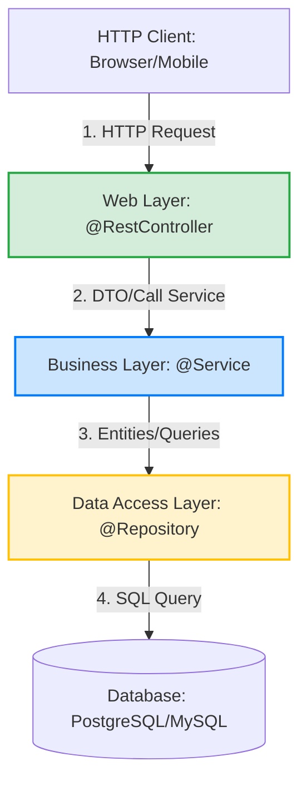

# @Component vs @Service vs @Repository vs @Controller: Phân biệt các Stereotype Annotations

## ⚡ Tóm tắt ngắn (30s)
Cả 4 annotations này đều là các **Stereotype Annotations** của Spring. Về mặt kỹ thuật, `@Service`, `@Repository`, và `@Controller` đều được kế thừa (meta-annotated) từ `@Component`. Chúng báo hiệu cho Spring Container biết để khởi tạo và quản lý Class này như một **Spring Bean** thông qua cơ chế quét thành phần (Component Scanning).

Điểm khác biệt cốt lõi nằm ở **vai trò kiến trúc (Semantic Layering)** và các **tính năng chuyên biệt** được Spring tích hợp riêng cho từng tầng:
1.  **`@Component`**: Định nghĩa chung nhất cho mọi Spring Bean không thuộc 3 tầng còn lại (tiện ích, cấu hình chung).
2.  **`@Controller` / `@RestController`**: Dành cho tầng **Presentation (Web/API)**. Xử lý HTTP requests, điều phối giao diện hoặc API response.
3.  **`@Service`**: Dành cho tầng **Business Logic**. Chưa tích hợp tính năng kỹ thuật đặc biệt ở mức framework, nhưng đóng vai trò định danh nghiệp vụ.
4.  **`@Repository`**: Dành cho tầng **Data Access (DAO)**. Spring tự động bật cơ chế **dịch lỗi Database (Exception Translation)** tại đây.

---

## 🔍 Chi tiết bản chất thực chiến

### 1. Sơ đồ kiến trúc phân tầng (Layered Architecture) chuẩn Spring Boot


### 2. Sự khác biệt cụ thể ở cấp độ tính năng Framework

#### A. `@Repository` và cơ chế Exception Translation (Dịch lỗi Database)
Đây là điểm khác biệt lớn nhất về mặt kỹ thuật. Khi một Class được đánh dấu `@Repository`, Spring tự động áp dụng một `BeanPostProcessor` có tên là `PersistenceExceptionTranslationPostProcessor`.
*   **Cơ chế**: Khi code tương tác database phát sinh lỗi (như lỗi cú pháp SQL, mất kết nối, trùng lặp khóa chính), thay vì ném ra ngoại lệ phức tạp và mang tính đặc thù của thư viện cụ thể (như `SQLException` của JDBC hay `JDBCException` của Hibernate), Spring sẽ tự động "dịch" và bọc (wrap) các ngoại lệ này thành hệ thống ngoại lệ **`DataAccessException`** nhất quán của Spring.
*   **Lợi ích**: Giúp tầng Service xử lý lỗi một cách độc lập, không bị phụ thuộc vào việc dự án đang sử dụng JPA/Hibernate, MyBatis hay JDBC thuần.

#### B. `@Controller` và `@RestController`
*   `@Controller`: Dùng trong mô hình MVC truyền thống (Server-side Rendering). Hàm trả về thường là một chuỗi (String) tương ứng với tên của View template (Thymeleaf, JSP, Mustache) để Server render ra HTML.
*   `@RestController`: Là sự kết hợp của `@Controller` và `@ResponseBody`. Mọi method trong class này mặc định trả về dữ liệu thô (Object, List, Map). Dữ liệu này sẽ tự động được Serialize thành định dạng JSON hoặc XML (qua thư viện Jackson) và ghi trực tiếp vào phần thân (Body) của HTTP Response.

---

## 💻 Code thực chiến: BAD vs GOOD

### ❌ BAD: Dùng sai vai trò kiến trúc và lạm dụng `@Component` cho tầng Data Access
```java
package com.example.dao;

import jakarta.persistence.EntityManager;
import jakarta.persistence.PersistenceContext;
import org.springframework.stereotype.Component;

@Component // ❌ ANTI-PATTERN: Dùng Component thay vì Repository ở tầng DAO
public class UserCustomDaoBad {

    @PersistenceContext
    private EntityManager entityManager;

    public void saveUser(UserEntity user) {
        // Nếu database xảy ra lỗi (ví dụ: duplicate key), JVM sẽ ném ra ngoại lệ thô của Hibernate.
        // Tầng Service muốn catch lỗi này phải import thư viện cụ thể của Hibernate/JPA,
        // phá vỡ tính đóng gói và nguyên tắc độc lập cơ sở dữ liệu.
        entityManager.persist(user);
    }
}
```

###  GOOD: Phân cấp rõ ràng với đúng Stereotype Annotation
```java
package com.example.dao;

import jakarta.persistence.EntityManager;
import jakarta.persistence.PersistenceContext;
import org.springframework.stereotype.Repository;

@Repository // ✅ CHUẨN: Spring tự động dịch mọi lỗi Hibernate thành Spring DataAccessException
public class UserCustomDaoGood {

    @PersistenceContext
    private EntityManager entityManager;

    public void saveUser(UserEntity user) {
        entityManager.persist(user);
    }
}
```

---

## 📊 Trade-off: So sánh 4 Stereotype Annotations

| Tiêu chí | `@Component` | `@Service` | `@Repository` | `@Controller` / `@RestController` |
| :--- | :--- | :--- | :--- | :--- |
| **Phân tầng kiến trúc** | Lớp tiện ích/hỗ trợ chung | Tầng Business Logic | Tầng Data Access (DAO) | Tầng Presentation (API/Web) |
| **Tính năng kỹ thuật phụ trợ**| Không có tính năng đặc biệt | Không có (Đóng vai trò phân nhóm) |  **Tự động dịch ngoại lệ Database** |  **Xử lý HTTP requests, serialize JSON** |
| **Bảo mật và Giao dịch**| Thường ít áp dụng giao dịch | Thường kết hợp `@Transactional` | Ít dùng `@Transactional` (Nhường cho Service) | Bảo mật đường dẫn (Endpoint Security) |
| **Cách dùng phổ biến**| Các helper class, file reader, JwtUtility | OrderService, PaymentService | CustomUserRepository | ProductController, UserRestController |

---

## ⚠️ Common Gotchas & Questions follow-up

* **Cạm bẫy lỗi quét thiếu Component (Scanning Gotcha)**:
  Annotation `@SpringBootApplication` chứa `@ComponentScan` mặc định. Nó chỉ quét các class nằm trong package hiện tại và toàn bộ các sub-packages (package con). Nếu bạn đặt `@Service` hay `@Repository` ở một package hoàn toàn nằm ngoài cây thư mục của `@SpringBootApplication`, Spring IoC Container sẽ bỏ qua chúng và ném ra lỗi `NoSuchBeanDefinitionException` khi tiêm dependency.
  * *Khắc phục:* Luôn tổ chức cấu trúc package bắt đầu từ gốc (base package) chứa class main `@SpringBootApplication`, hoặc khai báo quét thủ công bằng `@ComponentScan(basePackages = "com.other.package")`.
* **Câu hỏi đào sâu từ interviewer**: *Tại sao Spring lại chia nhỏ các annotation này ra trong khi về mặt kỹ thuật, chúng đều hoạt động giống `@Component` và có thể thay thế cho nhau hoàn toàn nếu bỏ qua Exception Translation?*
  * *(Trả lời: Việc phân cấp mang lại 3 giá trị cực lớn:
    1. **Khả năng đọc hiểu (Readability) & Kiến trúc**: Lập trình viên lập tức hiểu ngay vai trò của class trong hệ thống.
    2. **Pointcut AOP chính xác**: AOP cho phép ta viết các logic ghi log hay bảo mật chỉ nhắm vào riêng tầng Web (`within(@org.springframework.stereotype.Controller *)`) hoặc tầng Service một cách dễ dàng.
    3. **Tính năng đặc thù tương lai**: Giúp Spring dễ dàng bổ sung các tính năng riêng cho từng tầng mà không ảnh hưởng đến các tầng khác).*
---
