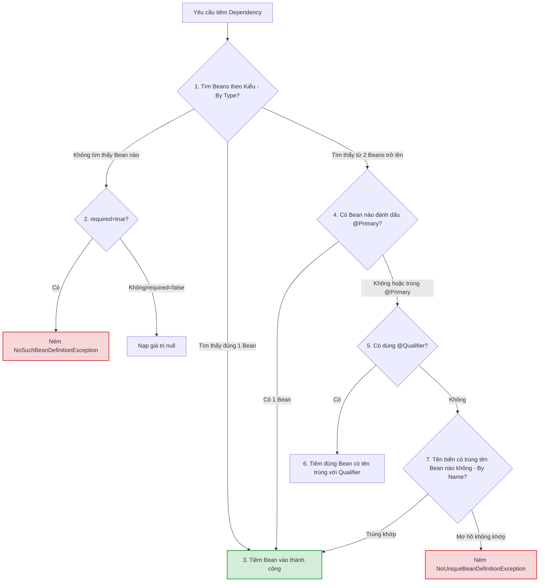

# @Autowired hoạt động như thế nào? Phân tích cơ chế Autowiring nội bộ

## ⚡ Tóm tắt ngắn (30s)
Annotation `@Autowired` báo hiệu cho Spring Container tự động tìm và tiêm (inject) dependency phù hợp vào Bean hiện tại. 
Cơ chế hoạt động nội bộ cốt lõi gồm:
1.  **Bộ xử lý trung tâm**: Spring sử dụng một class đặc biệt có tên là **`AutowiredAnnotationBeanPostProcessor`** (một `BeanPostProcessor` chuyên biệt) để quét và phân tích các trường, phương thức hoặc constructor được đánh dấu `@Autowired`.
2.  **Thời điểm thực thi**: Được kích hoạt trong giai đoạn **Populate Properties** của chu kỳ vòng đời Bean (sau khi gọi Constructor và trước khi gọi `@PostConstruct`).
3.  **Thuật toán tìm kiếm Bean (Resolution Strategy)**:
    *   **Bước 1: Tìm theo Kiểu (By-Type)**: Spring tìm tất cả các Bean khớp với kiểu dữ liệu của dependency trong Container.
    *   **Bước 2: Tìm theo Tên (By-Name)**: Nếu có nhiều hơn 1 Bean cùng kiểu, Spring sẽ chuyển sang cơ chế fallback tìm Bean có tên trùng khớp hoàn toàn với tên biến được khai báo.
    *   **Bước 3: Báo lỗi mập mờ**: Nếu vẫn không tìm thấy Bean duy nhất, Spring sẽ ném ra ngoại lệ `NoUniqueBeanDefinitionException` và dừng ứng dụng.

---

## 🔍 Chi tiết bản chất thực chiến

### 1. Thuật toán phân giải Dependency của Spring
Khi Spring phân tích thuộc tính `@Autowired private PaymentGateway paymentGateway;`:



### 2. Vai trò của `AutowiredAnnotationBeanPostProcessor`
Đây là "trái tim" của cơ chế Autowired. 
*   **Giai đoạn tiền xử lý (Metadata Gathering)**: Khi khởi chạy ứng dụng, PostProcessor này sẽ duyệt qua tất cả class, phát hiện ra các fields hoặc methods có gắn `@Autowired`, tạo ra đối tượng `InjectionMetadata` lưu trữ thông tin về các điểm cần tiêm.
*   **Giai đoạn thực thi (Injection Phase)**: Khi một Bean được tạo ra, Spring Container sẽ đưa instance của Bean đi qua `AutowiredAnnotationBeanPostProcessor`. Lúc này, nó sử dụng Java Reflection (thông qua `Field.set()` hoặc `Method.invoke()`) để ghi đè (inject) tham chiếu của dependency vào Bean, bất chấp việc field đó có phạm vi truy cập là `private`.

---

## 💻 Code thực chiến: BAD vs GOOD

### ❌ BAD: Gây lỗi mập mờ định nghĩa (Ambiguous Bean Definition) khi startup
```java
package com.example.service;

import org.springframework.beans.factory.annotation.Autowired;
import org.springframework.stereotype.Component;
import org.springframework.stereotype.Service;

interface NotificationSender { void send(String msg); }

@Component class EmailSender implements NotificationSender { public void send(String msg) {} }
@Component class SmsSender implements NotificationSender { public void send(String msg) {} }

@Service
public class AlertServiceBad {

    @Autowired // ❌ LỖI LÚC STARTUP: Spring tìm thấy 2 Beans có cùng kiểu NotificationSender (Email & Sms)
    private NotificationSender notificationSender; // Tên biến không trùng khớp với tên Bean nào (emailSender/smsSender)

    public void alert() {
        notificationSender.send("Alert!");
    }
}
// ⚠️ Kết quả: Ứng dụng crash lập tức với lỗi:
// "NoUniqueBeanDefinitionException: No qualifying bean of type 'NotificationSender' available: 
// expected single matching bean but found 2: emailSender,smsSender"
```

###  GOOD: Giải quyết mập mờ bằng `@Qualifier` kết hợp Constructor Injection
```java
package com.example.service;

import org.springframework.beans.factory.annotation.Qualifier;
import org.springframework.stereotype.Service;

@Service
public class AlertServiceGood {

    private final NotificationSender notificationSender;

    // ✅ Giải pháp tối ưu: Constructor Injection kết hợp Qualifier 
    // Chỉ định chính xác Spring phải tiêm "emailSender" Bean vào đây.
    public AlertServiceGood(@Qualifier("emailSender") NotificationSender notificationSender) {
        this.notificationSender = notificationSender;
    }

    public void alert() {
        notificationSender.send("Alert!");
    }
}
```

---

## 📊 Trade-off: So sánh các cơ chế giải quyết trùng Bean (Ambiguity resolution)

| Giải pháp | Cách thực hiện | Ưu điểm | Nhược điểm |
| :--- | :--- | :--- | :--- |
| **Dùng `@Primary`** | Đánh dấu `@Primary` trên Class được ưu tiên. | Rất tiện lợi, giúp cấu hình một Bean mặc định cho toàn hệ thống. | ❌ Thiếu trực quan nếu có nhiều vị trí tiêm khác nhau cần các cấu hình khác nhau. |
| **Dùng `@Qualifier`** | Khai báo `@Qualifier("beanName")` tại vị trí tiêm. | **Chính xác tuyệt đối**, kiểm soát tường minh từng vị trí tiêm. | Code hơi dài vì phải viết thêm annotation ở constructor/parameter. |
| **Dùng By-Name Fallback**| Đặt tên biến trùng khớp hoàn toàn với tên Bean. | Không cần viết thêm annotation cấu hình. | ❌ Cực kỳ nguy hiểm nếu vô tình đổi tên biến trong quá trình refactor code, dễ làm crash app bất ngờ. |

---

## ⚠️ Common Gotchas & Questions follow-up

* **Cạm bẫy lạm dụng `@Autowired(required = false)`**:
  Theo mặc định, nếu không tìm thấy Bean phù hợp để tiêm, Spring sẽ quăng lỗi và dừng app. Nếu bạn cấu hình `@Autowired(required = false)`, Spring sẽ bỏ qua lỗi khởi động và nạp giá trị `null` vào field đó.
  * *Khắc phục:* Hạn chế tối đa cách này. Nếu sử dụng, bắt buộc phải chèn các đoạn check `if (dependency != null)` trước khi thực thi method để tránh lỗi `NullPointerException` cực kỳ tai hại tại runtime.
* **Câu hỏi đào sâu từ interviewer**: *Tại sao việc dùng `@Autowired` trên private field lại bị coi là vi phạm nguyên tắc bao đóng (Encapsulation) của Java core?*
  * *(Trả lời: Vì private field sinh ra là để ngăn chặn sự can thiệp từ bên ngoài class. Việc `@Autowired` sử dụng Reflection để can thiệp trực tiếp vào field private mà không thông qua bất kỳ API công khai nào (constructor/setter) đã phá vỡ quy tắc đóng gói của OOP. Điều này làm cho class không thể được khởi tạo và sử dụng một cách bình thường ngoài môi trường Spring Container).*
---
