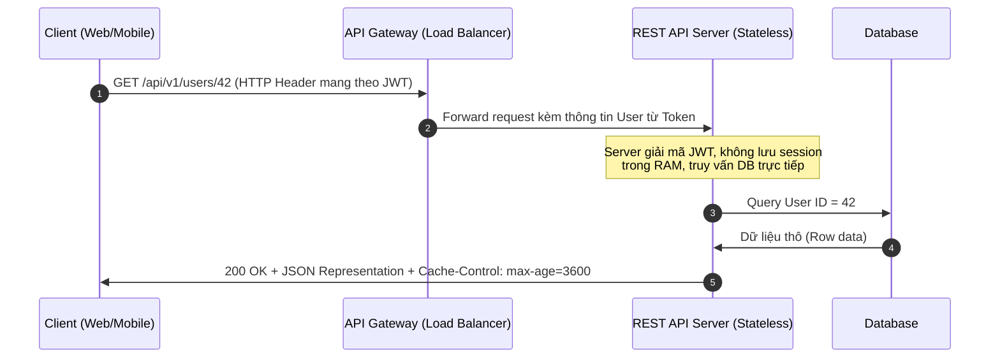

# REST là gì? Phân tích bản chất và các ràng buộc cốt lõi

## ⚡ Tóm tắt ngắn (30s)
`REST (Representational State Transfer)` không phải là một giao thức hay một tiêu chuẩn, mà là một **kiểu kiến trúc phần mềm (architectural style)** được định nghĩa bởi Roy Fielding vào năm 2000.
* **Bản chất**: REST tập trung vào **Resource (Tài nguyên)**. Mọi thứ trong hệ thống (User, Order, Product) đều được coi là tài nguyên và được định danh bằng một URI duy nhất. Trạng thái của tài nguyên được đại diện (Representation) qua các định dạng như JSON, XML và được truyền tải qua mạng.
* **6 ràng buộc cốt lõi**: Client-Server, Stateless, Cacheable, Uniform Interface, Layered System, và Code on Demand (tùy chọn). Hệ thống tuân thủ đầy đủ các ràng buộc này được gọi là **RESTful**.

---

## 🔍 Chi tiết bản chất thực chiến

### 1. Phân tích 6 Ràng buộc Cốt lõi của REST

Để một hệ thống được coi là chuẩn RESTful, nó phải tuân thủ nghiêm ngặt các ràng buộc sau:

1.  **Client-Server Architecture**: Tách biệt rõ ràng giữa Frontend (Client) và Backend (Server). Client không quan tâm đến việc lưu trữ dữ liệu, Server không quan tâm đến giao diện người dùng. Giúp hệ thống độc lập phát triển và dễ dàng mở rộng.
2.  **Stateless (Không lưu trạng thái)**: Mỗi request từ Client lên Server phải chứa **đầy đủ thông tin** để Server hiểu và xử lý độc lập. Server không lưu giữ bất kỳ context nào về session của Client trên bộ nhớ của nó.
3.  **Cacheable (Khả năng lưu bộ nhớ đệm)**: Dữ liệu phản hồi từ Server phải tự định nghĩa xem nó có được phép cache hay không (thông qua HTTP Headers như `Cache-Control`, `ETag`). Giúp tăng hiệu năng và giảm tải cho Server.
4.  **Uniform Interface (Giao diện đồng nhất)**: Ràng buộc quan trọng nhất giúp đơn giản hóa kiến trúc. Gồm 4 nguyên tắc con:
    *   *Identification of resources*: Định danh tài nguyên qua URI (ví dụ: `/api/v1/orders/123`).
    *   *Manipulation of resources through representations*: Client thao tác với tài nguyên thông qua các đại diện (JSON/XML) cùng metadata.
    *   *Self-descriptive messages*: Mỗi message phải chứa đủ thông tin để bên nhận biết cách xử lý (ví dụ: `Content-Type: application/json`).
    *   *Hypermedia As The Engine Of Application State (HATEOAS)*: API phản hồi kèm theo các liên kết động dẫn tới hành động tiếp theo.
5.  **Layered System (Hệ thống phân tầng)**: Client không thể biết mình đang kết nối trực tiếp với Server đích hay qua một trung gian (Proxy, Load Balancer, CDN, API Gateway). Giúp tăng cường bảo mật và mở rộng hệ thống dễ dàng.
6.  **Code on Demand (Tùy chọn)**: Server có thể gửi mã thực thi (như JavaScript applet) về cho Client chạy trực tiếp. Rất ít dùng trong thực tế API.

### 2. Mô hình luồng dữ liệu RESTful Stateless



---

## 💻 Code thực chiến: BAD vs GOOD

### ❌ BAD: Viết API mang tư duy RPC (Remote Procedure Call) và Stateful
Dưới đây là một controller vi phạm nghiêm trọng tính Stateless và giao diện đồng nhất của REST.

```java
@RestController
@RequestMapping("/users")
public class UserRpcController {

    // Vi phạm Stateless: Lưu thông tin session của user trên RAM của server này
    private User currentUser;

    @PostMapping("/loginUser") // Vi phạm: Tên URI chứa hành động (verb) thay vì danh từ
    public ResponseEntity<String> login(@RequestBody User loginUser, HttpSession session) {
        this.currentUser = loginUser; // Lưu biến global
        session.setAttribute("user", loginUser); // Stateful
        return ResponseEntity.ok("Logged in");
    }

    @GetMapping("/getUserInfoById") // Vi phạm: Dùng verb trong URI, không định danh resource
    public User getUserInfo(@RequestParam Long id) {
        return userService.findById(id);
    }

    @PostMapping("/updateUserAddress") // Vi phạm: Thao tác ghi dùng POST hỗn loạn thay vì PUT/PATCH
    public void updateAddress(@RequestBody Address address) {
        userService.updateAddress(currentUser.getId(), address);
    }
}
```

###  GOOD: Thiết kế RESTful chuẩn Stateless
Tách biệt tài nguyên rõ ràng, định danh bằng danh từ số nhiều, sử dụng HTTP Verbs đúng mục đích, và chứng thực phi trạng thái (Stateless Authentication) qua JWT mang trong header.

```java
@RestController
@RequestMapping("/api/v1/users") // Danh từ số nhiều, có versioning rõ ràng
public class UserController {

    private final UserService userService;

    public UserController(UserService userService) {
        this.userService = userService;
    }

    // Định danh tài nguyên cụ thể qua Path Variable, dùng đúng HTTP GET
    @GetMapping("/{id}")
    public ResponseEntity<UserResponseDto> getUserById(@PathVariable Long id) {
        UserResponseDto user = userService.findById(id);
        
        return ResponseEntity.ok()
                // Ràng buộc Cacheable: Cho phép Client cache kết quả này trong 1 giờ
                .header(HttpHeaders.CACHE_CONTROL, "public, max-age=3600")
                .body(user);
    }

    // Cập nhật tài nguyên dùng PUT hoặc PATCH
    @PatchMapping("/{id}/address")
    public ResponseEntity<Void> updateAddress(
            @PathVariable Long id,
            @RequestBody AddressDto addressDto,
            @AuthenticationPrincipal UserPrincipal principal // Lấy thông tin user trực tiếp từ JWT
    ) {
        // Đảm bảo tính Stateless: Server xác thực dựa hoàn toàn trên Token đi kèm request
        if (!id.equals(principal.getId())) {
            return ResponseEntity.status(HttpStatus.FORBIDDEN).build();
        }
        
        userService.updateAddress(id, addressDto);
        return ResponseEntity.noContent().build(); // 204 No Content chuẩn REST
    }
}
```

---

## 📊 Trade-off: Stateless vs Stateful Architecture

| Tiêu chí | Stateless Architecture (REST) | Stateful Architecture |
| :--- | :--- | :--- |
| **Khả năng mở rộng (Scalability)** | **Cực cao**. Dễ dàng scale-out (thêm server) bằng Load Balancer mà không cần đồng bộ session. | **Thấp**. Phải dùng Sticky Session hoặc Session Replication (Redis) rất phức tạp. |
| **Bảo mật và tính độc lập** | **Cao**. Token (JWT) tự mã hóa, dễ dàng tích hợp với các hệ thống phân tán đa nền tảng. | **Trung bình**. Dễ bị tấn công CSRF nếu không cấu hình cookie/session an toàn. |
| **Băng thông (Network Bandwidth)** | **Hao tốn hơn**. Client phải gửi thông tin chứng thực (JWT/API Key) trong mỗi request. | **Tiết kiệm**. Request rất nhỏ, server tự nhận diện dựa trên Session ID gọn nhẹ. |
| **Trải nghiệm lập trình viên** | Đơn giản, dễ debug lỗi của từng request độc lập. | Dễ phát sinh các lỗi khó tái hiện liên quan đến race-condition của session. |

---

## ⚠️ Common Gotchas & Questions follow-up

* **Cạm bẫy "Mất Stateless" khi scale ứng dụng**:
  Nhiều lập trình viên nghĩ hệ thống của mình là RESTful nhưng lại sử dụng bộ nhớ đệm cục bộ (Local Memory Cache như `ConcurrentHashMap` hay Caffeine) trên RAM của từng server instance để lưu trạng thái phiên làm việc hoặc kết quả giao dịch.
  * *Hệ quả:* Khi Load Balancer điều hướng request tiếp theo của cùng một client sang instance khác, dữ liệu biến mất gây lỗi hệ thống đột ngột.
  * *Khắc phục:* Buộc phải chuyển đổi sang giải pháp Distributed Cache (như Redis) hoặc lưu hoàn toàn trạng thái ở database trung tâm.

* **Câu hỏi đào sâu từ interviewer**: *Nếu REST Stateless buộc phải truyền JWT lớn ở mọi request gây tốn băng thông, tại sao người ta vẫn ưu tiên dùng nó thay vì Stateful Session để tối ưu mạng?*
  * *(Trả lời: Việc tối ưu băng thông mạng ngày nay không còn là nút thắt cổ chai lớn so với việc tối ưu khả năng mở rộng (Scalability) của hệ thống. Với Stateful Session, khi số lượng người dùng đồng thời tăng lên hàng triệu, RAM của Server sẽ bị cạn kiệt do phải lưu trữ Session Object cho từng người. Với Stateless REST, Server chỉ tốn CPU để giải mã và xác thực token trong vài mili-giây, cho phép hệ thống mở rộng quy mô tuyến tính dễ dàng).*
