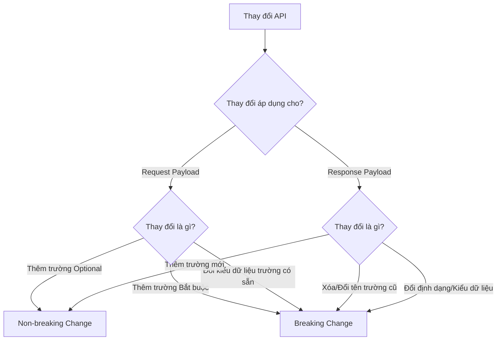

# API Backward Compatibility: Quản lý và Phát hiện Breaking Changes

## ⚡ Tóm tắt ngắn (30s)
**Tương thích ngược (Backward Compatibility)** là khả năng của một API phiên bản mới vẫn phục vụ bình thường cho các **Client chạy phiên bản cũ** mà không gây crash ứng dụng hay lỗi logic.
*   **Breaking Change (Phá vỡ tương thích)**: Xóa/Đổi tên trường dữ liệu trong response; Đổi kiểu dữ liệu; Thêm trường bắt buộc (Required) vào request body; Thay đổi cấu trúc URI hoặc mã trạng thái HTTP.
*   **Non-breaking Change (An toàn)**: Thêm trường tùy chọn (Optional) vào request; Thêm trường mới vào response; Thêm endpoint mới.
*   **Giải pháp quản trị**: Cấu hình Client bỏ qua các trường không xác định (`ignoreUnknown = true`); Sử dụng các công cụ kiểm tra tự động như **OpenAPI Diff** hoặc **Contract Testing** trong CI/CD pipeline để tự động phát hiện và chặn đứng các breaking changes trước khi deploy.

---

## 🔍 Chi tiết bản chất thực chiến

### 1. Phân biệt Breaking Changes vs Non-breaking Changes



#### 📌 Breaking Changes điển hình (Rất nguy hiểm):
1.  **Xóa hoặc đổi tên thuộc tính**: Đổi trường `username` thành `userName` trong JSON trả về sẽ lập tức gây lỗi `NullPointerException` hoặc crash ứng dụng mobile cũ do không parse được dữ liệu.
2.  **Thay đổi kiểu dữ liệu**: Đổi trường `id` từ kiểu số `Long` sang kiểu chuỗi `String` (UUID) khiến bộ parser ở Client bị ném lỗi type mismatch.
3.  **Thắt chặt ràng buộc dữ liệu đầu vào**: Biến một trường trước đây là tùy chọn (`@Nullable`) thành trường bắt buộc (`@NotNull`). Các client cũ không gửi trường này lên sẽ bị server từ chối ngay lập tức bằng lỗi `400 Bad Request` hoặc `422`.

#### 📌 Non-breaking Changes (An toàn nếu Client thiết kế đúng):
1.  **Thêm trường mới vào Response**: Client cũ sẽ đơn giản là bỏ qua trường mới này và hoạt động bình thường.
2.  **Thêm trường Optional vào Request**: Client cũ không gửi lên, server tự động gán giá trị mặc định, hệ thống hoạt động bình thường.

---

## 💻 Code thực chiến: BAD vs GOOD

### ❌ BAD: DTO thiết kế mỏng manh, dễ crash khi API cập nhật
Nếu Client viết code parse JSON một cách lỏng lẻo, không bỏ qua các trường lạ, chỉ cần Server thêm một trường mới vào response là Client sẽ bị crash ngay lập tức (đây là lỗi cực kỳ phổ biến ở các ứng dụng di động cũ).

```java
// Ở phía Client: Định nghĩa Object để parse JSON nhận từ Server
public class UserResponseBad {
    private Long id;
    private String name;

    // Vô tình vi phạm: Nếu server trả thêm trường "email" hoặc "status",
    // Jackson Parser ở Client sẽ ném UnrecognizedPropertyException và crash ứng dụng!
}
```

###  GOOD: Triển khai DTO vững chãi (Robust DTO) ở cả Client và Server
Luôn cấu hình Jackson bỏ qua các trường lạ khi deserialize ở phía Client. Ở phía Server, khi muốn bỏ một trường, hãy sử dụng quy trình **Deprecation** hai bước rõ ràng.

```java
// 1. Phía Client: Đảm bảo không bị crash khi Server tiến hóa thêm trường mới
@JsonIgnoreProperties(ignoreUnknown = true) // Cực kỳ quan trọng để giữ tương thích ngược!
public class UserResponseGood {
    private Long id;
    private String name;
    
    // Getters & Setters...
}

// 2. Phía Server: Quy trình Deprecate trường dữ liệu cũ an toàn
@JsonInclude(JsonInclude.Include.NON_NULL)
public class UserDto {
    private Long id;
    private String name;

    // BƯỚC 1: Đánh dấu trường cũ là Deprecated thay vì xóa ngay lập tức
    // Vẫn duy trì trường này hoạt động tối thiểu 6 tháng để Client cũ có thời gian nâng cấp
    @Deprecated(since = "v2.0", forRemoval = true)
    private String phoneNumber; 

    // BƯỚC 2: Cung cấp trường mới thay thế
    private String phone; 

    @Deprecated
    public String getPhoneNumber() {
        return phoneNumber != null ? phoneNumber : phone; // Fallback an toàn
    }

    public void setPhoneNumber(String phoneNumber) {
        this.phoneNumber = phoneNumber;
        this.phone = phoneNumber; // Đồng bộ dữ liệu
    }
    
    // Getters & Setters cho các trường khác...
}
```

---

## 📊 Ma trận so sánh các thay đổi API phổ biến

| Thay đổi API | Phân loại | Tác động tới Client cũ | Giải pháp xử lý |
| :--- | :--- | :--- | :--- |
| **Thêm API Endpoint mới** | **Non-breaking** | Không ảnh hưởng. | Triển khai thoải mái. |
| **Thêm trường mới vào Response** | **Non-breaking** | Không ảnh hưởng (Nếu Client dùng `@JsonIgnoreProperties`). | Triển khai thoải mái. |
| **Xóa trường trong Response** | **Breaking** | **Crash/Lỗi logic**. Client đọc ra giá trị null hoặc lỗi parse. | Không xóa trực tiếp. Đánh dấu `@Deprecated` và chỉ xóa ở Major Version tiếp theo. |
| **Thêm trường bắt buộc vào Request** | **Breaking** | **Lỗi 400/422**. Client cũ không biết để gửi trường mới lên. | Đặt giá trị mặc định ở Server, hoặc chuyển trường đó thành tùy chọn (Optional). |
| **Đổi kiểu dữ liệu trường có sẵn** | **Breaking** | **Crash hệ thống**. Gây lỗi chuyển đổi kiểu dữ liệu ở Client. | Tạo ra một trường mới hoàn toàn với tên mới và kiểu dữ liệu mới. |

---

## ⚠️ Common Gotchas & Questions follow-up

* **Cạm bẫy "Xóa API Endpoint chết" (Zombie APIs)**:
  Nhiều doanh nghiệp muốn dọn dẹp hệ thống nên đã xóa bỏ các API Endpoint cũ không còn hiển thị trên web.
  * *Hệ quả:* Họ quên mất rằng còn hàng chục ngàn người dùng điện thoại Android/iOS cũ chưa chịu cập nhật app trên Google Play/App Store vẫn đang âm thầm gọi các API đó hàng ngày. Việc xóa API lập tức làm tê liệt app của các khách hàng trung thành này.
  * *Khắc phục:* Bắt buộc phải đo đạc traffic (qua APM/Gateway log) của endpoint chuẩn bị xóa. Nếu traffic về bằng 0, mới được phép hạ cấp hoàn toàn. Trong thời gian chuẩn bị tắt API, hãy cấu hình API Gateway trả về HTTP Header `Deprecation: true` và `Sunset: Wed, 11 Nov 2026 23:59:59 GMT` để thông báo kỹ thuật.

* **Câu hỏi đào sâu từ interviewer**: *Làm sao thiết lập CI/CD tự động phát hiện Breaking Changes mà không cần con người review thủ công?*
  * *(Trả lời: Ta tích hợp công cụ kiểm tra tài liệu API tự động vào pipeline Jenkins/GitLab CI. Cụ thể:
    1. Khi dev tạo Pull Request, hệ thống build tự động sinh file OpenAPI Spec JSON (`openapi.json`) từ code nguồn hiện tại.
    2. Sử dụng công cụ mã nguồn mở **openapi-diff** hoặc **oasdiff** để so sánh file `openapi.json` mới tạo với file `openapi.json` của phiên bản đang chạy trên Production (đã được đẩy lên S3/Nexus từ trước).
    3. Công cụ sẽ phân tích cấu trúc cấu hình và trả về danh sách thay đổi. Nếu phát hiện bất kỳ thay đổi nào thuộc nhóm `BREAKING` (như xóa field, đổi type), build pipeline sẽ lập tức **bị Fail** và chặn không cho Merge Pull Request. Lập trình viên buộc phải nâng Version API hoặc refactor lại code để đảm bảo tương thích ngược).*
