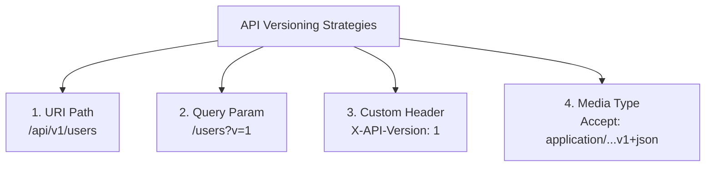

# REST API Versioning: Phân tích 4 hướng tiếp cận phổ biến và Trade-off

## ⚡ Tóm tắt ngắn (30s)
Khi hệ thống tiến hóa, việc thay đổi cấu trúc API (Breaking Changes) là không thể tránh khỏi. Để đảm bảo các client cũ không bị lỗi, ta cần cài đặt cơ chế kiểm soát phiên bản (**API Versioning**).
Có 4 phương pháp chính được ngành công nghiệp áp dụng thực tế:
1.  **URI Versioning**: `/api/v1/users` (Phổ biến nhất, cực kỳ thân thiện với caching, rõ ràng).
2.  **Query Parameter Versioning**: `/api/users?version=1` (Dễ viết, dễ thay đổi mặc định).
3.  **Custom Header Versioning**: Header `X-API-Version: 1` (Giữ URI sạch đẹp, khó cache ở CDN).
4.  **Media Type / Accept Header (Content Negotiation)**: `Accept: application/vnd.company.v1+json` (Học thuật chuẩn REST nhất, khó kiểm thử và debug).

---

## 🔍 Chi tiết bản chất thực chiến

### 1. Phân tích 4 Phương pháp Versioning



#### 🌐 1. URI Versioning
*   Phiên bản được đặt trực tiếp vào đường dẫn tài nguyên.
*   *Ví dụ*: `GET https://api.myshop.com/v1/products`
*   *Bản chất*: Dễ cấu hình định tuyến (Routing) ở API Gateway. Cực kỳ tối ưu cho các proxy trung gian hoặc CDN lưu bộ đệm (Caching) vì URI là duy nhất cho mỗi phiên bản.

#### 🌐 2. Query Parameter Versioning
*   Phiên bản được định nghĩa qua query string.
*   *Ví dụ*: `GET https://api.myshop.com/products?version=2`
*   *Bản chất*: Thích hợp khi muốn đặt một phiên bản mặc định khi client quên không truyền (fallback logic đơn giản). Tuy nhiên, làm rối cấu trúc query parameter của nghiệp vụ lọc/phân trang.

#### 🌐 3. Custom Header Versioning
*   Sử dụng một HTTP Header tự định nghĩa để mang thông tin phiên bản.
*   *Ví dụ*: `GET /products` kèm Header `X-API-Version: 2`
*   *Bản chất*: Giúp URI luôn sạch và đúng triết lý "Mỗi URI chỉ đại diện cho một tài nguyên duy nhất". Tuy nhiên, gây khó khăn cho việc cache ở CDN vì CDN thường chỉ dựa vào URI làm cache key (phải cấu hình `Vary` header phức tạp).

#### 🌐 4. Media Type Versioning (Content Negotiation)
*   Đặt phiên bản bên trong Header tiêu chuẩn `Accept` hoặc `Content-Type`.
*   *Ví dụ*: `GET /products` kèm Header `Accept: application/vnd.company.v2+json`
*   *Bản chất*: Đây là phương pháp hàn lâm chuẩn RESTful nhất (định nghĩa đại diện của tài nguyên). Giúp ẩn giấu hoàn toàn vết tích version trên URI, nhưng rất khó sử dụng cho các nhà phát triển bên ngoài (khó test trên trình duyệt, khó viết tài liệu).

---

## 💻 Code thực chiến: Triển khai cả 4 cách trong Spring Boot

Spring Boot hỗ trợ cấu hình ánh xạ mapping phiên bản cực kỳ linh hoạt thông qua annotation `@RequestMapping`.

```java
@RestController
public class VersioningController {

    // =========================================================================
    // 1. URI PATH VERSIONING (Phổ biến nhất - Khuyên dùng)
    // =========================================================================
    @GetMapping("/api/v1/data")
    public String getUriV1() {
        return "URI Version 1 data";
    }

    @GetMapping("/api/v2/data")
    public String getUriV2() {
        return "URI Version 2 data";
    }

    // =========================================================================
    // 2. QUERY PARAMETER VERSIONING
    // =========================================================================
    // Điểm hướng request bằng tham số 'params'
    @GetMapping(value = "/api/data", params = "version=1")
    public String getQueryV1() {
        return "Query Param Version 1";
    }

    @GetMapping(value = "/api/data", params = "version=2")
    public String getQueryV2() {
        return "Query Param Version 2";
    }

    // =========================================================================
    // 3. CUSTOM HEADER VERSIONING
    // =========================================================================
    // Điều hướng request bằng thuộc tính 'headers'
    @GetMapping(value = "/api/data", headers = "X-API-VERSION=1")
    public String getHeaderV1() {
        return "Custom Header Version 1";
    }

    @GetMapping(value = "/api/data", headers = "X-API-VERSION=2")
    public String getHeaderV2() {
        return "Custom Header Version 2";
    }

    // =========================================================================
    // 4. MEDIA TYPE VERSIONING (Accept Header / Content Negotiation)
    // =========================================================================
    // Điều hướng request bằng thuộc tính 'produces'
    @GetMapping(value = "/api/data", produces = "application/vnd.company.app-v1+json")
    public String getMediaTypeV1() {
        return "Media Type Version 1";
    }

    @GetMapping(value = "/api/data", produces = "application/vnd.company.app-v2+json")
    public String getMediaTypeV2() {
        return "Media Type Version 2";
    }
}
```

---

## 📊 Bảng so sánh trade-off của 4 chiến lược

| Tiêu chí | URI Versioning | Query Param Versioning | Custom Header | Media Type (Accept) |
| :--- | :--- | :--- | :--- | :--- |
| **Độ phủ thực tế** | **~85% (Cực cao)** | ~5% | ~7% | ~3% (Rất thấp) |
| **Khả năng Cache (CDN)** | **Tốt nhất**. Cache key dựa trực tiếp vào URI. | Khá tốt. Nhưng dễ bị trùng lặp cache nếu param lộn xộn. | Tệ. Đòi hỏi cấu hình `Vary` header rất phức tạp ở Gateway/CDN. | Tệ tương tự Custom Header. |
| **Độ sạch của URI** | Tệ. Phá vỡ tính nhất quán của URI đại diện tài nguyên. | Tệ. Làm rối URL. | **Tốt nhất**. URI không đổi. | **Tốt nhất**. URI không đổi. |
| **Dễ test & Debug** | **Dễ nhất**. Chỉ cần gõ trực tiếp URL lên trình duyệt là chạy. | Rất dễ. | Khó hơn. Phải dùng Postman/cURL để chèn Header. | Khó nhất. Phải đổi Accept header đúng định dạng. |
| **Quản lý Gateway (Routing)** | Rất dễ dàng phân luồng theo Path pattern. | Trung bình. | Khó hơn. Gateway phải đọc sâu vào HTTP Headers. | Khó nhất. |

---

## ⚠️ Common Gotchas & Questions follow-up

* **Cạm bẫy "Phình to mã nguồn" (Code Duplication) khi nâng cấp version**:
  Khi phát triển phiên bản V2, nhiều lập trình viên chọn cách nhân bản (Copy-Paste) toàn bộ Controller, Service, DTO từ V1 sang thư mục v2 để sửa đổi nhanh.
  * *Hệ quả:* Sau một thời gian, dự án phình to gấp đôi. Khi cần sửa một bug logic chung, dev phải sửa ở cả hai thư mục v1 và v2, dẫn đến sót bug và cực kỳ khó bảo trì.
  * *Khắc phục:* **Tách biệt tầng Controller nhưng tái sử dụng tầng Service và Domain**. Chỉ nhân bản DTO (Request/Response) nếu cấu trúc JSON thay đổi. Tầng Service nên chứa các hàm xử lý chung, sử dụng các Adapter hoặc Strategy Pattern để rẽ nhánh logic nghiệp vụ khác biệt giữa V1 và V2 thay vì nhân bản code thô sơ.

* **Câu hỏi đào sâu từ interviewer**: *Nếu ứng dụng của tôi chạy Microservices, tôi nên cấu hình phân luồng API Versioning (Routing) tại API Gateway hay để từng Microservice tự xử lý?*
  * *(Trả lời: Tốt nhất nên cấu hình phân luồng tại **API Gateway** kết hợp với **URI Versioning**.
    Khi client gọi `/api/v1/users`, API Gateway sẽ tự động định hướng (route) request này tới cụm service `user-service-v1`. Khi client gọi `/api/v2/users`, Gateway hướng tới cụm `user-service-v2`.
    Việc này giúp tách rời hoàn toàn mã nguồn của hai phiên bản microservices thành 2 repository hoặc 2 deployment độc lập, cho phép đội phát triển nâng cấp phiên bản mới mà không lo sợ làm ảnh hưởng hay crash dịch vụ cũ đang chạy rất ổn định).*
