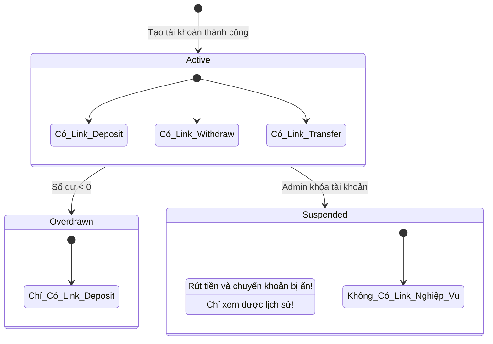

# HATEOAS là gì? Thực tế triển khai và Rào cản trong dự án thực tế

## ⚡ Tóm tắt ngắn (30s)
`HATEOAS (Hypermedia As The Engine Of Application State)` là ràng buộc cao nhất (Level 3) trong mô hình độ chín chắn Richardson của RESTful API.
*   **Bản chất**: Khi client truy vấn một tài nguyên, server trả về dữ liệu kèm theo một danh sách các **liên kết động (hypermedia links)**. Các liên kết này hướng dẫn client biết có thể thực hiện những hành động tiếp theo nào (như cập nhật, xóa, thanh toán) tương ứng với trạng thái hiện tại của tài nguyên đó.
*   **Thực tế**: Cực kỳ ít dự án thương mại thực tế triển khai HATEOAS triệt để. Dù rất đẹp đẽ về mặt lý thuyết (giúp lỏng liên kết giữa Client và Server), HATEOAS lại làm phình to payload phản hồi, tăng độ phức tạp lập trình ở cả hai phía và xung đột với các công cụ tạo tài liệu API hiện đại như Swagger.

---

## 🔍 Chi tiết bản chất thực chiến

### 1. Cách thức hoạt động của HATEOAS qua sơ đồ trạng thái

Hãy tưởng tượng một hệ thống quản lý tài khoản ngân hàng. Trạng thái của tài khoản quyết định những hành động tiếp theo client có thể làm:



*   **Không có HATEOAS**: Client (Mobile App) phải tự code cứng logic: `if (account.status == 'OVERDRAWN') { disableButtonWithdraw() }`. Nếu server thay đổi luật kinh doanh, lập trình viên buộc phải cập nhật code mobile app và yêu cầu người dùng update ứng dụng trên App Store.
*   **Có HATEOAS**: Client chỉ việc duyệt mảng links trả về từ API. Nếu thấy có link `rel="withdraw"` thì hiển thị nút rút tiền và gửi request lên URI động đó. Nếu không thấy, tự động ẩn nút rút tiền. Logic nghiệp vụ hoàn toàn nằm tập trung ở Server!

---

## 💻 Code thực chiến: BAD vs GOOD

### ❌ BAD: Trả về JSON tĩnh truyền thống (Level 2)
Client nhận dữ liệu thô và phải tự quyết định xem bước tiếp theo mình có thể gọi những API nào dựa trên tài liệu mô tả API tĩnh (Swagger).

```json
{
  "id": 1002,
  "accountNumber": "ACC-888999",
  "balance": -50.0,
  "status": "OVERDRAWN"
}
```

###  GOOD: Triển khai HATEOAS động bằng Spring HATEOAS
Server tự động phân tích trạng thái tài khoản và đính kèm các đường dẫn hành động phù hợp tương ứng với trạng thái thực tế của dữ liệu.

```java
import org.springframework.hateoas.EntityModel;
import org.springframework.hateoas.Link;
import org.springframework.hateoas.server.mvc.WebMvcLinkBuilder;
import static org.springframework.hateoas.server.mvc.WebMvcLinkBuilder.*;

@RestController
@RequestMapping("/api/v1/accounts")
public class AccountController {

    private final AccountService accountService;

    public AccountController(AccountService accountService) {
        this.accountService = accountService;
    }

    @GetMapping("/{id}")
    public ResponseEntity<EntityModel<AccountResponseDto>> getAccountById(@PathVariable Long id) {
        AccountResponseDto account = accountService.findById(id);
        
        // Tạo EntityModel để bọc dữ liệu
        EntityModel<AccountResponseDto> model = EntityModel.of(account);
        
        // 1. Link tự tham chiếu mặc định (Self Link)
        Link selfLink = linkTo(methodOn(AccountController.class).getAccountById(id)).withSelfRel();
        model.add(selfLink);

        // 2. Phân tích trạng thái dữ liệu để đính kèm link động
        if ("ACTIVE".equals(account.getStatus())) {
            // Cho phép gửi tiền, rút tiền, và chuyển khoản
            model.add(linkTo(methodOn(AccountController.class).deposit(id, null)).withRel("deposit"));
            model.add(linkTo(methodOn(AccountController.class).withdraw(id, null)).withRel("withdraw"));
            model.add(linkTo(methodOn(AccountController.class).transfer(id, null)).withRel("transfer"));
        } 
        else if ("OVERDRAWN".equals(account.getStatus())) {
            // Đang nợ tiền: Chỉ cho phép nạp thêm tiền để trả nợ, khóa chuyển khoản và rút tiền
            model.add(linkTo(methodOn(AccountController.class).deposit(id, null)).withRel("deposit"));
        }
        
        // Nếu SUSPENDED: Không đính kèm bất kỳ link giao dịch nào!

        return ResponseEntity.ok(model);
    }

    @PostMapping("/{id}/deposit")
    public ResponseEntity<Void> deposit(@PathVariable Long id, @RequestBody Double amount) { ... }

    @PostMapping("/{id}/withdraw")
    public ResponseEntity<Void> withdraw(@PathVariable Long id, @RequestBody Double amount) { ... }

    @PostMapping("/{id}/transfer")
    public ResponseEntity<Void> transfer(@PathVariable Long id, @RequestBody TransferRequest req) { ... }
}
```

---

## 📊 Trade-off: Tại sao HATEOAS ít được dùng trong thực tế?

| Lý do kỹ thuật | Bản chất rào cản thực tế |
| :--- | :--- |
| **Độ phức tạp Client tăng vọt** | Frontend developer lười parse JSON động. Thay vì gọi một hàm tĩnh định sẵn `axios.post('/api/accounts/123/withdraw')`, họ buộc phải duyệt mảng `links` để tìm object có `rel: "withdraw"` rồi lấy trường `href` để gọi. Điều này làm code frontend dài dòng và khó kiểm thử hơn. |
| **Phình to Payload (Overhead)** | Các URI kèm siêu dữ liệu (metadata) lặp đi lặp lại chiếm rất nhiều dung lượng mạng. Đối với các hệ thống yêu cầu độ trễ cực thấp (High-frequency trading) hoặc ứng dụng mobile ở vùng mạng yếu, việc gửi thêm hàng trăm byte links vô dụng ở mỗi request là một sự lãng phí băng thông lớn. |
| **Khó tương thích với OpenAPI / Swagger** | Các công cụ tự động sinh tài liệu như Swagger UI hoặc Springdoc-openapi hoạt động tối ưu dựa trên cấu trúc API tĩnh. Việc sinh tài liệu tự động và giao diện test tương tác cho các link sinh động từ HATEOAS là cực kỳ khó khăn và thiếu sự hỗ trợ của các thư viện mã nguồn mở. |
| **Chuyển dịch sự phụ thuộc (Coupling)** | HATEOAS hứa hẹn giúp lỏng liên kết vì client không cần biết trước URI. Tuy nhiên, client vẫn phải **phụ thuộc cứng vào tên định danh quan hệ (Relationship Name - `rel`)** như `withdraw` hay `deposit`. Nếu server đổi tên `withdraw` thành `debit`, client vẫn bị lỗi bình thường. |

---

## ⚠️ Common Gotchas & Questions follow-up

* **Cạm bẫy "Bảo mật lỏng lẻo" do tin tưởng tuyệt đối vào HATEOAS**:
  Nhiều lập trình viên ngây thơ nghĩ rằng: "Vì tài khoản bị khóa (`SUSPENDED`), server không trả về link `withdraw` trong response HATEOAS, do đó client không thể hiển thị nút rút tiền và hệ thống an toàn tuyệt đối".
  * *Hệ quả:* Kẻ tấn công hoặc một client tự viết mã nguồn ngoài không thèm dùng giao diện chính thống, họ biết trước URI của API rút tiền là `/api/v1/accounts/123/withdraw` và gửi thẳng request POST lên server $\r\rightarrow$ Rút tiền thành công từ tài khoản bị khóa!
  * *Khắc phục:* **HATEOAS chỉ phục vụ cho việc điều hướng hiển thị giao diện ở Client, tuyệt đối không được dùng thay thế cho việc xác thực quyền hạn ở Server**. Ở server, tại controller rút tiền, vẫn bắt buộc phải kiểm tra lại trạng thái tài khoản trong Database một cách nghiêm ngặt trước khi thực hiện giao dịch.

* **Câu hỏi đào sâu từ interviewer**: *HATEOAS thực sự mang lại giá trị lớn nhất trong kịch bản kiến trúc hệ thống nào?*
  * *(Trả lời: HATEOAS mang lại giá trị thực sự khổng lồ đối với các **Hệ sinh thái API mở (Public API)** quy mô toàn cầu dành cho hàng triệu bên thứ ba tích hợp độc lập (ví dụ điển hình là **PayPal API** hoặc **Stripe API**).
    Với các hệ thống này, khi nhà phát hành nâng cấp hoặc cấu trúc lại đường dẫn URL của dịch vụ (ví dụ: chuyển dịch cụm máy chủ thanh toán), các ứng dụng của đối tác đã tích hợp trước đó sẽ tự động đi theo liên kết dynamic mới mà không bị crash hệ thống và không đòi hỏi đối tác phải viết lại hay cấu hình lại mã nguồn của họ).*
