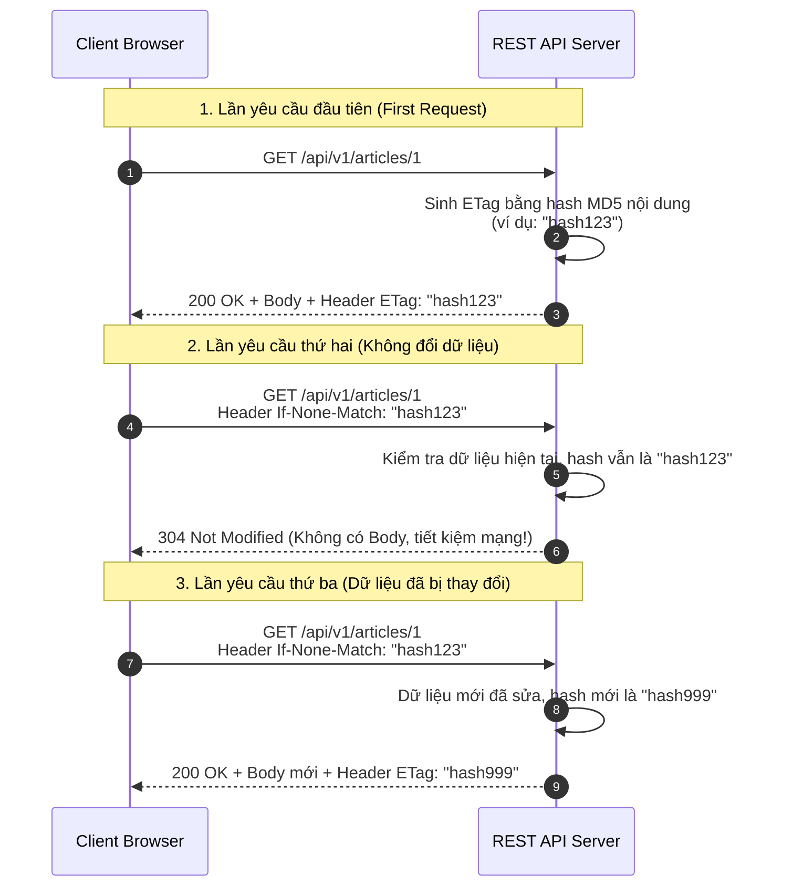

# ETag (Entity Tag) và Vai trò trong Caching / Optimistic Concurrency Control

## ⚡ Tóm tắt ngắn (30s)
`ETag (Entity Tag)` là một mã định danh duy nhất (thường là mã hash MD5/SHA-256 từ nội dung) đại diện cho **phiên bản cụ thể của một tài nguyên** tại thời điểm được truy vấn.
*   **Ứng dụng 1 - HTTP Caching (304 Not Modified)**: Server gửi ETag cho Client. Lần sau, Client gửi kèm ETag này trong Header `If-None-Match`. Nếu dữ liệu chưa đổi, Server chỉ trả về `304 Not Modified` không có body, giúp tiết kiệm tối đa băng thông.
*   **Ứng dụng 2 - Chống ghi đè trùng lặp (Optimistic Concurrency Control - OCC)**: Client gửi request cập nhật kèm ETag cũ trong Header `If-Match`. Nếu ETag của tài nguyên trong DB đã bị người khác thay đổi trước đó, Server lập tức từ chối bằng lỗi `412 Precondition Failed` để ngăn chặn việc ghi đè đè đè dữ liệu cũ lên mới (Lost Update Problem).

---

## 🔍 Chi tiết bản chất thực chiến

### 1. Quy trình HTTP Caching sử dụng ETag



### 2. Quy trình ngăn chặn Lost Update (Optimistic Concurrency Control)
Khi hai người dùng cùng cố gắng sửa đổi một tài nguyên tại một thời điểm:
1.  **Client A** và **Client B** cùng GET thông tin tài sản sản phẩm ID 42 có `ETag: "version_1"`.
2.  **Client A** bấm sửa tên sản phẩm và gửi request PATCH kèm Header `If-Match: "version_1"`.
    *   Server thấy ETag hiện tại trong DB vẫn là `"version_1"`, khớp hoàn toàn.
    *   Server cập nhật thành công sản phẩm, đồng thời tự động tăng ETag lên `"version_2"`.
3.  **Client B** chậm chân hơn 1 giây, bấm sửa giá sản phẩm và gửi request PATCH kèm Header `If-Match: "version_1"`.
    *   Server kiểm tra thấy ETag hiện tại trong DB đã là `"version_2"`, **lệch hoàn toàn** với `"version_1"` của Client B.
    *   Server lập tức dừng transaction, rollback dữ liệu và trả về lỗi **`412 Precondition Failed`**.
    *   Client B buộc phải tải lại dữ liệu mới nhất (vừa được sửa bởi A) rồi mới thực hiện sửa tiếp. Tránh hoàn toàn việc giá trị sửa đổi của B vô tình ghi đè mất tên sản phẩm A vừa sửa.

---

## 💻 Code thực chiến: Cấu hình ETag & Optimistic Lock trong Spring Boot

### 1. Cấu hình Filter tự động sinh ETag cho mọi phản hồi HTTP
Spring Boot cung cấp sẵn một bộ lọc `ShallowEtagHeaderFilter` giúp tự động hash nội dung của response body và đính kèm ETag Header mà bạn không cần tự code tay ở từng Controller.

```java
@Configuration
public class ETagConfig {

    // Đăng ký Filter tự động sinh ETag cho toàn bộ ứng dụng
    @Bean
    public FilterRegistrationBean<ShallowEtagHeaderFilter> etagFilter() {
        FilterRegistrationBean<ShallowEtagHeaderFilter> filterRegistration = new FilterRegistrationBean<>();
        filterRegistration.setFilter(new ShallowEtagHeaderFilter());
        filterRegistration.addUrlPatterns("/api/v1/products/*"); // Chỉ áp dụng cho các API cần cache
        return filterRegistration;
    }
}
```

### 2. Xử lý Optimistic Lock (OCC) kết hợp với JPA @Version và ETag
Ở tầng Database, ta sử dụng thuộc tính `@Version` của JPA Hibernate. Tầng Controller sẽ bắt ngoại lệ và trả về mã lỗi HTTP 412 chuẩn chỉ.

```java
// 1. Entity sử dụng @Version của JPA để kích hoạt Optimistic Lock dưới DB
@Entity
@Table(name = "products")
public class Product {
    @Id
    private Long id;
    
    private String name;
    private Double price;

    @Version // Hibernate tự động tăng số này mỗi khi có UPDATE thành công
    private Long version;
    
    // Getters, Setters...
}

// 2. Controller xử lý cập nhật an toàn với If-Match Header
@RestController
@RequestMapping("/api/v1/products")
public class ProductController {

    private final ProductRepository productRepository;

    public ProductController(ProductRepository productRepository) {
        this.productRepository = productRepository;
    }

    @PatchMapping("/{id}")
    public ResponseEntity<?> updateProduct(
            @PathVariable Long id,
            @RequestHeader(value = "If-Match", required = false) String ifMatchHeader,
            @RequestBody ProductDto updateDto
    ) {
        if (ifMatchHeader == null || ifMatchHeader.isBlank()) {
            return ResponseEntity.status(HttpStatus.BAD_REQUEST)
                    .body("Missing If-Match header for optimistic concurrency control");
        }

        // Parse ETag từ Header (ETag thường có dạng "version" hoặc W/"version")
        String cleanETag = ifMatchHeader.replace("\"", "").replace("W/", "");
        Long requestVersion = Long.parseLong(cleanETag);

        Product product = productRepository.findById(id)
                .orElseThrow(() -> new ResourceNotFoundException("Product not found"));

        // Kiểm tra khớp phiên bản thủ công trước khi ghi (Bảo vệ sớm)
        if (!product.getVersion().equals(requestVersion)) {
            return ResponseEntity.status(HttpStatus.PRECONDITION_FAILED)
                    .body("Conflict detected: Product was updated by another transaction. Please reload.");
        }

        // Thực hiện cập nhật
        product.setName(updateDto.getName());
        product.setPrice(updateDto.getPrice());
        
        try {
            Product saved = productRepository.save(product);
            return ResponseEntity.ok()
                    .eTag(saved.getVersion().toString()) // Trả về ETag mới
                    .body(saved);
        } catch (ObjectOptimisticLockingFailureException ex) {
            // Trường hợp race-condition vượt qua bước check IF ở trên và bị chặn ở tầng DB Transaction
            return ResponseEntity.status(HttpStatus.PRECONDITION_FAILED)
                    .body("Optimistic Lock failed: Database blocked the update due to concurrent modification.");
        }
    }
}
```

---

## 📊 Trade-off: Strong ETag vs Weak ETag

Có hai loại ETag được định nghĩa trong tiêu chuẩn HTTP:

| Tiêu chí | Strong ETag | Weak ETag (Định dạng: `W/"xyz"`) |
| :--- | :--- | :--- |
| **Độ chính xác** | **Tuyệt đối**. Đòi hỏi từng byte trong file/body phải giống hệt nhau 100%. | **Tương đối**. Cho phép dữ liệu có sai lệch nhỏ về cấu trúc nhưng ngữ nghĩa nội dung không đổi. |
| **Cách tính toán** | Thường chạy hash toàn bộ file/body phản hồi (tiêu tốn tài nguyên CPU của Server). | Sử dụng các thuộc tính meta-data như thời gian sửa đổi cuối cùng (`Last-Modified`) hoặc số version. |
| **Hỗ trợ Byte-range requests** | **Có**. Rất tốt cho việc tải file lớn chập chờn (tải dở dang được tiếp tục). | Không hỗ trợ. |
| **Hiệu năng Server** | Chậm hơn do phải lưu trữ đệm và chạy thuật toán băm (MD5/SHA) nội dung lớn. | Nhanh hơn nhờ thuật toán tính toán nhẹ nhàng. |

---

## ⚠️ Common Gotchas & Questions follow-up

* **Cạm bẫy "Hiệu năng giả tạo" (Shallow ETag Overhead)**:
  Nhiều dev lầm tưởng việc dùng `ShallowEtagHeaderFilter` giúp tăng hiệu năng xử lý của Server.
  * *Bản chất thực tế:* Shallow ETag chỉ giúp **tiết kiệm băng thông mạng (Network Bandwidth)**. Ở server, Spring Boot vẫn phải chạy đầy đủ logic nghiệp vụ, vẫn phải query Database, vẫn phải render toàn bộ DTO thành JSON. Chỉ ở giây cuối cùng trước khi gửi đi, Filter mới hash JSON đó để xem có khớp với ETag cũ hay không để quyết định gửi `304` hay `200`. Do đó, tài nguyên CPU và Database của server không hề giảm đi chút nào!
  * *Khắc phục:* Nếu muốn bảo vệ và tối ưu tối đa tài nguyên cho Server (CPU/Database), bắt buộc phải sử dụng **Deep ETag**. Server sẽ query trước trường `version` hoặc `updatedAt` của bản ghi trong DB. Nếu giá trị khớp với ETag trong header, server lập tức trả về `304 Not Modified` ngay lập tức mà không cần query thêm các bảng liên quan hay chạy logic tính toán nghiệp vụ đắt đỏ.

* **Câu hỏi đào sâu từ interviewer**: *Nếu ứng dụng của tôi chạy ở môi trường phân tán qua Load Balancer (Nhiều instances khác nhau), việc dùng ETag có gặp lỗi không?*
  * *(Trả lời: Nếu ETag được tạo ra dựa trên các yếu tố phụ thuộc máy chủ cụ thể (ví dụ: File Inode number trên hệ điều hành), thì khi Request gửi sang instance khác, ETag tính ra sẽ bị khác đi, làm mất tác dụng của cache.
    Do đó, để chạy ổn định trong môi trường phân tán, ETag bắt buộc phải được tính toán dựa hoàn toàn trên **Nội dung thuần túy của dữ liệu (Content Hash)** hoặc **Giá trị phiên bản duy nhất lưu trong DB (@Version)**, đảm bảo tất cả các instances tính ra giá trị ETag hoàn toàn đồng nhất).*
