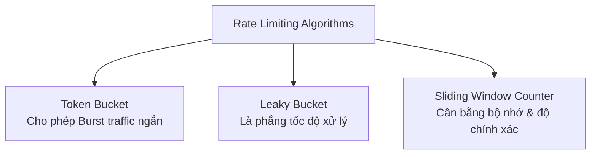

# Rate Limiting: Thiết kế Thuật toán và Hạ tầng Giới hạn Tần suất ở Quy mô lớn

## ⚡ Tóm tắt ngắn (30s)
**Rate Limiting (Giới hạn tần suất)** là cơ chế kiểm soát số lượng yêu cầu (requests) mà một Client có thể gửi lên hệ thống trong một khoảng thời gian nhất định nhằm bảo vệ dịch vụ khỏi các đòn tấn công DDoS, tránh quá tải tài nguyên (Resource Exhaustion) và quản lý chi phí vận hành.
*   **5 thuật toán kinh điển**: Token Bucket (Thùng thẻ), Leaky Bucket (Thùng rò), Fixed Window Counter (Bộ đếm cửa sổ cố định), Sliding Window Log (Nhật ký cửa sổ trượt), và Sliding Window Counter (Bộ đếm cửa sổ trượt).
*   **Hạ tầng thực tế**: 
    *   *Single instance*: Sử dụng thư viện in-memory như **Bucket4j** (Java) hoặc Guava RateLimiter.
    *   *Distributed (Kiến trúc phân tán)*: Triển khai ở mức **API Gateway** (như Kong, Nginx) hoặc tự thiết kế bộ lọc tích hợp **Redis + Lua Script** để đảm bảo tính nguyên tử (Atomicity) ở tốc độ cao.

---

## 🔍 Chi tiết bản chất thực chiến

### 1. Phân tích 3 thuật toán phổ biến nhất



#### 🔹 1. Token Bucket (Thùng thẻ)
*   **Cơ chế**: Một thùng chứa có dung lượng tối đa $C$. Cứ sau mỗi giây, hệ thống tự động bổ sung vào thùng $R$ token. Mỗi request gửi lên tiêu tốn 1 token. Nếu thùng hết token, request bị từ chối.
*   **Ưu điểm**: Cho phép xử lý **burst traffic** (lượng truy cập tăng đột biến trong thời gian cực ngắn) miễn là lượng token tích lũy trong thùng còn đủ.
*   **Ứng dụng**: Phổ biến nhất (Spring Cloud Gateway, Bucket4j sử dụng thuật toán này).

#### 🔹 2. Leaky Bucket (Thùng rò)
*   **Cơ chế**: Request đi vào một hàng đợi (Queue) có kích thước cố định giống như nước chảy vào xô. Ở đáy xô có một lỗ rò khiến nước thoát ra ngoài (request được xử lý) với một tốc độ không đổi $V$. Nếu nước tràn xô (hàng đợi đầy), request mới lập tức bị loại bỏ.
*   **Ưu điểm**: Tạo ra tốc độ xử lý đầu ra **hoàn toàn ổn định và trơn tru** (Traffic Shaping).
*   **Ứng dụng**: Thích hợp cho các luồng xử lý bất đồng bộ, ghi nhận log hệ thống.

#### 🔹 3. Sliding Window Counter (Bộ đếm cửa sổ trượt)
*   **Cơ chế**: Kết hợp giữa Fixed Window (nhanh, tiết kiệm RAM nhưng bị lỗi spike ở biên cửa sổ) và Sliding Window Log (chính xác tuyệt đối nhưng tốn RAM khủng khiếp). Thuật toán ước lượng tỷ lệ request hiện tại dựa trên số lượng đếm của cửa sổ hiện tại và cửa sổ ngay trước đó.
*   **Ưu điểm**: Khắc phục hoàn toàn lỗi spike ở biên cửa sổ cố định mà chỉ tiêu tốn 2 bộ đếm (counters) cực kỳ tiết kiệm bộ nhớ.

---

## 💻 Code thực chiến: Triển khai Phân tán bằng Redis + Lua Script

Trong hệ thống phân tán đa máy chủ (Multi-instances), việc tự đọc ghi đếm số lượng trong Redis bằng Java code thông thường dễ dẫn đến lỗi **Race Condition** (hai instances cùng đọc ra biến đếm là 9, cùng tăng lên 10 và cho phép vượt ngưỡng dù thực tế đã là 11). 
Để đảm bảo tính nguyên tử tuyệt đối mà không cần dùng khóa phân tán (Distributed Lock) gây chậm hệ thống, ta sử dụng **Lua Script** chạy trực tiếp và khép kín bên trong RAM của Redis Engine.

### Implementation: Dynamic Rate Limiter bằng Redis + Lua Script

```java
@Component
public class DistributedRateLimiter {

    private final StringRedisTemplate redisTemplate;
    private final RedisScript<Long> rateLimitScript;

    public DistributedRateLimiter(StringRedisTemplate redisTemplate) {
        this.redisTemplate = redisTemplate;
        // Load đoạn script Lua nguyên tử
        this.rateLimitScript = RedisScript.of(getLuaScript(), Long.class);
    }

    /**
     * Kiểm tra xem request của Client có vượt quá giới hạn tần suất hay không
     * @param clientKey Định danh client (IP, User ID, hoặc API Key)
     * @param maxRequest Số lượng request tối đa trong cửa sổ
     * @param windowSeconds Độ rộng của cửa sổ thời gian (giây)
     * @return true nếu request được phép đi tiếp, false nếu bị chặn (Rate Limited)
     */
    public boolean isAllowed(String clientKey, int maxRequest, int windowSeconds) {
        String key = "rate_limit:" + clientKey;
        
        // Thực thi Lua Script trong Redis
        // Keys: [key], Args: [maxRequest, windowSeconds]
        Long result = redisTemplate.execute(
                rateLimitScript,
                Collections.singletonList(key),
                String.valueOf(maxRequest),
                String.valueOf(windowSeconds)
        );

        return result != null && result == 1L; // 1 nghĩa là ALLOWED, 0 là BLOCKED
    }

    private String getLuaScript() {
        return "local key = KEYS[1] " +
               "local limit = tonumber(ARGV[1]) " +
               "local window = tonumber(ARGV[2]) " +
               
               "local current = redis.call('get', key) " +
               "if current and tonumber(current) >= limit then " +
               "    return 0 -- Bị chặn (Blocked) " +
               "end " +
               
               "if not current then " +
               "    redis.call('set', key, 1, 'EX', window) " +
               "else " +
               "    redis.call('incr', key) " +
               "end " +
               "return 1 -- Được phép (Allowed)";
    }
}

// Bộ lọc chặn request và trả về lỗi 429 Too Many Requests chuẩn REST
@Component
public class RateLimitInterceptor implements HandlerInterceptor {

    private final DistributedRateLimiter rateLimiter;

    public RateLimitInterceptor(DistributedRateLimiter rateLimiter) {
        this.rateLimiter = rateLimiter;
    }

    @Override
    public boolean preHandle(HttpServletRequest request, HttpServletResponse response, Object handler) throws Exception {
        String clientIp = request.getRemoteAddr(); // Phân loại theo IP của client
        
        // Quy định: Tối đa 60 requests trong 1 phút (60 giây)
        boolean allowed = rateLimiter.isAllowed(clientIp, 60, 60);
        
        if (!allowed) {
            response.setStatus(429); // Too Many Requests
            response.setContentType("application/json");
            response.getWriter().write("{\"error\": \"Too many requests. Please try again after 1 minute.\"}");
            return false; // Chặn đứng request tại đây
        }
        
        return true; // Cho phép đi tiếp vào Controller
    }
}
```

---

## 📊 So sánh các thuật toán Rate Limiting

| Thuật toán | Ưu điểm | Nhược điểm | Kịch bản sử dụng phù hợp |
| :--- | :--- | :--- | :--- |
| **Token Bucket** | Xử lý tốt burst traffic, cấu trúc in-memory cực kỳ nhẹ nhàng. | Cần cơ chế cập nhật token định kỳ (hoặc tính toán lazy bổ sung token). | **API Gateway, Web Service đa dụng**. |
| **Leaky Bucket** | Là phẳng các đỉnh traffic đầu ra, bảo vệ tuyệt đối các downstream services chậm chạp. | Có độ trễ (delay) cho các request bình thường nếu hàng đợi bị đầy. | **Các hệ thống thanh toán, đẩy message lên Queue**. |
| **Fixed Window** | Dễ hiểu nhất, chi phí bộ nhớ tối thiểu (chỉ lưu 1 key counter). | Bị lỗi spike ở biên cửa sổ (cho phép gấp đôi lượng traffic đi qua ở giây giao mùa). | Hệ thống nhỏ, cấu trúc đơn giản, ít chịu tải lớn. |
| **Sliding Window Counter** | Độ chính xác cao, giải quyết triệt để lỗi biên cửa sổ của Fixed Window mà vẫn cực kỳ tiết kiệm bộ nhớ. | Độ chính xác chỉ mang tính ước lượng (khoảng 99%). | **Hệ thống phân tán quy mô lớn thương mại**. |

---

## ⚠️ Common Gotchas & Questions follow-up

* **Cạm bẫy "Lựa chọn khóa định danh sai cách"**:
  Nếu bạn chỉ đơn thuần dùng `request.getRemoteAddr()` (IP) làm key định danh để Rate Limit:
  * *Hệ quả:* Hàng ngàn nhân viên trong một tòa nhà văn phòng lớn đều đi qua một cổng NAT Gateway và dùng chung một IP Public. Hệ thống của bạn sẽ coi toàn bộ tòa nhà đó là **1 client** duy nhất. Chỉ cần vài nhân viên duyệt web nhanh, toàn bộ tòa nhà sẽ bị khóa 429 oan uổng!
  * *Khắc phục:* Đối với các API yêu cầu đăng nhập, bắt buộc phải sử dụng **User ID** hoặc **API Key** làm khóa định danh Rate Limit. Chỉ sử dụng IP đối với các API Public (không đăng nhập) và phải phối hợp cấu hình nhận diện IP Public thực tế qua header `X-Forwarded-For` từ Load Balancer truyền xuống.

* **Câu hỏi đào sâu từ interviewer**: *Nếu Redis cluster của tôi bị crash hoặc mất kết nối đột ngột, Rate Limiter phân tán của bạn sẽ phản ứng thế nào? Bạn sẽ chọn chặn đứng 100% traffic (Fail-closed) hay cho phép tất cả đi qua (Fail-open)?*
  * *(Trả lời: Đây là bài toán đánh đổi kinh điển giữa **Availability (Tính sẵn sàng)** và **Security/Stability (Tính ổn định hệ thống)**.
    Trong thực tế dự án thương mại, ta bắt buộc phải cấu hình **Fail-open**. 
    Tại khối catch khi kết nối Redis lỗi, ta ghi log lỗi cảnh báo hệ thống giám sát và cho phép request đi tiếp vào Controller bình thường.
    *Lý do:* Việc sập cache không được phép kéo theo sập toàn bộ trải nghiệm của người dùng bình thường. Để giảm thiểu rủi ro khi hệ thống mở cửa tự do (Fail-open), ta nên có một lớp bảo vệ dự phòng phụ (Local Rate Limiter bằng Bucket4j) chạy in-memory tại từng instance độc lập để gánh đỡ tạm thời).*
