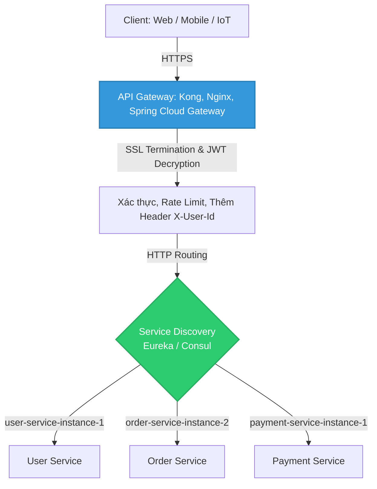

# Vai trò và Nhiệm vụ của API Gateway trong kiến trúc Microservices

## ⚡ Tóm tắt ngắn (30s)
Trong kiến trúc **Microservices (Dịch vụ nhỏ)**, một hệ thống có thể chứa hàng chục đến hàng trăm dịch vụ nội bộ độc lập. **API Gateway** đóng vai trò là **cửa ngõ duy nhất (Single Entry Point)** đứng trước toàn bộ hệ thống để tiếp nhận và điều phối mọi yêu cầu từ Client.
*   **Các nhiệm vụ cốt lõi**:
    *   *Routing (Định tuyến)*: Điều hướng request tới đúng microservice đích.
    *   *Security (Bảo mật)*: Xác thực Token (JWT), SSL Termination, và chặn đứng mã độc sớm.
    *   *Cross-cutting Concerns (Xử lý chung)*: Rate Limiting, Logging, Cors, Distributed Tracing (Correlation ID).
    *   *Resilience (Độ bền bỉ)*: Circuit Breaker, Retries, và Fallback.

---

## 🔍 Chi tiết bản chất thực chiến

### 1. Phác thảo Sơ đồ Kiến trúc API Gateway

Thay vì để Client trực tiếp kết nối với từng microservice (gây phơi bày địa chỉ IP nội bộ và phức tạp hóa việc chứng thực), API Gateway làm trung gian điều phối toàn bộ luồng traffic:



### 2. Các tính năng kỹ thuật tối quan trọng của API Gateway

1.  **SSL Termination (Giải mã SSL)**:
    API Gateway đảm nhận nhiệm vụ giải mã các kết nối HTTPS mã hóa từ Client bên ngoài. Khi đi qua Gateway vào mạng nội bộ (Internal Network), traffic sẽ được chuyển thành HTTP thông thường (hoặc gRPC/mTLS). Điều này giải phóng một lượng lớn tài nguyên CPU cho các microservices nội bộ khỏi việc giải mã HTTPS liên tục.
2.  **Centralized Authentication (Xác thực tập trung)**:
    Gateway bắt và giải mã mã độc/JWT token gửi từ client, xác thực chữ ký (Signature). Nếu token hợp lệ, Gateway tự động trích xuất các thông tin cốt lõi (User ID, Roles) và đính kèm vào HTTP Header dưới dạng bản rõ (ví dụ: `X-User-Id: 999`, `X-User-Roles: ADMIN`) rồi truyền xuống các microservices nội bộ.
    *   *Lợi ích*: Các service nội bộ chỉ việc đọc header có sẵn để xử lý logic nghiệp vụ, hoàn toàn không cần viết lại code giải mã hay xác thực JWT trùng lặp ở từng dự án.
3.  **Bảo vệ mạng nội bộ (IP Whitelisting)**:
    Toàn bộ microservices phía sau được triển khai trong mạng ảo riêng tư (Private Subnet). Các microservices chỉ chấp nhận các kết nối đi từ IP duy nhất của API Gateway. Kẻ tấn công bên ngoài không có cách nào quét thấy hay gửi request trực tiếp tới các service này.

---

## 💻 Code thực chiến: Cấu hình Định tuyến & Bộ lọc bằng Spring Cloud Gateway

Spring Cloud Gateway là framework gateway mạnh mẽ hàng đầu trong hệ sinh thái Java, tích hợp sâu sắc với Spring Boot.

### Cấu hình file `application.yml` định tuyến và thêm filter an toàn

```yaml
spring:
  cloud:
    gateway:
      routes:
        # 1. Định tuyến cho User Service
        - id: user_service_route
          uri: lb://user-service # Sử dụng Load Balancer để tự động gọi qua Eureka Discovery
          predicates:
            - Path=/api/v1/users/**
          filters:
            # Tự động loại bỏ tiền tố nếu cần (ở đây vẫn giữ nguyên path)
            - AddRequestHeader=X-Source-Gateway, Spring-Cloud-Gateway

        # 2. Định tuyến cho Order Service kèm Xác thực & Circuit Breaker
        - id: order_service_route
          uri: lb://order-service
          predicates:
            - Path=/api/v1/orders/**
          filters:
            # Thêm filter xử lý lỗi tự động (Circuit Breaker) sử dụng Resilience4j
            - name: CircuitBreaker
              args:
                name: orderServiceCircuitBreaker
                fallbackUri: forward:/fallback/order-service-error
            
            # Rate Limiting phân tán sử dụng Redis cho riêng route này
            - name: RequestRateLimiter
              args:
                redis-rate-limiter.replenishRate: 10 # Bổ sung 10 tokens/giây
                redis-rate-limiter.burstCapacity: 20 # Sức chứa tối đa 20 tokens
                key-resolver: "#{@userKeyResolver}" # Bean định danh User
```

### Triển khai custom Gateway Filter để giải mã JWT và tiêm Header `X-User-Id`

```java
@Component
public class JwtAuthenticationFilter extends AbstractGatewayFilterFactory<JwtAuthenticationFilter.Config> {

    private final JwtTokenProvider jwtTokenProvider;

    public JwtAuthenticationFilter(JwtTokenProvider jwtTokenProvider) {
        super(Config.class);
        this.jwtTokenProvider = jwtTokenProvider;
    }

    public static class Config {
        // Chứa các tham số cấu hình nếu cần
    }

    @Override
    public GatewayFilter apply(Config config) {
        return (exchange, chain) -> {
            ServerHttpRequest request = exchange.getRequest();

            // 1. Kiểm tra sự tồn tại của Authorization Header
            if (!request.getHeaders().containsKey(HttpHeaders.AUTHORIZATION)) {
                return onError(exchange, "Missing Authorization Header", HttpStatus.UNAUTHORIZED);
            }

            String authHeader = request.getHeaders().getFirst(HttpHeaders.AUTHORIZATION);
            if (authHeader == null || !authHeader.startsWith("Bearer ")) {
                return onError(exchange, "Invalid Authorization Header Format", HttpStatus.UNAUTHORIZED);
            }

            String token = authHeader.substring(7);

            // 2. Xác thực tính hợp lệ của Token JWT
            if (!jwtTokenProvider.validateToken(token)) {
                return onError(exchange, "Token is expired or invalidSignature", HttpStatus.UNAUTHORIZED);
            }

            // 3. Trích xuất User ID từ Token Claims
            String userId = jwtTokenProvider.getUserIdFromToken(token);

            // 4. Đột biến Request (Mutate): Tiêm thêm Header X-User-Id bản rõ để truyền xuống microservice nội bộ
            ServerHttpRequest mutatedRequest = request.mutate()
                    .header("X-User-Id", userId)
                    .build();

            return chain.filter(exchange.mutate().request(mutatedRequest).build());
        };
    }

    private Mono<Void> onError(ServerWebExchange exchange, String err, HttpStatus status) {
        ServerHttpResponse response = exchange.getResponse();
        response.setStatusCode(status);
        response.getHeaders().setContentType(MediaType.APPLICATION_JSON);
        
        String body = String.format("{\"error\": \"%s\"}", err);
        DataBuffer buffer = response.bufferFactory().wrap(body.getBytes());
        return response.writeWith(Mono.just(buffer));
    }
}
```

---

## 📊 Trade-off: Centralized Gateway vs Decentralized Services

Khi áp dụng API Gateway tập trung, hệ thống phải đối mặt với các trade-off kỹ thuật sau:

| Tiêu chí | Centralized Gateway Architecture | Decentralized (Direct Connection) |
| :--- | :--- | :--- |
| **Bảo mật mạng (Security)** | **Cực tốt**. Ẩn giấu hoàn toàn mạng nội bộ, chỉ expose 1 cổng duy nhất. | Rủi ro cao. Phải expose tất cả IPs và Ports của microservices ra internet. |
| **Quản lý Code (Maintenance)** | Code sạch. Logic auth, cors, rate limit nằm tập trung tại gateway. | Cực hình. Từng service nội bộ phải tự code, tự cập nhật thư viện bảo mật liên tục. |
| **Độ trễ hệ thống (Latency)** | **Chậm hơn một chút (Overhead)**. Mỗi request tốn thêm vài mili-giây để đi qua gateway phân luồng. | Nhanh hơn do kết nối trực tiếp. |
| **Điểm sập duy nhất (Single Point of Failure)** | **Nguy cơ cao**. Nếu API Gateway bị sập hoặc quá tải, toàn bộ hệ thống lập tức tê liệt hoàn toàn. | Thấp. Nếu service Order sập, service User vẫn hoạt động độc lập bình thường. |

---

## ⚠️ Common Gotchas & Questions follow-up

* **Cạm bẫy "Single Point of Failure" và cách khắc phục**:
  Để triệt tiêu nguy cơ API Gateway trở thành điểm sập duy nhất làm tê liệt hệ thống, tuyệt đối **không bao giờ được chạy duy nhất 1 thực thể (instance) API Gateway trên production**.
  * *Khắc phục:* Chạy cụm Gateway tối thiểu 3 instances phía sau một bộ tải trọng phần cứng hoặc hạ tầng DNS chịu tải cực tốt (như AWS ALB, Cloudflare Load Balancer). Load Balancer ngoài cùng sẽ làm nhiệm vụ kiểm tra sức khỏe (Health Check) của các instances gateway và điều phối traffic đều đặn.

* **Câu hỏi đào sâu từ interviewer**: *Nếu Gateway giải mã JWT và truyền ID bản rõ qua header `X-User-Id` xuống mạng nội bộ, điều gì ngăn chặn một lập trình viên xấu tính nội bộ giả mạo request tự thêm header `X-User-Id: 1` để truy cập tài khoản Admin?*
  * *(Trả lời: Đây là một kẽ hở bảo mật kinh điển trong mạng nội bộ của Microservices (Zero-Trust Security). Để chặn đứng nguy cơ giả mạo này, ta bắt buộc phải cấu hình **API Gateway luôn luôn tự động xóa (Strip) toàn bộ các Header nhạy cảm do Client bên ngoài tự ý truyền lên** trước khi thực hiện logic tiêm header thực tế.
    Tức là, nếu client gửi lên request mang theo header `X-User-Id: 1`, Gateway sẽ xóa sạch header này trước, sau đó giải mã JWT hợp lệ của client ra ID là `99` rồi mới gán `X-User-Id: 99` vào request chuyển tiếp).*
