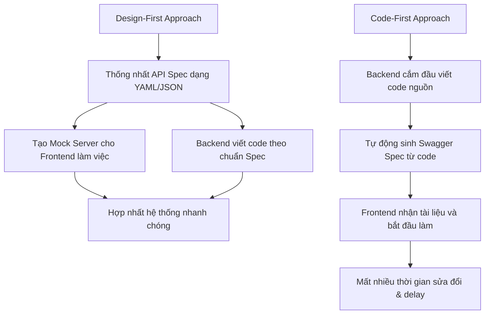

# OpenAPI / Swagger: Thiết kế "Design-First" vs "Code-First" và Quản lý tài liệu API

## ⚡ Tóm tắt ngắn (30s)
Quản lý tài liệu API là bắt buộc để đảm bảo sự phối hợp trơn tru giữa Frontend, Backend, QA và các đối tác tích hợp. **OpenAPI Specification (OAS)** là tiêu chuẩn công nghiệp hàng đầu để mô tả API. Có hai triết lý thiết kế tài liệu chính:
*   **Design-First (Thiết kế trước)**: Lập kế hoạch và viết file cấu hình định nghĩa API (YAML/JSON) trước khi viết code. Giúp các đội song hành làm việc độc lập (Parallel Development) từ sớm, chất lượng API cao hơn, nhưng tốn thời gian thống nhất ban đầu.
*   **Code-First (Code trước)**: Viết code nguồn trước, sau đó sử dụng các công cụ tự động sinh tài liệu từ code (như Springdoc-openapi). Rất nhanh và phù hợp với dự án nhỏ, nhưng dễ dẫn đến API thiết kế cẩu thả và bị bó buộc bởi cấu trúc Database dưới nền.

---

## 🔍 Chi tiết bản chất thực chiến

### 1. Phân tích hai triết lý thiết kế API



#### 📌 A. Triết lý Design-First (Khuyên dùng cho dự án Enterprise)
*   **Cách hoạt động**: Lập trình viên sử dụng các công cụ như Swagger Editor, Stoplight để thiết kế tài liệu API chuẩn chỉ trước. Sau đó dùng **OpenAPI Generator** để tự động tạo ra bộ khung code (Interface, DTOs) cho Java/Spring.
*   **Tại sao nên dùng?**
    1.  *Giao tiếp hoàn hảo*: Frontend và QA tham gia trực tiếp vào việc duyệt thiết kế API trước khi tốn nguồn lực code.
    2.  *Phát triển song song*: Ngay khi chốt file Spec, Frontend có thể chạy Mock Server (bằng Prism, WireMock) để gọi dữ liệu giả lập và làm giao diện, không cần đợi backend code xong.
    3.  *Đóng gói độc lập*: API hoàn toàn tách rời cấu trúc DB, hạn chế tối đa rò rỉ cấu trúc dữ liệu nhạy cảm ra ngoài.

#### 📌 B. Triết lý Code-First
*   **Cách hoạt động**: Dev viết Controller Java như bình thường, bọc các annotation Swagger `@Operation`, `@ApiResponse` lên đầu các hàm. Thư viện `springdoc-openapi-ui` sẽ tự động quét classpath khi chạy ứng dụng và dựng trang Swagger UI.
*   **Tại sao nên dùng?**
    1.  *Nhanh*: Tốc độ ra mắt tính năng (Time-to-market) cực cao ở giai đoạn đầu.
    2.  *Không bao giờ lệch tài liệu (No desync)*: Code thay đổi gì, tài liệu thay đổi đó ngay lập tức.
*   **Điểm yếu**: API thường được thiết kế vội vàng, các trường dữ liệu bị đặt tên lộn xộn, dễ bê nguyên xi cấu trúc Entity Database gửi thẳng về cho Client (anti-pattern lớn).

---

## 💻 Code thực chiến: BAD vs GOOD trong quản lý OpenAPI

### ❌ BAD: Viết tài liệu Code-First làm bẩn mã nguồn (Cluttered Code)
Lạm dụng việc khai báo chi tiết tài liệu bằng annotations trực tiếp trong Controller khiến code nguồn Java trở nên cực kỳ rối rắm. Logic nghiệp vụ bị chôn vùi dưới hàng chục dòng annotations Swagger.

```java
@RestController
@RequestMapping("/api/v1/users")
public class UserBadController {

    private final UserService userService;

    public UserBadController(UserService userService) {
        this.userService = userService;
    }

    // Anti-pattern: Annotations Swagger chiếm 80% độ dài của code, rất khó đọc logic nghiệp vụ!
    @Operation(summary = "Get user by ID", description = "Retrieve detailed information of a user by their unique primary key.")
    @ApiResponses(value = {
            @ApiResponse(responseCode = "200", description = "Found the user",
                    content = { @Content(mediaType = "application/json",
                            schema = @Schema(implementation = UserDto.class)) }),
            @ApiResponse(responseCode = "404", description = "User not found", content = @Content),
            @ApiResponse(responseCode = "500", description = "Internal server error", content = @Content)
    })
    @GetMapping("/{id}")
    public ResponseEntity<UserDto> getUserById(@PathVariable Long id) {
        // Chỉ có đúng 2 dòng logic thực tế!
        UserDto user = userService.findById(id);
        return ResponseEntity.ok(user);
    }
}
```

###  GOOD: Triển khai tách biệt Interface (Design-First API Generation)
Sử dụng Maven/Gradle plugin của OpenAPI Generator để sinh ra các Interface định nghĩa API từ file YAML trước. Controller của bạn chỉ việc `implement` interface này để viết code nghiệp vụ sạch sẽ 100%.

#### Bước 1: File định nghĩa API `api-spec.yaml` (Nguồn gốc chân lý)
```yaml
openapi: 3.0.3
info:
  title: User Management Service
  version: 1.0.0
paths:
  /api/v1/users/{id}:
    get:
      summary: Get user by ID
      parameters:
        - name: id
          in: path
          required: true
          schema:
            type: integer
            format: int64
      responses:
        '200':
          description: Successful response
          content:
            application/json:
              schema:
                $ref: '#/components/schemas/UserDto'
components:
  schemas:
    UserDto:
      type: object
      properties:
        id:
          type: integer
          format: int64
        name:
          type: string
```

#### Bước 2: Code Controller Java sạch sẽ sau khi được Plugin sinh mã nguồn tự động
```java
@RestController
// UserApi là Interface được sinh ra hoàn toàn tự động từ file YAML bởi OpenAPI Generator.
// Mọi annotations Swagger rườm rà đều nằm ẩn bên trong Interface này!
public class UserGoodController implements UserApi {

    private final UserService userService;

    public UserGoodController(UserService userService) {
        this.userService = userService;
    }

    @Override
    public ResponseEntity<UserDto> getUserById(Long id) {
        // Code nguồn siêu sạch, chỉ tập trung vào nghiệp vụ thực tế!
        UserDto user = userService.findById(id);
        return ResponseEntity.ok(user);
    }
}
```

---

## 📊 Bảng so sánh chi tiết: Design-First vs Code-First

| Tiêu chí | Design-First (Spec-First) | Code-First |
| :--- | :--- | :--- |
| **Bản chất chân lý (Source of Truth)** | **File thiết kế YAML / JSON**. | **Mã nguồn Java (Code)**. |
| **Song song phát triển (Parallel Dev)** | **Cực tốt**. Frontend và QA có thể bắt đầu chạy việc ngay khi chốt Spec. | Kém. Frontend phải ngồi đợi Backend code xong controller mới có tài liệu để làm. |
| **Độ sạch của Code (Clean Code)** | **Tuyệt đối**. Tách rời tài liệu và code logic qua cơ chế Auto-generate Interface. | Rối rắm. Annotations ngập tràn Controller. |
| **Chất lượng thiết kế API** | Cao nhờ có thời gian bàn bạc, thiết kế nghiêm túc từ đầu. | Dễ bị ảnh hưởng bởi cấu trúc DB, thiếu nhất quán giữa các dịch vụ. |
| **Nỗ lực bảo trì (Maintenance)** | Khó hơn. Cần duy trì tính đồng bộ giữa file YAML và code bằng các plugin sinh mã. | Rất nhàn nhã. |
| **Phù hợp nhất với** | **Dự án lớn, Microservices nhiều đội nhóm, API Public cho bên thứ ba**. | Dự án MVP nhỏ, Startup cần làm nhanh, ít nhân sự. |

---

## ⚠️ Common Gotchas & Questions follow-up

* **Cạm bẫy "Lệch pha tài liệu" (Desync) trong Design-First**:
  Nếu quy trình phát triển không nghiêm ngặt, khi có yêu cầu sửa đổi API gấp trên production:
  * *Hệ quả:* Lập trình viên lười sửa file YAML trước, họ nhảy thẳng vào sửa trực tiếp code Java của Controller để deploy cho nhanh. File YAML thiết kế ban đầu trở nên lỗi thời, biến thành "tài liệu rác" lừa dối các bên tích hợp tiếp theo.
  * *Khắc phục:* Bắt buộc cấu hình build pipeline (CI/CD) chạy lệnh kiểm thử chéo. Nếu mã nguồn Controller không khớp hoàn toàn (implements) với Interface sinh ra từ file YAML hiện tại, build pipeline sẽ lập tức báo lỗi và **từ chối biên dịch**. Ép lập trình viên muốn sửa code phải sửa file YAML trước.

* **Câu hỏi đào sâu từ interviewer**: *Làm sao để chia sẻ và tái sử dụng các DTOs/Schemas chung (như định dạng lỗi ErrorResponse, PagingMetadata) giữa nhiều microservices khác nhau trong triết lý Design-First?*
  * *(Trả lời: Ta không nên copy-paste định nghĩa schema đó vào từng file YAML của mỗi microservice. Giải pháp chuẩn Enterprise là:
    1. Tạo một repository trung tâm lưu trữ toàn bộ các file OpenAPI thiết kế chung.
    2. Sử dụng cơ chế tham chiếu ngoài **`$ref`** của OpenAPI để chỉ định đường dẫn trực tiếp tới schema chung trên Git (ví dụ: `$ref: 'https://raw.githubusercontent.com/org/shared-api-specs/main/common.yaml#/components/schemas/ErrorResponse'`).
    3. Trong quá trình build, generator sẽ tự động kéo các spec chung này về để sinh mã nguồn đồng nhất cho tất cả các dịch vụ).*
