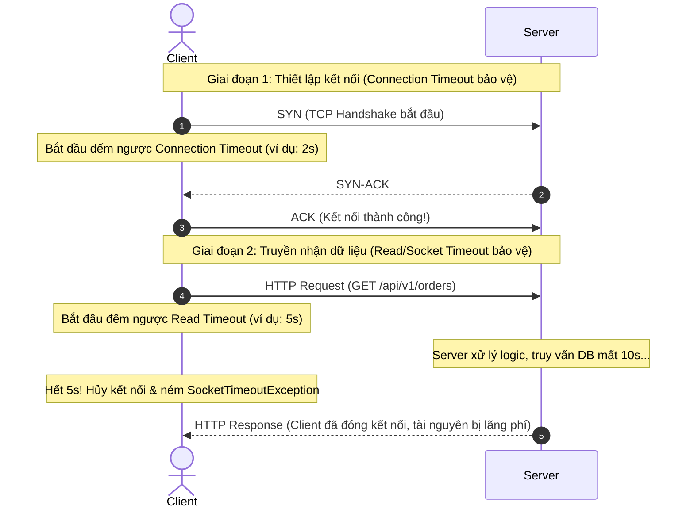

# Request Timeout: Phân loại, Tầm quan trọng và Chiến lược xử lý trong hệ thống Enterprise

## ⚡ Tóm tắt ngắn (30s)
Trong hệ thống phân tán (Distributed Systems) và Microservices, **Request Timeout** là cơ chế bảo vệ tối quan trọng. Nó thiết lập giới hạn thời gian tối đa cho một hành động giao tiếp. Nếu hành động vượt quá giới hạn này, nó sẽ bị hủy bỏ để giải phóng tài nguyên.

Có hai loại Timeout cốt lõi cần phân biệt rõ ràng:
1.  **Connection Timeout**: Thời gian tối đa để thiết lập kết nối TCP (3-way handshake) giữa Client và Server.
2.  **Read Timeout (Socket Timeout)**: Thời gian tối đa Client chờ nhận dữ liệu từ Server sau khi kết nối đã được thiết lập thành công.

**Quy tắc vàng**: *Không bao giờ sử dụng cấu hình timeout mặc định (thường là vô hạn hoặc quá lớn).* Không cấu hình timeout đồng nghĩa với việc tự sát hệ thống khi xảy ra sự cố nghẽn mạng hoặc downstream service phản hồi chậm, gây ra lỗi nghẽn luồng (Thread Starvation) và sập đổ dây chuyền (Cascading Failure).

---

## 🔍 Chi tiết bản chất thực chiến

### 1. Phân biệt Connection Timeout và Read Timeout
Để hiểu rõ bản chất, hãy xem luồng giao tiếp HTTP dưới đây:



*   **Connection Timeout**: Thường xảy ra khi địa chỉ IP/Port của Server không tồn tại, Server bị sập hoàn toàn (Crash), hoặc tường lửa (Firewall) chặn gói tin mà không phản hồi. Thời gian cấu hình thông thường rất ngắn (1s - 3s).
*   **Read Timeout**: Thường xảy ra khi Server đang bị quá tải (CPU 100%), Database bị nghẽn (Locking/Long-running query), hoặc Downstream API của bên thứ ba đang phản hồi chậm chạp. Thời gian cấu hình thường dài hơn Connection Timeout (2s - 10s tùy nghiệp vụ).

### 2. Sự nguy hiểm của "Thread Starvation" (Cạn kiệt luồng)
Hầu hết các Web Server truyền thống (như Apache Tomcat mặc định trong Spring Boot) hoạt động theo mô hình **Thread-per-Request** (Mỗi request được xử lý bởi một Thread).
*   Nếu Tomcat có `max-threads = 200` và ta gọi một API bên thứ ba có phản hồi chậm (mất 30s) mà **không cấu hình Read Timeout**.
*   Khi có 200 request đồng thời gọi API này, toàn bộ 200 Thread của Tomcat sẽ bị block để chờ đợi phản hồi.
*   Request thứ 201 đến sẽ bị xếp vào hàng đợi (Accept Queue). Khi hàng đợi đầy, Web Server sẽ lập tức từ chối kết nối, gây ra lỗi sập toàn bộ hệ thống (Out of Service) mặc dù CPU và Memory của máy chủ vẫn đang rất rảnh rỗi.

### 3. Timeout Propagation (Lan truyền Timeout)
Trong hệ thống Microservices, một request từ Client đi qua rất nhiều chặng:
`Client (10s) -> API Gateway (8s) -> Service A (5s) -> Service B (3s)`.
*   **Dynamic Timeout**: Nếu chặng trước đó đã tiêu tốn hết 4s của Client, các chặng phía sau phải tự động giảm thời gian Timeout của mình đi tương ứng để tránh thực hiện các tác vụ vô nghĩa khi Client chắc chắn đã ngắt kết nối.

---

## 💻 Code thực chiến: BAD vs GOOD trong cấu hình Timeout

### ❌ BAD: Sử dụng RestTemplate/WebClient với cấu hình mặc định
Trong Spring Boot, nếu khởi tạo `RestTemplate` hoặc `WebClient` bằng từ khóa `new` mà không chỉ định cấu hình, timeout mặc định sẽ là **vô hạn** (-1) trên nhiều nền tảng, hoặc quá lớn (ví dụ: 60s trên một số HTTP Client).

```java
@Service
public class OrderBadService {

    private final RestTemplate restTemplate = new RestTemplate(); // Dùng mặc định cực kỳ nguy hiểm!

    public String callThirdPartyPayment() {
        // Nếu hệ thống thanh toán của đối tác bị treo, luồng này sẽ bị treo vô hạn!
        // Gây nghẽn Tomcat Thread Pool nếu lượng request tăng cao.
        return restTemplate.getForObject("https://slow-payment-gateway.com/charge", String.class);
    }
}
```

###  GOOD: Cấu hình Timeout chặt chẽ cho RestTemplate, WebClient và Database

#### 1. Cấu hình sản xuất cho `RestTemplate` (sử dụng Apache HttpClient 5)
```java
@Configuration
public class RestTemplateConfig {

    @Bean
    public RestTemplate restTemplate(RestTemplateBuilder builder) {
        return builder
                // 1. Thiết lập Connection Timeout: 2 giây
                .setConnectTimeout(Duration.ofSeconds(2))
                // 2. Thiết lập Read Timeout: 5 giây
                .setReadTimeout(Duration.ofSeconds(5))
                .build();
    }
}
```

#### 2. Cấu hình sản xuất cho Reactive `WebClient` (sử dụng Netty)
```java
@Configuration
public class WebClientConfig {

    @Bean
    public WebClient webClient() {
        // Cấu hình HttpClient của Netty dưới nền
        HttpClient httpClient = HttpClient.create()
                .option(ChannelOption.CONNECT_TIMEOUT_MILLIS, 2000) // Connection Timeout: 2s
                .responseTimeout(Duration.ofSeconds(5)) // Read Timeout: 5s
                .doOnConnected(conn -> conn
                        .addHandlerLast(new ReadTimeoutHandler(5, TimeUnit.SECONDS))
                        .addHandlerLast(new WriteTimeoutHandler(5, TimeUnit.SECONDS)));

        return WebClient.builder()
                .clientConnector(new ReactorClientHttpConnector(httpClient))
                .build();
    }
}
```

#### 3. Cấu hình Database Query Timeout (Bảo vệ Database khỏi Long-running query)
```java
@Service
public class ReportService {

    private final ReportRepository reportRepository;

    public ReportService(ReportRepository reportRepository) {
        this.reportRepository = reportRepository;
    }

    // Thiết lập timeout cho transaction ở mức Database. 
    // Nếu câu SQL chạy quá 10 giây, Spring sẽ tự động Rollback và đóng kết nối.
    @Transactional(timeout = 10) 
    public List<ReportDto> generateComplexReport() {
        return reportRepository.executeComplexHeavyQuery();
    }
}
```

---

## 📊 Bảng so sánh: Connection Timeout vs Read Timeout

| Tiêu chí | Connection Timeout | Read Timeout (Socket Timeout) |
| :--- | :--- | :--- |
| **Giai đoạn xảy ra** | Thiết lập kết nối mạng (TCP Handshake). | Truyền tải dữ liệu sau khi kết nối thành công. |
| **Vị trí lỗi** | Tầng Transport (TCP). | Tầng Application (HTTP/Data Stream). |
| **Nguyên nhân phổ biến** | Server sập, sai IP/Port, Firewall chặn gói tin. | Server quá tải CPU/RAM, nghẽn Database, xử lý logic chậm. |
| **Lỗi Java ném ra** | `java.net.ConnectException: Connection timed out` | `java.net.SocketTimeoutException: Read timed out` |
| **Khuyến nghị cấu hình** | Nên đặt ngắn (**1s - 3s**). | Đặt linh hoạt tùy nghiệp vụ (**2s - 10s**). |

---

## ⚠️ Common Gotchas & Questions follow-up

### 1. Cạm bẫy "Double-Timeout" và Không nhất quán dữ liệu (Data Inconsistency)
*   **Kịch bản lỗi**: Client gọi API thanh toán của Server với Timeout là **3s**. Tuy nhiên, Server cấu hình xử lý thanh toán mất **5s** mới xong.
*   **Hậu quả**: Sau 3s, Client chủ động hủy request và báo lỗi thất bại lên màn hình cho người dùng. Tuy nhiên, ở phía Server, luồng xử lý vẫn tiếp tục chạy ngầm và thực hiện trừ tiền thành công của khách hàng sau 5s! Kết quả là khách hàng bị trừ tiền nhưng giao dịch báo lỗi.
*   **Giải pháp thực chiến**:
    *   *Quy tắc 1*: **Client Timeout luôn phải lớn hơn Server Timeout**.
    *   *Quy tắc 2*: Thiết kế API mang tính **Idempotency** (Nhất quán định danh). Nếu xảy ra timeout, client có thể an tâm gửi lại request cũ (cùng `Idempotency-Key`) để truy vấn trạng thái thực tế thay vì tự ý kết luận thất bại.

### 2. Câu hỏi đào sâu từ interviewer
*   **Q: Làm sao để thực hiện Dynamic Timeout Propagation trong một chuỗi gọi Microservices?**
    *   *Trả lời*: Chúng ta sử dụng HTTP Headers để truyền tải thời gian còn lại (Time-to-Live - TTL).
    1.  Khi Client gửi request đến API Gateway, Gateway gán một header `X-Request-Deadline: <timestamp_hết_hạn>`.
    2.  Mỗi Microservice nhận được request sẽ lấy `<timestamp_hết_hạn>` trừ đi thời gian hiện tại (`System.currentTimeMillis()`) để tính toán thời gian Timeout thực tế còn lại cho các lệnh gọi Downstream tiếp theo.
    3.  Nếu hiệu số âm hoặc bằng 0, hủy request ngay lập tức bằng lỗi `408 Request Timeout` hoặc `504 Gateway Timeout` để tiết kiệm tài nguyên hệ thống.
