# Retry API: Rủi ro "Thảm họa bầy ong" (Thundering Herd) và Giải pháp Exponential Backoff + Jitter

## ⚡ Tóm tắt ngắn (30s)
Cơ chế tự động gọi lại (**Retry**) là một vũ khí quan trọng giúp hệ thống tự phục hồi (**Self-healing**) khi gặp các sự cố mạng tạm thời (**Transient Faults**). Tuy nhiên, nếu thiết kế không đúng cách, Retry sẽ biến thành một cuộc tấn công từ chối dịch vụ tự chế (**Self-inflicted DDoS**).

*   **Rủi ro cốt lõi - Thảm họa bầy ong (Thundering Herd / Retry Storm)**: Khi một downstream service hoặc database bị nghẽn mạng hoặc sập tạm thời, hàng ngàn client sẽ nhận lỗi. Nếu tất cả client đồng loạt gửi lại yêu cầu sau một khoảng thời gian cố định (ví dụ: cứ sau đúng 1 giây), chúng sẽ tạo ra những đỉnh nhọn lưu lượng khổng lồ đè bẹp hệ thống downstream ngay khi nó vừa khởi động lại, khiến nó sập tiếp liên tục.
*   **Giải pháp cứu cánh**: Sử dụng **Exponential Backoff** (tăng thời gian chờ lũy tiến sau mỗi lần thất bại) kết hợp với **Jitter** (thêm nhiễu ngẫu nhiên vào thời gian chờ). Sự kết hợp này giúp phân tán tải trọng request đều theo thời gian, bảo vệ downstream service phục hồi một cách êm ái.

---

## 🔍 Chi tiết bản chất thực chiến

### 1. Cơ chế hình thành "Thảm họa bầy ong" (Thundering Herd)

Hãy tưởng tượng một hệ thống có 10,000 Client đang hoạt động đồng thời.

```mermaid
graph TD
    subgraph S1 ["Kịch bản 1: Retry tuyến tính (Không Jitter) - Gây sập chuỗi"]
    A[Downstream bị sập mạng 2s] --> B[10,000 Client nhận lỗi 503]
    B --> C[Chờ đúng 1.0 giây]
    C --> D[10,000 request ồ ạt nện vào Downstream cùng 1 mili-giây]
    D --> E[Downstream vừa khởi động lại bị sập tiếp!]
    end

    subgraph S2 ["Kịch bản 2: Exponential Backoff + Jitter - Phục hồi êm ái"]
    F[Downstream bị sập mạng 2s] --> G[10,000 Client nhận lỗi 503]
    G --> H[Chờ ngẫu nhiên: Client 1: 0.8s, Client 2: 1.5s, Client 3: 2.3s...]
    H --> I[Lưu lượng được trải đều từ 0.5s đến 3s]
    I --> J[Downstream chịu tải mượt mà & phục hồi thành công]
    end
```



Nếu không có **Jitter**, hành vi của các client sẽ bị **đồng bộ hóa (Synchronized)**. Sự đồng bộ hóa này biến lưu lượng truy cập ngẫu nhiên thông thường thành các xung điện áp cao áp, phá hủy mọi nỗ lực tự khôi phục của hệ thống.

### 2. Các thuật toán tính toán thời gian chờ Backoff

#### 📌 A. Exponential Backoff (Lũy tiến mũ)
Thời gian chờ tăng lên theo cấp số nhân sau mỗi lần thử:
$$Wait = Base \times Multiplier^{attempt}$$
*Ví dụ với $Base = 100ms, Multiplier = 2$:*
*   Lần thử 1: $100ms \times 2^0 = 100ms$
*   Lần thử 2: $100ms \times 2^1 = 200ms$
*   Lần thử 3: $100ms \times 2^2 = 400ms$
*   Lần thử 4: $100ms \times 2^3 = 800ms$

#### 📌 B. Jitter (Thêm yếu tố ngẫu nhiên - Randomness)
Để phá vỡ sự đồng bộ hóa của hàng loạt client, ta đưa thêm biến số ngẫu nhiên vào công thức. Có 3 cách áp dụng Jitter phổ biến:
1.  **Full Jitter (Khuyên dùng)**: Chọn một con số ngẫu nhiên hoàn toàn nằm giữa $0$ và mức trần lũy tiến hiện tại.
    $$Wait = Random(0, Base \times Multiplier^{attempt})$$
2.  **Equal Jitter**: Giữ một nửa thời gian chờ cố định, nửa còn lại lấy ngẫu nhiên.
    $$Wait = \frac{Half}{2} + Random\left(0, \frac{Half}{2}\right)$$
3.  **Decorrelated Jitter**: Sử dụng thuật toán nhân ngẫu nhiên từ khoảng thời gian chờ của lần thử trước đó để tính toán lần tiếp theo.

*Nghiên cứu thực tế từ AWS chỉ ra rằng **Full Jitter** là phương pháp tối ưu nhất để triệt tiêu hoàn toàn các đỉnh nhọn lưu lượng và giảm thiểu tổng thời gian hoàn thành tác vụ của toàn hệ thống.*

---

## 💻 Code thực chiến: BAD vs GOOD trong thiết kế Retry

### ❌ BAD: Dựng vòng lặp Retry thủ công hoặc dùng Retry tuyến tính không Jitter
Sử dụng vòng lặp `while` đơn giản với lệnh `Thread.sleep` cố định hoặc dùng cấu hình Spring Retry mặc định không có nhiễu ngẫu nhiên.

```java
@Service
public class OrderBadService {

    private static final int MAX_ATTEMPTS = 3;
    private static final long DELAY_MS = 1000; // 1 giây cố định

    @Autowired
    private RestTemplate restTemplate;

    // Anti-pattern: Nếu Gateway bị treo, tất cả các thread gọi API này 
    // sẽ đồng loạt ngủ đúng 1000ms và đồng loạt thức dậy dập phá hệ thống cùng lúc.
    public String processPayment(PaymentRequest request) {
        int attempt = 0;
        while (attempt < MAX_ATTEMPTS) {
            try {
                return restTemplate.postForObject("https://payment.com/charge", request, String.class);
            } catch (Exception e) {
                attempt++;
                if (attempt >= MAX_ATTEMPTS) {
                    throw new RuntimeException("Payment failed after 3 attempts", e);
                }
                try {
                    Thread.sleep(DELAY_MS); // Ngủ tuyến tính cố định - Tuyệt đối tránh!
                } catch (InterruptedException ie) {
                    Thread.currentThread().interrupt();
                    throw new RuntimeException(ie);
                }
            }
        }
        return null;
    }
}
```

###  GOOD: Triển khai Resilience4j với Exponential Backoff & Jitter trong Spring Boot

Sử dụng thư viện chuẩn công nghiệp **Resilience4j** để cấu hình bộ lọc Retry an toàn.

#### Bước 1: Cấu hình Declarative trong file `application.yml`
```yaml
resilience4j:
  retry:
    instances:
      paymentServiceRetry:
        max-attempts: 4                      # Thử tối đa 4 lần
        wait-duration: 200ms                 # Thời gian cơ sở (Base delay)
        enable-exponential-backoff: true     # Bật lũy tiến cấp số nhân
        exponential-backoff-multiplier: 2    # Hệ số nhân (200ms -> 400ms -> 800ms)
        enable-randomized-wait: true         # Bật Jitter (Nhiễu ngẫu nhiên)
        randomized-wait-factor: 0.5          # Độ biến động ngẫu nhiên +-50%
        retry-exceptions:                    # Chỉ retry với các lỗi tạm thời
          - org.springframework.web.client.ResourceAccessException
          - java.net.SocketTimeoutException
          - java.io.IOException
        ignore-exceptions:                   # Tuyệt đối KHÔNG retry lỗi nghiệp vụ
          - org.springframework.web.client.HttpClientErrorException.BadRequest
          - org.springframework.web.client.HttpClientErrorException.Unauthorized
```

#### Bước 2: Viết mã nguồn tích hợp gọn gàng trong Service Java
```java
@Service
@Slf4j
public class OrderGoodService {

    private final RestTemplate restTemplate;

    public OrderGoodService(RestTemplate restTemplate) {
        this.restTemplate = restTemplate;
    }

    // Annotation của Resilience4j tự động bọc logic nghiệp vụ bằng cấu hình an toàn trên yaml.
    @Retry(name = "paymentServiceRetry", fallbackMethod = "paymentFallback")
    public String processPayment(PaymentRequest request) {
        log.info("Attempting payment for order: {}", request.getOrderId());
        
        // Chỉ gọi API. Resilience4j sẽ lo toàn bộ việc ngủ, tính toán Exponential Backoff và Jitter ngầm.
        return restTemplate.postForObject("https://payment.com/charge", request, String.class);
    }

    // Phương thức dự phòng (Fallback) khi toàn bộ các lượt thử lại đều thất bại
    public String paymentFallback(PaymentRequest request, Throwable t) {
        log.error("All 4 payment attempts failed for order: {}. Reason: {}", request.getOrderId(), t.getMessage());
        throw new PaymentServiceException("Hệ thống thanh toán tạm thời không khả dụng. Vui lòng thử lại sau!", t);
    }
}
```

---

## 📊 Bảng so sánh các chiến lược Retry

| Tiêu chí | No Retry (Không thử lại) | Linear Retry (Tuyến tính) | Exponential Backoff (Không Jitter) | Exponential Backoff + Jitter (Full Jitter) |
| :--- | :--- | :--- | :--- | :--- |
| **Cách hoạt động** | Thất bại báo lỗi ngay. | Chờ cố định $X$ giây rồi thử lại. | Chờ tăng lũy tiến ($X, 2X, 4X, 8X$). | Chờ lũy tiến kèm nhiễu ngẫu nhiên hoàn toàn. |
| **Nguy cơ Thundering Herd** | Không có. | **Cực kỳ cao** (Gây nghẽn đỉnh nhọn cực lớn). | **Cao** (Vẫn bị đồng bộ hóa pha lượng tải). | **Không có (Triệt tiêu hoàn toàn)**. |
| **Bảo vệ Downstream** | Tốt. | Tệ nhất (Tự hủy hệ thống). | Trung bình. | **Xuất sắc nhất**. |
| **Phù hợp nhất với** | API không an toàn, không có tính Idempotency. | Hệ thống nội bộ cực nhỏ, tải cực thấp. | Phù hợp cho tiến trình ngầm (Background Job) chạy đơn lẻ. | **Hệ thống Microservices quy mô lớn, API gọi đối tác**. |

---

## ⚠️ Common Gotchas & Questions follow-up

### 1. Các cạm bẫy sống còn khi triển khai Retry
*   **🚨 Cạm bẫy 1: Retry trên các API phi Idempotent**:
    Tuyệt đối không bao giờ cấu hình tự động Retry cho các request dạng `POST` tạo mới tài nguyên hoặc thanh toán, trừ khi API đó cam kết hỗ trợ cơ chế nhất quán `Idempotency-Key` ở phía đối tác. Nếu không, khách hàng sẽ bị trùng lặp giao dịch (Double-charge).
*   **🚨 Cạm bẫy 2: Không phân biệt loại Exception để Retry**:
    Nếu đối tác phản hồi lỗi `400 Bad Request` hoặc `401 Unauthorized`, việc retry vô điều kiện 4-5 lần là hoàn toàn vô nghĩa và lãng phí tài nguyên CPU của cả 2 bên. Chỉ cấu hình retry cho các lỗi liên quan đến mạng kết nối (`ConnectException`, `SocketTimeoutException`) hoặc lỗi máy chủ tạm thời (`503 Service Unavailable`, `504 Gateway Timeout`).
*   **🚨 Cạm bẫy 3: Cấu hình Max Attempts quá lớn**:
    Retry quá nhiều lần (ví dụ: đặt max-attempts = 10) làm tăng thời gian phản hồi trung bình (latency) của Client lên quá cao, gây trải nghiệm tệ hại cho người dùng cuối (chờ đợi mòn mỏi trước khi nhận được thông báo lỗi). Khuyên dùng chỉ nên retry từ **3 đến 4 lần**.

### 2. Câu hỏi đào sâu từ interviewer
*   **Q: Khi nào nên sử dụng Retry và khi nào nên sử dụng Circuit Breaker? Chúng bổ trợ nhau thế nào?**
    *   *Trả lời*:
        *   **Retry** phù hợp nhất để xử lý các sự cố mạng **tạm thời, diễn ra rất ngắn** (Transient Faults - ví dụ: rụng gói tin mạng trong 100ms, server đối tác reload cấu hình nhanh).
        *   **Circuit Breaker** (Ngắt mạch) phù hợp để xử lý các sự cố **kéo dài** (Downstream sập nguồn hoàn toàn, mất điện database). Circuit Breaker sẽ chủ động ngăn không cho request đi qua để giảm tải cho downstream, giúp downstream hồi sinh mà không bị nghẹt thở.
        *   *Kết hợp*: Chúng phối hợp tuyệt vời bằng cách đặt **Retry nằm bên trong Circuit Breaker**. Khi Circuit Breaker ở trạng thái đóng (Closed), client gọi API và có thể Retry 2-3 lần bằng Exponential Backoff + Jitter nếu lỗi nhẹ. Nhưng nếu tỉ lệ lỗi vượt quá ngưỡng (ví dụ: 50% thất bại), Circuit Breaker sẽ lập tức Mở ra (Open) để chặn đứng mọi lượt gọi và retry tiếp theo, trả về lỗi Fallback ngay tức thì.
