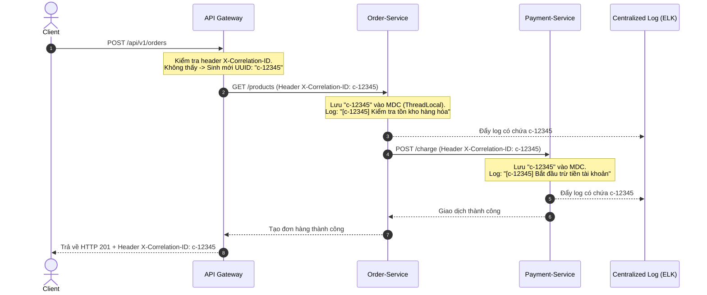

# Correlation ID / Request ID: Giải pháp giám sát lỗi (Distributed Tracing) trong Microservices

## ⚡ Tóm tắt ngắn (30s)
Trong kiến trúc đơn khối (Monolith), việc dò tìm nguyên nhân gây lỗi khá đơn giản vì toàn bộ luồng xử lý nằm chung một tiến trình. Nhưng trong kiến trúc **Microservices**, một thao tác của người dùng có thể kích hoạt một chuỗi gọi chéo qua hàng chục dịch vụ khác nhau. Lúc này, việc tìm log lỗi giống như mò kim đáy bể.

**Correlation ID** (hoặc **Request ID**) là giải pháp cứu cánh:
*   Đó là một chuỗi định danh duy nhất (thường là UUID) được sinh ra ngay khi yêu cầu của người dùng chạm vào hệ thống (thường ở **API Gateway**).
*   ID này được đính kèm vào HTTP Header (`X-Correlation-Id`), truyền xuyên suốt qua các tầng dịch vụ (Database, Cache, Message Queue).
*   Tất cả các dịch vụ khi ghi log (Log writing) bắt buộc phải kèm theo ID này thông qua cơ chế **MDC (Mapped Diagnostic Context)**.
*   Khi xảy ra sự cố, kỹ sư vận hành chỉ cần copy Correlation ID và tìm kiếm trên hệ thống log tập trung (như ELK, Splunk, Datadog, Grafana Loki) để có ngay bức tranh toàn cảnh về toàn bộ hành trình của yêu cầu đó.

---

## 🔍 Chi tiết bản chất thực chiến

### 1. Luồng di chuyển của Correlation ID trong hệ thống phân tán



Nếu bước (6) bị lỗi sập kết nối Database ở Payment-Service, lập trình viên chỉ cần lấy ID `c-12345` trả về trong Response Header của Client, gõ vào ELK và ngay lập tức thấy chuỗi nhật ký: *Gateway nhận request -> Order nhận request -> Payment gọi database bị timeout*.

### 2. Mapped Diagnostic Context (MDC) là gì?
MDC là một tính năng của các thư viện ghi log hiện đại (Logback, Log4j2). Nó hoạt động dựa trên cơ chế **ThreadLocal** (Lưu trữ dữ liệu riêng biệt cho mỗi Thread). Khi ta gán một giá trị vào MDC (ví dụ: `MDC.put("correlationId", "uuid-123")`), tất cả các câu lệnh ghi log (`log.info()`, `log.error()`) chạy trên Thread đó sẽ tự động chèn giá trị này vào định dạng log (Pattern) mà không cần lập trình viên phải cộng chuỗi thủ công.

---

## 💻 Code thực chiến: BAD vs GOOD trong quản lý Correlation ID

### ❌ BAD: Cộng chuỗi thủ công hoặc truyền ID qua tham số của hàm (Method Pollution)
Một lỗi cực kỳ phổ biến của Junior dev là truyền biến `correlationId` xuyên suốt mọi tham số của tất cả các hàm dịch vụ để in log, hoặc thủ công viết lệnh in log kèm ID.

```java
@Service
public class OrderBadService {
    private static final Logger log = LoggerFactory.getLogger(OrderBadService.class);

    // Anti-pattern: Hàm nghiệp vụ bị bẩn vì phải nhận thêm tham số không liên quan đến logic kinh doanh!
    public void createOrder(OrderRequest request, String correlationId) {
        log.info("[ID: " + correlationId + "] Bắt đầu tạo đơn hàng cho user: " + request.getUserId());
        
        // Phải tiếp tục truyền đi xuống tầng Repository hoặc API Client
        paymentBadClient.charge(request.getAmount(), correlationId);
        
        log.info("[ID: " + correlationId + "] Hoàn tất đơn hàng!");
    }
}
```

###  GOOD: Tự động hóa 100% bằng Filter, MDC và Interceptor trong Spring Boot

Chúng ta sẽ thiết kế một giải pháp tự động hoàn toàn:
1.  **Servlet Filter**: Đón request, lấy/sinh Correlation ID và nạp vào MDC.
2.  **RestTemplate Interceptor**: Tự động đính kèm ID vào các outbound request gọi dịch vụ khác.
3.  **Log Pattern**: Cấu hình Logback để tự in ID ra console/file.

#### Bước 1: Tạo Servlet Filter để quản lý vòng đời Correlation ID
```java
@Component
@Order(Ordered.HIGHEST_PRECEDENCE) // Đảm bảo chạy đầu tiên khi request tới
public class CorrelationIdFilter implements Filter {

    public static final String CORRELATION_ID_HEADER = "X-Correlation-ID";
    public static final String MDC_KEY = "correlationId";

    @Override
    public void doFilter(ServletRequest request, ServletResponse response, FilterChain chain)
            throws IOException, ServletException {
        
        HttpServletRequest httpRequest = (HttpServletRequest) request;
        HttpServletResponse httpResponse = (HttpServletResponse) response;

        // 1. Lấy ID từ Header của request đến (nếu có), nếu không có thì sinh UUID mới
        String correlationId = httpRequest.getHeader(CORRELATION_ID_HEADER);
        if (correlationId == null || correlationId.isBlank()) {
            correlationId = UUID.randomUUID().toString();
        }

        // 2. Nạp ID vào MDC để tự động in log trên thread hiện tại
        MDC.put(MDC_KEY, correlationId);

        // 3. Trả lại ID cho response header để Client/Gateway có thể theo dõi vết
        httpResponse.setHeader(CORRELATION_ID_HEADER, correlationId);

        try {
            chain.doFilter(request, response);
        } finally {
            // 4. BẮT BUỘC: Dọn sạch MDC sau khi kết thúc request để tránh rò rỉ dữ liệu (MDC Leak)
            // vì Thread Pool của Tomcat sẽ tái sử dụng thread này cho request khác!
            MDC.remove(MDC_KEY);
        }
    }
}
```

#### Bước 2: Tạo Client Interceptor để tự động truyền ID khi gọi Downstream Service
```java
public class RestTemplateHeaderInterceptor implements ClientHttpRequestInterceptor {

    @Override
    public ClientHttpResponse intercept(HttpRequest request, byte[] body, ClientHttpRequestExecution execution)
            throws IOException {
        
        // Lấy Correlation ID hiện tại từ MDC của Thread
        String correlationId = MDC.get(CorrelationIdFilter.MDC_KEY);
        
        if (correlationId != null) {
            // Tự động đẩy vào outbound HTTP Header
            request.getHeaders().add(CorrelationIdFilter.CORRELATION_ID_HEADER, correlationId);
        }
        
        return execution.execute(request, body);
    }
}

// Cấu hình nạp Interceptor vào RestTemplate
@Configuration
public class RestClientConfig {
    @Bean
    public RestTemplate restTemplate() {
        RestTemplate restTemplate = new RestTemplate();
        restTemplate.setInterceptors(Collections.singletonList(new RestTemplateHeaderInterceptor()));
        return restTemplate;
    }
}
```

#### Bước 3: Cấu hình Logback hiển thị Correlation ID trong tệp `logback-spring.xml`
Thêm định dạng `%X{correlationId}` vào encoder pattern. Nếu MDC chứa `correlationId`, logback sẽ tự động render nó ra.
```xml
<appender name="CONSOLE" class="ch.qos.logback.core.ConsoleAppender">
    <encoder>
        <!-- %X{correlationId} sẽ lấy giá trị từ MDC ra để in -->
        <pattern>%d{yyyy-MM-dd HH:mm:ss.SSS} [%thread] %-5level %logger{36} - [%X{correlationId}] - %msg%n</pattern>
    </encoder>
</appender>
```

---

## 📊 Phân biệt: X-Request-ID vs X-Correlation-ID

| Tiêu chí | X-Request-ID (Định danh yêu cầu) | X-Correlation-ID (Định danh chuỗi nghiệp vụ) |
| :--- | :--- | :--- |
| **Phạm vi áp dụng** | Thường định danh cho **độc nhất một kết nối HTTP** HTTP gửi đi từ Client tới Gateway. | Định danh cho **toàn bộ một luồng nghiệp vụ lớn** có thể bao gồm nhiều request độc lập hoặc bất đồng bộ. |
| **Tính duy nhất** | Thay đổi sau mỗi lần Client gửi lại (ví dụ: gửi lại request thanh toán mới sẽ có Request ID mới). | Giữ nguyên trong toàn bộ chuỗi giao dịch liên quan (dù Client retry 3 lần, Correlation ID vẫn là một). |
| **Nơi sinh ra** | Client (Browser/Mobile) hoặc API Gateway. | Thường được sinh ra bởi API Gateway hoặc Microservice đầu tiên nhận yêu cầu. |
| **Công dụng chính** | Giúp Debug lỗi kết nối mạng đơn lẻ, đo lường Latency mạng chặng đầu. | Phân tích luồng nghiệp vụ phức tạp đi qua nhiều Microservices và hệ thống Message Queue. |

---

## ⚠️ Common Gotchas & Questions follow-up

### 🚨 Cạm bẫy sống còn: "Mất vết log" khi xử lý bất đồng bộ (Thread context loss)
MDC sử dụng `ThreadLocal` dưới nền. Khi bạn viết code chạy bất đồng bộ bằng `@Async`, `CompletableFuture`, hoặc xử lý bất đồng bộ trong các Reactive Framework (Spring WebFlux / Project Reactor), nhiệm vụ sẽ được chuyển giao cho một **Thread khác** thuộc Thread Pool khác quản lý. Lúc này, MDC trên Thread mới sẽ hoàn toàn trống rỗng, khiến Correlation ID biến mất trên các dòng log tiếp theo.

*   **Giải pháp cho `@Async` (TaskDecorator trong Spring Boot)**:
    Ta cần viết một bộ `TaskDecorator` tùy chỉnh để tự động sao chép (copy) bản đồ MDC từ luồng cha sang luồng con trước khi bắt đầu tác vụ bất đồng bộ.

```java
public class MdcTaskDecorator implements TaskDecorator {
    @Override
    public Runnable decorate(Runnable runnable) {
        // Lấy context hiện tại của Thread cha
        Map<String, String> contextMap = MDC.getCopyOfContextMap();
        
        return () -> {
            try {
                if (contextMap != null) {
                    // Thiết lập context cho Thread con mới
                    MDC.setContextMap(contextMap);
                }
                runnable.run();
            } finally {
                // Dọn dẹp sạch sẽ Thread con sau khi chạy xong
                MDC.clear();
            }
        };
    }
}
```

Nạp bộ decorator này vào cấu hình ThreadPool của Spring `@Async`:
```java
@Configuration
@EnableAsync
public class AsyncConfig {
    @Bean
    public Executor taskExecutor() {
        ThreadPoolTaskExecutor executor = new ThreadPoolTaskExecutor();
        executor.setCorePoolSize(5);
        executor.setMaxPoolSize(10);
        executor.setTaskDecorator(new MdcTaskDecorator()); // Nạp decorator sao chép MDC
        executor.initialize();
        return executor;
    }
}
```

### 💬 Câu hỏi đào sâu từ interviewer
*   **Q: Làm sao để truyền Correlation ID qua một hệ thống Message Queue bất đồng bộ như Apache Kafka?**
    *   *Trả lời*: Chúng ta không nên đưa Correlation ID vào trong Payload JSON của Message (vì điều đó làm bẩn cấu trúc Data DTO nghiệp vụ).
    *   Thay vào đó, ta sử dụng tính năng **Headers** có sẵn của Kafka Record (hoặc Message Properties trong RabbitMQ).
    *   Khi gửi tin nhắn (Producer), ta lấy ID từ MDC ra và viết vào Kafka Header: `record.headers().add("X-Correlation-ID", correlationId.getBytes())`.
    *   Khi nhận tin nhắn (Consumer), Listener sẽ đón nhận message, đọc từ Kafka Header ra, nạp lại vào MDC của luồng xử lý nhận tin nhắn để tiếp tục ghi log nhất quán.
