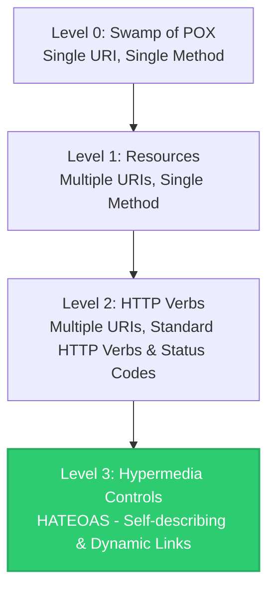

# Richardson Maturity Model (Mức độ chín chắn của RESTful API)

## ⚡ Tóm tắt ngắn (30s)
**Richardson Maturity Model (RMM)** là một mô hình đánh giá được đưa ra bởi Leonard Richardson, chia độ trưởng thành (chín chắn) của một API hệ thống thành **4 cấp độ (Level 0 đến Level 3)** dựa trên mức độ áp dụng các tiêu chuẩn Web (HTTP, URI, Hypermedia).
*   **Level 0 (The Swamp of POX)**: Chỉ dùng HTTP làm giao thức truyền tải đơn thuần (tunneling). Một URI duy nhất, một HTTP Method duy nhất (thường là POST) cho mọi thao tác.
*   **Level 1 (Resources)**: Bắt đầu chia nhỏ hệ thống thành các **Tài nguyên (Resources)** với các URI khác nhau, nhưng vẫn dùng một HTTP Method duy nhất.
*   **Level 2 (HTTP Verbs)**: Sử dụng các phương thức chuẩn của **HTTP Verbs** (GET, POST, PUT, DELETE...) kết hợp với **HTTP Status Codes** một cách chuẩn xác.
*   **Level 3 (Hypermedia Controls - HATEOAS)**: Cấp độ cao nhất. API phản hồi kèm theo các liên kết động dẫn tới hành động tiếp theo, giúp Client tự khám phá dịch vụ.

---

## 🔍 Chi tiết bản chất thực chiến

### 1. Phân tích 4 Cấp độ trong Richardson Maturity Model



#### 🌐 Level 0: The Swamp of POX (Plain Old XML/JSON)
*   **Đặc điểm**: Dùng HTTP như một đường ống dẫn dữ liệu (tunneling). Giống như kiến trúc SOAP hoặc RPC.
*   **Thực tế**: Một endpoint duy nhất như `/userService` hoặc `/api`. Client gửi request qua POST với body chứa tên hàm và tham số cần gọi.
*   **Nhược điểm**: Khó tích hợp, không tận dụng được cơ chế caching của HTTP proxy, tài liệu API phức tạp vì phải tự định nghĩa mọi quy tắc.

#### 🌐 Level 1: Resources (Phân rã tài nguyên)
*   **Đặc điểm**: Giới thiệu khái niệm **Resource**. Hệ thống được chia thành nhiều URI đại diện cho các thực thể độc lập.
*   **Thực tế**: Có URI riêng cho từng tài nguyên như `/api/users`, `/api/orders/123`. Tuy nhiên, vẫn sử dụng một phương thức duy nhất (POST hoặc GET) cho mọi thao tác ghi/đọc.

#### 🌐 Level 2: HTTP Verbs (Thao tác chuẩn HTTP)
*   **Đặc điểm**: Sử dụng đúng bản chất của giao thức HTTP.
*   **Thực tế**:
    *   **GET** để truy vấn dữ liệu (Safe & Idempotent).
    *   **POST** để tạo mới (Non-idempotent).
    *   **PUT/PATCH** để cập nhật (Idempotent/Non-idempotent).
    *   **DELETE** để xóa.
    *   Sử dụng đúng HTTP Status Codes: `201 Created` cho POST thành công, `404 Not Found` khi không thấy resource, `409 Conflict` khi trùng lặp dữ liệu...
*   **Lợi ích**: Cho phép các trung gian mạng (như Reverse Proxy, CDN) tự động cache các request GET một cách an toàn mà không sợ làm thay đổi dữ liệu hệ thống.

#### 🌐 Level 3: Hypermedia Controls (HATEOAS)
*   **Đặc điểm**: API tự mô tả. Response trả về không chỉ có dữ liệu mà còn chứa các đường link (`href`) dẫn tới các bước tiếp theo mà Client có thể thực hiện.
*   **Thực tế**: Khi truy vấn một đơn hàng chưa thanh toán, API trả lời thông tin đơn hàng kèm link thanh toán (`/orders/123/pay`) và link hủy (`/orders/123/cancel`). Nếu đơn hàng đã hoàn tất, các link này sẽ tự động biến mất và chỉ còn link xem hóa đơn (`/orders/123/receipt`).

---

## 💻 Code thực chiến: BAD vs GOOD

### ❌ BAD: Thiết kế API dừng ở Level 0 / Level 1
Hệ thống dùng chung một API Endpoint duy nhất, dùng POST để làm tất cả mọi việc bao gồm cả đọc và xóa dữ liệu.

```java
@RestController
@RequestMapping("/api/v1/user-service") // Endpoint duy nhất (Level 0)
public class UserServiceController {

    @PostMapping // Một HTTP Method duy nhất
    public ResponseEntity<Map<String, Object>> handleRequest(@RequestBody Map<String, Object> request) {
        String action = (String) request.get("action");
        Map<String, Object> response = new HashMap<>();

        if ("getUser".equals(action)) {
            Long id = Long.valueOf(request.get("id").toString());
            response.put("data", userService.findById(id));
            response.put("status", "SUCCESS");
        } else if ("deleteUser".equals(action)) {
            Long id = Long.valueOf(request.get("id").toString());
            userService.deleteById(id);
            response.put("status", "DELETED");
        }
        
        // Luôn luôn trả lời 200 OK ngay cả khi có lỗi hệ thống hoặc dữ liệu (Anti-pattern)
        return ResponseEntity.ok(response);
    }
}
```

###  GOOD: Thiết kế API chuẩn Level 3 (HATEOAS) bằng Spring HATEOAS
Tách biệt URI cho các tài nguyên (Level 1), dùng đúng HTTP Methods & Status Codes (Level 2), tích hợp liên kết động HATEOAS (Level 3).

```java
import org.springframework.hateoas.EntityModel;
import org.springframework.hateoas.server.mvc.WebMvcLinkBuilder;
import static org.springframework.hateoas.server.mvc.WebMvcLinkBuilder.*;

@RestController
@RequestMapping("/api/v1/orders")
public class OrderController {

    private final OrderService orderService;

    public OrderController(OrderService orderService) {
        this.orderService = orderService;
    }

    @GetMapping("/{id}")
    public ResponseEntity<EntityModel<OrderResponseDto>> getOrderById(@PathVariable Long id) {
        OrderResponseDto order = orderService.findById(id);
        
        // Khởi tạo EntityModel để bọc dữ liệu và đính kèm link HATEOAS (Level 3)
        EntityModel<OrderResponseDto> resource = EntityModel.of(order);
        
        // Link tự tham chiếu tới chính nó (self link)
        resource.add(linkTo(methodOn(OrderController.class).getOrderById(id)).withSelfRel());
        
        // Đính kèm các liên kết nghiệp vụ động dựa vào trạng thái của Order
        if ("PENDING".equals(order.getStatus())) {
            // Cung cấp liên kết để thanh toán đơn hàng
            resource.add(linkTo(methodOn(OrderController.class).payOrder(id)).withRel("pay"));
            // Cung cấp liên kết để hủy đơn hàng
            resource.add(linkTo(methodOn(OrderController.class).cancelOrder(id)).withRel("cancel"));
        } else if ("COMPLETED".equals(order.getStatus())) {
            // Đã hoàn thành thì chỉ cung cấp liên kết tải hóa đơn
            resource.add(linkTo(methodOn(OrderController.class).downloadReceipt(id)).withRel("receipt"));
        }

        return ResponseEntity.ok(resource); // Trả về 200 OK cùng thông tin tài nguyên và liên kết động
    }

    @PostMapping("/{id}/pay")
    public ResponseEntity<Void> payOrder(@PathVariable Long id) {
        orderService.processPayment(id);
        return ResponseEntity.noContent().build();
    }

    @PostMapping("/{id}/cancel")
    public ResponseEntity<Void> cancelOrder(@PathVariable Long id) {
        orderService.cancel(id);
        return ResponseEntity.noContent().build();
    }

    @GetMapping("/{id}/receipt")
    public ResponseEntity<byte[]> downloadReceipt(@PathVariable Long id) {
        byte[] file = orderService.generateReceipt(id);
        return ResponseEntity.ok(file);
    }
}
```

---

## 📊 So sánh: Thực tế ứng dụng các cấp độ trong RMM

| Tiêu chí | Level 0 & Level 1 | Level 2 (Được dùng nhiều nhất) | Level 3 (Chuẩn REST lý thuyết) |
| :--- | :--- | :--- | :--- |
| **Độ phủ thực tế** | Khoảng 10-15% (Chủ yếu các hệ thống cũ hoặc gRPC/GraphQL). | **Khoảng 80-85%**. Đây là tiêu chuẩn thiết kế API thực tế của mọi doanh nghiệp hiện đại. | Dưới 5%. Rất hiếm khi được áp dụng triệt để trong các dự án thương mại thông thường. |
| **Cơ chế Caching** | Rất kém. Không tận dụng được hạ tầng cache HTTP vì mọi thứ đi qua POST. | **Cực tốt**. GET cache ở CDN/Gateway dễ dàng. Giảm tải tối đa cho database. | Cực tốt. Tương tự Level 2 nhưng client linh động hơn nhờ khám phá link. |
| **Độ phức tạp Client** | Client phải biết trước tất cả các endpoint tĩnh của hệ thống. | Client phải quản lý các endpoint tĩnh và tự xử lý logic điều hướng trạng thái. | **Thấp nhất**. Client chỉ cần biết endpoint gốc (root link), các bước sau đi theo link trả về. |
| **Chi phí phát triển** | Thấp và nhanh ở giai đoạn đầu, nhưng bảo trì cực kỳ mệt mỏi về sau. | Cân bằng hoàn hảo giữa nỗ lực thiết kế cấu trúc hệ thống và lợi ích nhận được. | Rất cao. Server tốn hiệu năng build link, Client tốn tài nguyên phân tích link động. |

---

## ⚠️ Common Gotchas & Questions follow-up

* **Cạm bẫy "HATEOAS lý thuyết suông" trong dự án thực tế**:
  Dù Level 3 (HATEOAS) rất đẹp đẽ trên lý thuyết, nhưng trong thực tế, các frontend developer hoặc các đối tác bên thứ ba tích hợp API của bạn rất ghét HATEOAS.
  * *Tại sao?* Vì thay vì chỉ việc gọi một đường link tĩnh có sẵn trong tài liệu Swagger (`/api/v1/orders/123/pay`), họ buộc phải viết code phân tích JSON trả về, tìm key `pay` trong mảng `links` rồi mới lấy URI động đó để gửi tiếp request. Điều này làm tăng độ phức tạp của code client lên gấp nhiều lần mà không đem lại giá trị thực tế quá lớn đối với các app nội bộ.
  * *Lời khuyên:* Chỉ nên áp dụng Level 3 khi bạn xây dựng các hệ sinh thái API mở (Public API) cho hàng ngàn đối tác bên ngoài tự do khám phá và tích hợp mà không cần cập nhật code liên tục khi server thay đổi cấu trúc URL.

* **Câu hỏi đào sâu từ interviewer**: *Nếu ứng dụng của tôi chỉ thiết kế API đạt Level 2 trong Richardson Maturity Model thì nó có được gọi là RESTful thực thụ không?*
  * *(Trả lời: Theo đúng định nghĩa học thuật của Roy Fielding - cha đẻ của REST, một hệ thống nếu không triển khai HATEOAS (Level 3) thì không thể được gọi là RESTful API thực sự mà chỉ là HTTP API. Tuy nhiên, trong ngôn ngữ giao tiếp của ngành công nghiệp phần mềm thực tế ngày nay, các hệ thống đạt Level 2 đã được cộng đồng ngầm định và công nhận rộng rãi là các hệ thống RESTful API).*
