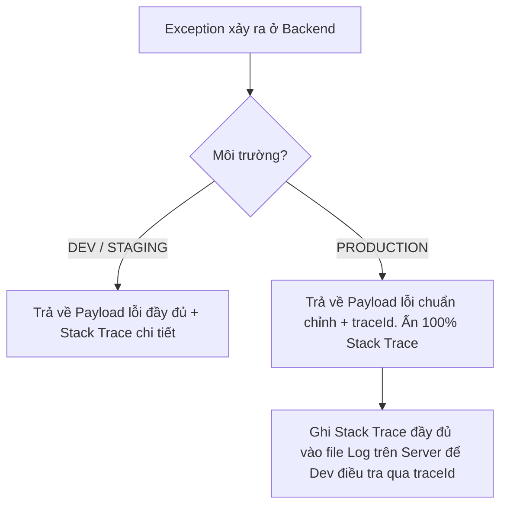

# Thiết kế cấu trúc Error Response chuẩn cho toàn hệ thống Enterprise

## ⚡ Tóm tắt ngắn (30s)
Trong một hệ thống chuyên nghiệp, việc thiết kế cấu trúc phản hồi lỗi (**Error Response**) đồng nhất là tối quan trọng. Nó giúp Client (Frontend, Mobile, hoặc đối tác bên thứ ba) dễ dàng lập trình xử lý ngoại lệ, hiển thị thông báo thân thiện với người dùng cuối, và tăng tốc độ gỡ lỗi (Debugging) của đội ngũ vận hành.

Một cấu trúc Error Response chuẩn chỉnh cho doanh nghiệp phải đạt được 3 mục tiêu:
1.  **Đồng nhất**: Tất cả API trong hệ thống (dù viết bằng Java, Node.js hay Go) đều phải trả về đúng một mẫu Payload lỗi duy nhất.
2.  **Thông tin nghiệp vụ chi tiết**: Sử dụng **Business Error Code** bên cạnh mã HTTP Status truyền thống để diễn giải chính xác lỗi nghiệp vụ.
3.  **Bảo mật**: Tuyệt đối không để lộ thông tin nhạy cảm của hệ thống (như Stack Trace, tên bảng DB, phiên bản thư viện) ra bên ngoài ở môi trường Production.

---

## 🔍 Chi tiết bản chất thực chiến

### 1. Tại sao HTTP Status Code là chưa đủ?
Mã trạng thái HTTP (HTTP Status Code) được thiết kế cho giao thức web nói chung, nên nó mang tính khái quát rất cao:
*   `400 Bad Request`: Chỉ biết là request sai, nhưng sai ở đâu? (Sai định dạng email, thiếu số điện thoại, hay ngày sinh không hợp lệ?)
*   `409 Conflict`: Xung đột dữ liệu, nhưng là tài khoản đã đăng ký, hay mã giảm giá đã được sử dụng?

Vì vậy, ta bắt buộc phải bổ sung **Business Error Code** (Mã lỗi nghiệp vụ nội bộ) dưới dạng chuỗi String viết hoa (ví dụ: `PROMOTION_CODE_EXPIRED`, `USER_EMAIL_ALREADY_EXISTS`) để Client có thể lập trình xử lý logic rẽ nhánh một cách chính xác.

### 2. Cấu trúc Payload lỗi chuẩn Enterprise (Khuyên dùng)
Dưới đây là một JSON đại diện cho cấu trúc lỗi hoàn hảo:

```json
{
  "timestamp": "2026-05-22T13:30:15.123Z",
  "status": 400,
  "error": "Bad Request",
  "code": "USER_VALIDATION_FAILED",
  "message": "Thông tin đăng ký thành viên không hợp lệ.",
  "details": [
    {
      "field": "email",
      "issue": "Email không đúng định dạng chuẩn.",
      "rejectedValue": "admin@@gmail.com"
    },
    {
      "field": "password",
      "issue": "Mật khẩu phải chứa ít nhất 8 ký tự, bao gồm cả số.",
      "rejectedValue": "123"
    }
  ],
  "traceId": "c-12345"
}
```

*Ý nghĩa các trường:*
*   `timestamp`: Thời điểm chính xác xảy ra lỗi (hữu ích để đối chiếu múi giờ).
*   `status`: HTTP Status Code nguyên bản (ví dụ: 400).
*   `error`: Tên lỗi HTTP chuẩn (ví dụ: "Bad Request").
*   `code`: Business Error Code cụ thể để Client ánh xạ hiển thị hoặc xử lý logic.
*   `message`: Thông báo lỗi ngắn gọn, thân thiện với người dùng (đã qua dịch thuật nếu có đa ngôn ngữ).
*   `details`: Mảng chứa thông tin chi tiết (thường dùng cho lỗi Validation Form hoặc nhiều lỗi cùng xảy ra). Nếu không có, trường này có thể trả về mảng rỗng `[]` hoặc `null`.
*   `traceId`: **Correlation ID** (UUID) của request đó. Khi người dùng gặp lỗi, họ chụp màn hình có chứa `traceId` gửi cho support. Dev chỉ việc copy `traceId` này tra cứu trên hệ thống log để tìm ra dòng Stack Trace lỗi nguyên bản ở Server.

### 3. Vấn đề rò rỉ bảo mật (Information Leakage)

Việc phơi bày Stack Trace của Java (như `NullPointerException` kéo dài hàng trăm dòng chứa tên class, tên hàm, cấu trúc bảng DB) ra Client trên Production là một **lỗ hổng bảo mật nghiêm trọng**. Hacker có thể khai thác các thông tin này để vẽ lại kiến trúc phần mềm, phát hiện phiên bản thư viện lỗi thời để tấn công mã độc.

---

## 💻 Code thực chiến: BAD vs GOOD trong xử lý Lỗi hệ thống

### ❌ BAD: Trả về lỗi tùy tiện, để lộ Stack Trace hoặc cấu trúc lỗi bất nhất
Lập trình viên bắt lỗi bằng các khối `try-catch` lộn xộn ở mỗi Controller, trả về các kiểu dữ liệu khác nhau (chỗ trả về String, chỗ trả về `Map<String, Object>`), hoặc để mặc định Spring Boot ném Stack Trace ra màn hình.

```java
@RestController
@RequestMapping("/api/v1/users")
public class UserBadController {

    @PostMapping
    public ResponseEntity<Object> createUser(@RequestBody UserDto user) {
        try {
            // Xử lý lưu user
            userService.save(user);
            return ResponseEntity.ok("Success");
        } catch (Exception e) {
            // Anti-pattern: Trả về map không đồng nhất cấu trúc và để lộ Stack Trace thô!
            Map<String, Object> error = new HashMap<>();
            error.put("msg", e.getMessage());
            error.put("stack", e.getStackTrace()); // Lỗ hổng bảo mật cực lớn!
            return ResponseEntity.status(500).body(error);
        }
    }
}
```

###  GOOD: Triển khai `@RestControllerAdvice` toàn cục và đồng nhất DTO lỗi

Chúng ta sẽ tạo ra một bộ khung xử lý lỗi tập trung bằng tính năng **AOP (Aspect Oriented Programming)** của Spring Boot thông qua `@RestControllerAdvice`.

#### Bước 1: Khai báo DTO đại diện cho cấu trúc lỗi thống nhất `ApiError`
```java
@Getter
@Setter
@JsonInclude(JsonInclude.Include.NON_NULL) // Ẩn các trường null nếu không cần thiết
public class ApiError {
    
    private final Instant timestamp;
    private final int status;
    private final String error;
    private final String code;
    private final String message;
    private List<ValidationError> details;
    private final String traceId;

    public ApiError(int status, String error, String code, String message) {
        this.timestamp = Instant.now();
        this.status = status;
        this.error = error;
        this.code = code;
        this.message = message;
        // Tự động lấy Correlation ID từ MDC nạp vào payload lỗi
        this.traceId = org.slf4j.MDC.get("correlationId"); 
    }

    @Getter
    @AllArgsConstructor
    public static class ValidationError {
        private String field;
        private String issue;
        private Object rejectedValue;
    }
}
```

#### Bước 2: Tạo Custom Business Exception cho nghiệp vụ của bạn
```java
@Getter
public class BusinessException extends RuntimeException {
    
    private final String errorCode;
    private final HttpStatus httpStatus;

    public BusinessException(String message, String errorCode, HttpStatus httpStatus) {
        super(message);
        this.errorCode = errorCode;
        this.httpStatus = httpStatus;
    }
}
```

#### Bước 3: Tạo Global Exception Handler quản lý tập trung toàn bộ lỗi
```java
@RestControllerAdvice
@Slf4j
public class GlobalExceptionHandler {

    // 1. Xử lý các lỗi nghiệp vụ chủ động (BusinessException)
    @ExceptionHandler(BusinessException.class)
    public ResponseEntity<ApiError> handleBusinessException(BusinessException ex) {
        log.warn("Business error occurred: [Code: {}] - Message: {}", ex.getErrorCode(), ex.getMessage());
        
        ApiError apiError = new ApiError(
                ex.getHttpStatus().value(),
                ex.getHttpStatus().getReasonPhrase(),
                ex.getErrorCode(),
                ex.getMessage()
        );
        return new ResponseEntity<>(apiError, ex.getHttpStatus());
    }

    // 2. Xử lý lỗi Validate dữ liệu đầu vào (@Valid - MethodArgumentNotValidException)
    @ExceptionHandler(MethodArgumentNotValidException.class)
    public ResponseEntity<ApiError> handleValidationException(MethodArgumentNotValidException ex) {
        log.warn("Input validation failed for request");

        ApiError apiError = new ApiError(
                HttpStatus.BAD_REQUEST.value(),
                HttpStatus.BAD_REQUEST.getReasonPhrase(),
                "INPUT_VALIDATION_FAILED",
                "Dữ liệu đầu vào không hợp lệ. Vui lòng kiểm tra lại!"
        );

        // Thu thập toàn bộ các trường bị validate lỗi
        List<ApiError.ValidationError> details = ex.getBindingResult().getFieldErrors().stream()
                .map(err -> new ApiError.ValidationError(
                        err.getField(),
                        err.getDefaultMessage(),
                        err.getRejectedValue()))
                .collect(Collectors.toList());
        
        apiError.setDetails(details);
        return ResponseEntity.badRequest().body(apiError);
    }

    // 3. Đón nhận toàn bộ các lỗi hệ thống không lường trước (Lỗi Runtime ẩn)
    @ExceptionHandler(Exception.class)
    public ResponseEntity<ApiError> handleGenericException(Exception ex) {
        // BẮT BUỘC: Ghi nhận Stack Trace đầy đủ vào File Log trên Server để kỹ sư điều tra
        log.error("Unhandled system crash detected! TraceId: {}", org.slf4j.MDC.get("correlationId"), ex);

        // PRODUCTION: Chỉ trả về thông báo chung chung cho Client, tuyệt đối không trả Stack Trace!
        ApiError apiError = new ApiError(
                HttpStatus.INTERNAL_SERVER_ERROR.value(),
                HttpStatus.INTERNAL_SERVER_ERROR.getReasonPhrase(),
                "INTERNAL_SYSTEM_ERROR",
                "Hệ thống gặp sự cố ngoài ý muốn. Vui lòng liên hệ quản trị viên!"
        );
        return ResponseEntity.status(HttpStatus.INTERNAL_SERVER_ERROR).body(apiError);
    }
}
```

---

## 📊 Bảng so sánh cấu hình lỗi: DEV vs PRODUCTION

| Tiêu chí | Môi trường DEV & STAGING | Môi trường PRODUCTION (Sản xuất) |
| :--- | :--- | :--- |
| **Hành vi Stack Trace** | Hiển thị chi tiết ngay trong JSON phản hồi. | **Ẩn hoàn toàn**. Chỉ lưu lại trong file Log Server. |
| **Mức độ chi tiết thông tin** | Cực kỳ chi tiết (bao gồm cả SQL, tên biến). | Giới hạn tối thiểu. Chỉ đưa ra mã lỗi chung chung. |
| **Trải nghiệm gỡ lỗi (Debugging)** | Rất nhanh, Dev đọc lỗi ngay trên màn hình browser. | Dev tra cứu log bằng `traceId` trên ELK/Grafana. |
| **Mức độ an toàn bảo mật** | Thấp (chỉ chạy nội bộ nên chấp nhận được). | **Tuyệt đối an toàn**. Tránh rò rỉ sơ đồ kiến trúc hệ thống. |

---

## ⚠️ Common Gotchas & Questions follow-up

### 1. Cạm bẫy "Mất định dạng JSON lỗi" qua API Gateway hoặc Proxy
*   **Vấn đề**: Khi dịch vụ Backend bị chết cứng hoặc quá tải hoàn toàn, API Gateway (như Nginx, Kong, AWS API Gateway) hoặc Load Balancer có thể tự sinh ra các lỗi như `502 Bad Gateway` hoặc `504 Gateway Timeout` và trả thẳng về cho Client một trang HTML thô thiển ("An error occurred...", "Cloudflare page 502"). Điều này làm sập ứng dụng Frontend/Mobile vì chúng không thể parse trang HTML này thành đối tượng JSON lỗi thông thường.
*   **Giải pháp**: Cần cấu hình trang lỗi tùy chỉnh (Custom Error Page) trên API Gateway (Nginx/Kong) để luôn định dạng phản hồi lỗi dưới dạng JSON đồng nhất cấu trúc với Backend khi có lỗi xảy ra ngay tại tầng Gateway.

### 2. Câu hỏi đào sâu từ interviewer
*   **Q: Làm sao để triển khai đa ngôn ngữ (Internationalization - I18n) cho thông báo lỗi `message`?**
    *   *Trả lời*: Có 2 trường phái giải quyết:
        1.  **Client-Side Translation (Khuyên dùng)**: Backend chỉ trả về `code` cố định (ví dụ: `CREDENTIALS_INVALID`). Cả ứng dụng Web, Android, iOS đều có file ngôn ngữ riêng của họ (ví dụ: `en.json`, `vi.json`). Họ sẽ tự ánh xạ mã lỗi này ra câu từ tương ứng. Cách này giảm tải tính toán dịch thuật cho Server và rất cơ động.
        2.  **Server-Side Translation**: Dùng `MessageSource` của Spring Boot. Backend đón nhận HTTP Header `Accept-Language: vi-VN` (hoặc `en-US`) gửi lên từ Client. Khi ném lỗi, Global Exception Handler sẽ tra cứu mã lỗi trong các file `messages_vi.properties` hoặc `messages_en.properties` tương ứng để lấy ra chuỗi dịch và đẩy vào trường `message`.
