# So sánh chuyên sâu các HTTP Methods: GET, POST, PUT, PATCH, DELETE

## ⚡ Tóm tắt ngắn (30s)
Sự khác biệt cốt lõi giữa các HTTP Methods trong kiến trúc RESTful không chỉ nằm ở mục đích sử dụng (CRUD), mà nằm ở hai thuộc tính kỹ thuật cực kỳ quan trọng được định nghĩa trong RFC 7231: **Tính An toàn (Safe)** và **Tính Lũy đẳng (Idempotent)**.
*   **GET**: **Safe & Idempotent**. Dùng để truy vấn tài nguyên, không làm thay đổi trạng thái dữ liệu, có khả năng cache cực cao.
*   **POST**: **Không Safe & Không Idempotent**. Dùng để tạo mới tài nguyên hoặc kích hoạt một hành động. Gọi $N$ lần sẽ tạo ra $N$ tài nguyên mới.
*   **PUT**: **Không Safe nhưng Idempotent**. Dùng để **thay thế hoàn toàn** tài nguyên cũ bằng dữ liệu mới gửi lên. Nếu tài nguyên chưa tồn tại, có thể tạo mới.
*   **PATCH**: **Không Safe & Không Idempotent (mặc định)**. Dùng để **cập nhật một phần** tài nguyên.
*   **DELETE**: **Không Safe nhưng Idempotent**. Dùng để xóa tài nguyên. Gọi nhiều lần vẫn cho ra một kết quả trạng thái cuối cùng (tài nguyên đã bị xóa).

---

## 🔍 Chi tiết bản chất thực chiến

### 1. Phân tích Thuộc tính Kỹ thuật của các Methods

```mermaid
flowchart LR
    subgraph Safe ["An toàn (Safe)"]
        S["Không làm thay đổi trạng thái của tài nguyên ở phía Server (Read-only)"]
    end
    subgraph Idempotent ["Lũy đẳng (Idempotent)"]
        I["Gọi yêu cầu 1 lần hay N lần liên tiếp thì trạng thái cuối cùng của hệ thống vẫn giống hệt nhau"]
    end
    style Safe fill:#1a365d,stroke:#3182ce,stroke-width:2px
    style Idempotent fill:#2c1a3f,stroke:#7b2cbf,stroke-width:2px
```



*   **Tại sao PUT lũy đẳng còn POST thì không?**
    *   Khi gọi `PUT /users/42` với body `{ "age": 30 }`, cho dù bạn gửi request này 100 lần, thông tin tuổi của user 42 vẫn chỉ là 30. Trạng thái cuối của hệ thống không đổi $\r\rightarrow$ **Idempotent**.
    *   Khi gọi `POST /users` với body `{ "name": "Alex" }`, mỗi lần gửi thành công, server sẽ sinh ra một bản ghi mới với ID mới (User 43, 44, 45...) $\r\rightarrow$ **Non-idempotent**.
*   **Tại sao PATCH lại KHÔNG lũy đẳng?**
    *   Nhiều người lầm tưởng PATCH là lũy đẳng giống PUT. Tuy nhiên, theo đặc tả RFC 5789, PATCH nhận vào một tập các lệnh hướng dẫn thay đổi (patch document).
    *   Ví dụ: Nếu request PATCH có body là `{ "$increment": { "balance": 10 } }` (tăng số dư thêm 10$):
        *   Gọi 1 lần: Số dư tăng 10.
        *   Gọi 2 lần: Số dư tăng 20.
        *   $\r\rightarrow$ Kết quả hệ thống thay đổi qua từng lần gọi $\r\rightarrow$ **Non-idempotent**.

### 2. Sự khác biệt về Payload (Request Body)
*   **GET**: Theo tiêu chuẩn HTTP, GET **không nên** chứa Request Body. Mặc dù về mặt lý thuyết kỹ thuật bạn vẫn có thể truyền body trong GET, hầu hết các hệ thống Reverse Proxy, CDN (Cloudflare) hoặc HttpClient sẽ tự động loại bỏ (strip) body này trước khi chuyển tiếp, dẫn đến mất dữ liệu hoặc lỗi `400 Bad Request`.
*   **PUT vs PATCH**:
    *   `PUT` yêu cầu gửi lên **toàn bộ các trường dữ liệu** của tài nguyên (Full Representation). Nếu thiếu trường nào, trường đó trên Server sẽ bị reset về giá trị mặc định hoặc null.
    *   `PATCH` chỉ yêu cầu gửi lên **những trường cần thay đổi** (Partial Representation).

---

## 💻 Code thực chiến: BAD vs GOOD

### ❌ BAD: Lạm dụng POST/GET hoặc nhầm lẫn giữa PUT và PATCH
Dưới đây là một controller viết sai phương thức và biến đổi dữ liệu một cách hỗn loạn, phá vỡ tính an toàn và lũy đẳng.

```java
@RestController
@RequestMapping("/api/v1/products")
public class ProductBadController {

    // Anti-pattern 1: Dùng GET để xóa tài nguyên (Vi phạm tính Safe)
    // Các công cụ quét web tự động (Web crawlers) đi qua link này có thể xóa sạch database của bạn!
    @GetMapping("/{id}/delete")
    public void deleteProduct(@PathVariable Long id) {
        productService.delete(id);
    }

    // Anti-pattern 2: Dùng PUT nhưng thực chất lại code logic PATCH (Cập nhật một phần)
    // Nếu client gửi thiếu trường 'description', database sẽ bị cập nhật mô tả thành null!
    @PutMapping("/{id}")
    public Product updateProductBad(@PathVariable Long id, @RequestBody Product input) {
        Product existing = productService.findById(id);
        if (input.getName() != null) {
            existing.setName(input.getName());
        }
        // Thiếu logic cập nhật toàn bộ các trường khác...
        return productService.save(existing);
    }
}
```

###  GOOD: Phân biệt rõ ràng PUT vs PATCH trong Spring Boot
Sử dụng chính xác hành vi cập nhật toàn bộ (PUT) và cập nhật một phần (PATCH) để đảm bảo tính an toàn dữ liệu và tối ưu băng thông.

```java
@RestController
@RequestMapping("/api/v1/products")
public class ProductGoodController {

    private final ProductRepository productRepository;

    public ProductGoodController(ProductRepository productRepository) {
        this.productRepository = productRepository;
    }

    // 1. PUT - Thay thế hoàn toàn tài nguyên (Full Update)
    @PutMapping("/{id}")
    public ResponseEntity<Product> replaceProduct(@PathVariable Long id, @RequestBody ProductDto newProductDto) {
        return productRepository.findById(id)
                .map(existingProduct -> {
                    // Thay thế hoàn toàn mọi trường dữ liệu bằng giá trị mới gửi lên
                    existingProduct.setName(newProductDto.getName());
                    existingProduct.setPrice(newProductDto.getPrice());
                    existingProduct.setDescription(newProductDto.getDescription()); // Nếu null thì set thành null!
                    Product saved = productRepository.save(existingProduct);
                    return ResponseEntity.ok(saved);
                })
                .orElseGet(() -> {
                    // PUT cho phép tạo mới nếu tài nguyên chưa tồn tại (tùy thiết kế hệ thống)
                    Product newProduct = new Product(id, newProductDto.getName(), newProductDto.getPrice());
                    return ResponseEntity.status(HttpStatus.CREATED).body(productRepository.save(newProduct));
                });
    }

    // 2. PATCH - Cập nhật một phần tài nguyên (Partial Update)
    // Dùng Map<String, Object> để nhận diện chính xác client chỉ gửi lên những trường nào
    @PatchMapping("/{id}")
    public ResponseEntity<Product> patchProduct(@PathVariable Long id, @RequestBody Map<String, Object> updates) {
        return productRepository.findById(id)
                .map(existingProduct -> {
                    // Chỉ cập nhật những trường thực sự xuất hiện trong JSON payload gửi lên
                    if (updates.containsKey("price")) {
                        existingProduct.setPrice(Double.valueOf(updates.get("price").toString()));
                    }
                    if (updates.containsKey("name")) {
                        existingProduct.setName((String) updates.get("name"));
                    }
                    Product saved = productRepository.save(existingProduct);
                    return ResponseEntity.ok(saved);
                })
                .orElse(ResponseEntity.notFound().build());
    }
}
```

---

## 📊 Bảng so sánh thuộc tính các HTTP Methods

| Tiêu chí | GET | POST | PUT | PATCH | DELETE |
| :--- | :--- | :--- | :--- | :--- | :--- |
| **Hành động CRUD** | Read (Đọc) | Create (Tạo) | Update (Ghi đè/Tạo) | Update (Cập nhật một phần) | Delete (Xóa) |
| **Tính An toàn (Safe)** | **Có (YES)** | Không (NO) | Không (NO) | Không (NO) | Không (NO) |
| **Tính Lũy đẳng (Idempotent)** | **Có (YES)** | Không (NO) | **Có (YES)** | Không (NO) | **Có (YES)** |
| **Có Request Body?** | Không nên | Có | Có | Có | Tùy chọn (Thường không) |
| **Khả năng Cache** | **Cực cao** | Rất hiếm khi | Không | Không | Không |

---

## ⚠️ Common Gotchas & Questions follow-up

* **Cạm bẫy thiết kế API Xóa (DELETE) không thực sự Lũy đẳng**:
  Về mặt lý thuyết, `DELETE` phải lũy đẳng. Client gửi `DELETE /users/42` lần đầu trả về `200 OK` hoặc `204 No Content`. Client gửi lần thứ hai, hệ thống đã xóa bản ghi đó rồi nên trả về `404 Not Found`.
  * *Hệ quả:* Nhiều dev lo sợ việc trả về `404` ở lần gọi thứ hai làm phá vỡ tính lũy đẳng (vì response code thay đổi từ `204` sang `404`).
  * *Thực tế:* **Tính lũy đẳng tính trên trạng thái tài nguyên ở phía server, không tính trên HTTP Status Code của response**. Ở lần gọi thứ 2, trạng thái phía server vẫn giống lần 1 (User 42 vẫn không tồn tại), do đó hệ thống vẫn hoàn toàn lũy đẳng. Bạn có thể trả về `404` một cách bình thường!

* **Câu hỏi đào sâu từ interviewer**: *Nếu ứng dụng của tôi có nghiệp vụ "trừ tiền trong ví", tôi nên thiết kế API này sử dụng HTTP Method nào để vừa đúng ngữ nghĩa REST, vừa an toàn?*
  * *(Trả lời: Hành động "trừ tiền" là một thay đổi trạng thái mang tính phi lũy đẳng (gửi 2 lần bị trừ tiền 2 lần). Do đó, tuyệt đối **không được dùng PUT hoặc GET**. Ta phải sử dụng **POST** (ví dụ: `POST /api/v1/wallets/42/transactions` với body `{ "amount": -10 }`). Đồng thời, để bảo vệ hệ thống trước rủi ro mạng chập chờn khiến client gửi trùng request POST, ta phải bắt buộc áp dụng cơ chế **Idempotency Key** lưu ở Redis/Database để chặn trùng lặp).*
