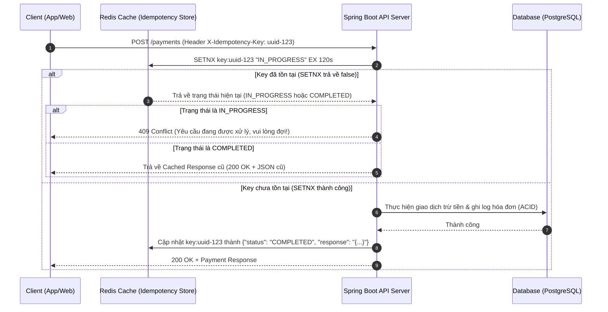

# Idempotency là gì? Thiết kế Idempotent API cho giao dịch thanh toán

## ⚡ Tóm tắt ngắn (30s)
**Tính lũy đẳng (Idempotency)** là khả năng của một API đảm bảo rằng việc thực hiện một yêu cầu nhiều lần liên tiếp sẽ đem lại **kết quả trạng thái hệ thống giống hệt** như khi thực hiện một lần duy nhất.
*   **Tại sao cần?** Trong môi trường mạng phân tán chập chờn, Client gửi yêu cầu thanh toán thành công, Server đã trừ tiền nhưng phản hồi mạng bị mất (Timeout). Client sẽ gửi lại (Retry). Nếu API không lũy đẳng, khách hàng sẽ bị **trừ tiền 2 lần**.
*   **Giải pháp chuẩn Enterprise**: Sử dụng cơ chế **Idempotency Key** (thường truyền qua Header `X-Idempotency-Key` dưới dạng UUID). Server phối hợp với một bộ nhớ đệm tốc độ cao (như Redis) để ghi nhận trạng thái xử lý của key này, đảm bảo không có giao dịch trùng lặp nào được thực thi.

---

## 🔍 Chi tiết bản chất thực chiến

### 1. Phác thảo kiến trúc Idempotency Key Pattern

Khi Client gửi một request có kèm theo `X-Idempotency-Key`, Server sẽ thực hiện quy trình kiểm tra và xử lý nghiêm ngặt qua các bước sau:



### 2. Các điểm mấu chốt khi thiết kế
1.  **Tính nguyên tử (Atomicity)**: Việc kiểm tra sự tồn tại của key và đánh dấu trạng thái "đang xử lý" (`IN_PROGRESS`) phải là một thao tác đơn lẻ, không thể bị xen ngang (Atomic). Ta sử dụng lệnh `SETNX` (Set if Not Exists) của Redis hoặc cơ chế Lock phân tán.
2.  **Thời gian sống (TTL - Time to Live)**: Idempotency Key không cần lưu trữ vĩnh viễn. Chỉ nên lưu trong khoảng thời gian đủ để client thực hiện retry thành công (ví dụ: 24 đến 48 giờ đối với thanh toán ngân hàng).
3.  **Xác thực Payload**: Để tránh trường hợp kẻ xấu gửi cùng một `X-Idempotency-Key` nhưng đổi body để thực hiện giao dịch khác, Server nên tạo mã hash (MD5/SHA256) từ payload và đính kèm vào key lưu trong Redis để so khớp chéo.

---

## 💻 Code thực chiến: BAD vs GOOD

### ❌ BAD: Không có cơ chế chống trùng lặp giao dịch
Controller xử lý thanh toán thô sơ, chỉ lưu thẳng vào DB. Khi mạng chập chờn và client click nút thanh toán liên tục, tài khoản khách hàng sẽ bị trừ tiền liên tiếp.

```java
@RestController
@RequestMapping("/api/v1/payments")
public class PaymentBadController {

    private final PaymentService paymentService;

    public PaymentBadController(PaymentService paymentService) {
        this.paymentService = paymentService;
    }

    @PostMapping
    public ResponseEntity<PaymentResponse> processPayment(@RequestBody PaymentRequest request) {
        // Anti-pattern: Nhận request và trừ tiền trực tiếp mà không kiểm tra trùng lặp!
        PaymentResponse response = paymentService.chargeMoney(request.getUserId(), request.getAmount());
        return ResponseEntity.ok(response);
    }
}
```

###  GOOD: Triển khai Idempotency Key bằng Redis trong Spring Boot
Sử dụng Redis để khóa giao dịch (Distributed Lock thô sơ qua `setIfAbsent`) và lưu trữ kết quả phản hồi của giao dịch đã hoàn tất.

```java
@RestController
@RequestMapping("/api/v1/payments")
public class PaymentGoodController {

    private final PaymentService paymentService;
    private final StringRedisTemplate redisTemplate;
    private final ObjectMapper objectMapper;

    public PaymentGoodController(PaymentService paymentService, 
                                 StringRedisTemplate redisTemplate, 
                                 ObjectMapper objectMapper) {
        this.paymentService = paymentService;
        this.redisTemplate = redisTemplate;
        this.objectMapper = objectMapper;
    }

    @PostMapping
    public ResponseEntity<?> processPayment(
            @RequestHeader("X-Idempotency-Key") String idempotencyKey,
            @RequestBody PaymentRequest request
    ) throws Exception {
        
        if (idempotencyKey == null || idempotencyKey.isBlank()) {
            return ResponseEntity.badRequest().body("Missing X-Idempotency-Key header");
        }

        String redisKey = "idempotency:payment:" + idempotencyKey;
        
        // Bước 1: Thử thiết lập trạng thái "IN_PROGRESS" bằng SETNX (Atomic)
        // Set TTL là 5 phút để khóa tạm thời trong lúc xử lý
        Boolean lockAcquired = redisTemplate.opsForValue()
                .setIfAbsent(redisKey, "IN_PROGRESS", Duration.ofMinutes(5));

        if (Boolean.FALSE.equals(lockAcquired)) {
            // Bước 2: Khóa không lấy được -> Key đã tồn tại. Lấy giá trị hiện tại ra kiểm tra.
            String currentValue = redisTemplate.opsForValue().get(redisKey);
            
            if ("IN_PROGRESS".equals(currentValue)) {
                // Đang xử lý giao dịch cũ, trả về lỗi 409 yêu cầu Client đợi
                return ResponseEntity.status(HttpStatus.CONFLICT)
                        .body("Transaction is being processed. Please do not retry yet.");
            }
            
            // Nếu trạng thái là COMPLETED, parse và trả về Response đã được cache từ trước
            PaymentResponse cachedResponse = objectMapper.readValue(currentValue, PaymentResponse.class);
            return ResponseEntity.ok()
                    .header("X-Cache-Lookup", "HIT - Idempotent response")
                    .body(cachedResponse);
        }

        try {
            // Bước 3: Đã lấy được khóa -> Tiến hành thực hiện nghiệp vụ thanh toán (Database transaction)
            PaymentResponse response = paymentService.chargeMoney(request.getUserId(), request.getAmount());
            
            // Bước 4: Lưu kết quả thành công vào Redis với TTL dài hơn (ví dụ: 24 giờ)
            String responseJson = objectMapper.writeValueAsString(response);
            redisTemplate.opsForValue().set(redisKey, responseJson, Duration.ofHours(24));
            
            return ResponseEntity.ok(response);
            
        } catch (Exception ex) {
            // Bước 5: Nếu xử lý nghiệp vụ thất bại, xóa key trong Redis để cho phép client retry lại từ đầu
            redisTemplate.delete(redisKey);
            throw ex;
        }
    }
}
```

---

## 📊 Trade-off: Lựa chọn hạ tầng lưu trữ Idempotency Key

| Tiêu chí | Lưu trữ trên Redis (Cache-aside) | Lưu trữ trực tiếp trên Database |
| :--- | :--- | :--- |
| **Hiệu năng (Performance)** | **Cực nhanh (Sub-millisecond)**. Giải phóng áp lực IO cho cơ sở dữ liệu chính. | Chậm hơn do phải chịu disk IO của DB. |
| **Tính nhất quán (Consistency)** | Rủi ro mất mát dữ liệu nếu Redis bị crash giữa chừng và không bật AOF persistence. | **Tuyệt đối**. Đảm bảo dữ liệu khóa nằm trong cùng một ACID Transaction với bảng Payment. |
| **Thời gian triển khai** | Rất nhanh thông qua Redis SDK và Spring AOP Interceptor. | Yêu cầu thiết kế bảng riêng (`idempotent_keys`) và quản lý scheduler xóa data định kỳ. |
| **Use-case phù hợp** | Hệ thống High-Throughput (Traffic cực lớn, thanh toán nhanh, ví điện tử). | Hệ thống tài chính ngân hàng lõi (Core Banking) đề cao tính chính xác hơn tốc độ. |

---

## ⚠️ Common Gotchas & Questions follow-up

* **Cạm bẫy "Mất điện giữa chừng" (State mismatch)**:
  Nếu server gọi API trừ tiền của bên thứ ba thành công, nhưng trước khi kịp ghi nhận kết quả `COMPLETED` vào Redis thì server bị crash hoặc mất điện đột ngột.
  * *Hệ quả:* Redis vẫn giữ trạng thái `IN_PROGRESS` cho đến khi hết hạn TTL 5 phút, hoặc đã bị xóa ở khối `catch`. Khi client gửi lại request, hệ thống sẽ coi là request mới và thực thi trừ tiền lại $\r\rightarrow$ Lỗi trùng lặp nghiêm trọng.
  * *Khắc phục:* Đối với các dịch vụ cực kỳ nhạy cảm liên quan đến tiền bạc, bắt buộc phải sử dụng **Database Transaction** để ghi chép. Tạo một bảng `idempotency_keys` ngay trong DB chính. Lệnh tạo giao dịch trừ tiền và lệnh ghi nhận khóa phải chạy trong cùng một transaction. Nếu có crash giữa chừng, toàn bộ tiến trình sẽ tự động rollback an toàn.

* **Câu hỏi đào sâu từ interviewer**: *Làm sao để thiết kế Idempotent API cho phương thức HTTP GET mà không cần dùng Idempotency Key?*
  * *(Trả lời: Về mặt định nghĩa của giao thức HTTP, bản thân phương thức GET **bắt buộc phải mặc định lũy đẳng (by-design)**. Một API GET được thiết kế đúng chuẩn RESTful sẽ không bao giờ được phép thực hiện các thao tác ghi dữ liệu, thay đổi trạng thái tài nguyên hay trừ tiền trong DB. Nó chỉ đơn thuần là đọc dữ liệu lên trả về cho Client. Do đó, bạn không bao giờ cần thiết kế Idempotency Key cho phương thức GET).*
