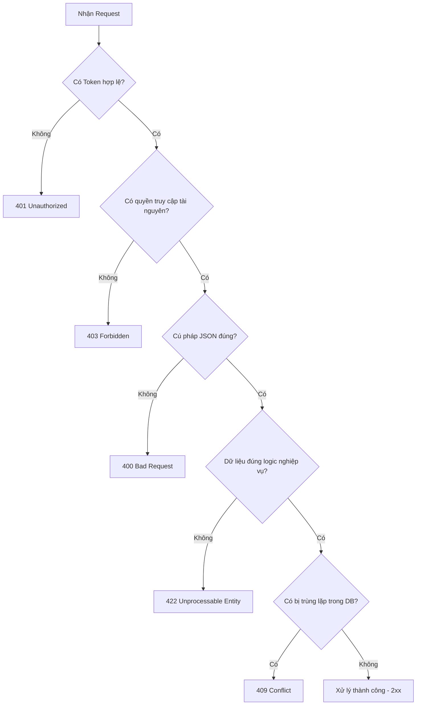

# HTTP Status Codes: Phân loại và Sử dụng chuẩn Enterprise

## ⚡ Tóm tắt ngắn (30s)
HTTP Status Codes là các mã trạng thái tiêu chuẩn được Server trả về để thông báo cho Client biết kết quả của một yêu cầu. Việc lựa chọn mã lỗi chuẩn xác giúp API tự mô tả rõ ràng, giảm tải công sức debug và cải thiện trải nghiệm tích hợp của đối tác.
*   **2xx (Thành công)**: `200 OK` (Đọc/Cập nhật thành công), `201 Created` (Tạo mới thành công), `204 No Content` (Xóa thành công, không trả về body).
*   **4xx (Lỗi phía Client)**: `400 Bad Request` (Sai cú pháp, sai kiểu dữ liệu), `401 Unauthorized` (Chưa chứng thực/Sai token), `403 Forbidden` (Đã chứng thực nhưng không có quyền truy cập), `404 Not Found` (Không tìm thấy tài nguyên), `409 Conflict` (Xung đột trạng thái hệ thống/Trùng lặp dữ liệu), `422 Unprocessable Entity` (Dữ liệu hợp lệ cú pháp nhưng vi phạm logic nghiệp vụ/Validation).
*   **5xx (Lỗi phía Server)**: `500 Internal Server Error` (Lỗi logic hệ thống, NullPointerException, crash DB).

---

## 🔍 Chi tiết bản chất thực chiến

### 1. Phân biệt các mã lỗi dễ gây nhầm lẫn



#### ⚖️ 401 Unauthorized vs 403 Forbidden
*   **401 Unauthorized**: Thực chất có nghĩa là **Unauthenticated** (Chưa được xác thực). Sử dụng khi Client không gửi thông tin định danh (Token/Cookie) hoặc thông tin định danh gửi lên đã hết hạn/không hợp lệ.
*   **403 Forbidden**: Sử dụng khi Server đã biết chính xác bạn là ai (đã xác thực thành công), nhưng bạn **không có vai trò hoặc quyền hạn** (Role/Permission) để thực hiện hành động này.

#### ⚖️ 400 Bad Request vs 422 Unprocessable Entity (WebDAV)
*   **400 Bad Request**: Lỗi nghiêm trọng về mặt kỹ thuật. Client gửi request sai định dạng cú pháp (ví dụ: JSON bị thiếu dấu ngoặc nhọn, truyền chuỗi chữ vào trường kiểu số `Long`, thiếu Query Param bắt buộc). Server không thể parse được request.
*   **422 Unprocessable Entity**: Request hoàn toàn đúng cú pháp kỹ thuật và Server parse thành công. Tuy nhiên, các giá trị dữ liệu bên trong vi phạm luật nghiệp vụ (ví dụ: trường `email` sai định dạng, `password` quá ngắn, hoặc tuổi dưới 18).

#### ⚖️ 404 Not Found vs 409 Conflict
*   **404 Not Found**: Tài nguyên được yêu cầu không tồn tại tại URI chỉ định.
*   **409 Conflict**: Yêu cầu không thể thực hiện được do xung đột với trạng thái hiện tại của hệ thống (ví dụ: Đăng ký tài khoản với email đã tồn tại, cập nhật dữ liệu bị lỗi do vi phạm khoá ngoại hoặc Optimistic Locking).

---

## 💻 Code thực chiến: BAD vs GOOD

### ❌ BAD: Dùng bừa bãi mã lỗi hoặc "mọi thứ trả về 200 OK"
Lỗi phổ biến nhất của các hệ thống mới xây dựng là luôn trả về `200 OK` ở mọi tình huống, kèm theo một cờ `success: false` ở bên trong body. Đây là một anti-pattern cực lớn vì nó vô hiệu hóa hoàn toàn cơ chế giám sát (Monitoring) của API Gateway và làm khó các thư viện HttpClient của frontend.

```java
@RestController
@RequestMapping("/api/v1/users")
public class UserBadController {

    @PostMapping
    public ResponseEntity<Map<String, Object>> createUser(@RequestBody UserDto userDto) {
        Map<String, Object> response = new HashMap<>();
        try {
            User user = userService.save(userDto);
            response.put("success", true);
            response.put("data", user);
            return ResponseEntity.ok(response); // Vi phạm: Tạo mới nhưng trả về 200 OK thay vì 201
        } catch (Exception ex) {
            response.put("success", false);
            response.put("message", ex.getMessage());
            return ResponseEntity.ok(response); // Vi phạm cực nặng: Có lỗi hệ thống nhưng vẫn trả về 200 OK!
        }
    }
}
```

###  GOOD: Triển khai Exception Handler tập trung trả về HTTP Status chuẩn chỉnh
Sử dụng Controller Advice để bắt các ngoại lệ nghiệp vụ và tự động ánh xạ chúng sang HTTP Status Codes tương ứng một cách thanh lịch và sạch sẽ.

```java
// 1. Controller viết cực gọn, chỉ xử lý trường hợp thành công
@RestController
@RequestMapping("/api/v1/users")
public class UserGoodController {

    private final UserService userService;

    public UserGoodController(UserService userService) {
        this.userService = userService;
    }

    @PostMapping
    public ResponseEntity<User> createUser(@Valid @RequestBody UserDto userDto) {
        User createdUser = userService.save(userDto);
        
        // 201 Created: Báo hiệu tạo tài nguyên thành công kèm đường dẫn tài nguyên mới ở Header Location
        URI location = ServletUriComponentsBuilder.fromCurrentRequest()
                .path("/{id}")
                .buildAndExpand(createdUser.getId())
                .toUri();
                
        return ResponseEntity.created(location).body(createdUser);
    }
}

// 2. Bộ xử lý ngoại lệ tập trung (Global Exception Handler)
@ControllerAdvice
public class GlobalExceptionHandler {

    // Bắt lỗi Validation dữ liệu đầu vào (@Valid) -> Ánh xạ về 422 Unprocessable Entity
    @ExceptionHandler(MethodArgumentNotValidException.class)
    public ResponseEntity<ErrorDetails> handleValidationException(MethodArgumentNotValidException ex) {
        List<String> errors = ex.getBindingResult().getFieldErrors().stream()
                .map(error -> error.getField() + ": " + error.getDefaultMessage())
                .toList();

        ErrorDetails errorDetails = new ErrorDetails(
                LocalDateTime.now(),
                "Validation Failed",
                errors.toString()
        );
        return ResponseEntity.status(HttpStatus.UNPROCESSABLE_ENTITY).body(errorDetails);
    }

    // Bắt lỗi trùng lặp dữ liệu (Ví dụ: Email đã tồn tại) -> Ánh xạ về 409 Conflict
    @ExceptionHandler(DuplicateEmailException.class)
    public ResponseEntity<ErrorDetails> handleDuplicateEmail(DuplicateEmailException ex) {
        ErrorDetails errorDetails = new ErrorDetails(LocalDateTime.now(), "Conflict Data", ex.getMessage());
        return ResponseEntity.status(HttpStatus.CONFLICT).body(errorDetails);
    }

    // Bắt lỗi không tìm thấy tài nguyên -> Ánh xạ về 404 Not Found
    @ExceptionHandler(ResourceNotFoundException.class)
    public ResponseEntity<ErrorDetails> handleNotFound(ResourceNotFoundException ex) {
        ErrorDetails errorDetails = new ErrorDetails(LocalDateTime.now(), "Resource Not Found", ex.getMessage());
        return ResponseEntity.status(HttpStatus.NOT_FOUND).body(errorDetails);
    }

    // Bắt tất cả các lỗi hệ thống unhandled khác -> Ánh xạ về 500 Internal Server Error
    @ExceptionHandler(Exception.class)
    public ResponseEntity<ErrorDetails> handleGlobalException(Exception ex) {
        // Ghi log lỗi chi tiết ra hệ thống để debug
        log.error("Unhandled exception occurred: ", ex);
        
        ErrorDetails errorDetails = new ErrorDetails(
                LocalDateTime.now(),
                "Internal Server Error",
                "An unexpected error occurred. Please contact administrator."
        );
        return ResponseEntity.status(HttpStatus.INTERNAL_SERVER_ERROR).body(errorDetails);
    }
}
```

---

## 📊 Trade-off: Thiết kế chi tiết lỗi (Error Payload) vs Bảo mật

Khi hệ thống trả về mã lỗi 4xx/5xx, ta cần cân nhắc kỹ lượng thông tin trả về trong body:

| Cách tiếp cận | Ưu điểm | Nhược điểm |
| :--- | :--- | :--- |
| **Expose chi tiết (Stacktrace/Database Error)** | Frontend developer và đối tác tích hợp có thể phát hiện chính xác lỗi là gì ngay lập tức mà không cần hỏi đội backend. | **Nguy cơ bảo mật cực cao**. Kẻ tấn công có thể biết được cấu trúc database, phiên bản thư viện hoặc logic nội bộ để khai thác lỗ hổng. |
| **Ẩn hoàn toàn (Chỉ trả về mã lỗi chung)** | Bảo mật tuyệt đối. Kẻ xấu không khai thác được bất kỳ thông tin nhạy cảm nào từ hệ thống. | Cực kỳ khó khăn cho việc tích hợp và kiểm thử. Dev phải lục lọi file log trên server để biết tại sao lỗi. |
| **Giải pháp tối ưu (Hybrid)** | Trả về thông báo nghiệp vụ thân thiện + **Correlation ID (Trace ID)**. Dev lấy Trace ID tra cứu log chi tiết trên ELK/Splunk. | Cần đầu tư xây dựng hạ tầng log tập trung để tra cứu hiệu quả. |

---

## ⚠️ Common Gotchas & Questions follow-up

* **Cạm bẫy "Mất mã lỗi thực" do API Gateway hoặc CDN**:
  Một lỗi kinh điển khi chạy trên production là mặc dù server Spring Boot của bạn cố gắng trả về lỗi `422` chi tiết cho client kèm theo lý do vi phạm trường nào, nhưng bộ lọc của **Nginx Reverse Proxy** hoặc **Cloudflare CDN** được cấu hình mặc định để bắt tất cả các lỗi `>= 400` và ghi đè bằng một trang HTML lỗi mặc định đẹp đẽ của họ.
  * *Hệ quả:* Client chỉ nhận được phản hồi HTML thô sơ thay vì payload JSON nghiệp vụ, gây crash ứng dụng mobile.
  * *Khắc phục:* Cần cấu hình bypass hoặc loại bỏ chỉ thị `proxy_intercept_errors` trong cấu hình Nginx để đảm bảo payload gốc từ server được truyền thẳng về client.

* **Câu hỏi đào sâu từ interviewer**: *Nếu tôi có nghiệp vụ "xóa một bản ghi", và bản ghi đó thực chất đã bị xóa trước đó rồi, tôi nên trả về 204 hay 404?*
  * *(Trả lời: Điều này tùy thuộc vào nghiệp vụ của bạn:
    1. Nếu hành động xóa của client mang tính chất khai báo (Idempotent): "Tôi muốn đảm bảo thực thể này không tồn tại", hãy trả về **204 No Content** (hoặc 200 OK) để client coi như đã hoàn thành mục tiêu.
    2. Nếu hành động xóa mang tính ràng buộc nghiệp vụ cao: "Tôi chỉ được xóa thứ tôi biết chắc chắn đang tồn tại", hãy trả về **404 Not Found** để cảnh báo cho client biết họ đang gửi một request không hợp lệ).*
