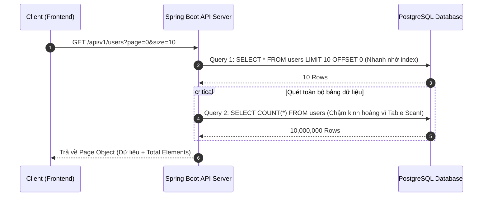

# Thiết kế Phân trang (Pagination) tối ưu hiệu năng ở quy mô dữ liệu lớn

## ⚡ Tóm tắt ngắn (30s)
Phân trang là bắt buộc đối với mọi API trả về danh sách đối tượng để bảo vệ Server khỏi lỗi cạn kiệt bộ nhớ (OOM) và giảm tải băng thông mạng. Tuy nhiên, khi quy mô dữ liệu lên tới hàng triệu bản ghi, phân trang mặc định sẽ gặp nút thắt cổ chai cực lớn.
*   **Thiết kế API chuẩn chỉnh**: Bắt buộc giới hạn kích thước trang tối đa (`maxSize`), cung cấp cấu trúc phản hồi đồng nhất.
*   **Tối ưu hóa hiệu năng**: Tránh thực hiện lệnh `COUNT(*)` đắt đỏ ở mỗi request; sử dụng cơ chế đếm lười (Lazy Count), bộ nhớ đệm (Count Caching), hoặc loại bỏ hoàn toàn tổng số bản ghi và thay thế bằng cờ `hasMore` (hoặc `hasNext`).

---

## 🔍 Chi tiết bản chất thực chiến

### 1. Nút thắt cổ chai "COUNT(*)" âm thầm giết chết Database
Mặc định, khi dùng các thư viện như Spring Data JPA Pageable, hệ thống sẽ thực hiện **2 truy vấn SQL** song song:
1.  Truy vấn lấy dữ liệu trang hiện tại: `SELECT * FROM users LIMIT 10 OFFSET 100`
2.  Truy vấn đếm tổng số bản ghi để tính số trang: `SELECT COUNT(*) FROM users`



Ở quy mô dữ liệu nhỏ, lệnh `COUNT(*)` chạy tức thời. Nhưng khi bảng có **hàng chục triệu dòng**, lệnh `COUNT(*)` buộc database phải thực hiện quét toàn bộ bảng (Table Scan) hoặc quét chỉ mục lớn (Index Scan), tiêu tốn cực nhiều CPU và đĩa (Disk I/O), khiến API bị nghẽn cổ chai nghiêm trọng.

### 2. Các chiến lược tối ưu hóa phân trang cấp Enterprise

1.  **Giới hạn cứng Page Size (Capping size)**:
    Tránh trường hợp client cố tình truyền `size=1000000` để vét cạn DB, gây sập server. Luôn kiểm tra và ép kích thước trang về một ngưỡng an toàn (ví dụ: tối đa 100 bản ghi).
2.  **Sử dụng Slice thay vì Page (Không đếm tổng số)**:
    Trong thực tế, người dùng lướt Facebook, Shopee hay Tiktok chỉ cuộn xuống dưới (Infinite Scroll) hoặc click "Xem thêm", họ không quan tâm hệ thống có chính xác bao nhiêu triệu bản ghi.
    *   *Giải pháp:* Dùng `Slice<T>` trong Spring Boot. Hệ thống chỉ lấy thêm $N+1$ phần tử (ví dụ yêu cầu 10, ta lấy 11). Nếu có phần tử thứ 11, ta biết vẫn còn trang tiếp theo (`hasNext = true`) và trả về đúng 10 phần tử cho client mà không cần chạy lệnh `COUNT(*)`!
3.  **Count Caching (Lưu trữ tổng số bản ghi ở Redis/Metadata)**:
    Đối với các bảng dữ liệu ít biến động, ta có thể cache giá trị `COUNT(*)` vào Redis với TTL khoảng 10-15 phút, hoặc định kỳ chạy một cronjob cập nhật số lượng dòng thay vì đếm động ở mọi request.

---

## 💻 Code thực chiến: BAD vs GOOD

### ❌ BAD: Phân trang mặc định dễ gây sập bộ nhớ và nghẽn DB
Controller dưới đây không giới hạn kích thước trang đầu vào, và sử dụng kiểu trả về `Page` mặc định, ép hệ thống chạy lệnh `COUNT(*)` đắt đỏ vô điều kiện.

```java
@RestController
@RequestMapping("/api/v1/logs")
public class LogBadController {

    private final SystemLogRepository logRepository;

    public LogBadController(SystemLogRepository logRepository) {
        this.logRepository = logRepository;
    }

    // Anti-pattern 1: Không giới hạn size đầu vào. Client truyền size=5000000 sẽ gây Java OOM!
    // Anti-pattern 2: Trả về Page<T> buộc JPA chạy lệnh COUNT(*) đếm hàng chục triệu bản ghi log!
    @GetMapping
    public Page<SystemLog> getLogs(Pageable pageable) {
        return logRepository.findAll(pageable);
    }
}
```

###  GOOD: Tối ưu phân trang bằng Slice & Giới hạn Page Size cứng
Sử dụng bộ lọc đầu vào để giới hạn `size` tối đa, sử dụng kiểu trả về `Slice` để loại bỏ hoàn toàn truy vấn `COUNT(*)`.

```java
@RestController
@RequestMapping("/api/v1/logs")
public class LogGoodController {

    private final SystemLogRepository logRepository;
    private static final int MAX_PAGE_SIZE = 100; // Giới hạn cứng 100 bản ghi/trang

    public LogGoodController(SystemLogRepository logRepository) {
        this.logRepository = logRepository;
    }

    @GetMapping
    public ResponseEntity<SliceResponse<SystemLogDto>> getLogs(
            @RequestParam(defaultValue = "0") int page,
            @RequestParam(defaultValue = "20") int size
    ) {
        // 1. Bảo vệ hệ thống: Capping page size đầu vào
        int sanitizedSize = Math.min(size, MAX_PAGE_SIZE);
        
        // Tạo Pageable với thông số an toàn
        Pageable pageable = PageRequest.of(page, sanitizedSize, Sort.by("createdAt").descending());

        // 2. Sử dụng Slice thay vì Page để tránh lệnh COUNT(*) đắt đỏ
        // Spring Data JPA sẽ sinh câu SQL có LIMIT = size + 1 (ví dụ LIMIT 21) để tự kiểm tra hasNext
        Slice<SystemLog> logSlice = logRepository.findSliceAll(pageable);

        // Map sang DTO và đóng gói Response đồng nhất
        Slice<SystemLogDto> dtoSlice = logSlice.map(log -> new SystemLogDto(log.getId(), log.getMessage(), log.getCreatedAt()));
        
        return ResponseEntity.ok(new SliceResponse<>(dtoSlice));
    }
}

// Lớp Wrapper Response chuẩn chỉnh cho API phân trang Slice
class SliceResponse<T> {
    private final List<T> content;
    private final int currentPage;
    private final int pageSize;
    private final boolean hasNext;

    public SliceResponse(Slice<T> slice) {
        this.content = slice.getContent();
        this.currentPage = slice.getNumber();
        this.pageSize = slice.getSize();
        this.hasNext = slice.hasNext(); // Trả về hasNext thay vì totalElements đắt đỏ
    }
    
    // Getters...
}
```

---

## 📊 So sánh các giải pháp đếm tổng số (Count Strategies)

| Chiến lược | Ưu điểm | Nhược điểm | Use-case phù hợp |
| :--- | :--- | :--- | :--- |
| **Đếm động mặc định (`COUNT(*)`)** | Cung cấp thông tin hoàn hảo cho Client hiển thị thanh phân trang đầy đủ (1, 2, 3... 99). | Cực kỳ chậm khi bảng dữ liệu vượt quá 1 triệu dòng. | Các bảng cấu hình, danh mục nhỏ, ít dữ liệu. |
| **Bỏ đếm (`Slice` / `hasNext`)** | **Hiệu năng tối đa**. Tốc độ phản hồi cực nhanh và không phụ thuộc vào độ lớn của bảng dữ liệu. | Client chỉ có thể làm tính năng "Xem thêm" hoặc cuộn vô tận, không nhảy trang cụ thể được. | **Ứng dụng hiện đại (Mạng xã hội, E-commerce, Log Viewer)**. |
| **Cache đếm (Redis Cache count)** | Nhanh, vẫn giữ được trải nghiệm hiển thị tổng trang ở Client. | Số liệu tổng dòng có thể bị lệch (Stale) một chút so với thực tế DB. | Bảng dữ liệu lớn nhưng ít thay đổi (ví dụ: Danh sách sách trong thư viện). |
| **Đếm ước lượng (Estimated Count)** | Cực nhanh. Tận dụng dữ liệu thống kê của DB Engine (như `reltuples` trong PostgreSQL). | Số lượng đếm chỉ mang tính tương đối, không chính xác tuyệt đối. | Hiển thị số liệu ước lượng dạng "Tìm thấy khoảng 1,200,000 kết quả" như Google. |

---

## ⚠️ Common Gotchas & Questions follow-up

* **Cạm bẫy "Data Drift" (Trôi lệch dữ liệu) khi dùng phân trang dạng Offset**:
  Khi người dùng đang ở trang 1 và chuẩn bị click sang trang 2, nếu trong DB có một bản ghi mới được chèn vào đầu bảng:
  * *Hệ quả:* Toàn bộ dữ liệu bị đẩy lùi xuống 1 dòng. Khi client tải trang 2, bản ghi cuối cùng của trang 1 sẽ xuất hiện lại ở đầu trang 2 $\r\rightarrow$ Người dùng bị trùng dữ liệu. Ngược lại, nếu có bản ghi bị xóa, người dùng sẽ bị sót dữ liệu.
  * *Khắc phục:* Với các bảng dữ liệu biến động cao, bắt buộc phải thiết kế phân trang theo dạng **Cursor Pagination (Keyset Pagination)** để đảm bảo dữ liệu hiển thị không bao giờ bị lệch.

* **Câu hỏi đào sâu từ interviewer**: *Nếu ứng dụng quản trị (Admin Portal) của doanh nghiệp bắt buộc phải có tính năng hiển thị tổng số dòng và cho phép nhảy tới một trang bất kỳ (ví dụ: Trang 45000), bạn sẽ giải quyết bài toán hiệu năng thế nào?*
  * *(Trả lời: Với hệ quản trị nội bộ đòi hỏi nhảy trang cụ thể, ta không thể dùng Slice. Cách tối ưu nhất là phối hợp **Count Caching** và **Deferred Join** trong SQL. Ta sẽ cache tổng số dòng trong Redis với TTL phù hợp.
    Đồng thời, khi viết câu lệnh SQL phân trang sâu (Deep Offset), thay vì dùng `SELECT * FROM users LIMIT 10 OFFSET 450000`, ta sẽ thực hiện Deferred Join bằng cách chỉ select trường `id` có đánh chỉ mục trước để lấy ra 10 ID cần thiết: `SELECT id FROM users LIMIT 10 OFFSET 450000`, sau đó mới JOIN ngược lại bảng chính để lấy đầy đủ các cột dữ liệu. Việc này tránh cho database phải nạp các cột dữ liệu lớn không cần thiết của 450,000 dòng vào bộ nhớ).*
