# So sánh chi tiết: Offset Pagination vs Cursor Pagination

## ⚡ Tóm tắt ngắn (30s)
Khi thiết kế API phân trang cho lượng dữ liệu lớn, việc chọn lựa giữa **Offset Pagination** và **Cursor (Keyset) Pagination** quyết định trực tiếp đến hiệu năng của hệ thống.
*   **Offset Pagination**: Sử dụng cặp tham số `page` và `size`, ánh xạ trực tiếp thành cú pháp `LIMIT size OFFSET (page * size)` trong SQL. Dễ dàng triển khai, hỗ trợ nhảy tới một trang bất kỳ (Trang 1, 2... 10), nhưng **cực kỳ chậm** ở các trang cuối cùng (Deep Offset) và gặp lỗi **Trôi lệch dữ liệu (Data Drift)**.
*   **Cursor Pagination**: Sử dụng một con trỏ `cursor` (thường là một chuỗi mã hóa đại diện cho điểm kết thúc của trang trước) kết hợp với `size`, ánh xạ thành truy vấn index `WHERE id < cursor LIMIT size` trong SQL. Hiệu năng **nhanh vượt trội và ổn định (O(1) hoặc O(log N))** bất kể trang sâu đến đâu, chống trôi lệch dữ liệu tuyệt đối, nhưng **không hỗ trợ nhảy trang bất kỳ**.

---

## 🔍 Chi tiết bản chất thực chiến

### 1. Phân tích Bản chất Vận hành dưới Database (SQL Engine)

Để hiểu tại sao Offset Pagination lại chậm ở các trang sâu, hãy so sánh cách Database xử lý hai câu lệnh SQL dưới đây đối với bảng `orders` có 10 triệu bản ghi (đã đánh index cột `id`):

#### 🐢 Trường hợp 1: Offset Pagination (Deep Offset)
```sql
SELECT * FROM orders 
ORDER BY id DESC 
LIMIT 10 OFFSET 9000000;
```
*   **Cơ chế hoạt động**: Database Engine **không thể** nhảy trực tiếp đến dòng thứ 9,000,000. Nó bắt buộc phải duyệt và nạp vào bộ nhớ **9,000,010 dòng** từ chỉ mục (Index Scan), sắp xếp chúng, sau đó **vứt bỏ 9,000,000 dòng đầu tiên** và chỉ lấy ra 10 dòng cuối cùng.
*   **Hệ quả**: Thời gian phản hồi tăng tuyến tính với độ sâu của trang. CPU và RAM của DB bị vắt kiệt.

#### 🚀 Trường hợp 2: Cursor Pagination
```sql
-- Client truyền lên con trỏ cursor = 1000234 (ID của order cuối cùng ở trang trước)
SELECT * FROM orders 
WHERE id < 1000234 
ORDER BY id DESC 
LIMIT 10;
```
*   **Cơ chế hoạt động**: Nhờ điều kiện `id < 1000234` trên cột đã được đánh index, DB Engine sử dụng thuật toán B-Tree để tìm kiếm trực tiếp (Index Seek) đến vị trí của bản ghi có ID `1000234` chỉ trong **vài phần triệu giây (O(log N))**. Sau đó, nó quét tiếp đúng 10 bản ghi tiếp theo nằm ngay bên cạnh trên cấu trúc đĩa rồi trả về ngay lập tức.
*   **Hệ quả**: Tốc độ phản hồi cực nhanh (thường dưới 5ms) và hoàn toàn **không đổi** dù bạn đang ở trang đầu tiên hay trang thứ một triệu.

---

### 2. Hiện tượng trôi lệch dữ liệu (Data Drift)
Giả sử có danh sách sắp xếp giảm dần. Người dùng đang xem Trang 1 gồm các bản ghi từ 10 đến 6.

```mermaid
gantt
    title Hiện tượng Trôi lệch Dữ liệu (Data Drift)
    dateFormat  X
    axisFormat %s

    section Offset - Client xem trang 1
    Bản ghi 10 : active, p1, 0, 1
    Bản ghi 9  : active, p2, 1, 2
    Bản ghi 8  : active, p3, 2, 3
    
    section DB bị chèn bản ghi 11 mới
    Bản ghi 11 (Mới) : crit, p4, 0, 1
    Bản ghi 10 : active, p5, 1, 2
    Bản ghi 9  : active, p6, 2, 3
    
    section Offset - Client nhảy trang 2 (OFFSET 3)
    Bản ghi 8  : active, p7, 3, 4
    Bản ghi 7  : active, p8, 4, 5
    Bản ghi 8 (BỊ TRÙNG LẶP!) : active, p9, 3, 4
```



*   **Với Offset (OFFSET 3)**: Khi sang trang 2, DB bỏ qua 3 bản ghi đầu tiên (hiện tại là 11, 10, 9). Kết quả trang 2 sẽ chứa bản ghi **8**, 7, 6. Người dùng bị xem lại bản ghi **8** hai lần!
*   **Với Cursor (`WHERE id < 8`)**: Khi sang trang 2, DB chỉ tìm các bản ghi có ID nhỏ hơn `8`. Kết quả trả về chắc chắn là 7, 6, 5. Không hề bị trùng lặp dữ liệu!

---

## 💻 Code thực chiến: Triển khai Cursor Pagination trong Spring Boot

Khi phân trang theo Cursor, con trỏ cursor thường được mã hóa dưới dạng chuỗi Base64 để ẩn chi tiết cài đặt phía dưới và tránh client tự ý chỉnh sửa lung tung.

### Implementation: Triển khai Cursor Pagination với Composite Cursor (Sắp xếp theo ID và thời gian tạo)

```java
@RestController
@RequestMapping("/api/v1/feed")
public class UserFeedController {

    private final PostRepository postRepository;

    public UserFeedController(PostRepository postRepository) {
        this.postRepository = postRepository;
    }

    @GetMapping
    public ResponseEntity<CursorResponse<PostDto>> getFeed(
            @RequestParam(required = false) String cursor,
            @RequestParam(defaultValue = "10") int limit
    ) {
        LocalDateTime cursorCreatedTime = null;
        Long cursorId = null;

        // 1. Giải mã con trỏ Cursor (Base64) được truyền từ client
        if (cursor != null && !cursor.isBlank()) {
            try {
                String decoded = new String(Base64.getDecoder().decode(cursor));
                // Định dạng cursor mã hóa: "yyyy-MM-ddTHH:mm:ss,id" (ví dụ: "2026-05-22T20:00:00,12345")
                String[] parts = decoded.split(",");
                cursorCreatedTime = LocalDateTime.parse(parts[0]);
                cursorId = Long.parseLong(parts[1]);
            } catch (Exception e) {
                return ResponseEntity.badRequest().body(null);
            }
        }

        // 2. Query database sử dụng index kết hợp (composite)
        // Chúng ta muốn sắp xếp Post theo createdAt giảm dần, nếu trùng thì theo ID giảm dần
        List<Post> posts;
        int queryLimit = limit + 1; // Lấy dư 1 phần tử để xác định nextCursor
        
        if (cursorId == null) {
            posts = postRepository.findFirstPage(queryLimit);
        } else {
            posts = postRepository.findNextPage(cursorCreatedTime, cursorId, queryLimit);
        }

        // 3. Xử lý dữ liệu và tạo con trỏ tiếp theo (nextCursor)
        boolean hasNext = posts.size() > limit;
        List<Post> resultData = hasNext ? posts.subList(0, limit) : posts;
        
        String nextCursor = null;
        if (hasNext) {
            Post lastPost = resultData.get(resultData.size() - 1);
            // Tạo chuỗi raw cursor mới
            String rawCursor = lastPost.getCreatedAt().toString() + "," + lastPost.getId();
            // Mã hóa sang Base64
            nextCursor = Base64.getEncoder().encodeToString(rawCursor.getBytes());
        }

        // Map sang DTO
        List<PostDto> content = resultData.stream()
                .map(p -> new PostDto(p.getId(), p.getTitle(), p.getCreatedAt()))
                .toList();

        return ResponseEntity.ok(new CursorResponse<>(content, nextCursor, hasNext));
    }
}

// Định nghĩa câu SQL hiệu năng cao trong Spring Data JPA Repository
@Repository
public interface PostRepository extends JpaRepository<Post, Long> {

    @Query(value = "SELECT * FROM posts ORDER BY created_at DESC, id DESC LIMIT :limit", nativeQuery = true)
    List<Post> findFirstPage(@Param("limit") int limit);

    // Sử dụng cú pháp Tuple Comparison (so sánh đa cột) tối ưu index trong PostgreSQL/MySQL
    @Query(value = "SELECT * FROM posts " +
                   "WHERE (created_at, id) < (:cursorTime, :cursorId) " +
                   "ORDER BY created_at DESC, id DESC LIMIT :limit", nativeQuery = true)
    List<Post> findNextPage(@Param("cursorTime") LocalDateTime cursorTime, 
                            @Param("cursorId") Long cursorId, 
                            @Param("limit") int limit);
}
```

---

## 📊 Bảng so sánh toàn diện: Offset vs Cursor Pagination

| Tiêu chí | Offset Pagination | Cursor Pagination |
| :--- | :--- | :--- |
| **Hiệu năng trên dữ liệu lớn** | **Kém**. Tốc độ chậm dần đều ở các trang sâu. | **Cực tốt**. Tốc độ phản hồi cực nhanh và bất biến O(1). |
| **Độ ổn định dữ liệu (Data Drift)** | **Kém**. Dễ bị trùng lặp/sót dữ liệu khi có hành động INSERT/DELETE ở trang trước. | **Hoàn hảo**. Chống trôi lệch dữ liệu tuyệt đối. |
| **Nhảy tới trang bất kỳ** | **Có**. Client có thể click trực tiếp tới trang 50. | **Không**. Chỉ có thể điều hướng "Trước/Sau" (Next/Previous). |
| **Độ phức tạp lập trình** | Rất đơn giản. Spring Boot hỗ trợ tận răng qua `Pageable`. | Phức tạp hơn. Cần tự viết câu query SQL tối ưu index và xử lý mã hóa cursor. |
| **Khả năng sắp xếp (Sort)** | Rất linh hoạt. Thích hợp sắp xếp theo bất kỳ cột nào tùy chọn. | Khó hơn nhiều. Yêu cầu cột dùng làm cursor bắt buộc phải Unique và Sequential (như ID tăng dần, timestamp...). |
| **Use-case phù hợp** | Admin Dashboards, Báo cáo nội bộ, dữ liệu nhỏ biến động ít. | **Infinite Scroll (Facebook, Twitter, TikTok), Chat history, High-traffic API**. |

---

## ⚠️ Common Gotchas & Questions follow-up

* **Cạm bẫy "Cursor không Unique" gây mất dữ liệu**:
  Nếu bạn sử dụng trường `createdAt` hoặc `price` để làm cursor, điều gì xảy ra nếu có 20 bản ghi cùng được tạo vào đúng một thời điểm hoặc cùng có mức giá là $10?
  * *Hệ quả:* Khi dùng câu lệnh so sánh thông thường `WHERE price < cursorPrice`, database sẽ bỏ sót (skip) toàn bộ các bản ghi còn lại có cùng mức giá $10 ở trang tiếp theo, dẫn đến mất dữ liệu nghiêm trọng hiển thị trên giao diện người dùng.
  * *Khắc phục:* **Luôn luôn sử dụng Composite Cursor kết hợp với một trường duy nhất (như Primary Key ID)**. Như ví dụ code ở trên, câu lệnh so sánh cặp `(created_at, id) < (:cursorTime, :cursorId)` đảm bảo tính duy nhất tuyệt đối của con trỏ và không bao giờ bỏ sót bất kỳ bản ghi nào.

* **Câu hỏi đào sâu từ interviewer**: *Nếu client cố tình sửa đổi chuỗi Base64 của Cursor và gửi lên một chuỗi không hợp lệ, hệ thống của bạn sẽ xử lý thế nào để tránh lỗi crash hệ thống hoặc SQL Injection?*
  * *(Trả lời: Vì Cursor là dữ liệu do Client gửi lên, ta bắt buộc phải coi nó là **không an toàn** (Untrusted input). Trong đoạn code triển khai, toàn bộ logic giải mã và phân tích cursor đều được bọc trong khối `try-catch`. Nếu có bất kỳ lỗi parse định dạng, lỗi parse số, hoặc chứa ký tự đặc biệt, hệ thống lập tức bắt ngoại lệ, ghi log cảnh báo và trả về mã lỗi **400 Bad Request** ngay lập tức. Đồng thời, do sử dụng JPA Parameter Binding (`:cursorTime`, `:cursorId`) trong câu SQL Native, hệ thống được bảo vệ an toàn tuyệt đối trước mọi nguy cơ tấn công SQL Injection).*
