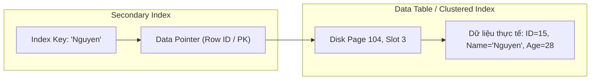

# Bản chất vật lý và cơ chế hoạt động của Index trong RDBMS

## ⚡ Tóm tắt ngắn (30s)
Trong Cơ sở dữ liệu quan hệ (RDBMS), **Index (Chỉ mục)** là một cấu trúc dữ liệu vật lý riêng biệt (tách rời khỏi bảng dữ liệu chính), được thiết kế để tăng tốc độ tìm kiếm và truy xuất dòng dữ liệu bằng cách giảm thiểu số lượng trang đĩa (Disk Pages) cần đọc. 

Tuy nhiên, Index không phải là "viên đạn bạc". Sử dụng Index đi kèm các chi phí đánh đổi cực kỳ lớn:
1.  **Không gian lưu trữ**: Tốn thêm đĩa cứng để lưu trữ cấu trúc Index.
2.  **Ghi phạt (Write Penalty / Write Amplification)**: Mọi thao tác ghi (`INSERT`, `UPDATE`, `DELETE`) trên bảng đều buộc hệ quản trị cơ sở dữ liệu (DBMS) phải cập nhật đồng thời cấu trúc của toàn bộ Index liên quan, gây chậm đáng kể tốc độ ghi và có thể dẫn đến phân mảnh đĩa (Page Split).

---

## 🔍 Chi tiết bản chất thực chiến

### 1. Bản chất vật lý của Index: Trỏ đến dữ liệu gốc ra sao?
Bảng dữ liệu vật lý trong ổ đĩa được chia thành nhiều đơn vị cố định gọi là **Page** (Trang đĩa - mặc định là 8KB trong Postgres/SQL Server, 16KB trong MySQL InnoDB). Khi không có Index, để tìm một bản ghi, hệ thống buộc phải nạp toàn bộ các Page của bảng từ ổ đĩa vào RAM để quét tuyến tính — hành động này gọi là **Full Table Scan** (tốn kém tài nguyên I/O đĩa nghiêm trọng).

Index là một bảng tra cứu thu nhỏ được sắp xếp theo thứ tự, chứa hai thành phần cốt lõi:
*   **Khóa chỉ mục (Index Key)**: Giá trị của các cột được lập chỉ mục.
*   **Con trỏ dữ liệu (Data Pointer)**: Địa chỉ vật lý trỏ trực tiếp đến dòng dữ liệu thực tế trong Page của bảng chính. Địa chỉ này thường được gọi là:
    *   **RID (Row ID)**: Bao gồm `[Page Number, Slot Number]` trong các bảng dạng Heap (như PostgreSQL hay SQL Server không có Clustered Index).
    *   **Clustered Key (Khóa cụm)**: Trong các bảng dạng Index-Organized Table (như MySQL InnoDB), con trỏ trong các Secondary Index sẽ trỏ đến Khóa chính (Primary Key), sau đó dùng Khóa chính để tra tiếp trong Clustered Index nhằm lấy dòng dữ liệu thực tế.



### 2. Sự khác biệt giữa các kiểu quét dữ liệu (Access Path)
Khi nhận được câu lệnh SQL, Optimizer (Bộ tối ưu hóa truy vấn) sẽ phân tích chi phí (Cost-based Optimizer) để chọn con đường tối ưu:
*   **Seq Scan / Full Table Scan**: Đọc tuần tự từng khối đĩa từ đầu đến cuối bảng. Phù hợp khi bảng rất nhỏ hoặc khi bạn cần lấy ra > 20% tổng số bản ghi trong bảng.
*   **Index Scan (Point Lookup)**: Tìm chính xác giá trị khóa trên cây Index, lấy ra con trỏ vật lý và nhảy trực tiếp đến Page chứa dòng dữ liệu đó trên đĩa.
*   **Index Range Scan**: Tìm phần tử biên trên Index, sau đó duyệt tuần tự qua các nút lá kế tiếp của Index (vì các nút lá đã được liên kết với nhau thành danh sách liên kết kép) để lấy ra một khoảng dữ liệu.

### 3. Khái niệm Selectivity và Cardinality (Độ chọn lọc và Lượng số)
Đây là hai chỉ số quyết định xem Optimizer có sử dụng Index của bạn hay không:
*   **Cardinality**: Số lượng giá trị duy nhất (unique values) trong một cột. Ví dụ: cột `id` có Cardinality cực cao (bằng tổng số dòng); cột `gender` có Cardinality cực thấp (chỉ có 'M', 'F', 'Other').
*   **Selectivity (Độ chọn lọc)**: Tỷ lệ số dòng được trả về so với tổng số dòng trong bảng đối với một giá trị cụ thể. Công thức: `Selectivity = 1 / Cardinality`.

> [!IMPORTANT]
> Cột có **Selectivity càng cao** (gần bằng 1, tức là tính duy nhất cao) thì Index hoạt động càng hiệu quả. Ngược lại, việc tạo Index trên các cột có Cardinality thấp (như `status`, `gender`, `active`) thường là vô nghĩa vì chi phí duyệt cây Index cộng với chi phí nhảy đĩa (Random Read / Key Lookup) sẽ cao hơn rất nhiều so với việc quét tuyến tính toàn bộ bảng (Sequential Read).

---

## 💻 Code thực chiến: BAD vs GOOD trong thiết kế Index

### ❌ BAD: Lập chỉ mục vô tội vạ hoặc chọn cột có độ chọn lọc kém
Thiết kế bảng cấu hình người dùng, lập chỉ mục lên mọi cột được nhắc đến trong mệnh đề `WHERE` mà không quan tâm đến độ chọn lọc hoặc tần suất ghi.

```sql
-- DDL tạo bảng người dùng
CREATE TABLE users (
    id BIGINT GENERATED ALWAYS AS IDENTITY PRIMARY KEY,
    username VARCHAR(50) NOT NULL,
    email VARCHAR(100) NOT NULL,
    gender CHAR(1) NOT NULL, -- Độ chọn lọc cực kém (chỉ có M/F)
    is_active BOOLEAN NOT NULL DEFAULT true, -- Độ chọn lọc cực kém (true/false)
    created_at TIMESTAMP NOT NULL
);

-- TẠO INDEX SAI LẦM
CREATE INDEX idx_users_gender ON users(gender); -- Anti-pattern: Lãng phí, DB hầu như không bao giờ dùng
CREATE INDEX idx_users_is_active ON users(is_active); -- Anti-pattern: Gây chậm các câu lệnh UPDATE trạng thái
CREATE INDEX idx_users_username ON users(username);
CREATE INDEX idx_users_email ON users(email);
```

###  GOOD: Tạo Index có chiến lược, dựa trên Selectivity và Explain Plan
Lập chỉ mục có chọn lọc, kết hợp phân tích câu lệnh thực tế bằng `EXPLAIN ANALYZE`.

```sql
-- DDL tối ưu hóa
CREATE TABLE users (
    id BIGINT GENERATED ALWAYS AS IDENTITY PRIMARY KEY,
    username VARCHAR(50) NOT NULL,
    email VARCHAR(100) NOT NULL,
    gender CHAR(1) NOT NULL,
    is_active BOOLEAN NOT NULL DEFAULT true,
    created_at TIMESTAMP NOT NULL
);

-- Chỉ tạo Index trên các cột có Cardinality cao và được tìm kiếm nhiều
CREATE UNIQUE INDEX idx_users_email ON users(email); -- Rất tốt, tính độc nhất tuyệt đối (Selectivity = 1)
CREATE INDEX idx_users_username ON users(username); -- Tốt, độ trùng lặp username thấp

-- Để giải quyết bài toán lọc danh sách người dùng active theo thời gian đăng ký mới nhất
-- Sử dụng Partial Index (PostgreSQL) để chỉ lưu trữ những người dùng đang active, tiết kiệm không gian đĩa!
CREATE INDEX idx_users_active_created ON users(created_at) WHERE is_active = true;
```

**Cách kiểm tra hiệu năng bằng `EXPLAIN` trên PostgreSQL:**
```sql
EXPLAIN ANALYZE 
SELECT id, username FROM users WHERE email = 'senior_dev@gmail.com';
```

*Kết quả mong đợi:*
`Index Scan using idx_users_email on users  (cost=0.15..8.17 rows=1 width=40) (actual time=0.015..0.016 rows=1 loops=1)` -> Cho thấy câu truy vấn thực hiện Index Scan cực nhanh (0.016ms), chi phí I/O tối thiểu.

---

## 📊 Bảng so sánh các kiểu truy xuất vật lý

| Tiêu chí | Full Table Scan (Quét toàn bảng) | Index Scan (Point Lookup) | Index Range Scan (Quét khoảng) |
| :--- | :--- | :--- | :--- |
| **Kiểu đọc ổ đĩa** | Sequential Read (Đọc tuần tự) | Random Read (Đọc ngẫu nhiên) | Kết hợp Random Read & Sequential |
| **Độ phức tạp thuật toán** | $O(N)$ (Quét toàn tuyến tính) | $O(\log N)$ (Duyệt cấu trúc cây) | $O(\log N + K)$ ($K$ là số phần tử trong khoảng) |
| **Hiệu quả nhất khi nào?** | Cần lấy lượng dữ liệu lớn (>20% bảng) hoặc bảng rất nhỏ | Lấy duy nhất 1 hoặc vài dòng dữ liệu cụ thể | Lấy một khoảng liên tục (ví dụ: `created_at` trong 1 tuần) |
| **Chi phí I/O đĩa** | Cố định và tăng tuyến tính theo kích thước bảng | Cực nhỏ (chỉ đọc 3-4 blocks cây Index + 1 block bảng) | Phụ thuộc kích thước khoảng quét |

---

## ⚠️ Common Gotchas & Questions follow-up

### 1. Cạm bẫy "Write Penalty" (Phạt ghi) trong các hệ thống High-write
*   **Vấn đề**: Mỗi khi có bản ghi mới được thêm vào, hoặc cập nhật giá trị cột có Index, DBMS không chỉ ghi bản ghi đó vào Page dữ liệu gốc mà còn phải định vị lại vị trí khóa trên cấu trúc Index của cột đó, thực hiện chèn khóa mới và tái cân bằng cây Index. Nếu hệ thống ghi hàng ngàn bản ghi mỗi giây và có 5-10 Indexes trên một bảng, hiệu năng ghi sẽ bị nghẽn trầm trọng tại I/O đĩa.
*   **Giải pháp**: Chỉ lập chỉ mục trên những cột thực sự cần thiết cho các truy vấn quan trọng. Định kỳ dọn dẹp các Index không sử dụng (Unused Indexes) bằng cách tra cứu số liệu thống kê sử dụng Index của DBMS (ví dụ: bảng `pg_stat_user_indexes` trong PostgreSQL).

### 2. Tại sao tôi đã tạo Index nhưng Database vẫn thực hiện Seq Scan?
*   **Nguyên nhân 1: Dữ liệu quá nhỏ**: Nếu bảng chỉ có vài trăm dòng, Optimizer tính toán rằng việc nạp trực tiếp vài Page của bảng chính vào RAM để quét tuần tự còn nhanh hơn việc nạp Page chứa Index, tìm con trỏ, rồi lại nạp Page chứa bảng chính.
*   **Nguyên nhân 2: Lỗi sứt mẻ Index (Index Invalid/Broken due to Functions)**: Mệnh đề `WHERE` bọc cột Index bên trong một hàm (ví dụ: `WHERE UPPER(email) = 'ADMIN@GMAIL.COM'`). Khi đó, cấu trúc Index lưu giá trị gốc (`email`) chứ không lưu giá trị sau hàm, nên Optimizer không thể sử dụng Index.
*   **Nguyên nhân 3: Độ chọn lọc quá thấp (Low Selectivity)**: Bạn query một giá trị chiếm > 20%-30% tổng số dòng của bảng. Hệ quản trị tính toán thấy số lần Random I/O nhảy từ Index sang Table quá lớn, nên chuyển luôn sang Seq Scan cho nhanh.

### 3. Câu hỏi đào sâu từ interviewer
*   **Q: Làm thế nào để đo lường và phát hiện các Unused Index trong môi trường Production thực tế?**
    *   *Trả lời*: Trong PostgreSQL, chúng ta sử dụng hệ thống view thống kê hiệu năng. Cụ thể là truy vấn bảng `pg_stat_user_indexes` để đếm số lần Index được quét (`idx_scan`). Nếu một Index có `idx_scan = 0` hoặc cực kỳ nhỏ qua nhiều tháng vận hành, trong khi số lượng ghi của bảng (`pg_stat_user_tables.n_tup_ins`) rất lớn, đó là ứng viên hàng đầu để tiến hành `DROP INDEX CONCURRENTLY` nhằm giải phóng ổ đĩa và tăng tốc độ ghi.
