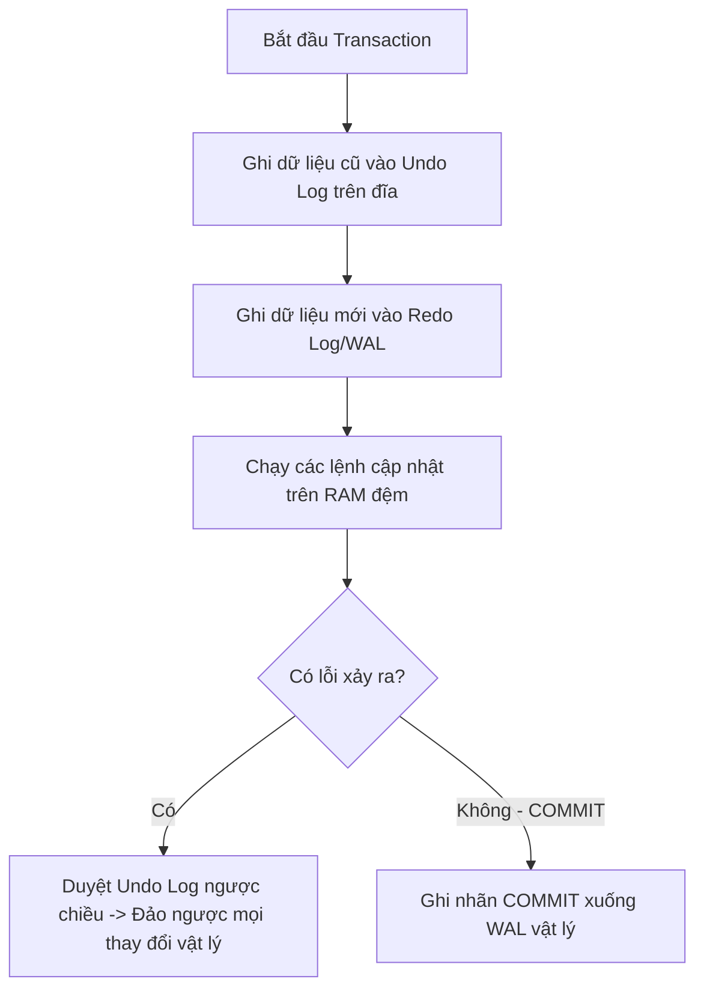

# Mổ Xẻ Thuật Ngữ ACID: Trọng Tâm Của Sự Tin Cậy Dữ Liệu Trong Thiết Kế Hệ Thống

## ⚡ Tóm tắt ngắn (30s)
**ACID (Atomicity, Consistency, Isolation, Durability)** là bộ tiêu chuẩn vàng gồm 4 thuộc tính bắt buộc phải có để đảm bảo một hệ quản trị cơ sở dữ liệu quan hệ (RDBMS) xử lý các giao dịch (Transactions) một cách tin cậy tuyệt đối, bảo vệ sự toàn vẹn của dữ liệu trong các điều kiện truy cập đồng thời cực đoan hoặc thảm họa phần cứng.

Tóm tắt bản chất kỹ thuật:
1.  **Atomicity (Tính nguyên tử)**: "Được ăn cả, ngã về không". Được hiện thực hóa bằng nhật ký phục hồi (**Undo Log**) để đảo ngược dữ liệu nếu có lỗi xảy ra giữa chừng.
2.  **Consistency (Tính nhất quán)**: Đưa cơ sở dữ liệu từ trạng thái hợp lệ này sang trạng thái hợp lệ khác. Là sự kết hợp giữa ràng buộc vật lý của DB (Constraint, Foreign Key) và logic nghiệp vụ của ứng dụng.
3.  **Isolation (Tính cô lập)**: Các giao dịch đồng thời không được giẫm chân lên nhau. Được hiện thực hóa bằng cơ chế **Khóa (Locks)** và **MVCC (Multi-Version Concurrency Control)**.
4.  **Durability (Tính bền vững)**: Dữ liệu đã COMMIT không bao giờ bị mất, dù hệ thống có bị rút phích cắm nguồn ngay lập tức. Được bảo đảm bởi nhật ký ghi trước (**Redo Log / WAL**) được đẩy trực tiếp xuống đĩa bằng cuộc gọi hệ thống `fsync`.

---

## 🔍 Chi tiết bản chất thực chiến

### 1. Atomicity (Tính nguyên tử) & Cơ chế hoạt động của WAL/Undo Log
Thuộc tính Atomicity yêu cầu một giao dịch chứa chuỗi nhiều câu lệnh phải được xử lý như một thao tác đơn lẻ. Hoặc tất cả đều thành công, hoặc tất cả đều biến mất không để lại dấu vết.

Để làm được điều này dưới đĩa cứng, RDBMS sử dụng kỹ thuật **Write-Ahead Logging (WAL)**:
*   Mọi thay đổi dữ liệu đầu tiên phải được ghi tuần tự vào một file nhật ký chung gọi là **Transaction Log (hoặc Undo/Redo Log)** trên đĩa trước khi nó thực sự sửa đổi các trang dữ liệu (Data Pages) trong bảng chính.
*   **Undo Log**: Lưu trữ trạng thái cũ của dữ liệu trước khi thay đổi. Nếu giao dịch bị hủy bỏ giữa chừng (hoặc hệ thống bị sập trước khi COMMIT), DBMS sẽ đọc Undo Log ngược từ dưới lên để khôi phục (Rollback) toàn bộ dữ liệu trở lại trạng thái ban đầu một cách hoàn hảo.



### 2. Consistency (Tính nhất quán) - Trách nhiệm chung giữa DB và App
Tính nhất quán đảm bảo mọi ràng buộc dữ liệu (Database Schema Constraints) luôn được thỏa mãn trước và sau giao dịch.
*   **Phía Cơ sở dữ liệu**: Đảm bảo các ràng buộc vật lý như khóa ngoại (`FOREIGN KEY`), giá trị không rỗng (`NOT NULL`), kiểm tra miền giá trị (`CHECK`), hay tính duy nhất (`UNIQUE`). Nếu vi phạm, DB sẽ tự động từ chối giao dịch.
*   **Phía Ứng dụng (Application)**: Đảm bảo các logic nghiệp vụ (Invariants). Ví dụ: Tổng số tiền trong tài khoản A và tài khoản B trước khi chuyển khoản phải bằng tổng số tiền sau khi chuyển khoản. DB không thể hiểu được logic này; do đó, lập trình viên bắt buộc phải viết code chính xác để giữ tính nhất quán cho hệ thống.

### 3. Isolation (Tính cô lập) & Nghệ thuật MVCC (Multi-Version Concurrency Control)
Nếu chạy tuần tự từng giao dịch, hiệu năng hệ thống sẽ bằng không. Để chạy song song hàng ngàn luồng, RDBMS phải giải quyết bài toán cô lập.
*   **Giải pháp thô sơ (Locking)**: Dùng khóa độc quyền (Exclusive Lock). Giao dịch A đang sửa dòng $X$ sẽ chặn (block) toàn bộ giao dịch B muốn đọc dòng $X$. Điều này gây nghẽn hệ thống cực kỳ nghiêm trọng.
*   **Giải pháp hiện đại (MVCC - Điều khiển đồng thời đa phiên bản)**:
    *   Được sử dụng trong các DB phổ biến như PostgreSQL và MySQL InnoDB.
    *   **Nguyên tắc**: *Đọc không chặn Ghi, Ghi không chặn Đọc*.
    *   Khi giao dịch Ghi thực hiện sửa đổi một dòng dữ liệu, thay vì ghi đè trực tiếp lên vị trí cũ, DBMS sẽ tạo ra một **phiên bản mới** của dòng dữ liệu đó trên đĩa.
    *   Các giao dịch Đọc đồng thời sẽ được cung cấp một **Snapshot (ảnh chụp nhanh)** chứa phiên bản dữ liệu cũ hợp lệ tại thời điểm giao dịch Đọc bắt đầu. Nhờ đó, luồng Đọc hoạt động trơn tru không hề bị block bởi luồng Ghi đang diễn ra.

### 4. Durability (Tính bền vững) & Cuộc gọi hệ thống `fsync`
Giao dịch một khi đã COMMIT thành công thì dữ liệu phải tồn tại vĩnh viễn, kể cả khi máy chủ bị cháy phần cứng hay đột ngột mất điện.
*   Để tối ưu hóa hiệu năng, DBMS không ghi dữ liệu trực tiếp xuống file dữ liệu chính trên ổ cứng khi COMMIT (vì ghi ngẫu nhiên rất chậm). Thay vào đó, nó ghi tuần tự dữ liệu thay đổi vào **Redo Log** (nhật ký ghi tiếp).
*   Khi có yêu cầu COMMIT, hệ thống sẽ thực hiện cuộc gọi hệ thống đắt đỏ **`fsync()`** của hệ điều hành để ép buộc bộ nhớ đệm đĩa cứng (Disk Cache) phải đẩy toàn bộ dữ liệu Redo Log từ RAM xuống đĩa vật lý vĩnh viễn. 
*   Nếu hệ thống sập nguồn ngay sau đó: Khi khởi động lại, DBMS chỉ việc quét Redo Log và chạy lại (**Redo / Forward Recovery**) các thay đổi đã COMMIT để khôi phục trạng thái chính xác của đĩa dữ liệu.

---

## 💻 Code thực chiến: BAD vs GOOD trong thiết kế ACID

### ❌ BAD: Vi phạm tính Isolation do chọn Isolation Level quá thấp gây mất mát dữ liệu
Sử dụng Isolation Level mặc định nhưng không xử lý hiện tượng "Lost Update" khi có hai luồng đồng thời tăng giá trị số dư tài khoản.

```sql
-- Luồng A và Luồng B đồng thời chạy truy vấn sau ở mức Read Committed:
-- Bước 1: Đọc số dư hiện tại của tài khoản id = 1 (Giả sử số dư = 100$)
SELECT balance FROM accounts WHERE id = 1; -- Cả hai luồng đều đọc ra 100$

-- Bước 2: Tính toán số dư mới bằng code ứng dụng (Luồng A cộng thêm 50$, Luồng B cộng thêm 30$)
-- Bước 3: Ghi đè lại dữ liệu
-- Luồng A chạy trước:
UPDATE accounts SET balance = 150 WHERE id = 1;
-- Luồng B chạy ngay sau:
UPDATE accounts SET balance = 130 WHERE id = 1;

-- KẾT QUẢ TỆ HẠI: 
-- Số dư thực tế đáng lẽ phải là 180$, nhưng do luồng B ghi đè đè lên luồng A, 
-- giao dịch cộng 50$ của luồng A bị BÓC HƠI hoàn toàn (Lost Update)!
```

###  GOOD: Sử dụng Optimistic Locking để bảo vệ Isolation ở mức ứng dụng
Tận dụng cơ chế khóa lạc quan (Optimistic Locking) bằng cách thêm cột `version` để phát hiện và ngăn chặn việc ghi đè dữ liệu trùng lặp.

```sql
-- Cấu trúc bảng tối ưu có cột version
CREATE TABLE accounts (
    id BIGINT PRIMARY KEY,
    balance DECIMAL(15,2) NOT NULL,
    version INT NOT NULL DEFAULT 0
);

-- Bước 1: Cả hai luồng đọc số dư kèm số hiệu phiên bản (version = 0)
SELECT balance, version FROM accounts WHERE id = 1; -- Đọc ra: balance = 100, version = 0

-- Bước 2: Luồng A chèn trước, tăng số phiên bản lên 1
UPDATE accounts 
SET balance = 150, version = version + 1 
WHERE id = 1 AND version = 0; -- THÀNH CÔNG (1 dòng bị ảnh hưởng, version tăng lên 1)

-- Bước 3: Luồng B chèn sau với thông tin phiên bản cũ (version = 0)
UPDATE accounts 
SET balance = 130, version = version + 1 
WHERE id = 1 AND version = 0; -- THẤT BẠI! (0 dòng bị ảnh hưởng vì version hiện tại đã là 1)

-- Code ứng dụng bắt được kết quả 0 dòng ảnh hưởng sẽ ném ra OptimisticLockingFailureException 
-- và chủ động thực hiện retry lại giao dịch cho người dùng B một cách an toàn.
```

---

## 📊 Bảng so sánh thuộc tính ACID dưới góc nhìn cài đặt hệ thống

| Thuộc tính | Mục tiêu cốt lõi | Kẻ thù chính | Cơ chế cài đặt trong DBMS |
| :--- | :--- | :--- | :--- |
| **Atomicity** | Đảm bảo tính trọn vẹn | Lỗi ứng dụng, crash hệ thống giữa chừng | **Undo Log**, Transaction State Machine |
| **Consistency** | Đảm bảo tính đúng đắn | Thiết kế sai logic, vi phạm dữ liệu | Schema Constraints, App validation code |
| **Isolation** | Đảm bảo tính độc lập | Đọc ghi đồng thời (Concurrency Bugs) | **Locks** (Shared/Exclusive), **MVCC** |
| **Durability** | Đảm bảo tính vĩnh viễn | Mất điện đột ngột, lỗi phần cứng ổ đĩa | **Redo Log / WAL**, **fsync() system call** |

---

## ⚠️ Common Gotchas & Questions follow-up

### 1. Tại sao hệ thống phân tán (Distributed Systems) không thể giữ ACID tuyệt đối?
*   **Vấn đề**: Khi bạn chuyển dịch hệ thống từ kiến trúc Monolith sang Microservices với nhiều database độc lập, việc duy trì một transaction ACID truyền thống là bất khả thi.
*   **Lý thuyết CAP Theorem**: Trong hệ thống phân tán, bạn chỉ có thể chọn 2 trong 3 yếu tố: **Consistency (Nhất quán)**, **Availability (Sẵn sàng)**, và **Partition Tolerance (Chịu lỗi phân vùng mạng)**. Khi có lỗi kết nối mạng xảy ra, để giữ tính nhất quán tuyệt đối (ACID), bạn buộc phải khóa toàn bộ hệ thống (hy sinh Availability).
*   **Mô hình BASE (đối lập với ACID)**: 
    *   **B**asically **A**vailable (Sẵn sàng cơ bản).
    *   **S**oft state (Trạng thái mềm - dữ liệu có thể thay đổi theo thời gian mà không cần kích hoạt ghi).
    *   **E**ventual consistency (Nhất quán cuối cùng - dữ liệu sẽ khớp nhau sau một khoảng thời gian trễ).
*   *Giải pháp thực chiến*: Thay vì cố gắng ép transaction ACID liên database bằng cơ chế 2PC (Two-Phase Commit - vốn cực kỳ chậm và dễ bị deadlock), các kỹ sư Senior sẽ sử dụng các Pattern thiết kế như **Saga Pattern** (sử dụng các transaction cục bộ kết hợp sự kiện bù trừ Compensation Transaction) hoặc **Outbox Pattern** kết hợp Message Broker để đạt trạng thái **Nhất quán cuối cùng (Eventual Consistency)**.

### 2. Câu hỏi đào sâu từ interviewer
*   **Q: MVCC trong PostgreSQL hoạt động cụ thể như thế nào dưới đĩa cứng để hỗ trợ tính cô lập (Isolation)? Làm thế nào nó quản lý các phiên bản dữ liệu?**
    *   *Trả lời*:
        *   Trong PostgreSQL, mỗi dòng dữ liệu (Tuple) trên đĩa vật lý có đính kèm hai trường ẩn cực kỳ quan trọng: **`xmin`** (ID của Transaction tạo ra dòng này) và **`xmax`** (ID của Transaction xóa/cập nhật dòng này).
        *   Khi bạn chạy lệnh `UPDATE`, PostgreSQL không sửa đè dữ liệu. Thay vào đó, nó thiết lập trường `xmax` của dòng cũ bằng ID của transaction hiện tại (đánh dấu dòng cũ đã bị xóa), đồng thời chèn một dòng mới hoàn toàn có `xmin` bằng ID của transaction hiện tại.
        *   Khi một câu lệnh `SELECT` chạy, PostgreSQL dựa vào ID transaction hiện tại của nó để so sánh với `xmin` và `xmax` của từng Tuple nhằm quyết định xem dòng đó có "hiển thị" (visible) đối với Snapshot hiện tại của nó hay không.
        *   *Nhược điểm thực chiến*: Cơ chế này dẫn đến việc tạo ra rất nhiều dòng rác vật lý (Dead Tuples) trên đĩa cứng khi hệ thống có tần suất ghi cao. PostgreSQL bắt buộc phải định kỳ chạy tiến trình **VACUUM** (dọn rác) để thu hồi dung lượng đĩa vật lý của các dòng chết này, nếu không sẽ gây ra hiện tượng phình to dữ liệu (Table Bloat) làm chậm toàn bộ hệ thống.
