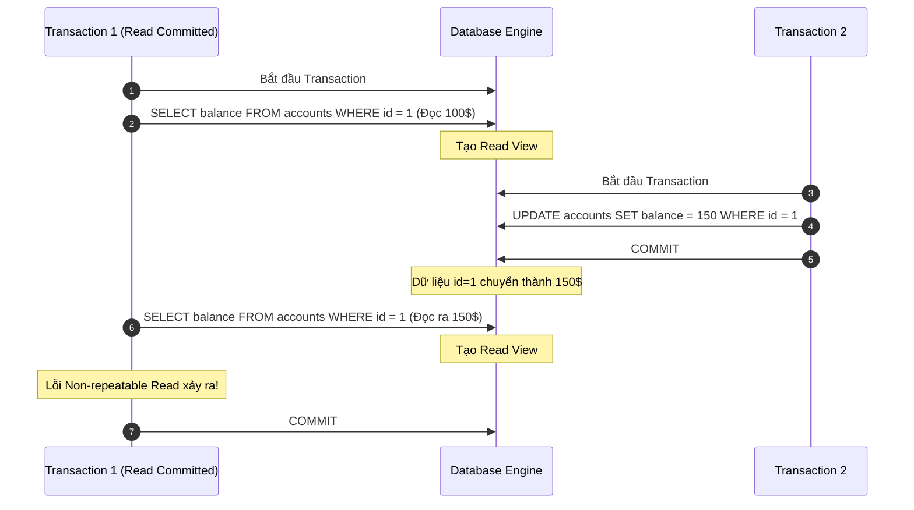

# Đào Sâu Các Mức Độ Cô Lập (Transaction Isolation Levels) Trong RDBMS: Bản Chất, Hiện Thực Hóa Và Trade-offs

## ⚡ Tóm tắt ngắn (30s)
**Transaction Isolation Levels (Các mức độ cô lập giao dịch)** quyết định cách một Transaction nhìn thấy các thay đổi dữ liệu được thực hiện bởi các Transaction chạy đồng thời khác. Chuẩn ANSI SQL-92 định nghĩa 4 mức độ từ thấp đến cao:
1. **Read Uncommitted**: Cho phép đọc dữ liệu chưa commit. Bị lỗi **Dirty Read**. Hầu như không bao giờ dùng trong production.
2. **Read Committed** (Mặc định của PostgreSQL, SQL Server): Chỉ đọc dữ liệu đã commit. Tránh được Dirty Read nhưng vẫn bị **Non-repeatable Read** và **Phantom Read**.
3. **Repeatable Read** (Mặc định của MySQL InnoDB): Đảm bảo đọc cùng một dòng dữ liệu nhiều lần trong một transaction sẽ ra kết quả y hệt. MySQL InnoDB chặn luôn cả Phantom Read ở mức này bằng **Next-Key Locks**.
4. **Serializable**: Cô lập tuyệt đối, các transaction được thực thi như thể chạy tuần tự. Tránh được mọi hiện tượng bất thường (bao gồm cả **Write Skew**) nhưng đánh đổi bằng hiệu năng cực thấp và nguy cơ cao bị **Deadlock**.

Bản chất cài đặt: **Locks (S locks, X locks)** hoặc **MVCC (Multi-Version Concurrency Control)** kết hợp **Undo Logs/Read View**.

---

## 🔍 Chi tiết bản chất thực chiến

### 1. Cơ chế nội bộ của các mức độ cô lập

Để hiểu sâu sắc, chúng ta phải phân tích cách hai cơ sở dữ liệu phổ biến nhất hiện nay là **MySQL (InnoDB Engine)** và **PostgreSQL** hiện thực hóa các mức cô lập này:

#### A. Read Committed (RC)
*   **MySQL InnoDB**: Mỗi câu lệnh `SELECT` trong transaction sẽ tạo ra một **Read View (Snapshot)** mới ngay tại thời điểm câu lệnh đó thực thi. Nếu Transaction khác commit giữa hai câu lệnh `SELECT` của bạn, `SELECT` thứ hai sẽ thấy dữ liệu mới.
*   **PostgreSQL**: Tương tự, mỗi câu lệnh bên trong transaction nhìn thấy một snapshot dữ liệu tại thời điểm câu lệnh đó bắt đầu chạy.

#### B. Repeatable Read (RR)
*   **MySQL InnoDB**: **Read View** được tạo ra **một lần duy nhất** khi câu lệnh `SELECT` đầu tiên của transaction được thực thi. Tất cả các lệnh `SELECT` sau đó trong cùng transaction sẽ tái sử dụng lại đúng Read View này, đảm bảo dữ liệu không bao giờ thay đổi (Repeatable).
*   **PostgreSQL**: Sử dụng cơ chế **Snapshot Isolation**. Snapshot được chụp ngay khi transaction bắt đầu. Ngoài việc chống Non-repeatable Read, PostgreSQL chặn luôn Phantom Read ở mức này. Tuy nhiên, nó bị lỗi **Write Skew** (Lệch ghi).

#### C. Serializable
*   **MySQL InnoDB**: Chuyển tất cả các câu lệnh `SELECT` thuần túy (non-locking reads) thành `SELECT ... FOR SHARE` một cách ngầm định, tự động áp khóa đọc chia sẻ (Shared Lock) lên các dòng dữ liệu để chặn mọi luồng ghi đồng thời.
*   **PostgreSQL**: Sử dụng **SSI (Serializable Snapshot Isolation)**. Không dùng khóa cứng để block mà sử dụng biểu đồ phụ thuộc (Dependency Graph) để phát hiện các vòng lặp xung đột (siw - read-write conflicts) trực tiếp trên RAM. Nếu phát hiện xung đột có thể gây bất toàn vẹn dữ liệu, nó sẽ chủ động hủy bỏ (Abort) một trong hai transaction kèm lỗi `40001 (serialization_failure)`.



---

## 💻 Code thực chiến: BAD vs GOOD trong thiết kế

### ❌ BAD: Lỗi "Lost Update" ngầm ở mức Read Committed
Một hệ thống thanh toán đọc số dư tài khoản của ví điện tử, tính toán và cộng tiền rồi lưu lại. Ở mức cô lập mặc định `Read Committed`, nếu có hai yêu cầu đồng thời, hệ thống sẽ bị mất mát tiền của khách hàng.

```sql
-- Luồng A và Luồng B chạy đồng thời ở mức Read Committed
-- Luồng A:
START TRANSACTION;
SELECT balance FROM wallets WHERE user_id = 42; -- Trả về 100$

-- Luồng B:
START TRANSACTION;
SELECT balance FROM wallets WHERE user_id = 42; -- Trả về 100$

-- Cả hai luồng xử lý trên code ứng dụng: 
-- Luồng A muốn cộng 50$ (100 + 50 = 150)
-- Luồng B muốn cộng 30$ (100 + 30 = 130)

-- Luồng A thực hiện cập nhật trước:
UPDATE wallets SET balance = 150 WHERE user_id = 42;
COMMIT; -- Thành công, số dư vật lý là 150$

-- Luồng B ghi đè ngay sau đó:
UPDATE wallets SET balance = 130 WHERE user_id = 42;
COMMIT; -- Thành công, số dư ví chỉ còn 130$ thay vì 180$!
```

###  GOOD: Giải quyết Lost Update bằng Locking Đọc (Pessimistic Locking) ở mức Read Committed hoặc dùng Optimistic Lock
Thay vì nâng toàn bộ DB lên Serializable (gây nghẽn hệ thống cực nặng), chúng ta chỉ cần áp dụng cơ chế khóa chọn lọc bằng cách sử dụng `FOR UPDATE` (Pessimistic Lock) hoặc `Optimistic Locking` (Khóa lạc quan).

```sql
-- Giải pháp 1: Pessimistic Locking với FOR UPDATE
START TRANSACTION;

-- Lệnh SELECT ... FOR UPDATE sẽ lập tức áp khóa độc quyền (Exclusive Lock) lên dòng user_id = 42.
-- Nếu Luồng B cố gắng SELECT ... FOR UPDATE dòng này, nó sẽ bị BLOCK và phải đợi Luồng A kết thúc.
SELECT balance FROM wallets WHERE user_id = 42 FOR UPDATE; -- Đọc ra 100$, khóa dòng này lại.

-- Tính toán logic trên App: 100$ + 50$ = 150$
UPDATE wallets SET balance = 150 WHERE user_id = 42;
COMMIT; -- Giải phóng khóa.

-- Luồng B được giải phóng, đọc ra giá trị mới nhất là 150$, cộng thêm 30$ thành 180$ và ghi xuống an toàn!
```

---

## 📊 Bảng so sánh toàn diện các Isolation Levels

| Tiêu chí | Read Uncommitted | Read Committed | Repeatable Read | Serializable |
| :--- | :--- | :--- | :--- | :--- |
| **Dirty Read** | ❌ Bị ảnh hưởng | ✅ Đã phòng ngừa | ✅ Đã phòng ngừa | ✅ Đã phòng ngừa |
| **Non-repeatable Read**| ❌ Bị ảnh hưởng | ❌ Bị ảnh hưởng | ✅ Đã phòng ngừa | ✅ Đã phòng ngừa |
| **Phantom Read** | ❌ Bị ảnh hưởng | ❌ Bị ảnh hưởng | ✅ Phòng ngừa một phần (MySQL InnoDB chặn hoàn toàn bằng Next-Key Lock) | ✅ Đã phòng ngừa hoàn toàn |
| **Write Skew** | ❌ Bị ảnh hưởng | ❌ Bị ảnh hưởng | ❌ Bị ảnh hưởng (ở PostgreSQL RR) | ✅ Đã phòng ngừa hoàn toàn |
| **Cơ chế cài đặt chính** | Đọc ghi không khóa trực tiếp | **Read View per Query** (MVCC), short-lived locks | **Read View per Transaction** (MVCC), **Gap/Next-Key locks** | **SSI** (Postgres), **Shared Locks** trên toàn bộ SELECT (MySQL) |
| **Hiệu năng & Khả năng Scalability** | Cực kỳ cao | Cao (Phù hợp 90% ứng dụng) | Trung bình khá | Cực kỳ thấp (Dễ nghẽn cổ chai) |

---

## ⚠️ Common Gotchas & Questions follow-up

### 1. Write Skew (Lệch ghi) là gì và tại sao Repeatable Read (Snapshot Isolation) không chặn được?
*   **Hiện tượng**: Write Skew xảy ra khi hai transaction đồng thời đọc cùng một tập dữ liệu, đưa ra quyết định ghi dựa trên tập dữ liệu đó, nhưng ghi vào hai dòng khác nhau dẫn đến vi phạm logic nghiệp vụ tổng thể.
*   **Ví dụ kinh điển**: Quy định bệnh viện: "Luôn có ít nhất 1 bác sĩ trực". Có 2 bác sĩ A và B đang trực. Cả hai cùng muốn xin nghỉ phép đồng thời.
    *   **T1 (Bác sĩ A xin nghỉ)**: Đếm số bác sĩ đang trực (`SELECT COUNT(*) FROM active_doctors` -> kết quả là 2). Logic thỏa mãn (>1), T1 cho phép A nghỉ (`UPDATE status = 'OFF' WHERE id = A`).
    *   **T2 (Bác sĩ B xin nghỉ)**: Đồng thời đếm số bác sĩ đang trực (`SELECT COUNT(*)` -> kết quả vẫn trả về 2 vì T1 chưa commit ở Snapshot Isolation). T2 cho phép B nghỉ (`UPDATE status = 'OFF' WHERE id = B`).
    *   **Hậu quả sau COMMIT**: Cả hai bác sĩ cùng nghỉ, số bác sĩ trực về 0! Vi phạm nghiêm trọng ràng buộc nghiệp vụ.
*   *Cách phòng chống*:
    1.  Dùng **Serializable** Isolation Level (DB sẽ tự động phát hiện xung đột phụ thuộc và rollback 1 trong 2).
    2.  Sử dụng **Locking tường minh**: `SELECT ... FOR UPDATE` khi đếm số bác sĩ trực để bắt luồng sau phải chờ luồng trước hoàn tất.

### 2. Câu hỏi đào sâu từ interviewer
*   **Q: Tại sao MySQL InnoDB đặt mặc định là Repeatable Read trong khi PostgreSQL và Oracle lại chọn Read Committed làm mặc định?**
    *   *Trả lời*: Đây là một yếu tố lịch sử và thiết kế kiến trúc:
        *   **Lịch sử Replication của MySQL**: Thuở sơ khai, MySQL sử dụng cơ chế nhân bản dựa trên câu lệnh (**Statement-Based Replication - SBR**). Để đảm bảo dữ liệu ghi xuống file nhị phân **Binary Log (Binlog)** khi phát lại (replay) ở máy con (Replica) cho ra kết quả nhất quán 100% với máy chính (Source), MySQL bắt buộc phải sử dụng mức độ cô lập `Repeatable Read` cùng cơ chế khóa khoảng cách **Gap Locks**. Nếu dùng `Read Committed` với SBR, thứ tự thực thi câu lệnh xen kẽ có thể làm dữ liệu máy con lệch pha hoàn toàn so với máy mẹ.
        *   **Hiện tại**: Mặc dù ngày nay MySQL mặc định dùng nhân bản dựa trên dòng (**Row-Based Replication - RBR**), RR vẫn được giữ làm mặc định để tương thích ngược. Nhiều hệ thống lớn có lưu lượng truy cập cao (High Traffic) thường chủ động chuyển MySQL sang `Read Committed` để loại bỏ `Gap Locks`, giảm thiểu tối đa hiện tượng khóa chết (Deadlocks) và tăng thông lượng (Throughput) ghi của hệ thống.
