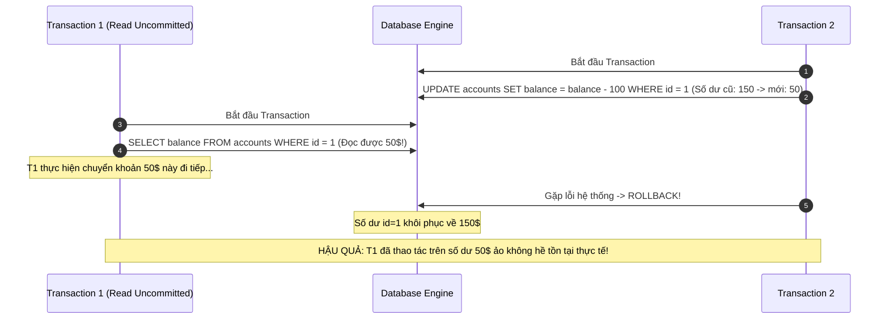
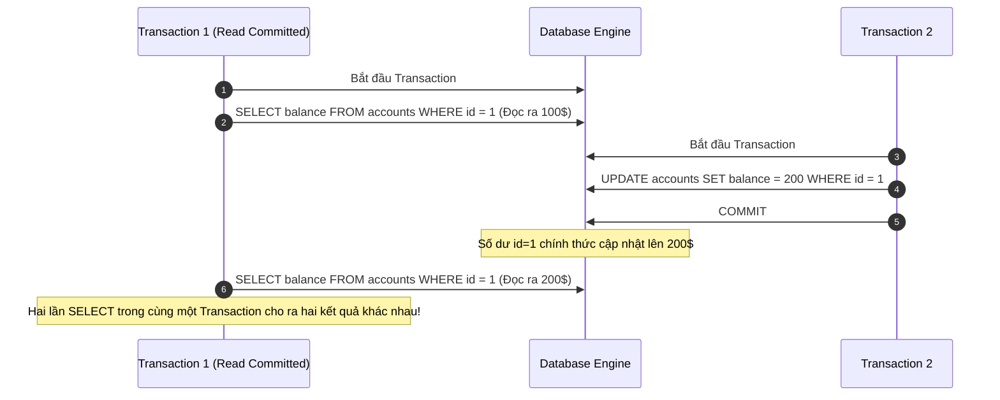
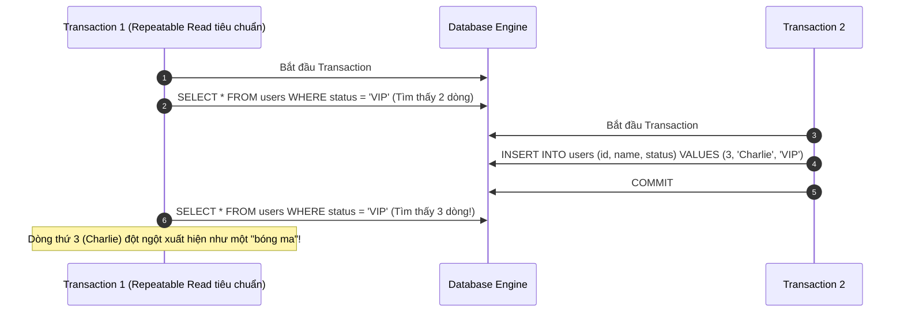

# Phân Biệt Ba Hiện Tượng Bất Thường Kinh Điển: Dirty Read, Non-Repeatable Read Và Phantom Read

## ⚡ Tóm tắt ngắn (30s)
Đây là 3 hiện tượng dữ liệu bất nhất (Read Anomalies) xảy ra khi nhiều Transaction đồng thời thực hiện thao tác Đọc - Ghi trên cùng một Cơ sở dữ liệu:
1. **Dirty Read (Đọc bẩn)**: Transaction A đọc được dữ liệu đang sửa đổi của Transaction B **khi B chưa COMMIT**. Nếu B bị ROLLBACK, dữ liệu A đọc được hoàn toàn là giả (rác).
2. **Non-repeatable Read (Đọc không lặp lại)**: Transaction A đọc một dòng dữ liệu, sau đó Transaction B **UPDATE hoặc DELETE dòng đó và COMMIT**. Transaction A đọc lại dòng đó lần thứ hai và thấy dữ liệu đã bị thay đổi hoặc biến mất.
3. **Phantom Read (Đọc bóng ma)**: Transaction A đọc một tập hợp các dòng thỏa mãn điều kiện `WHERE` (ví dụ: đếm số lượng tài khoản ví), sau đó Transaction B **INSERT thêm dòng mới thỏa mãn điều kiện đó và COMMIT**. Transaction A đọc lại tập dữ liệu này lần thứ hai và thấy xuất hiện thêm những dòng mới "bóng ma" chưa từng thấy trước đó.

*Điểm khác biệt cốt lõi giữa 2 và 3*: Non-repeatable Read tập trung vào sự thay đổi/xóa bỏ của các **dòng đã tồn tại** (sử dụng khóa dòng - Row Lock để chặn). Phantom Read tập trung vào sự xuất hiện của các **dòng mới chèn** (phải sử dụng khóa khoảng cách - Gap Lock để chặn).

---

## 🔍 Chi tiết bản chất thực chiến

### 1. Phân tích chi tiết từng hiện tượng bất thường

#### A. Dirty Read (Đọc bẩn)
Hiện tượng này phá vỡ hoàn toàn nguyên tắc "Atomicity" của ACID. Giao dịch đọc được trạng thái dữ liệu trung gian của một giao dịch khác.



#### B. Non-repeatable Read (Đọc không lặp lại)
Xảy ra chủ yếu ở mức cô lập `Read Committed`. Mặc dù dữ liệu đọc ra đều là dữ liệu đã COMMIT hợp lệ, nhưng tính nhất quán xuyên suốt một giao dịch bị phá vỡ.



#### C. Phantom Read (Đọc bóng ma)
Khác với hai hiện tượng trên vốn chỉ nhắm vào một bản ghi cụ thể, Phantom Read ảnh hưởng đến các truy vấn phạm vi (Range Query). 



---

## 💻 Code thực chiến: BAD vs GOOD trong thiết kế

### ❌ BAD: Chạy thống kê tài chính bị sai lệch số liệu do Non-repeatable Read
Ứng dụng thực hiện tính toán tổng tài sản của một công ty bằng cách cộng số dư của hai quỹ phòng ngừa rủi ro.

```sql
-- Transaction A bắt đầu xuất báo cáo tài chính (Isolation Level: Read Committed)
START TRANSACTION;

-- Bước 1: Đọc số dư Quỹ 1 (Đọc ra 1,000,000$)
SELECT balance FROM funds WHERE id = 1;

-- CÙNG LÚC ĐÓ, Transaction B thực hiện chuyển khoản 200,000$ từ Quỹ 2 sang Quỹ 1
START TRANSACTION;
UPDATE funds SET balance = balance + 200000 WHERE id = 1;
UPDATE funds SET balance = balance - 200000 WHERE id = 2; -- Số dư cũ: 500,000$ -> mới: 300,000$
COMMIT; -- Transaction B hoàn thành xuất sắc!

-- Bước 2: Transaction A tiếp tục đọc số dư Quỹ 2 (Đọc ra 300,000$)
SELECT balance FROM funds WHERE id = 2;

COMMIT;

-- KẾT QUẢ TỆ HẠI: 
-- Hệ thống tính tổng tài sản = 1,000,000$ (Quỹ 1 cũ) + 300,000$ (Quỹ 2 mới) = 1,300,000$
-- Con số thực tế phải luôn là 1,500,000$! 200,000$ đã hoàn toàn "bay màu" khỏi báo cáo tài chính!
```

###  GOOD: Khóa dữ liệu bằng Repeatable Read (hoặc Khóa tường minh)
Để xử lý trường hợp trên, nâng Transaction lên mức `Repeatable Read` (trong MySQL) hoặc sử dụng khóa chia sẻ `FOR SHARE`.

```sql
-- Transaction A sử dụng mức cô lập REPEATABLE READ
SET TRANSACTION ISOLATION LEVEL REPEATABLE READ;
START TRANSACTION;

-- Bước 1: Đọc số dư Quỹ 1 (Đọc ra 1,000,000$)
SELECT balance FROM funds WHERE id = 1;

-- Lúc này, bất kể Transaction B có cập nhật và COMMIT thành công Quỹ 2 về 300,000$...
-- Nhờ cơ chế MVCC Read View giữ nguyên phiên bản tại thời điểm bắt đầu Transaction A:

-- Bước 2: Transaction A đọc số dư Quỹ 2 vẫn trả về 500,000$ (Giá trị lịch sử hợp lệ)
SELECT balance FROM funds WHERE id = 2;

COMMIT;
-- KẾT QUẢ HOÀN HẢO: Tổng tính toán = 1,000,000$ + 500,000$ = 1,500,000$. Báo cáo tài chính chính xác tuyệt đối!
```

---

## 📊 Bảng tổng hợp đối chiếu ba hiện tượng

| Hiện tượng | Nguyên nhân vật lý | Bị ảnh hưởng ở Isolation Level nào? | Giải pháp ngăn chặn từ DBMS Engine |
| :--- | :--- | :--- | :--- |
| **Dirty Read** | Đọc trực tiếp từ bộ đệm RAM chưa ghi xuống đĩa cứng (Dirty Pages) | `Read Uncommitted` | **Read Committed**: Chỉ đọc từ các phiên bản dữ liệu đã COMMIT (MVCC Read View). |
| **Non-repeatable Read** | Dòng dữ liệu bị cập nhật/xóa bởi transaction khác đã commit | `Read Uncommitted`, `Read Committed` | **Repeatable Read**: Cố định Read View xuyên suốt toàn bộ Transaction (hoặc dùng Row-level Shared Lock). |
| **Phantom Read** | Dòng dữ liệu mới được chèn vào khoảng trống (Gaps) giữa các dòng hiện tại | `Read Uncommitted`, `Read Committed`, `Repeatable Read` (tiêu chuẩn ANSI) | **Next-Key Locks** (MySQL InnoDB) chặn mọi hành vi INSERT vào khoảng trống của tập dữ liệu đang được đọc; hoặc **Serializable** (PostgreSQL). |

---

## ⚠️ Common Gotchas & Questions follow-up

### 1. Sự khác biệt cốt lõi giữa Non-repeatable Read và Phantom Read là gì?
Đây là câu hỏi cực kỳ phổ biến nhằm đánh giá xem ứng viên có thực sự hiểu bản chất cơ chế Lock của Database hay chỉ học thuộc lòng:
*   **Về mặt dữ liệu**:
    *   *Non-repeatable Read*: Chỉ ảnh hưởng đến các **dòng dữ liệu sẵn có**. Phép toán là `UPDATE` hoặc `DELETE`.
    *   *Phantom Read*: Ảnh hưởng đến một **tập hợp dữ liệu** trả về từ RANGE QUERY (truy vấn phạm vi). Phép toán là `INSERT` (hoặc cập nhật một dòng từ không thỏa mãn sang thỏa mãn điều kiện `WHERE`).
*   **Về cơ chế Khóa (Locking)**:
    *   Để chặn *Non-repeatable Read*, DBMS chỉ cần dùng **Row Lock (Khóa dòng)** đơn giản lên bản ghi được đọc.
    *   Để chặn *Phantom Read*, DBMS không thể dùng Row Lock được (vì dòng mới chèn chưa hề tồn tại để mà khóa!). DBMS bắt buộc phải khóa các khoảng trống trống nằm giữa các dòng đang tồn tại. Cơ chế này gọi là **Gap Locking** hoặc kết hợp thành **Next-Key Locking** (khóa cả dòng hiện tại lẫn khoảng trống ngay trước nó).

### 2. Câu hỏi đào sâu từ interviewer: "Tại sao trong MySQL InnoDB, mức cô lập Repeatable Read lại không bị lỗi Phantom Read, trong khi theo chuẩn ANSI SQL thì RR vẫn bị?"
*   *Trả lời*: 
    *   Chuẩn ANSI SQL-92 định nghĩa các Isolation Level thông qua các hiện tượng bất thường tối thiểu. Theo chuẩn này, mức `Repeatable Read` chỉ bắt buộc chặn Dirty Read và Non-repeatable Read, vẫn cho phép Phantom Read xảy ra.
    *   Tuy nhiên, đội ngũ phát triển **MySQL InnoDB** đã quyết định tối ưu hóa mức `Repeatable Read` để nó trở nên mạnh mẽ hơn: Họ tích hợp cơ chế khóa **Next-Key Locks** (kết hợp Record Lock và Gap Lock). Khi bạn thực hiện một câu lệnh đọc có khóa ví dụ `SELECT ... FOR UPDATE` hoặc `SELECT ... FOR SHARE`, InnoDB sẽ tự động khóa toàn bộ vùng dữ liệu thỏa mãn điều kiện `WHERE` cùng các "khoảng trống" (Gaps) xung quanh nó. Nhờ vậy, không một transaction nào có thể INSERT thêm dòng mới vào vùng này, triệt tiêu hoàn toàn hiện tượng Phantom Read ngay từ mức `Repeatable Read`.
