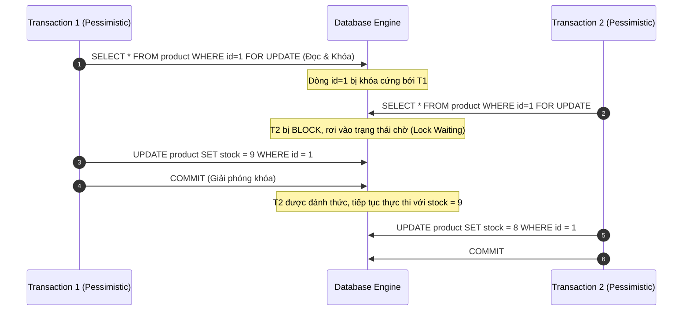
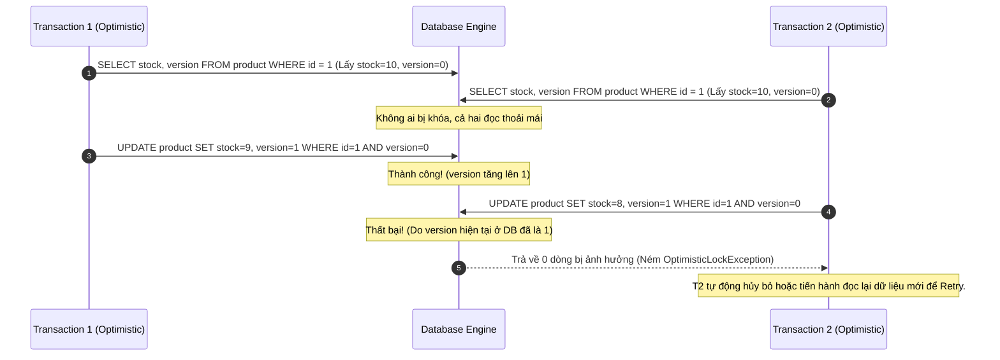

# Optimistic Locking vs Pessimistic Locking: Nghệ Thuật Quản Trị Concurrency Trong Thực Chiến

## ⚡ Tóm tắt ngắn (30s)
*   **Pessimistic Locking (Khóa bi quan)**: Thiết lập tư duy "luôn có người phá hoại". Khi đọc dữ liệu lên, nó **lập tức khóa cứng dòng dữ liệu** (bằng `FOR UPDATE` - Exclusive Lock). Bất kỳ transaction nào khác muốn đọc/ghi dòng đó đều phải xếp hàng đợi. 
    *   *Sử dụng*: Khi tỷ lệ xung đột cực cao (High Conflict), nghiệp vụ yêu cầu an toàn tuyệt đối và chi phí Rollback/Retry là quá đắt đỏ.
*   **Optimistic Locking (Khóa lạc quan)**: Thiết lập tư duy "mọi chuyện sẽ ổn thôi". Nó **không khóa bất kỳ thứ gì khi đọc**. Thay vào đó, nó thêm một cột `version` (hoặc `timestamp`). Khi ghi đè (UPDATE), nó sẽ kiểm tra xem `version` ở DB có trùng với `version` lúc đọc hay không. Nếu trùng, UPDATE thành công và tăng version lên 1. Nếu không trùng (đã có luồng khác ghi trước), nó sẽ ném ra lỗi và bắt ứng dụng chủ động xử lý (thường là rollback và retry).
    *   *Sử dụng*: Khi tỷ lệ xung đột thấp (Low/Medium Conflict), yêu cầu thông lượng hệ thống (Throughput) cao, hoặc có các giao dịch kéo dài (Long-running Transactions).

---

## 🔍 Chi tiết bản chất thực chiến

### 1. Luồng hoạt động và Cơ chế vận hành

Để hiểu sâu sắc sự khác biệt, hãy theo dõi cách hai cơ chế này phản ứng với xung đột đồng thời của 2 luồng thao tác trên cùng một bản ghi:

#### A. Pessimistic Locking (Khóa Vật Lý ở mức DB)
*   Được cài đặt trực tiếp bằng cơ chế khóa của hệ quản trị cơ sở dữ liệu (DBMS Lock Manager).
*   Khi chạy truy vấn đọc kèm khóa độc quyền (ví dụ `SELECT ... FOR UPDATE`), DBMS sẽ lưu giữ khóa này trong suốt vòng đời của Transaction.
*   **Điểm yếu**: Tiêu tốn tài nguyên DB (Memory để giữ locks), rất dễ gây ra **Deadlocks**, và gây nghẽn cổ chai nghiêm trọng vì block toàn bộ các luồng khác.



#### B. Optimistic Locking (Khóa Logic ở mức Ứng Dụng)
*   Không khóa ở mức DB. Cài đặt bằng thuật toán so sánh và tráo đổi (Compare-And-Swap) thông qua ứng dụng (hoặc ORM như Hibernate).
*   Câu lệnh SQL cập nhật ngầm định có dạng: `UPDATE table SET column = value, version = version + 1 WHERE id = 1 AND version = current_version;`.
*   **Điểm mạnh**: Không block bất kỳ ai, tận dụng tối đa năng lực xử lý đồng thời của DB.
*   **Điểm yếu**: Nếu xung đột xảy ra liên tục, chi phí xử lý ngoại lệ (Exception) và Re-try ở phía Ứng dụng sẽ kéo tụt hiệu năng hệ thống.



---

## 💻 Code thực chiến: BAD vs GOOD trong thiết kế

Dưới đây là cách hiện thực hóa hai cơ chế này bằng **Spring Data JPA & Hibernate** - bộ công cụ tiêu chuẩn hàng đầu của Java Backend:

### ❌ BAD: Giữ Pessimistic Lock qua một API call bên thứ ba (Thảm họa treo hệ thống!)
Một lỗi kinh điển của lập trình viên trung cấp là bọc một cuộc gọi API HTTP bên ngoài (hoặc xử lý tác vụ chậm) bên trong một Transaction đang giữ khóa bi quan. Điều này làm cạn kiệt Connection Pool của Database chỉ trong vài giây!

```java
@Transactional
public void processPaymentPessimistic(Long orderId) {
    // 1. Áp khóa độc quyền lên dòng dữ liệu ở Database
    Order order = orderRepository.findByIdForUpdate(orderId)
        .orElseThrow(() -> new EntityNotFoundException());

    // 2. BAD: Gọi API sang bên thứ ba (Ví dụ: Stripe, Paypal) mất trung bình 3-5 giây!
    // TRONG SUỐT 5 GIÂY NÀY, DATABASE CONNECTION BỊ KHÓA CỨNG, KHÔNG THỂ PHỤC VỤ LUỒNG KHÁC!
    PaymentResult result = paymentGateway.charge(order.getAmount()); 

    if (result.isSuccess()) {
        order.setStatus(OrderStatus.PAID);
        orderRepository.save(order);
    }
}
```

###  GOOD: Chuyển sang Optimistic Locking bằng `@Version` và cơ chế Retry tự động
Giải pháp tối ưu là sử dụng Khóa lạc quan `@Version` để giải phóng hoàn toàn DB Lock trong thời gian gọi API ngoài, kết hợp cơ chế Retry thông minh bằng `@Retryable` của Spring.

#### 1. Khai báo Entity với thuộc tính `@Version`
```java
@Entity
@Table(name = "orders")
@Getter @Setter
public class Order {
    @Id
    private Long id;
    
    private BigDecimal amount;
    private String status;

    @Version // Hibernate tự động quản lý kiểm tra và tăng giá trị này
    private Long version;
}
```

#### 2. Viết Service xử lý nghiệp vụ với `@Retryable`
```java
@Service
@RequiredArgsConstructor
public class OrderService {

    private final OrderRepository orderRepository;
    private final PaymentGateway paymentGateway;

    // Tự động thử lại tối đa 3 lần nếu gặp lỗi xung đột khóa lạc quan (OptimisticLockingFailureException)
    // Mỗi lần thử lại cách nhau 100ms (backoff)
    @Retryable(
        retryFor = { ObjectOptimisticLockingFailureException.class },
        maxAttempts = 3,
        backoff = @Backoff(delay = 100)
    )
    @Transactional
    public void processPaymentOptimistic(Long orderId) {
        // Đọc dữ liệu kèm theo số version hiện tại (Không khóa DB!)
        Order order = orderRepository.findById(orderId)
            .orElseThrow(() -> new EntityNotFoundException());

        if (!"PENDING".equals(order.getStatus())) {
            return; // Đã xử lý rồi, thoát luôn.
        }

        // Tách API call ra ngoài Transaction nếu có thể, hoặc dùng Optimistic Lock bảo vệ:
        PaymentResult result = paymentGateway.charge(order.getAmount());

        if (result.isSuccess()) {
            order.setStatus("PAID");
            // Khi save, Hibernate sinh ra câu lệnh UPDATE có kèm: WHERE id = ? AND version = ?
            orderRepository.save(order); 
        }
    }
}
```

---

## 📊 Bảng so sánh đa chiều: Optimistic vs Pessimistic Locking

| Tiêu chí so sánh | Optimistic Locking (Khóa lạc quan) | Pessimistic Locking (Khóa bi quan) |
| :--- | :--- | :--- |
| **Mức độ can thiệp** | Logic ở mức Ứng dụng / ORM Framework | Vật lý trực tiếp dưới Database Engine |
| **Cơ chế khóa** | Không khóa (Non-blocking) | Khóa cứng dòng dữ liệu (Blocking) |
| **Hiệu năng hệ thống (Throughput)**| Cực kỳ cao khi xung đột thấp | Thấp, giảm tuyến tính theo số lượng người dùng đồng thời |
| **Nguy cơ Deadlock** | Gần như bằng 0 | Rất cao nếu thiết kế truy vấn không đồng nhất |
| **Chi phí xử lý lỗi** | Tốn CPU/RAM của App Server để chạy lại (Retry) | Tốn tài nguyên DB để giữ hàng đợi chờ khóa |
| **Transaction kéo dài** | Rất phù hợp (Không ảnh hưởng đến DB) | Cực kỳ nguy hiểm (Dễ làm cạn kiệt Connection Pool) |
| **Dòng nghiệp vụ phù hợp** | Hệ thống E-commerce, quản lý Profile, CMS | Đặt vé máy bay, trừ tiền ví điện tử, quản lý kho hàng nhạy cảm |

---

## ⚠️ Common Gotchas & Questions follow-up

### 1. Làm thế nào để phòng tránh thảm họa nghẽn kết nối (Connection Pool Exhaustion) khi bắt buộc phải dùng Pessimistic Lock?
*   **Vấn đề**: Khi lưu lượng truy cập cao, hàng trăm luồng cùng chạy `SELECT ... FOR UPDATE` trên cùng một bản ghi sẽ tạo ra hàng đợi khổng lồ. Các luồng này chiếm giữ kết nối từ Connection Pool (như HikariCP) và không chịu nhả ra, khiến toàn bộ ứng dụng bị tê liệt (treo cứng).
*   **Giải pháp thực chiến**:
    1.  **Thiết lập Query Timeout**: Luôn cấu hình thời gian chờ tối đa cho các câu lệnh khóa.
    2.  **Sử dụng cú pháp `NOWAIT` hoặc `SKIP LOCKED`**:
        *   `SELECT ... FOR UPDATE NOWAIT`: Nếu dòng đó đã bị khóa bởi transaction khác, DB sẽ lập tức ném lỗi về ngay lập tức thay vì bắt luồng của bạn phải xếp hàng chờ đợi vô thời hạn.
        *   `SELECT ... FOR UPDATE SKIP LOCKED` (Được hỗ trợ từ MySQL 8.0 và PostgreSQL): DB sẽ tự động bỏ qua các dòng đang bị khóa và chỉ lấy ra các dòng rảnh rỗi. Đây là vũ khí tối thượng để xây dựng các hệ thống hàng đợi tin nhắn (Message Queue) tự chế hiệu năng cao bằng Database quan hệ.

### 2. Câu hỏi đào sâu từ interviewer: "Nếu sử dụng Optimistic Locking, làm thế nào bạn xử lý bài toán cập nhật dữ liệu của các thực thể có mối quan hệ cha-con (Aggregate Root và Child Entities)?"
*   *Trả lời*:
    *   Trong thiết kế Domain-Driven Design (DDD), thay đổi ở các thực thể con (Child) phải được phản ánh lên thực thể cha (Aggregate Root).
    *   Theo mặc định, nếu bạn chỉ cập nhật thực thể con, Hibernate sẽ chỉ tăng `version` của thực thể con đó mà giữ nguyên `version` của thực thể cha. Điều này có thể dẫn đến việc thực thể cha bị vi phạm tính nhất quán logic nếu có một luồng khác đồng thời thay đổi cấu trúc tổng thể.
    *   *Giải pháp*: Chúng ta phải sử dụng chế độ khóa cưỡng bức **`LockModeType.OPTIMISTIC_FORCE_INCREMENT`** của JPA lên đối tượng Cha. Khi thực hiện thay đổi bất kỳ thực thể con nào, JPA sẽ ép buộc câu lệnh SQL cập nhật phải tăng cả số phiên bản `version` của đối tượng Cha, đảm bảo tính cô lập tuyệt đối cho toàn bộ cấu trúc Aggregate Root.
