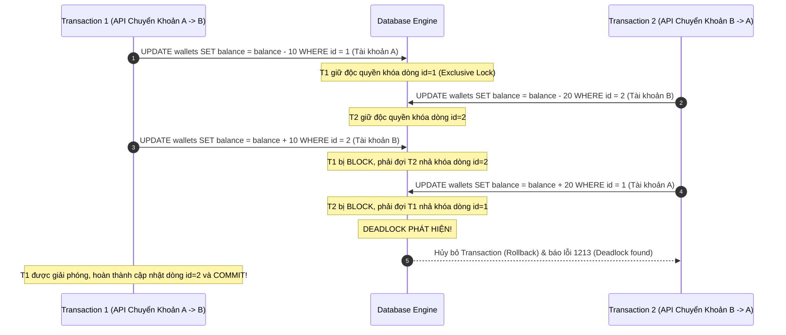

# Giải Mã Khóa Chết (Deadlocks) Trong Cơ Sở Dữ Liệu: Cơ Chế Phát Hiện, Phòng Tránh Và Xử Lý Thực Chiến

## ⚡ Tóm tắt ngắn (30s)
**Deadlock (Khóa chết)** là hiện tượng hai hoặc nhiều Transaction đồng thời bị treo vô thời hạn vì mỗi Transaction đều đang nắm giữ một khóa vật lý (Lock) đối với tài nguyên mà Transaction kia đang cần, tạo thành một vòng lặp chờ đợi khép kín (Circular Wait).

*Cơ chế tự động của DBMS*: 
*   Các RDBMS hiện đại (MySQL InnoDB, PostgreSQL) không để hệ thống bị treo mãi mãi. Chúng chạy một luồng chạy nền tự động phát hiện vòng lặp chờ khóa bằng sơ đồ **Wait-For Graph**.
*   Khi phát hiện Deadlock, DBMS sẽ lập tức chủ động hủy bỏ (Abort/Rollback) một Transaction (thường là Transaction tốn ít tài nguyên khôi phục nhất - **Victim**) và giải phóng các khóa để Transaction còn lại tiếp tục chạy hoàn tất.
*   *Nguyên tắc phòng tránh tối cao*: **Luôn khóa các tài nguyên theo một thứ tự nhất quán tuyệt đối** (ví dụ: luôn sắp xếp tăng dần theo ID trước khi thực hiện khóa hàng loạt).

---

## 🔍 Chi tiết bản chất thực chiến

### 1. Phân tích nguyên nhân và Biểu đồ vòng lặp khóa chết

Deadlock xảy ra do sự kết hợp của 4 điều kiện kinh điển (Coffman Conditions):
1.  **Mutual Exclusion (Loại trừ tương hỗ)**: Tài nguyên được khóa độc quyền (Exclusive Lock).
2.  **Hold and Wait (Giữ và Chờ)**: Transaction đang giữ một khóa và đồng thời yêu cầu thêm khóa mới.
3.  **No Preemption (Không cướp đoạt)**: Không ai có quyền ép buộc Transaction khác nhả khóa giữa chừng.
4.  **Circular Wait (Chờ đợi vòng tròn)**: T1 chờ T2 nhả khóa, T2 lại đang chờ T1 nhả khóa.



### 2. Cách DBMS tự động phát hiện Deadlock dưới RAM

RDBMS có 2 cơ chế chính để bảo vệ hệ thống khỏi bị treo vô tận:

#### A. Lock Timeout (Đặt hạn giờ chờ khóa)
Cơ chế đơn giản nhất. Mỗi yêu cầu lấy khóa chỉ được phép đợi tối đa một khoảng thời gian cấu hình sẵn (ví dụ: `innodb_lock_wait_timeout = 50s` trong MySQL). Quá thời gian này, câu lệnh bị hủy bỏ kèm lỗi Timeout.
*   *Nhược điểm*: 50 giây là quá lâu trong môi trường High Traffic, làm tắc nghẽn hàng loạt luồng xử lý khác trước khi kịp ném lỗi.

#### B. Sơ đồ Wait-For Graph (Phát hiện chủ động)
DBMS xây dựng một đồ thị có hướng trong bộ nhớ RAM đệm (Memory Buffer Pool):
*   **Đỉnh (Nodes)**: Đại diện cho các Transaction đang hoạt động.
*   **Cạnh (Edges)**: $T_1 \to T_2$ nghĩa là $T_1$ đang đợi khóa mà $T_2$ đang nắm giữ.
*   DBMS định kỳ chạy thuật toán duyệt đồ thị (thường là DFS - Depth First Search) để tìm kiếm các **chu trình khép kín (Cycles)**. Nếu có chu trình, nghĩa là có Deadlock.
*   **Tiêu chí chọn Victim**: DBMS sẽ tính toán lượng tài nguyên cần giải phóng. Transaction nào có số lượng bản ghi đã chỉnh sửa ít nhất (thể hiện qua số lượng bản ghi **Undo Log**) sẽ bị hủy bỏ (Rollback) vì chi phí phục hồi trạng thái vật lý của nó là rẻ nhất.

---

## 💻 Code thực chiến: BAD vs GOOD trong thiết kế

### ❌ BAD: Cập nhật tài nguyên ngẫu hứng dẫn đến Deadlock bất chợt
Hệ thống xử lý đơn hàng gồm nhiều mặt hàng. Ứng dụng duyệt qua danh sách sản phẩm trong giỏ hàng theo thứ tự khách hàng thêm vào và tiến hành trừ kho (Stock).

```sql
-- Transaction 1 (Khách hàng A mua sản phẩm 10 rồi đến sản phẩm 20)
START TRANSACTION;
UPDATE products SET stock = stock - 1 WHERE id = 10; -- Khóa dòng 10 thành công
-- (Đồng thời, Transaction 2 của Khách B mua sản phẩm 20 rồi đến sản phẩm 10)
-- Transaction 2:
START TRANSACTION;
UPDATE products SET stock = stock - 1 WHERE id = 20; -- Khóa dòng 20 thành công

-- Transaction 1:
UPDATE products SET stock = stock - 1 WHERE id = 20; -- Bị BLOCK vì dòng 20 bị giữ bởi T2

-- Transaction 2:
UPDATE products SET stock = stock - 1 WHERE id = 10; -- Bị BLOCK -> DEADLOCK lập tức xảy ra!
```

###  GOOD: Sắp xếp thứ tự ID tài nguyên nhất quán trước khi truy vấn khóa
Nguyên tắc vàng: **Bất kỳ luồng nghiệp vụ nào, ở bất kỳ API nào, khi cần khóa nhiều tài nguyên cùng một lúc, phải sắp xếp chúng theo một thứ tự duy nhất (Ví dụ: Tăng dần theo ID).**

```java
@Transactional
public void purchaseProducts(List<Long> productIds) {
    // 1. GOOD: Sắp xếp danh sách ID tăng dần trước khi thực hiện khóa dữ liệu!
    // Việc này đảm bảo mọi luồng đồng thời đều sẽ xin khóa theo thứ tự: id nhỏ trước, id lớn sau.
    // Loại bỏ hoàn toàn khả năng xảy ra chu trình chờ đợi vòng tròn (Circular Wait).
    List<Long> sortedIds = productIds.stream()
        .sorted()
        .collect(Collectors.toList());

    for (Long id : sortedIds) {
        // Thực hiện khóa dòng sản phẩm theo thứ tự tăng dần
        Product product = productRepository.findByIdForUpdate(id)
            .orElseThrow(() -> new EntityNotFoundException());
            
        product.setStock(product.getStock() - 1);
        productRepository.save(product);
    }
}
```

---

## 📊 Bảng so sánh các phương pháp xử lý Deadlock

| Phương pháp | Cách hoạt động | Ưu điểm | Nhược điểm |
| :--- | :--- | :--- | :--- |
| **Lock Timeout** | Đặt thời gian chờ tối đa cho mỗi câu lệnh lấy khóa | Đơn giản, dễ cấu hình, không tốn CPU tính toán đồ thị | Cực kỳ chậm, gây tích tụ các luồng treo tạm thời làm nghẽn hệ thống |
| **Wait-For Graph Detection** | DBMS tự động phân tích chu trình khóa dưới RAM | Phát hiện và xử lý Deadlock tức thời (mất vài mili-giây) | Tốn một lượng tài nguyên CPU nhỏ của Database Engine để định kỳ quét |
| **Consistent Ordering** | Ứng dụng tự kiểm soát thứ tự khóa tài nguyên | **Phương pháp tốt nhất**, triệt tiêu Deadlock tận gốc mà không phát sinh lỗi | Đòi hỏi lập trình viên phải có kỷ luật và hiểu rõ hệ thống thiết kế |
| **Optimistic Locking** | Chuyển sang dùng version để cập nhật, không dùng lock vật lý | Không bao giờ bị deadlock ở mức DB | Khi xung đột quá cao sẽ gây thất bại hàng loạt, tốn tài nguyên Retry |

---

## ⚠️ Common Gotchas & Questions follow-up

### 1. Hiện tượng Deadlock siêu ẩn do Gap Locks và Next-Key Locks trong MySQL InnoDB là gì?
Đây là một ca cực kỳ hóc búa, thường được dùng để phỏng vấn các kỹ sư Senior+. Deadlock xảy ra ngay cả khi bạn thực hiện các câu lệnh có vẻ hoàn toàn vô hại trên các dòng dữ liệu khác nhau!
*   **Kịch bản**: Bảng `users` có các id đang tồn tại là 10 và 20. Không có id 15. Mức cô lập là `Repeatable Read`.
    *   **T1**: Chạy `SELECT * FROM users WHERE id = 15 FOR UPDATE;`
        *   Vì id 15 không tồn tại, InnoDB thiết lập một **Gap Lock** trên khoảng trống $(10, 20)$ để chặn Phantom Read. Gap Lock này cho phép nhiều Transaction cùng giữ đồng thời (vì nó chỉ là khóa ngăn chặn chèn).
    *   **T2**: Chạy cùng câu lệnh `SELECT * FROM users WHERE id = 15 FOR UPDATE;`
        *   T2 cũng lấy được **Gap Lock** trên khoảng $(10, 20)$ thành công trơn tru.
    *   **T1**: Thử chèn `INSERT INTO users (id, name) VALUES (15, 'Alex');`
        *   Để chèn, T1 yêu cầu một **Insert Intention Lock (Khóa ý định chèn)** trên khoảng $(10, 20)$. Nhưng khóa này bị block bởi Gap Lock mà **T2** đang nắm giữ. T1 phải xếp hàng chờ T2.
    *   **T2**: Cũng thử chèn `INSERT INTO users (id, name) VALUES (15, 'Bob');`
        *   T2 yêu cầu **Insert Intention Lock** trên khoảng $(10, 20)$. Nhưng nó bị block bởi Gap Lock của **T1** đang nắm giữ.
    *   **Hậu quả**: Cả hai luồng cùng giữ khóa Gap Lock và cùng đợi đối phương nhả Gap Lock để thực hiện lệnh INSERT. **Deadlock xảy ra lập tức!**
*   *Cách khắc phục*: Chuyển mức cô lập sang `Read Committed` (loại bỏ Gap Lock) hoặc sử dụng cơ chế Khóa Lạc Quan ở tầng ứng dụng.

### 2. Làm thế nào để điều tra nguyên nhân gây Deadlock trên môi trường Production?
*   **Bước 1**: Truy cập Database bằng quyền Admin và chạy lệnh kiểm tra trạng thái:
    ```sql
    SHOW ENGINE INNODB STATUS;
    ```
*   **Bước 2**: Tìm đến phân mục **`LATEST DETECTED DEADLOCK`**. Phân mục này sẽ in ra bản kết xuất (Dump) cực kỳ chi tiết bao gồm:
    *   Danh sách 2 Transaction gây ra deadlock (mã luồng, câu lệnh SQL gần nhất).
    *   Khóa vật lý mà mỗi bên đang nắm giữ (địa chỉ trang dữ liệu, loại khóa: `lock_mode X locks rec but not gap`, v.v.).
    *   Câu lệnh bị block và Transaction nào bị chọn làm **Victim** để rollback.
*   **Bước 3**: Phân tích câu lệnh SQL và đối chiếu với code ứng dụng để tìm ra điểm bất nhất trong thứ tự khóa tài nguyên và thực hiện tối ưu hóa sắp xếp ID hoặc cấu trúc giao dịch.
