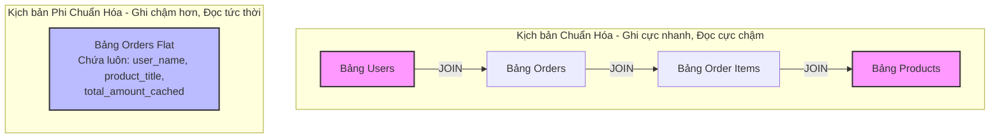

# Chuẩn Hóa (Normalization) vs Phi Chuẩn Hóa (Denormalization): Nghệ Thuật Cân Đối Giữa Tính Đúng Đắn Và Hiệu Năng Đọc Ghi

## ⚡ Tóm tắt ngắn (30s)
*   **Normalization (Chuẩn hóa)**: Là quá trình phân rã một bảng lớn thành nhiều bảng nhỏ hơn có mối quan hệ với nhau, tuân thủ các dạng chuẩn (1NF, 2NF, 3NF, BCNF) nhằm mục tiêu **triệt tiêu hoàn toàn sự dư thừa dữ liệu (Data Redundancy)** và ngăn chặn các hiện tượng bất thường khi chèn, sửa, xóa (Data Anomalies).
    *   *Ưu điểm*: Đảm bảo tính toàn vẹn dữ liệu tuyệt đối, tiết kiệm dung lượng lưu trữ, tối ưu hóa hiệu năng Ghi (Write Performance).
    *   *Nhược điểm*: Khi cần đọc dữ liệu, bạn phải thực hiện các phép **JOIN** phức tạp liên kết nhiều bảng lớn với nhau, gây suy sụp hiệu năng Đọc nghiêm trọng.
*   **Denormalization (Phi chuẩn hóa)**: Là kỹ thuật chủ động **đưa một lượng dư thừa dữ liệu có tính toán** vào cấu trúc DB để loại bỏ bớt các phép JOIN đắt đỏ hoặc các phép tính toán tổng hợp (Aggregation) lặp đi lặp lại.
    *   *Ưu điểm*: Tối ưu hóa tối đa hiệu năng Đọc (Read Performance) ở các hệ thống có traffic cực cao.
    *   *Nhược điểm*: Làm suy giảm hiệu năng Ghi, tốn bộ nhớ đĩa, và chịu rủi ro cao về **bất nhất dữ liệu (Data Inconsistency)** nếu ứng dụng không đồng bộ chính xác các bản sao dư thừa.

---

## 🔍 Chi tiết bản chất thực chiến

### 1. Bản chất kỹ thuật của các Dạng chuẩn (Normal Forms)

Để thuyết phục nhà tuyển dụng ở level Senior, bạn cần tóm gọn bản chất của các dạng chuẩn một cách khoa học nhất thông qua khái niệm **Phụ thuộc hàm (Functional Dependency)**:

*   **1NF (Dạng chuẩn 1 - Nguyên tử)**: Mỗi ô dữ liệu chỉ chứa **một giá trị đơn nhất (Atomic)**. Không chứa danh sách hoặc mảng dữ liệu. Không lặp lại các cột có cùng kiểu thông tin.
*   **2NF (Dạng chuẩn 2 - Không phụ thuộc một phần)**: Thỏa mãn 1NF + **Mọi thuộc tính không phải khóa phải phụ thuộc hoàn toàn vào Khóa chính (Primary Key)** chứ không được phụ thuộc vào một phần của khóa chính (chỉ xảy ra khi khóa chính là khóa ghép gồm nhiều cột).
*   **3NF (Dạng chuẩn 3 - Không phụ thuộc bắc cầu)**: Thỏa mãn 2NF + **Không có thuộc tính không phải khóa nào phụ thuộc bắc cầu vào Khóa chính**. Tức là: Không được phép tồn tại mối quan hệ $A \to B \to C$ (trong đó $A$ là khóa chính, $B$ và $C$ là các cột thường). Cột thường không được phép phụ thuộc vào cột thường khác.
*   **BCNF (Boyce-Codd Normal Form)**: Dạng chuẩn mạnh hơn của 3NF. Quy định: Với mọi phụ thuộc hàm có dạng $X \to Y$ có nghĩa, thì $X$ **bắt buộc phải là một Siêu khóa (Super Key)**. Triệt tiêu các trường hợp khóa chính ghép có các cột phụ thuộc chéo lẫn nhau.

### 2. Sự đánh đổi giữa JOIN và Aggregation ở môi trường High Concurrency

Trong các hệ thống Enterprise có lưu lượng truy cập cao (hàng ngàn request/giây), việc thực thi các câu lệnh SQL JOIN liên kết 5 - 10 bảng hoặc thực hiện tính toán `SUM`, `COUNT` trên hàng triệu bản ghi sẽ lập tức làm cạn kiệt tài nguyên CPU của Database Server.



---

## 💻 Code thực chiến: BAD vs GOOD trong thiết kế

### ❌ BAD: Lạm dụng Normalization tối đa dẫn đến nghẽn CPU khi Đọc Dashboard
Chúng ta cần hiển thị trang thông tin cá nhân của người dùng kèm theo tổng số tiền họ đã mua sắm trên hệ thống thương mại điện tử. DB được thiết kế chuẩn hóa 3NF tuyệt đối.

```sql
-- Mỗi lần người dùng tải trang cá nhân (hoặc Dashboard), ứng dụng phải chạy truy vấn tính toán cực nặng:
-- DB buộc phải quét qua toàn bộ lịch sử đơn hàng của user, JOIN 3 bảng và tính SUM vật lý.
-- Khi bảng order_items đạt mốc hàng chục triệu dòng, câu lệnh này sẽ mất vài giây để phản hồi!
SELECT 
    u.id, 
    u.email, 
    SUM(oi.quantity * oi.price) as total_spent
FROM users u
LEFT JOIN orders o ON u.id = o.user_id
LEFT JOIN order_items oi ON o.id = oi.order_id
WHERE u.id = 99
GROUP BY u.id, u.email;
```

###  GOOD: Áp dụng Denormalization thông minh (Cache và cập nhật nguyên tử)
Chúng ta đưa thêm một cột dữ liệu dư thừa có chủ đích là `total_spent` vào thẳng bảng `users`. 

```sql
-- Cấu trúc bảng Users đã được phi chuẩn hóa cột total_spent
CREATE TABLE users (
    id BIGINT PRIMARY KEY,
    email VARCHAR(255) NOT NULL,
    total_spent DECIMAL(15, 2) NOT NULL DEFAULT 0.00 -- Cột dư thừa lưu trữ kết quả tính toán trước
);

-- Mỗi lần người dùng truy cập trang cá nhân, Đọc cực nhanh bằng 1 câu SELECT đơn giản trên 1 bảng:
-- Tốc độ phản hồi đạt mức sub-millisecond (dưới 1ms), cực kỳ dễ index và không tốn CPU tính toán!
SELECT id, email, total_spent FROM users WHERE id = 99;
```

#### Xử lý đồng bộ dữ liệu dư thừa phía Ứng dụng:
Để đảm bảo cột `total_spent` luôn chính xác, mỗi khi có một đơn hàng mới được thanh toán thành công, ứng dụng phải cập nhật giá trị dư thừa này một cách **Nguyên tử (Atomically)** bên trong cùng một Transaction thanh toán:

```java
@Transactional
public void completeOrder(Long userId, BigDecimal orderTotal) {
    // 1. Tạo đơn hàng mới
    Order order = new Order(userId, OrderStatus.COMPLETED);
    orderRepository.save(order);

    // 2. Cập nhật cộng dồn cột phi chuẩn hóa một cách an toàn trực tiếp dưới DB
    // Sử dụng câu lệnh UPDATE có tính nguyên tử tránh Lost Update
    userRepository.incrementTotalSpent(userId, orderTotal); 
}

// Bên trong UserRepository:
@Modifying
@Query("UPDATE User u SET u.total_spent = u.total_spent + :amount WHERE u.id = :userId")
void incrementTotalSpent(@Param("userId") Long userId, @Param("amount") BigDecimal amount);
```

---

## 📊 Bảng so sánh đa chiều: Normalization vs Denormalization

| Tiêu chí so sánh | Normalization (Chuẩn hóa) | Denormalization (Phi chuẩn hóa) |
| :--- | :--- | :--- |
| **Mục tiêu cốt lõi** | Triệt tiêu dư thừa, bảo vệ toàn vẹn dữ liệu | Tối ưu hóa tốc độ Đọc dữ liệu |
| **Số lượng bảng & JOINs**| Nhiều bảng nhỏ, sử dụng JOIN liên tục | Ít bảng lớn (Flat tables), hạn chế tối đa JOIN |
| **Hiệu năng Đọc** | Chậm (Đặc biệt nghẽn khi dữ liệu phình to) | Cực kỳ nhanh, dễ tận dụng Index tuyến tính |
| **Hiệu năng Ghi (Insert/Update)**| Rất nhanh (chỉ ghi dữ liệu vào một vị trí duy nhất) | Chậm hơn (do phải cập nhật đồng thời nhiều bản sao dư thừa) |
| **Rủi ro bất nhất dữ liệu**| Bằng 0 | Rất cao nếu ứng dụng gặp lỗi đồng bộ dữ liệu |
| **Dung lượng lưu trữ đĩa**| Tiết kiệm tối đa | Tốn bộ nhớ hơn do lưu trữ lặp lại dữ liệu |

---

## ⚠️ Common Gotchas & Questions follow-up

### 1. Làm thế nào để giữ dữ liệu đồng nhất (Consistency) khi tiến hành phi chuẩn hóa?
Đây là thách thức lớn nhất của Denormalization. Nếu dữ liệu dư thừa bị lệch pha (ví dụ: tên sản phẩm thay đổi ở bảng sản phẩm nhưng bảng chi tiết đơn hàng cũ vẫn giữ tên cũ - hoặc tệ hơn: số tiền tích lũy bị tính sai), hệ thống sẽ bị mất uy tín nghiêm trọng.
*   **Giải pháp thực chiến**:
    1.  **Đồng bộ Transaction cục bộ (Strong Consistency)**: Cập nhật dữ liệu chính và dữ liệu dư thừa trong cùng một Database Transaction (như ví dụ code Java ở trên). Thích hợp cho các số liệu tài chính nhạy cảm.
    2.  **Đồng bộ bất đồng bộ qua Sự kiện (Eventual Consistency)**: Khi dữ liệu chính thay đổi, phát ra một sự kiện (Event) vào Message Broker (như Kafka). Luồng Consumer sẽ đọc sự kiện này và cập nhật cột phi chuẩn hóa sau đó vài trăm mili-giây. Thích hợp cho các hệ thống tải cao, chấp nhận độ trễ dữ liệu ngắn.
    3.  **Sử dụng Database Triggers hoặc Materialized Views**: Để DB tự động lo việc đồng bộ (tuy nhiên cần cẩn thận vì Trigger rất khó debug và làm tăng tải cho DB Engine).

### 2. Câu hỏi đào sâu từ interviewer: "Tại sao trong thực tế thiết kế cơ sở dữ liệu quan hệ, người ta hầu như chỉ chuẩn hóa đến mức 3NF/BCNF mà hiếm khi tiến lên 4NF hay 5NF?"
*   *Trả lời*:
    *   **Lý do thực tiễn**: Việc chuẩn hóa lên các dạng chuẩn cao hơn (4NF - xử lý phụ thuộc đa trị, 5NF - xử lý phụ thuộc liên kết) đòi hỏi phải phân rã cơ sở dữ liệu thành số lượng bảng khổng lồ với cấu trúc cực kỳ vụn vặt.
    *   **JOIN Explosion (Bùng nổ phép JOIN)**: Càng nhiều bảng, số lượng phép JOIN để lấy ra một thông tin cơ bản cho người dùng càng nhiều. Chi phí CPU và bộ nhớ đệm RAM để DB Engine tối ưu hóa đường đi của câu lệnh (Query Optimizer) đối với các truy vấn có quá nhiều JOIN sẽ tăng theo cấp số nhân, kéo tụt nghiêm trọng hiệu năng của toàn hệ thống.
    *   **Sự cân bằng**: Mức **3NF** là điểm cân bằng vàng (Sweet Spot) hoàn hảo nhất giữa tính toàn vẹn dữ liệu và hiệu năng thực thi của các RDBMS truyền thống.
