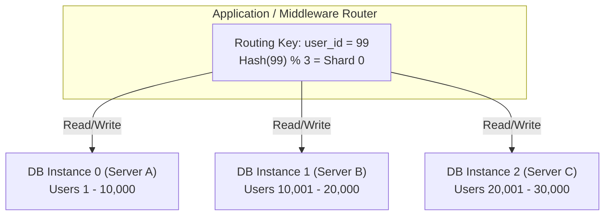

# Partitioning vs Sharding: Sự khác biệt kiến trúc thực chiến

## ⚡ Tóm tắt ngắn (30s)
* **Partitioning (Phân mảnh nội bộ)**: Là việc chia nhỏ một bảng dữ liệu khổng lồ thành các phần nhỏ hơn (gọi là partitions) nhưng **vẫn nằm trên cùng một Database Instance (một server vật lý)**. Ứng dụng truy cập qua một thực thể bảng duy nhất, việc định tuyến dữ liệu do Database Engine tự động xử lý.
    * *Mục tiêu*: Tối ưu hiệu năng truy vấn (Query Pruning), dễ dàng quản lý dữ liệu lịch sử (ví dụ: drop nhanh dữ liệu cũ).
* **Sharding (Phân mảnh phân tán)**: Là việc chia nhỏ bảng dữ liệu và phân tán các phần dữ liệu đó **ra nhiều Database Instances độc lập nằm trên các server vật lý khác nhau (mỗi server gọi là một Shard)**. 
    * *Mục tiêu*: Vượt qua giới hạn phần cứng của một server đơn lẻ (Scale-out / Horizontal Scaling), giải quyết cả nút thắt về CPU, RAM, Disk I/O và dung lượng lưu trữ tối đa.

---

## 🔍 Chi tiết bản chất thực chiến

### 1. Partitioning (Database-Level Partitioning)
Thường được gọi là **Horizontal Partitioning (Phân mảnh ngang)**. Về mặt logic, ứng dụng vẫn nhìn thấy một bảng duy nhất (ví dụ: `orders`). Nhưng dưới tầng vật lý, Database Engine chia bảng này thành các phân vùng riêng biệt dựa trên một cột khóa phân vùng (`Partition Key`).

#### Các chiến lược Partitioning phổ biến:
* **Range Partitioning**: Chia theo dải giá trị (thường dùng nhất cho thời gian, ví dụ: phân vùng theo tháng `partition_2026_01`, `partition_2026_02`).
* **List Partitioning**: Chia theo danh sách giá trị cụ thể (ví dụ: phân vùng theo quốc gia `region_VN`, `region_SG`).
* **Hash Partitioning**: Áp dụng hàm băm lên khóa phân vùng để phân bổ đều dữ liệu vào một số lượng phân vùng cố định.

```mermaid
graph TD
    subgraph Single DB Instance (Server A)
        Table_Orders["Table: orders (Logical View)"]
        Table_Orders --> P1["Partition 2026_Q1 (Physical file 1)"]
        Table_Orders --> P2["Partition 2026_Q2 (Physical file 2)"]
        Table_Orders --> P3["Partition 2026_Q3 (Physical file 3)"]
    end
```

### 2. Sharding (Application/Middleware-Level Partitioning)
Sharding là kỹ thuật chia sẻ không gian lưu trữ (Share-Nothing Architecture). Mỗi Shard là một cơ sở dữ liệu hoàn chỉnh và độc lập, không hề biết đến sự tồn tại của các Shard khác.

#### Cơ chế định tuyến trong Sharding (Routing Mechanism):
Để biết dữ liệu của một khách hàng nằm ở Shard nào, hệ thống cần một **Routing Key (Sharding Key)**.
* **Lookup-based Sharding**: Sử dụng một dịch vụ trung gian hoặc bảng cấu hình để map `Sharding Key -> Shard ID`.
* **Hash-based Sharding**: Sử dụng công thức `Hash(Sharding Key) % Total_Shards` để tìm Shard. Tuy nhiên, phương pháp này rất khó scale khi cần thêm Shard mới (giải pháp nâng cao: *Consistent Hashing*).
* **Directory-based Sharding**: Định tuyến qua các Database Middleware chuyên dụng như **Vitess** (cho MySQL) hoặc **Citus** (cho PostgreSQL).



---

## 💻 Minh họa SQL & Thực tế cấu hình

### 🛠️ Cấu hình Partitioning trong MySQL (Không ảnh hưởng tầng Application)
Khi sử dụng Partitioning, nhà phát triển không cần sửa bất kỳ dòng code ứng dụng nào. Database tự động lưu trữ dữ liệu vào phân vùng tương ứng.

```sql
-- Tạo bảng orders phân vùng theo năm của ngày tạo đơn hàng
CREATE TABLE orders (
    id INT NOT NULL,
    user_id INT NOT NULL,
    order_date DATE NOT NULL,
    amount DECIMAL(10,2) NOT NULL,
    PRIMARY KEY (id, order_date) -- Khóa chính bắt buộc phải bao gồm cột phân vùng
)
PARTITION BY RANGE (YEAR(order_date)) (
    PARTITION p2024 VALUES LESS THAN (2025),
    PARTITION p2025 VALUES LESS THAN (2026),
    PARTITION p2026 VALUES LESS THAN (2027),
    PARTITION p_future VALUES LESS THAN MAXVALUE
);

-- Khi truy vấn đúng phân vùng (Query Pruning):
-- DB Engine sẽ CHỈ đọc file vật lý của p2026, bỏ qua hoàn toàn các file khác. Hiệu năng cực cao!
SELECT * FROM orders WHERE order_date = '2026-05-22';
```

### 🛠️ Cấu hình Sharding phía Application (Sử dụng Spring Boot với nhiều DataSource)
Khi tự triển khai Sharding ở tầng ứng dụng, bạn phải định nghĩa các DataSource khác nhau và quyết định kết nối nào được sử dụng bằng lập trình.

```java
public class RoutingDataSource extends AbstractRoutingDataSource {
    @Override
    protected Object determineCurrentLookupKey() {
        // Lấy Shard Key từ ThreadLocal Context
        return ShardContextHolder.getShardKey(); 
    }
}

// Khi thực thi nghiệp vụ:
public void processUserOrder(Long userId, OrderDto orderDto) {
    // Quyết định dữ liệu của user này thuộc về Shard nào
    String shardKey = (userId % 2 == 0) ? "dataSourceShardA" : "dataSourceShardB";
    
    ShardContextHolder.setShardKey(shardKey);
    try {
        // Mọi câu lệnh SQL trong method này sẽ được định tuyến tới Shard tương ứng
        orderRepository.save(new Order(userId, orderDto.getAmount()));
    } finally {
        ShardContextHolder.clear();
    }
}
```

---

## 📊 Bảng so sánh đa chiều: Partitioning vs Sharding

| Tiêu chí | Partitioning (Phân mảnh nội bộ) | Sharding (Phân mảnh phân tán) |
| :--- | :--- | :--- |
| **Vị trí lưu trữ** | Một server duy nhất (Cùng CPU/RAM/Disk) | Nhiều server vật lý khác nhau độc lập |
| **Giới hạn phần cứng**| Giới hạn bởi cấu hình tối đa của 1 server (Vertical limit) | Không giới hạn phần cứng (Scale-out vô hạn) |
| **Độ phức tạp ứng dụng**| Rất thấp (DB Engine tự lo hết) | Rất cao (Phải xử lý routing, schema migration phức tạp) |
| **Truy vấn chéo (Cross-join)**| Hoạt động bình thường và mượt mà | Cực kỳ chậm, đắt đỏ (phải hạn chế tối đa) |
| **Distributed Transaction**| Không cần (ACID cục bộ hoạt động hoàn hảo) | Bắt buộc nếu ghi dữ liệu trên nhiều Shard (2PC, Saga) |
| **Mục đích chính** | Dọn dẹp dữ liệu cũ, tối ưu hóa I/O cục bộ | Tăng throughput đọc/ghi và sức chứa dữ liệu |

---

## ⚠️ Common Gotchas & Questions follow-up

### 1. Nút thắt lớn nhất của Sharding: "Cross-Shard Queries & Transactions"
Khi đã sharding hệ thống theo `user_id`, nếu bạn muốn chạy một câu lệnh báo cáo: *Hiển thị top 10 sản phẩm bán chạy nhất toàn hệ thống*, truy vấn này buộc phải quét qua tất cả các Shard, thu thập dữ liệu về bộ nhớ ứng dụng và thực hiện sort thủ công. Đây gọi là hiện tượng **Scatter-Gather**.
* **Giải pháp thực chiến**: 
    1. Tránh chạy các câu lệnh analytical trực tiếp trên các Shards thương mại (OLTP). 
    2. Đẩy dữ liệu từ các Shards về một Data Warehouse trung tâm (như BigQuery, ClickHouse) hoặc Elasticsearch thông qua CDC (Change Data Capture) để phục vụ việc tìm kiếm, thống kê toàn cục.

### 2. Câu hỏi đào sâu từ interviewer: "Nếu hệ thống bị mất cân bằng dữ liệu giữa các Shard (Hot Shard), bạn sẽ giải quyết thế nào?"
* **Trả lời**: 
    * **Nguyên nhân**: Do chọn `Sharding Key` không tốt. Ví dụ, sharding theo `country_id`, dẫn đến Shard của Việt Nam (`VN`) có hàng chục triệu bản ghi và quá tải, trong khi Shard của Lào (`LA`) chỉ có vài chục ngàn bản ghi.
    * **Giải pháp khắc phục**:
        1. **Resharding (Chia lại Shard)**: Tách Shard lớn thành các Shard nhỏ hơn. Quá trình này đòi hỏi migration dữ liệu trực tiếp (Live Migration) khá phức tạp.
        2. **Composite Sharding Key**: Kết hợp thêm một yếu tố ngẫu nhiên hoặc có tính phân bổ vào key. Ví dụ, thay vì dùng `country_id`, ta dùng `country_id + "_" + (user_id % 4)`. Cách này giúp phân bổ đều dữ liệu của quốc gia lớn ra 4 Shard khác nhau.
