# Replication là gì? Các mô hình nhân bản dữ liệu thực chiến

## ⚡ Tóm tắt ngắn (30s)
**Database Replication (Nhân bản cơ sở dữ liệu)** là quá trình sao chép dữ liệu liên tục và tự động từ một máy chủ cơ sở dữ liệu (Leader/Master) sang một hoặc nhiều máy chủ cơ sở dữ liệu khác (Follower/Replica) nhằm đạt được 3 mục tiêu cốt lõi:
1. **High Availability (Tính sẵn sàng cao)**: Tránh điểm lỗi đơn nhất (SPOF). Nếu Master chết, Replica có thể lập tức được nâng cấp (failover) lên làm Master mới.
2. **Scalability (Khả năng mở rộng đọc)**: Tăng băng thông đọc bằng cách định tuyến các truy vấn SELECT tới các Read Replicas (Scale-out Reads).
3. **Disaster Recovery (Khôi phục thảm họa)**: Giữ một bản sao địa lý ở trung tâm dữ liệu khác (Geo-replication) phòng khi thiên tai hoặc sự cố mạng diện rộng.

---

## 🔍 Chi tiết bản chất thực chiến

Để thể hiện trình độ Senior, bạn cần nắm vững bản chất hoạt động và các mô hình đánh đổi (Trade-offs) trong thiết kế replication:

### 1. Phân loại theo cơ chế đồng bộ dữ liệu (Replication Timing)

```mermaid
sequenceDiagram
    autonumber
    actor Client
    participant Leader
    participant Follower (Sync)
    participant Follower (Async)

    Client->>Leader: 1. Write (INSERT/UPDATE)
    Note over Leader: Ghi vào WAL & DB cục bộ
    
    rect rgb(26, 54, 93)
        Note over Leader, Follower (Sync): --- Khung Đồng bộ (Synchronous) ---
        Leader->>Follower (Sync): 2. Replication Log
        Note over Follower (Sync): Ghi log & Xác nhận
        Follower (Sync)-->>Leader: 3. ACK (OK)
    end
    
    Leader-->>Client: 4. Write Success Response
    
    rect rgb(44, 82, 130)
        Note over Leader, Follower (Async): --- Khung Bất đồng bộ (Asynchronous) ---
        Leader-xFollower (Async): 5. Replication Log (Background)
        Note over Follower (Async): Ghi log & Áp dụng sau
    end
```



#### A. Đồng bộ (Synchronous Replication)
* **Cơ chế**: Leader chỉ trả về kết quả thành công cho Client sau khi **tất cả** (hoặc một số lượng cấu hình) Follower đã xác nhận đã nhận và ghi dữ liệu thành công.
* **Ưu điểm**: Đảm bảo không mất mát dữ liệu (Zero Data Loss) nếu Leader sập đột ngột. Dữ liệu trên Follower luôn mới nhất.
* **Nhược điểm**: Độ trễ ghi (Write Latency) tăng cao vì phải chờ phản hồi qua mạng từ các máy chủ khác. Nếu một Follower bị sập hoặc nghẽn mạng, toàn bộ tiến trình Ghi của hệ thống sẽ bị chặn đứng.

#### B. Bất đồng bộ (Asynchronous Replication)
* **Cơ chế**: Leader ghi dữ liệu cục bộ thành công và lập tức phản hồi "OK" cho Client. Việc đẩy dữ liệu sang các Follower diễn ra ngầm (background job).
* **Ưu điểm**: Tốc độ ghi cực nhanh, không phụ thuộc vào tình trạng hoạt động của các Follower.
* **Nhược điểm**: Chấp nhận rủi ro mất dữ liệu (Data Loss) nếu Leader sập trước khi dữ liệu kịp đẩy qua Follower. Gây ra hiện tượng **Replication Lag** (Replica chứa dữ liệu cũ hơn Leader).

#### C. Bán đồng bộ (Semi-Synchronous Replication)
* **Cơ chế**: Kết hợp cả hai. Leader chỉ cần chờ **ít nhất một** Follower xác nhận đã nhận dữ liệu là có thể phản hồi thành công cho Client. Đây là cấu hình tối ưu thường dùng trong MySQL Enterprise.

---

### 2. Các mô hình kiến trúc Replication phổ biến

#### 🌟 Single-Leader (Active-Passive / Master-Slave)
* **Cách hoạt động**: Mọi thao tác Ghi (Write) bắt buộc phải gửi tới Leader duy nhất. Leader ghi xong sẽ phát log tới các Followers. Clients có thể đọc từ bất kỳ Follower nào.
* **Use case**: Hầu hết các hệ thống OLTP truyền thống (MySQL, PostgreSQL, Redis).

#### 🌟 Multi-Leader (Active-Active)
* **Cách hoạt động**: Tồn tại nhiều máy chủ Leader chạy song song ở các chi nhánh khác nhau. Mỗi Leader đều nhận Ghi và tự động đồng bộ chéo dữ liệu với các Leaders còn lại.
* **Thách thức cực lớn**: **Write Conflict Resolution** (Xung đột ghi). Nếu hai Leader cùng sửa một bản ghi cùng lúc, DB phải có thuật toán giải quyết (ví dụ: *Last-Write-Wins* hoặc CRDTs).
* **Use case**: Hệ thống đa quốc gia cần tối ưu độ trễ ghi cho user ở từng vùng địa lý.

#### 🌟 Leaderless (Cassandra / DynamoDB Style)
* **Cách hoạt động**: Không có khái niệm Leader. Client gửi yêu cầu ghi tới nhiều node cùng lúc. Dữ liệu được coi là ghi thành công nếu đạt được sự đồng thuận của một số lượng Node tối thiểu (Quorum Write).
* **Use case**: Các hệ thống cơ sở dữ liệu phân tán NoSQL cực kỳ lớn, yêu cầu khả năng chịu lỗi (fault tolerance) siêu cao.

---

## 💻 Cấu hình & Log Format Thực Chiến

Database đồng bộ dữ liệu thông qua việc chuyển giao các định dạng log. Có 3 loại định dạng phổ biến dưới tầng DB:

1. **Statement-based Replication**: Leader ghi lại chính xác câu lệnh SQL gốc (ví dụ: `INSERT INTO...`) và gửi cho Follower chạy lại.
    * *Rủi ro*: Lỗi dữ liệu với các hàm không xác định như `NOW()`, `RAND()`, hoặc `UUID()`.
2. **Row-based Replication (Khuyên dùng)**: Leader chuyển đổi sự thay đổi của từng dòng dữ liệu cụ thể (Binary dữ liệu dòng cũ và dòng mới) để Follower áp dụng trực tiếp. Cực kỳ an toàn nhưng log dung lượng rất lớn.
3. **Write-Ahead Log (WAL) Shipping**: Chuyển giao trực tiếp các khối dữ liệu mức thấp (byte-level storage engine modifications). Cực kỳ nhanh nhưng ràng buộc chặt chẽ với phiên bản DB.

### Minh họa cấu hình Replication trong PostgreSQL (WAL Streaming)

Trên Master (`postgresql.conf`):
```ini
# Cấu hình Master cho phép streaming WAL log
wal_level = replica
max_wal_senders = 10 # Số lượng connection replica tối đa
archive_mode = on
archive_command = 'cp %p /var/lib/postgresql/data/archive/%f'
```

Trên Replica (`pg_hba.conf` & thiết lập kết nối):
```ini
# Cấp quyền cho user replicator kết nối từ IP của replica server
host replication replicator 192.168.1.100/32 md5
```

---

## 📊 Bảng so sánh các mô hình Replication

| Tiêu chí | Single-Leader | Multi-Leader | Leaderless |
| :--- | :--- | :--- | :--- |
| **Độ trễ Ghi** | Trung bình (phụ thuộc vị trí Leader) | Thấp (ghi tới Leader gần nhất) | Thấp |
| **Xử lý xung đột** | Không xảy ra xung đột ghi | Rất phức tạp (Conflict resolution) | Sử dụng Read Repair / Vector Clocks |
| **Khả năng chịu lỗi**| Master chết cần bầu chọn Leader mới | Một Leader chết, các Leader khác vẫn ghi bình thường | Rất cao nhờ cơ chế Quorum |
| **Độ phức tạp cấu trúc**| Thấp | Rất cao | Rất cao |

---

## ⚠️ Common Gotchas & Questions follow-up

### 1. "Split-Brain" - Cơn ác mộng của Single-Leader Replication
Khi có sự cố mạng xảy ra (Network Partition), máy chủ Master cũ vẫn chạy nhưng các Follower không liên lạc được với nó. Các Follower nghĩ rằng Master đã chết và tự động bầu chọn một Follower khác lên làm Master mới. Lúc này hệ thống tồn tại song song **2 Master** cùng nhận Ghi. Khi mạng kết nối lại, dữ liệu sẽ bị ghi đè và hư hỏng nghiêm trọng.
* **Giải pháp thực chiến**: Bắt buộc phải sử dụng cơ chế **Quorum (Đa số)** để quyết định việc bầu chọn Leader mới. Chỉ vùng mạng nào chứa hơn 50% số lượng node của hệ thống mới được phép hoạt động và bầu chọn Master mới, vùng bị cô lập dưới 50% sẽ tự động chuyển sang chế độ Read-Only.

### 2. Câu hỏi đào sâu từ interviewer: "Làm sao để đo đạc và giảm thiểu Replication Lag trong hệ thống sản xuất?"
* **Trả lời**:
  * **Cách đo**: Trong MySQL, chạy câu lệnh `SHOW SLAVE STATUS` và kiểm tra chỉ số `Seconds_Behind_Master`. Trong Postgres, đo độ lệch offset WAL giữa Master và Replica (`pg_wal_lsn_diff`).
  * **Cách giảm thiểu**:
    1. **Tuning phần cứng**: Đảm bảo cấu hình ổ đĩa (I/O throughput) và CPU của Replica mạnh tương đương Master.
    2. **Multi-threaded Replication**: Theo mặc định, quá trình áp dụng log ở Replica là đơn luồng (single thread). Bật cấu hình nhân bản đa luồng (ví dụ: `replica_parallel_workers` trong PostgreSQL hoặc `slave_parallel_workers` trong MySQL) để tận dụng tối đa đa nhân CPU của Replica.
    3. **Tách workloads**: Không chạy các câu lệnh báo cáo (analytical queries) quá nặng trên Replica vì chúng sẽ khóa tài nguyên và làm chậm quá trình áp dụng WAL log mới.
